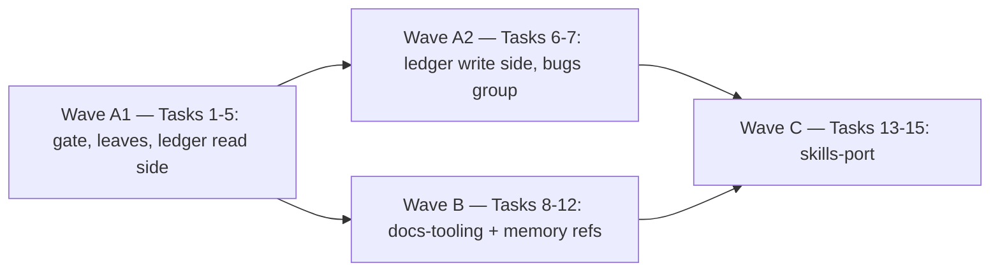

# Wave 2 Closure — Ledger, Docs Tooling, Skills Port Implementation Plan

> **For agentic workers:** REQUIRED SUB-SKILL: Use superpowers:subagent-driven-development
> (recommended) or superpowers:executing-plans to implement this plan task-by-task. Steps use
> checkbox (`- [ ]`) syntax for tracking.
>
> **The wave is the dispatch unit, not the task.** This plan groups its fifteen tasks into
> four lettered waves (the table and the launch graph below). Dispatch **one implementer
> subagent per wave**, run **one review round per wave** with **one reviewer subagent per
> wave**, and give the implementer the whole wave's tasks in one brief. Inside a wave nothing
> changes: every task keeps its own failing test, its own verification and its own commit.
> A plan that is merely grouped into waves visually gets executed one subagent per task, and
> nothing about that looks wrong while it happens — this paragraph is what stops it.

> **No code block in this plan was executed before it was written down.** Every `Expected:`
> line is a prediction and every mutation outcome is a hypothesis: apply the mutation, run the
> test, revert, and record what actually happened in the task's commit message. If a test
> reddens for another reason, or does not redden, stop and redesign the assertion rather than
> keeping the prose. Where a step's instruction does not match the tree, report the mismatch
> instead of guessing.

**Goal:** Close wave 2 of the extraction design on the code side — port the bug ledger
(`bugs new|index|check|renumber`), the documentation tooling (`docs check`, `docs trail`,
`plan check`, and the `memory refs` guard the memory lane left unshipped) and the two skills
plus the navigator agent, each as a Keelline area with its tests, its `docs/cli.md` sections
and its changelog fragment — so that wave 3's `workflows` has every gate it runs, `assess`
has every rule it reports on, and `skills-author` has a skills directory to grow.

**Architecture:** Two new areas and one grown one. `src/keelline/ledger/` is a full area: a
`bugs` CLI group over a library that parses one-file-per-bug entries, renders the generated
index as a pure function of them, scans the configured code roots for dangling identifiers,
and files or renumbers entries through `fsops`. `src/keelline/docs/` is a full area with two
CLI groups, `docs` and `plan`: budgets and link targets over the always-loaded documents, the
regenerated design-and-plan trail inside the roadmap, and the plan lint; its memory-graph
check reads the store through the C3 surface. `src/keelline/memory/refs.py` is the one module
this plan adds to a merged lane, because `memory refs` is a C5 row the memory lane planned and
never shipped. Four leaf modules beside the areas — `identifiers` (the one identifier
grammar), `findings` (the one shape a check returns and the one summary renderer), `prose`
(the one answer to "what part of this Markdown is prose") and `command` (the flags and the
configuration load every command shares) — plus one `git_run` in `gitenv`, hold what three
areas would otherwise each spell for themselves, and keep every cross-area edge off the
graph. `skills/` and `agents/` are documents held to a test: every `keelline …`
invocation they name parses against the real parser or is allow-listed by the package that
will ship it, and no skill body names a harness tool. Every port keeps the source's rules and
sheds its state: paths, prefixes, roots and themes come from `keelline.toml`, from the preset
or from a sidecar data file the project owns.

**Tech Stack:** Python ≥ 3.11, standard library only at runtime (`re`, `os`, `stat`,
`posixpath`, `subprocess`, `tomllib`, `pathlib`, `dataclasses`, `datetime`, `collections`),
pytest, ruff, mypy strict, `uv`.

**Spec:** the agent-harness extraction design (2026-09-05), a private document — §2 D7 (no
magic numbers), D9 (neutral document paths), D13 (English artifacts), D14 (writes are
enumerated), D15 (repository configuration never grants capability); §3 (config values are
untrusted; a value shaped like an option never reaches a subprocess); §5.1 (layout: `skills/`,
`agents/`, `src/keelline/{ledger,docs}`); §5.2 (the Ledger, Documents and Memory rows of the
CLI table, and the exit-code contract); §5.5 (the **Port** lane: `close-bug`, `memory-sweep`,
`code-navigator`, and the thin wrappers `init`, `upgrade`, `uninstall`, `attach`, `setup`,
`doctor`; skills in action language with a per-harness tool mapping); §5.8 (no
project-identifying string anywhere in the public tree); §7.1 (`[paths]`, `[ledger]`,
`[budgets]`); §8.3 (the keys a pull request may not change — this plan reads them, `assess`
enforces them); §9.2 (note schema, for the graph check); §11 (what leaves, and "nothing
leaves carrying this repository's state"; the `common/ → projects/` link rule); §15.2 (the
`ledger`, `docs-tooling` and `skills-port` rows: all three consume C1; `ledger` and
`docs-tooling` unblock `workflows` and `assess`; `docs-tooling` also consumes C3); §15.4
(contracts C1, C3, C5; disjoint ownership). That document cannot be opened from this
repository; every clause this plan leans on is quoted where it is used.

**Scope:** packages `ledger`, `docs-tooling` and `skills-port` (§15.2), in one plan by owner
decision of 2026-09-16 (the design's one-plan-per-package rule is set aside for this closure;
`readme-methodology` and `notes` follow in a second plan after this one has executed). A
change belongs to this plan iff it lands under `src/keelline/ledger/`, `src/keelline/docs/`,
`src/keelline/identifiers.py`, `src/keelline/findings.py`, `src/keelline/command.py`, (create)
`src/keelline/prose.py` (leaf modules the areas share), the `git_run` function this plan adds
to `src/keelline/gitenv.py`, `tests/test_neutral_wave2.py`, `tests/test_identifiers.py`, (create)
`tests/test_findings.py`, `tests/test_command.py`, `tests/test_git_run.py`, (create)
`src/keelline/memory/refs.py` (plus
the growth of `src/keelline/memory/api.py`, `tests/memory/test_surface.py` and the `refs`
subparser in `src/keelline/memory/commands.py` it needs), `tests/ledger/`, `tests/docs/`, `tests/skills/`,
the refs test module under `tests/memory/`, `skills/`, `agents/`, an appended `mutations.toml` entry, an
appended `docs/cli.md` section, or a `changelog.d/{ledger,docs-tooling,skills-port,memory-refs}.feature.md`
fragment. The reusable workflow that runs these gates belongs to `workflows`; the findings
engine that reads their rules belongs to `assess`; the ledger runbook, the generated index
and the roadmap trail marker as *installed artifacts* belong to `templates`; `README.md`'s
command list and "two areas ship today" line belong to `readme-methodology`; the
`.codex-plugin/plugin.json` `skills` key belongs to `foundation`/`release` (the manifests
are theirs, §15.4).

**Source:** the private repository's `scripts/` directory at the commit the dispatch brief names: the ledger script
(2,165 lines; 127 collected tests in its fixture module plus three in its committed-tree
module), the documentation-hygiene guard (262 lines; 47 tests), the plan lint (458 lines;
44 tests), the trail generator (565 lines; 12 tests), the memory-reference guard (396 lines;
23 tests) and the shared reference grammar (49 lines); the two skills and the navigator
agent under that repository's `.claude/`, and the memory protocol note the `memory-sweep`
skill links to. **The path of that checkout is handed to each implementer out of band, in
the dispatch brief.** An implementer without it stops and reports at the first port task —
a module reconstructed from this plan's prose is not a port, and the source's tests are the
measurements the port is held to. This plan quotes what it relies on and never names the
repository (§5.8).

## Global Constraints

Every task's requirements implicitly include this section.

- **Python floor 3.11**; the runtime imports only the standard library and `keelline` itself,
  enforced by `tests/test_import_boundary.py`. No task may add a dependency.
- **Exit codes (C5):** 0 success, 1 findings or failure, 2 refusal or internal error. Library
  modules raise `keelline.errors.Failure` / `Refusal`; only `cli.py` maps them. A refusal to
  write because the write would destroy content the repository holds nowhere else is a
  `Refusal` (2), never a `Failure`: a caller must not read it as "findings, proceed anyway".
- **Every command prints one line** (§5.2). A command with many findings puts the count and
  up to `LISTED_LIMIT` labels on that line and the full list in `--json` (`Result.data`).
- **Repository bytes are data** (CONTRIBUTING). A `Result.summary` carries counts, rule
  labels, repo-relative paths, line numbers and ledger identifiers this lane computed; never
  an entry title, a `related` value, a note's text, a roadmap line or a plan's sentence. Those
  go in `Result.data`, which the person or CI job owning the repository reads.
- **Config values that reach a subprocess are untrusted** (§3): every `git` this plan runs
  goes through `keelline.gitenv.git_run` (Task 2) — the one `subprocess.run`, the one
  scrubbed environment, the one bound, the one `noqa` pair — closes its argument list with
  `--`, and never receives a config value that starts with `-`: `contained()` refuses an
  absolute path and `..`, and a `[ledger] id_prefix` is held to `^[A-Z][A-Z0-9]{0,7}$`
  before it is interpolated into a regular expression. No task adds a second runner.
- **One shape for a finding, one renderer for a summary line** (`keelline.findings`, Task 2):
  no area defines its own finding dataclass, its own cap or its own join.
- **Every configured path is contained.** `[paths]` values are validated by `load()`;
  `ledger.code_roots` is not (the guards lane's `contained_roots` docstring says so), so
  every reader here takes it through `keelline.guards.api.contained_roots`. A cross-area
  import goes through the other area's `api` module and nothing else.
- **Writes go through `fsops`** (`write_within`, `mkdirs_within`), never `Path.write_text`,
  in any module that puts a file into a repository. Writes are enumerated (D14): `bugs new`
  writes one entry file and the index; `bugs renumber` writes the moved entry, the void
  pointer, every scanned file the sweep rewrote, and the index; `bugs index` writes the
  index; `docs trail` writes the roadmap. Nothing else in this plan writes.
- **No cross-module test imports.** `tests/` is not a package and there is no `conftest.py`.
  Each test module builds its own fixtures; the ~12-line `CONFIG` string, the `project()`
  helper, the git-scrubbing `git()` helper and the three surface-test AST cases are repeated
  per module on purpose, as the guards and memory lanes did. That repetition is the price of
  the constraint, not an oversight to "simplify" in review.
- **No magic numbers** (D7): every bound is a named module constant whose comment says what
  it caps and why it is not a config key. Budgets come from `config.budgets.effective(name)`.
- **Lint and types:** ruff `line-length = 100`, `select = ["E", "F", "I", "UP", "B", "SIM",
  "S", "RUF"]` — every `subprocess.run` carries `# noqa: S603` (and `S607` when the
  executable is a bare name) beside a comment saying why the arguments are safe; `mypy`
  strict over `src`, `tests` and `scripts`. Run `uv run ruff check .`, `uv run ruff format
  --check .` and `uv run mypy` at CI's scope, never on one file: a suppression added for
  one checker is not added for the other.
- **English artifacts** (D13), and **no project-identifying string** (§5.8). Task 1 ships the
  gate over this plan's own files, including this plan. Fixtures use neutral names
  (`widget`, `acme`, `src/widget/`, `BR-001`…`BR-099`, `BR-404`), never the source repository's paths,
  ledger identifiers, branch names or phase names. Identifiers numbered 100–199 (with the
  default prefix) are on the denylist and must not appear anywhere, fixtures included.
- **`git` in a test runs with the developer's configuration scrubbed** —
  `GIT_CONFIG_GLOBAL=/dev/null`, `GIT_CONFIG_SYSTEM=/dev/null`, `GIT_TERMINAL_PROMPT=0`,
  `HOME=<tmp_path>` — and every such module skips where `git` is absent.
- **Every command test threads `--machine`** on a command that loads `keelline.toml` (every
  command in this plan does). `tests` never read or write `~/.config/keelline/`.
- **Assertion oracles:** every new assertion ships with the mutation that reddens it, or a
  sentence saying why none exists. Load-bearing guards go into `mutations.toml`. An assertion
  whose expected value is read from the subject says so in its comment and is paired with a
  fixed value.
- **`mutations.toml` and `docs/cli.md` are shared-append files**: `mutations.toml` carries no
  lane headings, only a prose comment per entry, so append entries at the end with their own
  comment; in `docs/cli.md` new sections go above the `---` rule that precedes
  `## Configuration`, which is the last section. The merger resolves an append conflict by
  keeping both sides.
- **The mutation oracle runs after the commit, never before it.** `mutation_oracle.py`
  refuses on any `git status --porcelain` output for the files its entries name. Every task
  commits its source, tests and `mutations.toml` entry first and runs the oracle as its last
  step; a survivor is fixed and amended into that commit.
- **`uv run ruff format .` before every commit.** The code blocks in this plan are
  unformatted and several lines exceed 100 characters; ruff reflows Python but never a string
  literal, so a long line inside a string is the implementer's to break.
- **Commit per task**, conventional type prefix, no attribution trailer of any kind.

## File Structure

| File | Responsibility |
|---|---|
| `src/keelline/identifiers.py` (create) | Leaf: `Identifiers(prefix)`, the one definition of what a ledger identifier looks like, built from `[ledger] id_prefix`; read by the ledger, the plan lint and the memory graph |
| `src/keelline/findings.py` (create) | Leaf: `Finding(rule, path, line, detail)`, `LISTED_LIMIT`, `listed`, `labels` — the one shape a check returns and the one summary renderer |
| `src/keelline/command.py` (create) | Leaf: `common_flags`, `root_and_config` — what every configured command shares |
| `src/keelline/prose.py` (create) (Task 8) | Leaf: the one answer to "what part of this Markdown is prose" — `REFERENCE`, `FENCE`, `CODE_SPAN`, `blank_fences`, `blank_code_spans`, `path_references` |
| `src/keelline/gitenv.py` | Modified: gains `git_run`, the one `subprocess.run(["git", …])` in this plan |
| `src/keelline/ledger/__init__.py` (create) | Docstring only (`test_surface.py` asserts no imports) |
| `src/keelline/ledger/entries.py` (create) | `Entry`, `LedgerError`, the flat-frontmatter reader and the quoting writer helpers |
| `src/keelline/ledger/index.py` (create) | `render_index`, the generated-index grammar, the overwrite refusal and its two shared messages, `index_path`/`index_text` |
| `src/keelline/ledger/scan.py` (create) | One traversal for three readers: scan roots from config, git enumeration with a walk fallback, the fixture-holder marker, citations and mentions |
| `src/keelline/ledger/check.py` (create) | `problems(root, config)`, `uninitialised`, the evidence-boundary rule |
| `src/keelline/ledger/write.py` (create) | The entry template, the allocator, `file_entry`, `renumber` |
| `src/keelline/ledger/git.py` (create) | `git_output(root, *args)`: three lines over `git_run`, "failure reads as nothing found" |
| `src/keelline/ledger/commands.py` (create) | The `bugs` group |
| `src/keelline/ledger/api.py` (create) | The import surface |
| `src/keelline/docs/__init__.py` (create) | Docstring only |
| `src/keelline/docs/hygiene.py` (create) | Budgets over the agents file and the roadmap prose; link targets in the agents file |
| `src/keelline/docs/graph.py` (create) | The advisory wiki-link graph over the resolved store |
| `src/keelline/docs/trail.py` (create) | `trail.toml` (themes and states), `render_listing`, `rebuild`, the two stale guards |
| `src/keelline/docs/plans.py` (create) | The plan lint: references, leading steps, `Scope:`/`Premise:`, asserted mutation outcomes |
| `src/keelline/docs/commands.py` (create) | The `docs` and `plan` groups |
| `src/keelline/docs/api.py` (create) | The import surface |
| `src/keelline/memory/refs.py` (create) | Backticked repository paths in notes that no longer resolve; the audience rule; `WIKI_LINK` |
| `skills/README.md` (create) | The action-language rule and the per-harness tool mapping (not a skill) |
| `skills/close-bug/SKILL.md`, `skills/memory-sweep/SKILL.md`, `skills/memory-sweep/references/protocol.md` (create) | The two ported skills |
| `skills/{init,upgrade,uninstall,attach,setup,doctor}/SKILL.md` (create) | The six thin wrappers, written against C5 |
| `agents/code-navigator.md` (create) | The navigator agent |
| `tests/test_neutral_wave2.py` (create) | The §5.8 gate over every file this plan adds, this plan included; top level because it spans three waves |
| `tests/test_identifiers.py`, `test_findings.py`, `test_command.py`, `test_git_run.py` (create) | The leaves, one module each |
| `tests/ledger/test_entries.py`, `test_index.py`, `test_scan.py`, `test_check.py`, `test_write.py`, `test_commands.py`, `test_surface.py` (create) | One module each |
| `tests/docs/test_prose.py`, `test_hygiene.py`, `test_graph.py`, `test_trail.py`, `test_plans.py`, `test_commands.py`, `test_surface.py` (create) | One module each |
| `tests/memory/test_refs.py` (create) | The reference guard |
| `tests/skills/test_skills.py` (create) | Frontmatter, invocations, action language, the line budget |

**Premise (deviations and decisions, for the wave-2 merger):**

1. **Three packages, one plan, one branch, four waves.** Owner decision 2026-09-16. Execute
   on `wp/wave-2-closure` cut from `dev`; the areas are disjoint by file *and by import*
   (every shared thing is a leaf from Task 2), so the merger may split the branch into one
   pull request per wave if review size asks for it — the gate and the leaves are in Wave A1,
   which every later wave's pull request would then follow. Wave A is cut in two at the
   read/write seam (A1 reads and checks, A2 writes and registers) because a single ledger
   wave was five times the size of Wave C and the one holding a 2,165-line external script
   open beside the plan; the cut costs one dispatch and halves the largest context. A killed
   implementer is resumed, never restarted.
2. **The legacy-ledger machinery is not ported.** The source carries a `migrate` command,
   a three-way `--from` import and a "legacy mode" that recognises `## <PREFIX>-nnn`
   headings in the index. C5's Ledger row has no `bugs migrate`, and a project adopting
   Keelline has no pre-migration ledger to split. What survives: `bugs check` is inert
   (exit 0, "nothing to check") while the ledger directory does not exist *and* the index is
   not one this tool generated; a generated index with no ledger directory behind it is
   refused as a deleted ledger; and a `## <PREFIX>-nnn` heading in the index is simply
   foreign content — recover it by hand, the message names no command. Roughly 700 source
   lines and 45 of the 127 source tests fall away with it; the port's test count is
   measured against the remaining 82, and each dropped test is named in Task 5's commit.
3. **The foreign-checkout refusal is not ported.** The source's hazard was a default root
   read from `__file__`, so a script invoked by path from a worktree wrote into another
   checkout. `--root` defaults to the current directory here, and the hazard does not exist.
4. **The generated-index marker names this generator, and recognition is structural.** The
   first paragraph reads `_Generated by \`keelline bugs index\` from …`. An index is "one this
   tool generated" when its first paragraph opens with `` _Generated by ` `` and names
   `index` — which also recognises the source's own marker, so adopting the port does not
   refuse to regenerate over the index the source wrote. Below the header the rendering is
   byte-identical to the source for `id_prefix = "BR"` and the preset's default paths
   (§7.1: "regeneration must be byte-identical for `BR`"); Task 4 has the executor measure
   that once against the source checkout and record the result in the commit.
5. **A fixture-holder marker replaces the source's hard-coded exclusion list.** The source
   names two of its own test files whose fixtures spell identifiers as sample data. Here a
   file whose first `FIXTURE_MARKER_WINDOW` bytes contain `keelline:ledger:fixtures` is
   excluded from the mention scan and from `renumber`'s sweep. It is a repository-authored
   opt-out of a lint over the file that carries it — the same trust level as the source's
   list, which was repository-authored code — and it grants nothing (D15). A real reference
   inside a marked file is invisible to the scan, exactly as the source accepts for its list.
6. **Scan roots come from configuration.** Mention roots are the repository's top-level files
   plus `ledger.code_roots` through `contained_roots`; citation roots add the first path
   component of every `[paths]` value that has more than one (so `docs` for the defaults).
   The citation pattern is loose on purpose — any `…/<bugs dirname>/<PREFIX>-nnn.md` — and the
   decision is made by resolving the match against `paths.bugs` two ways, as the source does.
7. **The allocator drops the legacy-heading source.** `next_identifier` reads the working
   tree by filename and by `id:`, and every entry ever added on any ref via `git log --all
   --diff-filter=A`. The third source, `## PREFIX-nnn` headings in the index on every ref,
   goes with Premise 2. The pre-allocation `git fetch` stays, bounded, and a skipped fetch is
   reported in the command's summary rather than on stderr.
8. **`memory refs` lands in the memory area, on a merged lane.** The memory lane's Task 12
   planned it (`Finding`, `unresolved`, `audience_violations`, `check`; `memory refs
   [--json]`) and its surface table lists `docs-tooling` as the consumer; nothing shipped.
   Task 11 adds `refs.py`, grows `keelline.memory.api` by exactly those names and edits
   `tests/memory/test_surface.py`'s pinned set in the same commit — the surface test is an
   equality, so growing it is deliberate by construction. Source roots for shorthand
   references are `ledger.code_roots` plus the parent of every `[paths]` value, not the
   source's hard-coded list; a group the resolver could not provide is read off
   `store.unavailable` — the resolver's own record, reason included — and is a refusal (2),
   the source's "the walk went blind" exit, kept; and a note the walk quarantined as
   unparseable is reported (exit 1) for the reason `renumber` reports a file its sweep could
   not read: an unread note is not a clean note.
9. **`docs trail` reads its themes and states from `trail.toml` beside the roadmap.** The
   source keeps an ordered theme list and a path→state map as module constants — the exact
   state §11 says must not leave. Here both are data in `<dir of paths.roadmap>/trail.toml`:
   `[[theme]]` tables with `label` and `pattern`, in order, and a `[states]` table. A
   missing file is an empty theme list and an empty map, so a fresh project's trail is one
   `Unfiled` bucket with every document `delivered` — and the source's "a new document must
   declare its state" guard still fires on the writing path, which is the only path that adds
   a row: `docs trail` writes, then reports the undeclared rows with exit 1. `--check` cannot
   see that guard — it has no earlier listing to compare against — so a defaulted `delivered`
   committed over that report is invisible to CI; `docs/cli.md` says so, and closing the gap
   (an explicit state for every row, dropping the default) is a decision for the `templates`
   lane, which writes the first `trail.toml`. Rows are
   `<specs dirname>/<file>` and `<plans dirname>/<file>`; links are computed relative to the
   roadmap's directory; the generated comment names `keelline docs trail`.
10. **`plan check` takes `PATH…` and no `--allow-uncommitted`.** C5 fixes `plan check [--base
    REF] PATH…`. With paths, exactly those plans are linted; without, the plans the diff
    `origin/<base>...HEAD` touches under `paths.plans`, `--base` defaulting to
    `project.base_branch`. The source's "not linted (uncommitted)" NOTE is kept as a
    `Result.data["unlinted"]` list and a count on the summary line, so the remedy is to name
    the file. A base that does not resolve is a `Failure`, never an OK — the source's own
    hard-won rule.
11. **`docs check` does not budget the memory index.** The source warns at 90 % of the index
    word budget; `keelline memory index --check` already reports `memory_index_words` and the
    native caps (`IndexCheck.over_budget`, `over_caps`), and a second reader of one budget is
    two definitions of it. `--memory-graph` is the advisory wiki-link graph only — every
    `[[link]]` resolves to a note in the store, no link is immediately repeated, no ledger
    identifier is bracketed — reported as `NOTE` lines in `data["notices"]` with exit 0, for
    the source's reason: the store is shared by every session on the machine and a sibling's
    half-finished sweep is not this tree's fault. Dead backticked paths are `memory refs`,
    a separate command with its own exit codes, as the source's protocol had it. The graph is
    **opt-in**: a bare `docs check` runs exactly the enforced set its success line names, and
    never resolves the store (up to four bounded `git` queries) to produce advice it does not
    gate on.
12. **`docs check` reports a missing agents file as a problem**, as the source does: the
    always-loaded document is the one document a project must have. Its path is
    `paths.agents_md`; the section it budgets is `## Current status`, a constant the
    template lane will write into the agents skeleton.
13. **Six wrapper skills describe commands that do not exist yet.** §5.5 puts them in this
    lane. They are written against C5's flags alone and say so in one line each; Task 14's
    test parses every `keelline …` invocation in every skill against the real parser and
    accepts a non-parsing one only from `NOT_YET_SHIPPED`, a literal map from command to the
    package that ships it (`init` → `onboarding`; `upgrade`, `uninstall` → `upgrade`;
    `attach`, `detach` → `attach`; `setup` → `setup`; `doctor` → `hooks-core`). The lane that ships a
    command deletes its entry, and the test reddens if it forgets.
14. **Skills are action language; the agent file is Claude Code's.** A skill body names no
    harness tool (`Read`, `Grep`, `Glob`, `Bash`, `Edit`, `Write`, `WebFetch`,
    `AskUserQuestion`, `Agent`, `LSP`); the per-harness mapping lives in `skills/README.md`
    and Task 13's test holds every `SKILL.md` to the list. `agents/code-navigator.md` keeps
    its `tools:` frontmatter because that file is read by one harness only (§5.1 names it,
    §10 says later harnesses need only an emitter branch). The source's navigator names a
    code-graph plugin and a language-server plugin by product name; the port names the
    *capability* and says what to do when it is absent.
15. **Owed elsewhere, so it is written down:** the `skills` key of `.codex-plugin/plugin.json`
    (§5.4 says the Codex manifest "carries the `interface` block and `skills`"; the
    manifests are `foundation`/`release` files — the merger adds
    `"skills": ["./skills/close-bug", …]` if the Codex loader needs it, which S1 did not
    measure, and in the same change rewrites
    `tests/test_manifests.py::test_codex_manifest_carries_no_hooks_or_skills_key`, whose name
    and comment encode the current absence of that key); the whole-tree §5.8 gate and the CI wiring of `bugs check`, `docs check`,
    `plan check` and `docs trail --check` (`workflows`); the ledger runbook, the generated
    index and the roadmap trail marker as installed artifacts (`templates`); the
    `README.md` rows for the eight new commands (`readme-methodology`); the local,
    git-ignored `AGENTS.md` of this repository, which is not a document and is updated by
    whoever merges.
16. **The neutrality gate is a deliberate second copy, and both copies die together.**
    `tests/test_neutral_wave2.py` duplicates the guards lane's digest table, `SHAPES` and (create)
    `offending()` (about 90 lines); a twenty-first token has to be added to both tables by
    hand, and both carry `len(FORBIDDEN) == 20`. Sharing them would need a module two test
    packages import, which the "no cross-module test imports" constraint forbids; the
    `workflows` lane's whole-tree gate replaces both, and Task 1 says so in the module
    docstring. Duplicate-and-delete-later, said out loud, rather than a third copy later.
17. **What stays as it was in the memory area.** `memory.commands._with_common` keeps its
    own three flags (it predates `keelline.command` and adds `--store` to every memory
    command); `memory.store._git` keeps its three-valued `GitAnswer` and its usability
    probe, which `git_run` does not replicate. Both are the memory lane's; a follow-up may
    make them callers of the leaves.

**Neutralisation (§11: nothing leaves carrying the source repository's state).** Each row
is a string the port must not carry; Task 1's gate fails on the left column's tokens.

| Source string | Becomes |
|---|---|
| The source repository's name, in any spelling | removed |
| The source's hard-coded code-root tuple (eight directory names) | `ledger.code_roots` through `contained_roots`, plus the top level |
| The source's two excluded fixture files, by path | the `keelline:ledger:fixtures` marker (Premise 5) |
| The source's index header links (its runbook path, its audits directory) | computed from `paths.runbooks` and `paths.bugs` |
| The source's generator marker (its script invocation) | `` `keelline bugs index` `` |
| The source's `migrate` remediation lines and its legacy heading vocabulary | removed with Premise 2 |
| The source's plans directory, its roadmap path, its agents file path | `paths.plans`, `paths.roadmap`, `paths.agents_md` |
| The source's `THEMES` list and `STATE_OVERRIDES` map, with every identifier and phase name in them | `trail.toml` (Premise 9); the plan's own fixtures use `widget` themes |
| The source's trail preamble naming its script | the same sentence naming `keelline docs trail` |
| The source's memory-reference source roots and its linker script name | `ledger.code_roots` + `[paths]` parents; `config.memory.groups` |
| The source's memory protocol note: its symlink command with the owner's home path, its four hook script names, its worktree-linker name and runbook link | `skills/memory-sweep/references/protocol.md` (create) keeps the rules (write the rule not the incident; merge on close coupling; italics for a path that deliberately does not resolve; delete resolved volatile notes) and names Keelline commands for every mechanism |
| The `close-bug` skill's script invocations and runbook link | `keelline bugs index`, `keelline bugs check`; "your project's ledger runbook, if it has one" |
| The `memory-sweep` skill's two script invocations and its linker name | `keelline docs check --memory-graph`, `keelline memory refs`; a group the resolver cannot provide is named in the refusal |
| The navigator agent's two plugin product names and its code-graph output directory | "a code-graph tool, if one is installed", "a language server, if the session offers one" |
| Test fixtures naming the source's areas, modules and its web-client files | `widget`, `acme`, `src/widget/`, `an area` |
| Identifiers numbered 100–199 in any fixture | `BR-001`…`BR-099`, `BR-404` |

---

## Waves and launch graph

| Wave | Tasks | Package | Dispatch |
|---|---|---|---|
| **A1** | 1–5 | `ledger`, read side; the gate and the four leaves | one implementer, one reviewer; Task 1 commits this plan and ships the §5.8 gate every later task runs under; Task 2 ships the leaves every later wave imports |
| **A2** | 6–7 | `ledger`, write side and the `bugs` group | one implementer, one reviewer; consumes only the names A1's `Interfaces:` blocks publish |
| **B** | 8–12 | `docs-tooling` (+ `memory refs`) | one implementer, one reviewer; kept whole — no external source to hold open for most of it |
| **C** | 13–15 | `skills-port` | one implementer, one reviewer |



Wave A2 and Wave B both depend on A1 alone and are independent of each other by file and by
import (Wave B imports `keelline.identifiers`, `keelline.findings`,
`keelline.command` and `keelline.gitenv.git_run` — all A1's leaves — and nothing from the
ledger area). They may run in parallel **only in separate worktrees**: two implementers on
one worktree race on `mutations.toml` and `docs/cli.md`. On one branch in one session, run
A1, A2, B, C. Wave C depends on A2 and B: its skills name `bugs`, `docs check
--memory-graph` and `memory refs`, and its invocation test parses them against the real
parser. Wave A1 is the largest dispatch in this plan and the one holding the external
source open; if its implementer is killed by a usage limit, resume it rather than
restarting.

---

### Task 1: The packages, this plan, and the neutrality gate

**Files:**
- Create: `src/keelline/ledger/__init__.py`, `src/keelline/docs/__init__.py`,
  `tests/ledger/__init__.py`, `tests/docs/__init__.py`, `tests/skills/__init__.py`, (create)
  `tests/test_neutral_wave2.py` (create)
- Commit: `docs/plans/2026-09-16-wave-2-closure-ledger-docs-skills.md` (this file)

**Interfaces:**
- Produces: the packages `keelline.ledger` and `keelline.docs` the frame can discover once
  their `commands.py` exist; the gate every later wave runs under — `FORBIDDEN` and
  `offending()` in `tests/test_neutral_wave2.py`, the denylist every later task is held to. (create)
  The gate sits at the top level of `tests/`, beside `tests/test_areas.py` and
  `tests/test_import_boundary.py`, because it walks three areas, two document trees and the
  shared leaf modules: a gate over three waves filed under one wave's test package would be
  missing from the other waves' pull requests if the merger splits the branch (Premise 1).
  It is a deliberate second copy of the guards lane's gate, and both are deleted when the
  `workflows` lane ships the whole-tree §5.8 gate (Premise 16).

- [ ] **Step 1: Write the failing gate**

Copy `tests/guards/test_neutral.py` to `tests/test_neutral_wave2.py` and change exactly (create)
these things. The digests stay: they are the same source repository and the same tokens.

```python
# tests/test_neutral_wave2.py — the header, the constants and the walk; the digest helpers,
# `FORBIDDEN`, `SHAPES` and `offending()` are copied verbatim from tests/guards/test_neutral.py.
"""§5.8: no project-identifying string in the public repository, held over this plan's files.

The design's whole-tree gate belongs to the `workflows` lane; this is the same rule scoped to
what the three wave-2 closure ports can carry in, checked from the first task so a ported
docstring, a ported skill or a ported theme list cannot land the state §11 requires it to
shed. It walks three areas, two document trees and four shared leaf modules because one plan
delivers them, and it lives at the top level of `tests/` for that reason.

**A deliberate second copy.** `tests/guards/test_neutral.py` carries the same denylist and
the same `offending()`; a twenty-first token has to be added to both tables by hand. Both
gates are deleted the day the `workflows` lane ships the whole-tree gate — do not extend
either into a third.

The denylist is stored as digests, not tokens — see tests/guards/test_neutral.py for why, and
do not "simplify" them back into literals.
"""

from __future__ import annotations

import hashlib
import re
from pathlib import Path

import pytest

ROOT = Path(__file__).resolve().parents[1]
LANE = (
    ROOT / "src" / "keelline" / "ledger",
    ROOT / "src" / "keelline" / "docs",
    ROOT / "tests" / "ledger",
    ROOT / "tests" / "docs",
    ROOT / "tests" / "skills",
    ROOT / "skills",
    ROOT / "agents",
)
PLAN = "docs/plans/2026-09-16-wave-2-closure-ledger-docs-skills.md"
FRAGMENTS = ("ledger", "docs-tooling", "skills-port", "memory-refs")
# The leaf modules this plan adds beside the areas (Task 2), the one memory module it adds
# to a merged lane (Premise 8), and their tests.
EXTRA_FILES = (
    ROOT / "src" / "keelline" / "identifiers.py",
    ROOT / "src" / "keelline" / "findings.py",
    ROOT / "src" / "keelline" / "command.py",
    ROOT / "src" / "keelline" / "prose.py",
    ROOT / "src" / "keelline" / "memory" / "refs.py",
    ROOT / "tests" / "test_identifiers.py",
    ROOT / "tests" / "test_findings.py",
    ROOT / "tests" / "test_command.py",
    ROOT / "tests" / "test_git_run.py",
    ROOT / "tests" / "memory" / "test_refs.py",
)


def lane_files() -> list[Path]:
    found: list[Path] = []
    for directory in LANE:
        found.extend(directory.rglob("*.py"))
        found.extend(directory.rglob("*.md"))
    found.extend(path for path in EXTRA_FILES if path.is_file())
    # The plan is named without an existence guard on purpose — a skipped file would hide
    # exactly the drift this walk exists to catch.
    found.append(ROOT / PLAN)
    for slug in FRAGMENTS:
        fragment = ROOT / "changelog.d" / f"{slug}.feature.md"
        if fragment.is_file():
            found.append(fragment)
    # `docs/cli.md` and `gitenv.py` are shared, pre-existing files with Keelline's own strings
    # that hit the gate; the sections and the function this plan adds to them are checked by
    # hand at the tasks that write them.
    return sorted(path for path in found if path.name != "test_neutral_wave2.py")


def test_the_gate_reads_something() -> None:
    # No mutation of its own: this is the mutation guard for the parametrised test below,
    # which passes vacuously if the walk ever finds no files. `rglob` over a directory that
    # does not exist yet yields nothing and raises nothing, so each wave that creates a gated
    # tree extends this guard with one file from it (Tasks 2, 13 and 14) — the wave that
    # creates a tree is the wave that proves the gate reads it.
    files = lane_files()
    assert ROOT / "src" / "keelline" / "ledger" / "__init__.py" in files
    assert ROOT / "src" / "keelline" / "docs" / "__init__.py" in files
    assert ROOT / PLAN in files
```

Keep `test_the_denylist_is_stored_as_digests`, `test_the_digest_function_is_pinned`,
`test_the_gate_discriminates` and `test_no_lane_file_carries_a_source_repository_string`
exactly as the guards module has them, and replace its `mutations.toml` test with one that
reads the entries whose `file` names the ledger area, the docs area, the refs module or one
of the four leaf modules:

```python
def test_mutations_toml_carries_no_source_repository_string() -> None:
    text = (ROOT / "mutations.toml").read_text(encoding="utf-8")
    mine = (
        "keelline/ledger/", "keelline/docs/", "keelline/memory/refs.py",
        "keelline/identifiers.py", "keelline/findings.py", "keelline/command.py", "keelline/prose.py",
    )
    entries = [b for b in text.split("[[mutation]]") if any(name in b for name in mine)]
    for block in entries:
        assert offending(block) == [], block[:120]
```

- [ ] **Step 2: Run it to verify it fails**

Run: `uv run pytest tests/test_neutral_wave2.py -q`
Expected: `test_the_gate_reads_something` fails — neither `__init__.py` exists yet. Every
parametrised case over existing files (the plan) passes; if the plan itself reddens the
gate, the plan is wrong and the offending token is fixed in the plan before anything else.

- [ ] **Step 3: Create the packages**

```python
# src/keelline/ledger/__init__.py
"""The bug ledger: one file per bug under `[paths] bugs`, one generated index at
`[paths] bug_index`, and the scan that keeps every identifier in the tree pointing at an entry.

The import surface is `keelline.ledger.api`, not this file — see `tests/ledger/test_surface.py`
for why the package `__init__` stays empty.
"""
```

```python
# src/keelline/docs/__init__.py
"""Documentation tooling: budgets and links over the always-loaded documents, the generated
design-and-plan trail inside the roadmap, the plan lint, and the advisory memory link graph.

The import surface is `keelline.docs.api`, not this file.
"""
```

`tests/ledger/__init__.py`, `tests/docs/__init__.py`, `tests/skills/__init__.py`: empty (create)
files, as `tests/guards/__init__.py` is.

- [ ] **Step 4: Run the gate and the discovery tests**

Run: `uv run pytest tests/test_neutral_wave2.py tests/test_areas.py -q`
Expected: all pass. `tests/test_areas.py` still passes because a package with no
`commands.py` and no `hooks.py` is invisible to both discovery paths (`_has_submodule`).

- [ ] **Step 5: Commit, with the plan**

```bash
git add src/keelline/ledger/__init__.py src/keelline/docs/__init__.py tests/ledger tests/docs tests/skills tests/test_neutral_wave2.py docs/plans/2026-09-16-wave-2-closure-ledger-docs-skills.md
git commit -m "feat(ledger,docs): open the two areas under the §5.8 gate, with the wave-2 closure plan"
```

---

### Task 2: The leaves every wave shares

**Files:**
- Create: `src/keelline/identifiers.py`, `src/keelline/findings.py`,
  `src/keelline/command.py`, `tests/test_identifiers.py`, `tests/test_findings.py`, (create)
  `tests/test_command.py`, `tests/test_git_run.py` (create)
- Modify: `src/keelline/gitenv.py` (add `git_run`), `tests/test_neutral_wave2.py` (extend (create)
  the emptiness guard)

**Interfaces:**
- Consumes: `keelline.errors.Refusal`, `keelline.gitenv.scrubbed_env`,
  `GIT_TIMEOUT_SECONDS`, `keelline.config.loader.load`, `keelline.config.schema.Config`.
- Produces — four leaf modules (each imports nothing from an area, so any area may import
  them and no area edge is created; `prose.py` joins them in Task 8):
  - `keelline.identifiers`: `PREFIX`, `DIGITS` (the three-digits-or-more rule; public
    because the allocator's git-log reader and the plan lint's `Fixes` rule build their own
    patterns from it, and a respelling inline would be a spelling the mutation entry over
    this line cannot reach); `Identifiers(prefix)` with `.exact`, `.mention`,
    `.fixes` (the `Fixes <PREFIX>-nnn` claim a plan makes), `.number(id) -> int`,
    `.format(n) -> str`, `.is_identifier(text) -> bool`, `.shape` (`BR-nnn`);
    `identifiers(config) -> Identifiers`. One definition of the identifier grammar for the
    ledger, the plan lint and the memory graph.
  - `keelline.findings`: `Finding(rule, path, line, detail)` (frozen) with `.label`
    (`path:line [rule]`, `-` for no path); `LISTED_LIMIT`; `listed(items: list[str]) -> str`
    (cap-and-join, `", and N more"`); `labels(findings) -> str` (`listed` over labels).
    The one shape every check in this plan returns and the one renderer every summary line
    uses.
  - `keelline.gitenv.git_run(root, *args, timeout=GIT_TIMEOUT_SECONDS, stdin=None)
    -> tuple[int, str]`: `(returncode, stdout)`; `(-1, "")` when `git` could not be run or
    timed out. The one `subprocess.run(["git", …])` in this plan, with the one `noqa` pair
    and the one argument-safety comment (§3).
  - `keelline.command`: `common_flags(parser, *, store=False) -> parser` (`--root`,
    `--machine`, and `--store` where a command resolves the memory store);
    `root_and_config(args) -> tuple[Path, Config]`. What every configured command in the
    `bugs`, `docs` and `plan` groups shares. It imports the configuration loader at module
    level and is therefore never imported by a `hooks.py` or by `keelline.areas` — the
    discovery isolation test forbids that.

- [ ] **Step 1: Write the failing tests**

```python
# tests/test_identifiers.py
from __future__ import annotations

import pytest

from keelline.errors import Refusal
from keelline.identifiers import Identifiers


def test_the_default_prefix_reads_and_writes_three_digit_identifiers() -> None:
    ids = Identifiers("BR")
    assert ids.is_identifier("BR-042")
    assert ids.number("BR-042") == 42
    assert ids.format(7) == "BR-007"
    assert ids.format(2345) == "BR-2345"


def test_fewer_than_three_digits_is_not_an_identifier() -> None:
    # `renumber` and every reader enforce this; a two-digit heading was the shape the source's
    # index guard existed to catch. Mutation: change `{3,}` to `+` in `_DIGITS` — reddens this.
    assert not Identifiers("BR").is_identifier("BR-42")


def test_a_mention_is_bounded_by_word_edges() -> None:
    ids = Identifiers("BR")
    assert ids.mention.findall("see BR-404 and XBR-405 and BR-4060x") == ["BR-404"]


def test_the_fixes_claim_shares_the_digit_rule() -> None:
    # The plan lint reads this; one `_DIGITS` for the ledger and the lint, so the two cannot
    # disagree about the minimum. Mutation: build `fixes` with `\d+` — the second assertion reddens.
    ids = Identifiers("BR")
    assert ids.fixes.search("Fixes BR-042.") is not None
    assert ids.fixes.search("Fixes BR-42.") is None


def test_another_prefix_changes_every_pattern_together() -> None:
    ids = Identifiers("QA")
    assert ids.is_identifier("QA-001")
    assert not ids.is_identifier("BR-001")
    assert ids.mention.findall("QA-001 BR-001") == ["QA-001"]
    assert ids.fixes.search("Fixes QA-001") is not None and ids.fixes.search("Fixes BR-001") is None


@pytest.mark.parametrize("prefix", ["", "br", "B R", "-BR", "BR-", "TOOLONGXX", "B(R"])
def test_a_prefix_outside_the_contract_is_refused_before_it_meets_a_regex(prefix: str) -> None:
    # `id_prefix` is repository-controlled (§3). It is interpolated into regular expressions
    # and into filenames, so it is held to a shape first. Mutation: drop the `PREFIX.match`
    # check — the `B(R` case then raises `re.error` (an internal error, exit 2 by accident)
    # and the others build patterns that match nothing; this test reddens on the exception
    # type for `B(R` and on the missing refusal for the rest.
    with pytest.raises(Refusal):
        Identifiers(prefix)
```

```python
# tests/test_findings.py
from __future__ import annotations

from keelline.findings import LISTED_LIMIT, Finding, labels, listed


def test_a_label_is_the_path_the_line_and_the_rule_and_never_the_detail() -> None:
    # The summary line carries labels; `detail` may quote the repository and stays in `--json`.
    assert Finding("dead-link", "docs/a.md", 12, "quoted text").label == "docs/a.md:12 [dead-link]"
    assert Finding("stale-index", "docs/bug-reports.md", None, "x").label == "docs/bug-reports.md [stale-index]"
    assert Finding("base-unresolvable", "", None, "x").label == "- [base-unresolvable]"


def test_listed_caps_the_tail_and_says_how_many_it_dropped() -> None:
    # An unmigrated ledger had 134 identifiers and the remediation was one command for the
    # whole set; the tail is length, not information. Mutation: drop the cap — the first
    # assertion reddens.
    items = [f"item-{n}" for n in range(LISTED_LIMIT + 3)]
    assert listed(items).endswith(", and 3 more")
    assert listed(items[:LISTED_LIMIT]).count(",") == LISTED_LIMIT - 1
    assert listed([]) == ""


def test_labels_renders_findings_through_the_same_cap() -> None:
    findings = [Finding("r", f"p{n}.md", n, "d") for n in range(LISTED_LIMIT + 1)]
    assert labels(findings).startswith("p0.md:0 [r], ") and labels(findings).endswith(", and 1 more")
```

```python
# tests/test_git_run.py
from __future__ import annotations

import shutil
from pathlib import Path

import pytest

from keelline.gitenv import git_run

needs_git = pytest.mark.skipif(shutil.which("git") is None, reason="git is not installed")


@needs_git
def test_a_successful_query_returns_zero_and_its_output(tmp_path: Path) -> None:
    code, out = git_run(tmp_path, "init", "-q")
    assert (code, out) == (0, "")
    code, out = git_run(tmp_path, "rev-parse", "--is-inside-work-tree")
    assert (code, out.strip()) == (0, "true")


@needs_git
def test_a_non_zero_exit_is_returned_not_collapsed(tmp_path: Path) -> None:
    # `check-ignore` answers 1 for "nothing matched"; a runner that read every non-zero as
    # "nothing found" could not carry that answer. Mutation: return `(-1, "")` on any
    # non-zero — this reddens.
    git_run(tmp_path, "init", "-q")
    (tmp_path / ".gitignore").write_text("x\n", encoding="utf-8")
    code, _ = git_run(tmp_path, "check-ignore", "--no-index", "--stdin", stdin="y\n")
    assert code == 1


def test_a_git_that_cannot_run_is_minus_one(tmp_path: Path, monkeypatch: pytest.MonkeyPatch) -> None:
    monkeypatch.setenv("PATH", str(tmp_path))  # no git here
    assert git_run(tmp_path, "rev-parse") == (-1, "")


@needs_git
def test_the_environment_is_scrubbed(tmp_path: Path, monkeypatch: pytest.MonkeyPatch) -> None:
    # An inherited GIT_DIR would make every answer be about a different repository.
    elsewhere = tmp_path / "elsewhere"
    elsewhere.mkdir()
    git_run(elsewhere, "init", "-q")
    monkeypatch.setenv("GIT_DIR", str(elsewhere / ".git"))
    code, _ = git_run(tmp_path, "rev-parse", "--is-inside-work-tree")
    assert code != 0
```

```python
# tests/test_command.py
from __future__ import annotations

import argparse
from pathlib import Path

from keelline.command import common_flags, root_and_config

CONFIG = """
[keelline]
version = "0.1.0"
state = "installed"
preset = "recommended"
profile = ""
agents = ["claude"]

[project]
name = "widget"
base_branch = "main"
release_branch = "main"
"""


def test_common_flags_are_root_and_machine_and_store_only_on_request() -> None:
    plain = common_flags(argparse.ArgumentParser())
    assert vars(plain.parse_args([])) == {"root": ".", "machine": None}
    with_store = common_flags(argparse.ArgumentParser(), store=True)
    assert vars(with_store.parse_args(["--store", "s"])) == {"root": ".", "machine": None, "store": "s"}


def test_root_and_config_resolves_the_root_and_loads_under_the_named_machine_file(tmp_path: Path) -> None:
    root = tmp_path / "widget"
    root.mkdir()
    (root / "keelline.toml").write_text(CONFIG, encoding="utf-8")
    args = common_flags(argparse.ArgumentParser()).parse_args(["--root", str(root), "--machine", str(tmp_path / "m.toml")])
    resolved, config = root_and_config(args)
    assert resolved == root.resolve() and config.project.name == "widget"
```

- [ ] **Step 2: Run them to verify they fail**

Run: `uv run pytest tests/test_identifiers.py tests/test_findings.py tests/test_git_run.py tests/test_command.py -q`
Expected: four collection errors (`keelline.identifiers`, `keelline.findings`,
`keelline.command` missing; `git_run` not in `keelline.gitenv`).

- [ ] **Step 3: Write the identifier grammar**

```python
# src/keelline/identifiers.py
"""One definition of what a ledger identifier looks like, from `[ledger] id_prefix`.

The source spelt `BR-` in eleven regular expressions and three format strings; a configurable
prefix means one object every reader and writer asks, so a prefix that changes changes all of
them together. A leaf module: the ledger, the plan lint (`Fixes BR-nnn`) and the memory graph
(`[[BR-nnn]]`) all read it, and none of them may import another's area. The prefix is
repository-controlled (§3): it is interpolated into patterns and filenames, so it is held to a
shape before either happens.
"""

from __future__ import annotations

import re
from dataclasses import dataclass
from functools import cached_property
from typing import TYPE_CHECKING

from keelline.errors import Refusal

if TYPE_CHECKING:
    from keelline.config.schema import Config

# Upper-case letters and digits, one to eight characters, letter first. Not a budget: a cap on
# what may be interpolated into a regular expression and a filename, and the eight is what a
# `PREFIX-nnn.md` filename stays readable at.
PREFIX = re.compile(r"\A[A-Z][A-Z0-9]{0,7}\Z")
# Three digits or more: `renumber` and every reader enforce it, and the index guard the
# source grew was built around headings that fell short of it. The plan lint's `Fixes` rule
# reads the same constant, so the two cannot disagree about the minimum.
_DIGITS = r"\d{3,}"


@dataclass(frozen=True)
class Identifiers:
    prefix: str

    def __post_init__(self) -> None:
        if not PREFIX.match(self.prefix):
            raise Refusal(
                f"[ledger] id_prefix {self.prefix!r} must match {PREFIX.pattern}; "
                "it is interpolated into patterns and filenames"
            )

    @cached_property
    def exact(self) -> re.Pattern[str]:
        return re.compile(rf"\A{re.escape(self.prefix)}-({_DIGITS})\Z")

    @cached_property
    def mention(self) -> re.Pattern[str]:
        return re.compile(rf"\b{re.escape(self.prefix)}-{_DIGITS}\b")

    @cached_property
    def fixes(self) -> re.Pattern[str]:
        """The claim a plan makes that obliges it to carry a `Premise:` line."""
        return re.compile(rf"\bFixes\s+{re.escape(self.prefix)}-{_DIGITS}\b")

    def is_identifier(self, text: str) -> bool:
        return self.exact.match(text) is not None

    def number(self, identifier: str) -> int:
        match = self.exact.match(identifier)
        if match is None:
            raise Refusal(f"{identifier!r} is not a {self.shape} identifier")
        return int(match.group(1))

    def format(self, number: int) -> str:
        return f"{self.prefix}-{number:03d}"

    @property
    def shape(self) -> str:
        """How a message spells the contract: `BR-nnn`."""
        return f"{self.prefix}-nnn"


def identifiers(config: Config) -> Identifiers:
    return Identifiers(config.ledger.id_prefix)
```

- [ ] **Step 4: Write `findings.py`**

```python
# src/keelline/findings.py
"""What every check in the ledger, docs and memory areas returns, and how a summary line
renders a list of them (§5.2: one line per command).

The label carries what this lane computed — a repo-relative path, a line number, a rule name
from this lane's own vocabulary; the detail may quote the repository and is for `--json`
(CONTRIBUTING: repository bytes are data). A leaf module: three areas import it.
"""

from __future__ import annotations

from dataclasses import dataclass

# Items per summary line, capped. An unmigrated ledger had 134 identifiers and the remediation
# was one command for the whole set, so the tail is length, not information — and printing it
# pushes the command that repairs the tree off the end of the line. One cap for every message
# rather than a per-call knob, and not a config key (D7): a caller free to choose is a caller
# free to reintroduce the 1,800-character line this exists to prevent.
LISTED_LIMIT = 8


@dataclass(frozen=True)
class Finding:
    rule: str
    path: str  # repo-relative or store-relative; "" for a finding about the tree as a whole
    line: int | None
    detail: str  # may quote the repository; `--json` only

    @property
    def label(self) -> str:
        where = self.path or "-"
        if self.line is not None:
            where = f"{where}:{self.line}"
        return f"{where} [{self.rule}]"


def listed(items: list[str]) -> str:
    if len(items) <= LISTED_LIMIT:
        return ", ".join(items)
    return f"{', '.join(items[:LISTED_LIMIT])}, and {len(items) - LISTED_LIMIT} more"


def labels(findings: list[Finding]) -> str:
    return listed([finding.label for finding in findings])
```

- [ ] **Step 5: Add `git_run` to `gitenv.py`**

Append to `src/keelline/gitenv.py`, below `scrubbed_env`:

```python
def git_run(
    root: Path, *args: str, timeout: float = GIT_TIMEOUT_SECONDS, stdin: str | None = None
) -> tuple[int, str]:
    """`(returncode, stdout)` of `git -C root args`; `(-1, "")` when git could not be run.

    The one place this project runs `git` outside the memory store's own resolver: every
    argument list is built from constants by the caller, every pathspec follows `--`, and no
    configuration value reaches this list without `contained()` having refused the
    `-`-shaped ones (§3). Resolved through PATH for the reason above: the machine owner's git
    must answer. A non-zero exit is returned, not collapsed — `check-ignore` answers 1 for
    "nothing matched", and that is an answer.
    """
    try:
        completed = subprocess.run(  # noqa: S603 - see the docstring
            ["git", "-C", str(root), *args],  # noqa: S607 - PATH on purpose, see the module docstring
            input=stdin,
            capture_output=True,
            text=True,
            check=False,
            timeout=timeout,
            env=scrubbed_env(),
        )
    except (OSError, subprocess.SubprocessError):
        return -1, ""
    return completed.returncode, completed.stdout
```

with `import subprocess` and `from pathlib import Path` added to the module's imports, and one
sentence added to the module docstring: "`git_run` is the runner the ledger and docs areas
call; `memory.store._git` keeps its three-valued answer and its usability probe, which are
the memory lane's, and is not rewritten here (Premise 17)." Read the added function against
the denylist by hand — `gitenv.py` is outside the gate's walk.

- [ ] **Step 6: Write `command.py`**

```python
# src/keelline/command.py
"""What every configured command shares: the common flags and the configuration load.

Three areas register commands that take `--root` and `--machine` and then load
`keelline.toml`; at three the convention is code. Not in `keelline.areas`: that module is
imported by the hook registry, and `tests/test_areas.py` asserts that discovery in a clean
interpreter imports neither the configuration layer nor the presets — this module imports the
loader at module level and is imported only by `commands.py` modules.
"""

from __future__ import annotations

import argparse
from pathlib import Path

from keelline.config.loader import load
from keelline.config.schema import Config


def common_flags(parser: argparse.ArgumentParser, *, store: bool = False) -> argparse.ArgumentParser:
    parser.add_argument("--root", default=".", help="project root (default: current directory)")
    parser.add_argument("--machine", default=None, help="machine configuration file to read")
    if store:
        parser.add_argument("--store", default=None, help="resolve the memory store at this path")
    return parser


def root_and_config(args: argparse.Namespace) -> tuple[Path, Config]:
    root = Path(args.root).resolve()
    machine = Path(args.machine) if args.machine else None
    return root, load(root, machine=machine)
```

- [ ] **Step 7: Extend the gate's emptiness guard**

In `tests/test_neutral_wave2.py::test_the_gate_reads_something` add: (create)

```python
    assert ROOT / "src" / "keelline" / "identifiers.py" in files
    assert ROOT / "src" / "keelline" / "findings.py" in files
```

- [ ] **Step 8: Run the tests**

Run: `uv run ruff format . && uv run pytest tests/test_identifiers.py tests/test_findings.py tests/test_git_run.py tests/test_command.py tests/test_neutral_wave2.py tests/test_areas.py tests/test_import_boundary.py -q && uv run mypy && uv run ruff check .`
Expected: all pass; the import-boundary test still finds nothing outside the standard
library; `test_areas.py`'s isolation test still imports no `keelline.config` on discovery
(`command.py` is imported by no `hooks.py`).

- [ ] **Step 9: Declare three mutations, commit, run the oracle**

```toml
# A repository-controlled prefix reaches a regular expression only after its shape is checked.
[[mutation]]
name = "an unchecked ledger prefix reaches the regular expression"
file = "src/keelline/identifiers.py"
before = '        if not PREFIX.match(self.prefix):'
after = '        if False:'
reddens = ["tests/test_identifiers.py::test_a_prefix_outside_the_contract_is_refused_before_it_meets_a_regex"]

# One digit rule for the ledger and the plan lint.
[[mutation]]
name = "the Fixes claim stops sharing the identifier digit rule"
file = "src/keelline/identifiers.py"
before = '        return re.compile(rf"\bFixes\s+{re.escape(self.prefix)}-{_DIGITS}\b")'
after = '        return re.compile(rf"\bFixes\s+{re.escape(self.prefix)}-\d+\b")'
reddens = ["tests/test_identifiers.py::test_the_fixes_claim_shares_the_digit_rule"]

# A non-zero exit is an answer some callers need (`check-ignore` says 1 for "nothing matched").
[[mutation]]
name = "the git runner collapses every non-zero exit into could-not-run"
file = "src/keelline/gitenv.py"
before = '    return completed.returncode, completed.stdout'
after = '    return (completed.returncode, completed.stdout) if completed.returncode == 0 else (-1, "")'
reddens = ["tests/test_git_run.py::test_a_non_zero_exit_is_returned_not_collapsed"]
```

```bash
git add src/keelline/identifiers.py src/keelline/findings.py src/keelline/command.py src/keelline/gitenv.py tests/test_identifiers.py tests/test_findings.py tests/test_git_run.py tests/test_command.py tests/test_neutral_wave2.py mutations.toml
git commit -m "feat: the identifier grammar, the finding shape, the git runner and the command helpers every wave shares"
uv run python scripts/mutation_oracle.py identifiers
uv run python scripts/mutation_oracle.py gitenv
```

Expected: caught. (`mutation_oracle.py PATTERN` matches `PATTERN` against each entry's
`name` and `file`, never against its `reddens` paths.)

---

### Task 3: Entries

**Files:**
- Create: `src/keelline/ledger/entries.py`, `tests/ledger/test_entries.py`

**Interfaces:**
- Consumes: `keelline.identifiers.Identifiers`/`identifiers` (Task 2); `config.paths.bugs`;
  `keelline.config.paths.contained`; `keelline.errors.Failure`.
- Produces: `Entry` (frozen dataclass: `id, title, status, severity, area, found, source, fixed_in,
  related: tuple[str, ...], body, path: Path`, `.number`); `LedgerError(Failure)`;
  `STATUSES`, `SEVERITIES`, `KEYS`, `REQUIRED_KEYS`, `REQUIRED_UNLESS_VOID`;
  `parse_entry(text, *, path, ids) -> Entry`; `load_entries(root, config) -> list[Entry]`;
  `bugs_dir(root, config) -> Path`; `quote(value) -> str`; `scalar(value) -> str`;
  `field_line(key, value) -> str`; `related_field(related) -> str`.

- [ ] **Step 1: Write the failing tests**

```python
# tests/ledger/test_entries.py
"""The reader and the writer helpers for one entry file.

keelline:ledger:fixtures — the identifiers below are sample data, not claims about a ledger.
"""

from __future__ import annotations

from pathlib import Path

import pytest

from keelline.ledger.entries import (
    KEYS,
    STATUSES,
    Entry,
    LedgerError,
    field_line,
    parse_entry,
    quote,
    related_field,
    scalar,
)
from keelline.identifiers import Identifiers

IDS = Identifiers("BR")
PATH = Path("docs/bugs/BR-042.md")

ENTRY = """---
id: BR-042
title: "a widget treats a \\"0\\" string target as truthy"
status: open
severity: low
area: widget rendering
found: 2026-07-21
source: audit-2026-07-21
fixed_in:
related: [BR-039]
---

- **Found:** 2026-07-21 (audit)
- **Where:** `src/widget/bars.py`

Body prose.
"""


def test_parse_entry_reads_every_field() -> None:
    entry = parse_entry(ENTRY, path=PATH, ids=IDS)
    assert entry == Entry(
        id="BR-042",
        title='a widget treats a "0" string target as truthy',
        status="open",
        severity="low",
        area="widget rendering",
        found="2026-07-21",
        source="audit-2026-07-21",
        fixed_in="",
        related=("BR-039",),
        body='- **Found:** 2026-07-21 (audit)\n- **Where:** `src/widget/bars.py`\n\nBody prose.\n',
        path=PATH,
    )
    assert entry.number == 42


@pytest.mark.parametrize(
    ("text", "fragment"),
    [
        ("no frontmatter\n", "no `---` frontmatter"),
        ("---\nid: BR-001\n  nested: x\n---\n", "nested frontmatter"),
        ("---\nid: BR-001\nbogus line\n---\n", "expected `key: value`"),
        ("---\nid: BR-001\ncolour: red\n---\n", "unknown frontmatter key"),
        ("---\nid: BR-001\nid: BR-002\n---\n", "duplicate key"),
        ("---\ntitle: x\nstatus: open\nfound: 2026-01-01\n---\n", "missing required frontmatter key `id`"),
        ("---\nid: BR-4x\ntitle: x\nstatus: open\nfound: 2026-01-01\n---\n", "must look like BR-nnn"),
        ("---\nid: BR-001\ntitle: x\nstatus: done\nfound: 2026-01-01\n---\n", "`status` must be one of"),
        ("---\nid: BR-001\ntitle: x\nstatus: open\nfound: 2026-01-01\n---\n", "missing required frontmatter key `severity`"),
        ("---\nid: BR-001\ntitle: x\nstatus: open\nseverity: huge\narea: a\nfound: 2026-01-01\n---\n", "`severity` must be one of"),
        ("---\nid: BR-001\ntitle: x\nstatus: open\nseverity: low\narea: a\nfound: 2026/01/01\n---\n", "must be an ISO date"),
        ("---\nid: BR-001\ntitle: x\nstatus: open\nseverity: low\narea: a\nfound: 2026-02-30\n---\n", "names a date that does not exist"),
        ("---\nid: BR-001\ntitle: x\nstatus: open\nseverity: low\narea: a\nfound: 2026-01-01\nrelated: BR-002\n---\n", "must be an inline list"),
        ("---\nid: BR-001\ntitle: x\nstatus: open\nseverity: low\narea: a\nfound: 2026-01-01\nrelated: [BR-2]\n---\n", "which is not a BR identifier"),
        ('---\nid: BR-001\ntitle: "unterminated\nstatus: open\nseverity: low\narea: a\nfound: 2026-01-01\n---\n', "unterminated quoted value"),
        ('---\nid: BR-001\ntitle: "bad \\q escape"\nstatus: open\nseverity: low\narea: a\nfound: 2026-01-01\n---\n', "unsupported escape"),
    ],
)
def test_parse_entry_rejects_broken_frontmatter(text: str, fragment: str) -> None:
    # Each case is one rule; every message names the path so CI output is actionable.
    # Mutation for the date-exists rule: drop the `date.fromisoformat` call — the `2026-02-30`
    # row reddens alone.
    with pytest.raises(LedgerError, match=fragment) as raised:
        parse_entry(text, path=PATH, ids=IDS)
    assert str(PATH) in str(raised.value)


@pytest.mark.parametrize("raw", ["#412 in the tracker", "- a dash", "a: b", "key #1", "ends in a colon:", "[x]", "{y}", "*star", "!bang", "|pipe", ">gt", "'q", '"', "%p", "@at", "`tick`"])
def test_a_value_that_is_not_a_plain_yaml_string_needs_quotes(raw: str) -> None:
    # The subset stays valid YAML: a bare `#412 …` reads as a comment to a real YAML reader
    # and the key as null. Mutation: narrow `_NEEDS_QUOTING`'s leading class to `[-?:,]` —
    # the `#412` row reddens.
    text = f"---\nid: BR-001\ntitle: x\nstatus: open\nseverity: low\narea: a\nfound: 2026-01-01\nsource: {raw}\n---\n"
    with pytest.raises(LedgerError, match="needs double quotes"):
        parse_entry(text, path=PATH, ids=IDS)


@pytest.mark.parametrize("value", ["plain", "#412 in the tracker", "ends in a colon:", "`f88a`", 'say "hi"', "back\\slash", "trail\\"])
def test_the_reader_accepts_every_value_the_writer_produces(value: str) -> None:
    # `scalar` quotes exactly when `_unquote` would refuse the bare form; the two are one pair.
    # The `trail\\` case is the title ending in a backslash that aborted the source's whole
    # migration once. Mutation: test the last two characters in `_unquote` instead of the
    # backslash-run parity — that case reddens.
    text = f"---\nid: BR-001\ntitle: {scalar(value)}\nstatus: open\nseverity: low\narea: a\nfound: 2026-01-01\n---\n"
    assert parse_entry(text, path=PATH, ids=IDS).title == value


def test_quote_escapes_only_backslash_and_double_quote() -> None:
    assert quote('a "b" \\ c') == '"a \\"b\\" \\\\ c"'


def test_void_entries_need_no_severity_or_area() -> None:
    text = "---\nid: BR-005\ntitle: renumbered\nstatus: void\nfound: 2026-01-01\nrelated: [BR-009]\n---\n\nbody\n"
    entry = parse_entry(text, path=PATH, ids=IDS)
    assert (entry.status, entry.severity, entry.area) == ("void", "", "")


def test_an_empty_optional_field_is_written_with_no_trailing_space() -> None:
    # An editor strips the space on save and the file stops matching what `new` wrote.
    assert field_line("source", "") == "source:"
    assert field_line("source", "audit") == "source: audit"
    assert related_field(()) == "related:"
    assert related_field(("BR-001", "BR-002")) == "related: [BR-001, BR-002]"


def test_the_writers_and_the_reader_agree_on_the_key_set() -> None:
    # `KEYS` is the reader's whole vocabulary; `STATUSES` must each have an index section
    # (pinned again in test_index.py). No mutation: a key added to one side and not the other
    # reddens `test_parse_entry_reads_every_field` or the render test, which is the point.
    assert set(KEYS) == {"id", "title", "status", "severity", "area", "found", "source", "fixed_in", "related"}
    assert STATUSES == ("open", "partial", "fixed", "rejected", "void")
```

- [ ] **Step 2: Run them to verify they fail**

Run: `uv run pytest tests/ledger/test_entries.py -q`
Expected: a collection error, `ModuleNotFoundError: keelline.ledger.entries`.

- [ ] **Step 3: Port `entries.py`**

Port the source's `LedgerError`, `Entry`, `_unquote`, `_require_iso_date`, `_parse_related`,
`parse_entry`, `load_entries`, `_quote`, `_scalar`, `_field`, `_related_field` into
`src/keelline/ledger/entries.py` with these edits and no others:

- `LedgerError(Failure)`, not `Exception`; the docstring says exit 1 is the frame's.
- Every function that tested `_ID` takes `ids: Identifiers` (from `keelline.identifiers`)
  and asks `ids.exact` / `ids.is_identifier`; messages spell the contract as `ids.shape`. `Entry.number` becomes
  `int(self.id.rsplit("-", 1)[1])` — the id was validated by `parse_entry`, so no pattern is
  needed there.
- `load_entries(root: Path, config: Config) -> list[Entry]` replaces the source's
  `load_entries(bugs_dir)`: it computes `bugs_dir(root, config)`, globs
  `f"{ids.prefix}-*.md"`, parses against `path.relative_to(root)`, and sorts by `number`.
- `bugs_dir(root, config) -> Path` is `contained(root, config.paths.bugs)`.
- `_quote` → `quote`, `_scalar` → `scalar`, `_field` → `field_line`, `_related_field` →
  `related_field`: public, because `write.py` and `index.py` use them and the surface test
  pins imports. `_NEEDS_QUOTING`, `_FRONTMATTER`, `_KEY_VALUE`, `_ISO_DATE` keep their
  names and their comments — the comment on `_NEEDS_QUOTING` explaining the `#412` case is
  the measurement that justifies the class, and it names no repository.
- The module docstring keeps the source's first two paragraphs (one file per bug, the flat
  subset of YAML and why) and drops the CI-job sentence.

- [ ] **Step 4: Run the tests**

Run: `uv run ruff format . && uv run pytest tests/ledger tests/test_neutral_wave2.py -q && uv run mypy && uv run ruff check .`
Expected: every test passes; the neutrality gate stays green over the new module.

- [ ] **Step 5: Declare one mutation**

Append to `mutations.toml`:

```toml
# A bare `#412 in the tracker` reads as a comment to a real YAML reader and the key as null;
# the subset stays valid YAML only because the leading class is YAML's whole indicator set.
[[mutation]]
name = "the frontmatter reader accepts a bare value a YAML reader would misparse"
file = "src/keelline/ledger/entries.py"
before = '''_NEEDS_QUOTING = re.compile(r"\A[-?:,\[\]{}#&*!|>'\"%@`]|: | #|:\Z")'''
after = '''_NEEDS_QUOTING = re.compile(r"\A[-?:,]|: | #|:\Z")'''
reddens = ["tests/ledger/test_entries.py::test_a_value_that_is_not_a_plain_yaml_string_needs_quotes"]
```

- [ ] **Step 6: Commit, then run the oracle**

```bash
git add src/keelline/ledger/entries.py tests/ledger/test_entries.py mutations.toml
git commit -m "feat(ledger): port the entry reader under the shared identifier grammar"
uv run python scripts/mutation_oracle.py ledger
```

Expected: caught. A survivor is fixed and amended into the commit.

---

### Task 4: The generated index and its overwrite refusal

**Files:**
- Create: `src/keelline/ledger/index.py`, `tests/ledger/test_index.py`

**Interfaces:**
- Consumes: Task 3's `Entry`, `load_entries`, `bugs_dir`; `keelline.identifiers.identifiers` (Task 2).
- Produces: `SECTIONS`; `GENERATED_BY = "_Generated by `keelline bugs index`"`;
  `header(config) -> str`; `render_index(entries, config) -> str`;
  `index_path(root, config) -> Path`; `index_text(root, config) -> str`;
  `is_generated_index(text) -> bool`; `foreign_index_lines(text, config) -> list[str]`;
  `refuse_index_overwrite(root, config, current: str) -> None` (raises `Refusal`);
  `ENTRIES_MISSING`, `FOREIGN_CONTENT` — the two refusal messages, format strings shared
  with `check.py` so the guard that stops the operator and the check that explains why
  describe the same file the same way.

- [ ] **Step 1: Write the failing tests**

```python
# tests/ledger/test_index.py
"""The index is a pure function of the entry files, and regenerating it must never destroy
content that exists nowhere else.

keelline:ledger:fixtures — the identifiers below are sample data, not claims about a ledger.
"""

from __future__ import annotations

import shutil
from pathlib import Path

import pytest

from keelline.config.loader import load
from keelline.config.schema import Config
from keelline.errors import Refusal
from keelline.ledger.entries import load_entries
from keelline.ledger.index import (
    GENERATED_BY,
    SECTIONS,
    foreign_index_lines,
    header,
    index_path,
    is_generated_index,
    refuse_index_overwrite,
    render_index,
)

CONFIG = """
[keelline]
version = "0.1.0"
state = "installed"
preset = "recommended"
profile = ""
agents = ["claude"]

[project]
name = "widget"
base_branch = "main"
release_branch = "main"
"""


def project(tmp_path: Path, extra: str = "") -> tuple[Path, Config]:
    root = tmp_path / "widget"
    root.mkdir()
    (root / "keelline.toml").write_text(CONFIG + extra, encoding="utf-8")
    return root, load(root, machine=tmp_path / "m.toml")


def entry(number: int, status: str = "open", severity: str = "low", title: str = "a title", fixed_in: str = "") -> str:
    fixed = f'fixed_in: "{fixed_in}"' if fixed_in else "fixed_in:"
    if status == "void":
        return f"---\nid: BR-{number:03d}\ntitle: {title}\nstatus: void\nfound: 2026-01-0{number % 9 + 1}\n---\n\nvoid\n"
    return (
        f"---\nid: BR-{number:03d}\ntitle: {title}\nstatus: {status}\nseverity: {severity}\n"
        f"area: an area\nfound: 2026-01-0{number % 9 + 1}\nsource:\n{fixed}\nrelated:\n---\n\nbody\n"
    )


def ledger(root: Path, entries: dict[int, str]) -> None:
    bugs = root / "docs" / "bugs"
    bugs.mkdir(parents=True, exist_ok=True)
    for number, text in entries.items():
        (bugs / f"BR-{number:03d}.md").write_text(text, encoding="utf-8")


def test_the_header_is_computed_from_the_configured_paths(tmp_path: Path) -> None:
    root, config = project(tmp_path)
    assert header(config) == (
        "# Bug reports\n\n"
        f"{GENERATED_BY} from `bugs/BR-*.md`; edit the entry\n"
        "files, not this one. How to file, close, reference, and merge:\n"
        "[runbook](runbooks/bug-reports.md). Audit provenance: [docs/bugs/audits/](bugs/audits/)._\n"
    )


def test_the_header_follows_a_moved_ledger(tmp_path: Path) -> None:
    # Mutation: hard-code `bugs/` in `header` — this reddens while the test above stays green.
    root, config = project(tmp_path, '\n[paths]\nbugs = "ledger/entries"\nbug_index = "ledger/INDEX.md"\nrunbooks = "guides"\n')
    text = header(config)
    assert "from `entries/BR-*.md`" in text
    assert "[runbook](../guides/bug-reports.md)" in text


def test_render_index_groups_by_status_and_counts_each_section(tmp_path: Path) -> None:
    root, config = project(tmp_path)
    ledger(root, {1: entry(1), 2: entry(2, "fixed", fixed_in="`abc1234`"), 3: entry(3, "void"), 4: entry(4, "partial", "high")})
    text = render_index(load_entries(root, config), config)
    assert text.startswith(header(config))
    assert "## Open (1)\n\n| ID | Sev | Area | Title | Found |\n|---|---|---|---|---|\n| [BR-001](bugs/BR-001.md) | low | an area | a title | 2026-01-02 |\n" in text
    assert "## Partially fixed (1)\n" in text
    assert "## Rejected (0)\n\n| ID | Sev | Area | Title | Found |\n" in text
    assert "## Fixed (1)\n\n| ID | Title | Fixed in |\n|---|---|---|\n| [BR-002](bugs/BR-002.md) | a title | `abc1234` |\n" in text
    assert "## Void identifiers (1)\n\n| ID | Why |\n|---|---|\n| [BR-003](bugs/BR-003.md) | a title |\n" in text


def test_every_status_has_a_section_to_be_rendered_into() -> None:
    from keelline.ledger.entries import STATUSES

    assert [status for status, _ in SECTIONS] == list(STATUSES)


def test_a_cell_escapes_what_would_break_out_of_its_column(tmp_path: Path) -> None:
    # Backslash first: escaping only the pipe renders `\|` as an escaped backslash and a live
    # separator, and the Found date slides under the wrong heading.
    root, config = project(tmp_path)
    ledger(root, {1: entry(1, title='"a \\\\| b"')})
    rows = [line for line in render_index(load_entries(root, config), config).splitlines() if line.startswith("| [BR-001]")]
    assert rows == ["| [BR-001](bugs/BR-001.md) | low | an area | a \\\\\\| b | 2026-01-02 |"]
    assert rows[0].count("|") - rows[0].count("\\|") == 6


def test_an_empty_ledger_still_renders_every_section_header(tmp_path: Path) -> None:
    root, config = project(tmp_path)
    ledger(root, {})
    text = render_index([], config)
    for _, heading in SECTIONS:
        assert f"## {heading} (0)" in text


def test_a_generated_index_is_recognised_by_its_first_paragraph(tmp_path: Path) -> None:
    root, config = project(tmp_path)
    assert is_generated_index(render_index([], config))
    # The generator this one replaces wrote a different invocation into the same sentence;
    # adopting the port must not refuse to regenerate over it (Premise 4).
    assert is_generated_index("# Bug reports\n\n_Generated by `python3 a_script.py index` from x._\n")
    assert not is_generated_index("# Bug reports\n\n## BR-001 — a hand-written ledger\n")
    assert not is_generated_index("# Bug reports\n\n_Generated by `something else` from x._\n")


def test_a_reworded_generated_header_is_a_stale_index_not_foreign_content(tmp_path: Path) -> None:
    root, config = project(tmp_path)
    text = render_index([], config).replace("edit the entry\nfiles", "edit the entry files\nand nothing else")
    assert foreign_index_lines(text, config) == []


def test_a_paragraph_added_under_the_generated_header_is_still_foreign(tmp_path: Path) -> None:
    root, config = project(tmp_path)
    text = render_index([], config).replace("\n## Open", "\nAn operator's note.\n\n## Open", 1)
    assert foreign_index_lines(text, config) == ["An operator's note."]


def test_every_line_the_generator_writes_is_inside_the_grammar_it_enforces(tmp_path: Path) -> None:
    root, config = project(tmp_path)
    ledger(root, {1: entry(1), 2: entry(2, "fixed", fixed_in="`abc`"), 3: entry(3, "void"), 4: entry(4, "rejected")})
    assert foreign_index_lines(render_index(load_entries(root, config), config), config) == []


@pytest.mark.parametrize("line", ["##  Open (1)", "### Open (1)", "## BR-009 — a resurrected section", "prose with no identifier"])
def test_index_refuses_to_delete_any_content_it_did_not_generate(tmp_path: Path, line: str) -> None:
    # `index` renders from the entry files alone, so anything else in the file is deleted by
    # that write with no diff and exit 0. Mutation: make `foreign_index_lines` return `[]` —
    # every case reddens.
    root, config = project(tmp_path)
    ledger(root, {1: entry(1)})
    current = render_index(load_entries(root, config), config) + f"\n{line}\n"
    with pytest.raises(Refusal, match="did not generate"):
        refuse_index_overwrite(root, config, current)


def test_a_generated_index_whose_entry_files_are_gone_is_refused(tmp_path: Path) -> None:
    root, config = project(tmp_path)
    ledger(root, {1: entry(1)})
    current = render_index(load_entries(root, config), config)
    shutil.rmtree(root / "docs" / "bugs")
    with pytest.raises(Refusal, match="restore them rather than regenerating"):
        refuse_index_overwrite(root, config, current)


def test_a_stale_but_generated_index_is_not_refused(tmp_path: Path) -> None:
    root, config = project(tmp_path)
    ledger(root, {1: entry(1)})
    stale = render_index([], config)
    refuse_index_overwrite(root, config, stale)  # no raise: the remedy is regeneration
    assert index_path(root, config) == root / "docs" / "bug-reports.md"

```

- [ ] **Step 2: Run them to verify they fail**

Run: `uv run pytest tests/ledger/test_index.py -q`
Expected: collection error, `ModuleNotFoundError: keelline.ledger.index`.

- [ ] **Step 3: Port `index.py`**

Port `_HEADER`/`_GENERATED_MARKER`, `_LIVE_COLUMNS`, `_FIXED_COLUMNS`, `_SECTIONS`,
`_cell`, `_link`, `render_index`, `_generated_header_lines`, `_foreign_index_lines`,
`_foreign_content_problem`, `_absent_entries_problem`, `_LISTED_LIMIT`, `_listed`,
`_refuse_index_overwrite`, `bugs_dir`/`index_path`/`_index_text` into
`src/keelline/ledger/index.py`. The legacy branches (`_LEGACY_HEADING`, `resurrected_ids`,
`_malformed_ids*`, `_legacy_split`, `_unabsorbed_foreign_*`, `legacy_absorbed`) are not
ported (Premise 2). The shape:

```python
# src/keelline/ledger/index.py
from __future__ import annotations

import posixpath
import re
from pathlib import Path, PurePosixPath
from typing import TYPE_CHECKING

from keelline.config.paths import contained
from keelline.errors import Refusal
from keelline.identifiers import identifiers
from keelline.ledger.entries import STATUSES, Entry, bugs_dir

if TYPE_CHECKING:
    from keelline.config.schema import Config

GENERATED_BY = "_Generated by `keelline bugs index`"
# Structural recognition: the first paragraph opens with the marker's fixed prefix and names
# `index` inside the backticks. This also recognises the generator this one replaced, whose
# sentence differed only in the invocation (Premise 4).
_GENERATED = re.compile(r"\A_Generated by `[^`\n]*\bindex\b[^`\n]*` from ")
_LIVE_COLUMNS = "| ID | Sev | Area | Title | Found |\n|---|---|---|---|---|\n"
_FIXED_COLUMNS = "| ID | Title | Fixed in |\n|---|---|---|\n"
SECTIONS = (
    ("open", "Open"),
    ("partial", "Partially fixed"),
    ("rejected", "Rejected"),
    ("fixed", "Fixed"),
    ("void", "Void identifiers"),
)
# `SECTIONS` and `STATUSES` are pinned equal by `test_every_status_has_a_section_to_be_rendered_into`;
# no module-level `assert`, which `python -O` would drop.
_SECTION_COUNT = re.compile(r"\A## (.+) \(\d+\)\Z")
# The two refusals, as format strings: `refuse_index_overwrite` raises them and `check.problems`
# reports them, and both must describe the same file the same way (`bugs`, `index`, `count`,
# `first` are the fields).
ENTRIES_MISSING = (
    "{bugs}/ does not exist, but {index} is this tool's generated index; the entry files are "
    "the ledger and the index carries nothing of its own, so restore them rather than "
    "regenerating over it"
)
FOREIGN_CONTENT = (
    "{index} carries {count} line(s) this tool did not generate, the first being {first!r}; "
    "the index is rendered from the entry files alone, so that content exists nowhere else — "
    "recover it before regenerating"
)


def _relative(config: Config, target: str) -> str:
    """`target` (a root-relative config path) as a link from the index's own directory."""
    index_dir = str(PurePosixPath(config.paths.bug_index).parent)
    return posixpath.relpath(target, index_dir)


def header(config: Config) -> str:
    bugs = _relative(config, config.paths.bugs)
    runbook = _relative(config, f"{config.paths.runbooks}/bug-reports.md")
    prefix = identifiers(config).prefix
    return (
        "# Bug reports\n\n"
        f"{GENERATED_BY} from `{bugs}/{prefix}-*.md`; edit the entry\n"
        "files, not this one. How to file, close, reference, and merge:\n"
        f"[runbook]({runbook}). Audit provenance: [{config.paths.bugs}/audits/]({bugs}/audits/)._\n"
    )


def index_path(root: Path, config: Config) -> Path:
    return contained(root, config.paths.bug_index)


def index_text(root: Path, config: Config) -> str:
    path = index_path(root, config)
    return path.read_text(encoding="utf-8") if path.is_file() else ""


def _cell(text: str) -> str:
    return text.replace("\\", "\\\\").replace("|", "\\|").replace("\n", " ").strip()


def _link(entry: Entry, config: Config) -> str:
    return f"[{entry.id}]({_relative(config, config.paths.bugs)}/{entry.id}.md)"


def render_index(entries: list[Entry], config: Config) -> str:
    parts = [header(config)]
    by_status = {status: [e for e in entries if e.status == status] for status, _ in SECTIONS}
    for status, heading in SECTIONS:
        selected = by_status[status]
        parts.append(f"\n## {heading} ({len(selected)})\n\n")
        if status == "fixed":
            parts.append(_FIXED_COLUMNS)
            parts.extend(f"| {_link(e, config)} | {_cell(e.title)} | {_cell(e.fixed_in)} |\n" for e in selected)
        elif status == "void":
            parts.append("| ID | Why |\n|---|---|\n")
            parts.extend(f"| {_link(e, config)} | {_cell(e.title)} |\n" for e in selected)
        else:
            parts.append(_LIVE_COLUMNS)
            parts.extend(
                f"| {_link(e, config)} | {e.severity} | {_cell(e.area)} | {_cell(e.title)} | {e.found} |\n"
                for e in selected
            )
    return "".join(parts)


def is_generated_index(text: str) -> bool:
    lines = text.splitlines()
    if not lines or not lines[0].startswith("# "):
        return False
    start = 1
    while start < len(lines) and not lines[start].strip():
        start += 1
    end = start
    while end < len(lines) and lines[end].strip():
        end += 1
    return _GENERATED.match("\n".join(lines[start:end])) is not None


def _generated_header_lines(text: str) -> list[str]:
    """The title and the first paragraph, when that paragraph is this tool's marker; else []."""
    if not is_generated_index(text):
        return []
    lines = text.splitlines()
    start = 1
    while not lines[start].strip():
        start += 1
    end = start
    while end < len(lines) and lines[end].strip():
        end += 1
    return [lines[0], *lines[start:end]]


def foreign_index_lines(text: str, config: Config) -> list[str]:
    allowed = set(header(config).splitlines()) | set(_generated_header_lines(text))
    headings = {heading for _, heading in SECTIONS}
    foreign: list[str] = []
    for line in text.splitlines():
        if not line.strip() or line in allowed or line.startswith("|"):
            continue
        counted = _SECTION_COUNT.match(line)
        if counted is not None and counted.group(1) in headings:
            continue
        foreign.append(line)
    return foreign


def refuse_index_overwrite(root: Path, config: Config, current: str) -> None:
    """Refuse to regenerate while that write would destroy something (Premise 2 and 4)."""
    index = config.paths.bug_index
    if not bugs_dir(root, config).is_dir() and is_generated_index(current):
        raise Refusal(ENTRIES_MISSING.format(bugs=config.paths.bugs, index=index))
    foreign = foreign_index_lines(current, config)
    if foreign:
        raise Refusal(FOREIGN_CONTENT.format(index=index, count=len(foreign), first=foreign[0]))
```

Carry the source's docstrings for `_cell`, `render_index`, `_generated_header_lines`,
`_foreign_index_lines` and `_refuse_index_overwrite` across, minus every sentence about
`migrate`, `--from` and legacy sections. `{first!r}` in `FOREIGN_CONTENT` is
repository-authored text in a `Refusal` message: that message reaches the terminal of the
person who ran the command against their own repository, which is the one reader the rule
permits, and it is the reason the refusal is actionable; say so beside the constant.

- [ ] **Step 4: Run the tests**

Run: `uv run ruff format . && uv run pytest tests/ledger -q && uv run mypy && uv run ruff check .`
Expected: all pass.

- [ ] **Step 5: Measure byte-identity against the source ledger (executor only)**

In the source checkout (path from the dispatch brief), with this branch's `keelline`
importable (`PYTHONPATH=<this worktree>/src`): write a throwaway script in your scratchpad
that builds a `Config` through `load()` from a temporary `keelline.toml` carrying only the
`[keelline]` and `[project]` tables (the preset supplies `docs/bugs`, the index path and
`BR`), calls `load_entries(<source root>, config)` and `render_index(...)`, and diffs the
result against the source's committed index with both files' first paragraph dropped.
Expected: an empty diff. Paste the diff command and its (empty) output into the commit
message of Step 6. A non-empty diff is a port defect in `render_index` or `_cell` — fix it
before committing. Nothing from the source tree is copied into this repository.

- [ ] **Step 6: Declare one mutation and commit**

```toml
# Regenerating over content the tool did not write deletes it with no diff and exit 0.
[[mutation]]
name = "the index overwrite guard stops seeing foreign lines"
file = "src/keelline/ledger/index.py"
before = '    foreign = foreign_index_lines(current, config)'
after = '    foreign: list[str] = []'
reddens = ["tests/ledger/test_index.py::test_index_refuses_to_delete_any_content_it_did_not_generate"]
```

```bash
git add src/keelline/ledger/index.py tests/ledger/test_index.py mutations.toml
git commit -m "feat(ledger): render the index from the entry files, and refuse to destroy what they do not hold"
uv run python scripts/mutation_oracle.py ledger
```

Expected: caught.

---

### Task 5: The scan, the rules, and `problems`

**Files:**
- Create: `src/keelline/ledger/git.py`, `src/keelline/ledger/scan.py`,
  `src/keelline/ledger/check.py`, `tests/ledger/test_scan.py`, `tests/ledger/test_check.py` (create)

**Interfaces:**
- Consumes: Tasks 2–4; `keelline.guards.api.contained_roots`; `keelline.gitenv.git_run`;
  `keelline.findings.Finding`.
- Produces: `git_output(root, *args, timeout=QUERY_TIMEOUT_SECONDS) -> str` (a thin helper
  over `git_run`: failure reads as nothing found);
  `TOP_LEVEL`, `FIXTURE_MARKER`, `FIXTURE_MARKER_WINDOW`, `EXCLUDED_DIRNAMES`,
  `BINARY_SUFFIXES`; `Scanned(path, relative, text, error)`;
  `mention_roots(root, config) -> tuple[str, ...]`, `document_roots(root, config)`,
  `citation_roots(root, config)`; `scannable(root, names) -> Iterator[Scanned]`;
  `citation_pattern(config) -> re.Pattern[str]`;
  `entry_citations(root, config) -> dict[str, list[tuple[PurePosixPath, int]]]`;
  `code_mentions(root, config) -> dict[str, list[tuple[PurePosixPath, int]]]`;
  `EVIDENCE_LABEL`, `EVIDENCE_PLACEHOLDER`; `uninitialised(root, config) -> bool`;
  `problems(root, config) -> list[Finding]` (the ledger's rules are `Finding`s from
  `keelline.findings`; "problem" is the ledger's word for one on its summary line).

- [ ] **Step 1: Write the failing tests**

```python
# tests/ledger/test_scan.py
"""One traversal for three readers, and the two readers that use it.

keelline:ledger:fixtures — the identifiers below are sample data, not claims about a ledger.
"""

from __future__ import annotations

import os
import shutil
import subprocess
from pathlib import Path, PurePosixPath

import pytest

from keelline.config.loader import load
from keelline.config.schema import Config
from keelline.ledger.scan import (
    FIXTURE_MARKER,
    FIXTURE_MARKER_WINDOW,
    citation_pattern,
    citation_roots,
    code_mentions,
    entry_citations,
    mention_roots,
    scannable,
)

CONFIG = """
[keelline]
version = "0.1.0"
state = "installed"
preset = "recommended"
profile = ""
agents = ["claude"]

[project]
name = "widget"
base_branch = "main"
release_branch = "main"
"""

needs_git = pytest.mark.skipif(shutil.which("git") is None, reason="git is not installed")


def project(tmp_path: Path, extra: str = "") -> tuple[Path, Config]:
    root = tmp_path / "widget"
    root.mkdir()
    (root / "keelline.toml").write_text(CONFIG + extra, encoding="utf-8")
    for name in ("src", "tests", "scripts", "docs"):
        (root / name).mkdir()
    return root, load(root, machine=tmp_path / "m.toml")


def write(root: Path, relative: str, text: str) -> Path:
    path = root / relative
    path.parent.mkdir(parents=True, exist_ok=True)
    path.write_text(text, encoding="utf-8")
    return path


def git(root: Path, *args: str) -> str:
    env = {
        **os.environ,
        "GIT_CONFIG_GLOBAL": "/dev/null",
        "GIT_CONFIG_SYSTEM": "/dev/null",
        "GIT_TERMINAL_PROMPT": "0",
        "HOME": str(root.parent),
    }
    return subprocess.run(
        ["git", "-C", str(root), *args], capture_output=True, text=True, check=True, env=env
    ).stdout


def test_mention_roots_are_the_top_level_plus_the_contained_code_roots(tmp_path: Path) -> None:
    root, config = project(tmp_path)
    assert mention_roots(root, config) == (".", "src", "tests", "scripts")


def test_citation_roots_add_the_first_component_of_every_document_path(tmp_path: Path) -> None:
    # The defaults put every document under `docs/`; a citation names a path, so the reader
    # that reports a dangling one may read documents, while the bare-mention reader may not
    # (plan documents spell invented identifiers as worked examples).
    root, config = project(tmp_path)
    assert citation_roots(root, config) == (".", "src", "tests", "scripts", "docs")


def test_a_code_root_outside_the_project_is_skipped_not_scanned(tmp_path: Path) -> None:
    root, config = project(tmp_path, '\n[ledger]\ncode_roots = ["src", "../elsewhere"]\n')
    (tmp_path / "elsewhere").mkdir()
    assert mention_roots(root, config) == (".", "src")


def test_the_top_level_files_are_scanned(tmp_path: Path) -> None:
    # `pyproject.toml` and `.gitignore` each carried a live identifier once, invisible to a scan
    # that only knew directories.
    root, config = project(tmp_path)
    write(root, "pyproject.toml", "# see BR-404\n")
    assert list(code_mentions(root, config)) == ["BR-404"]


@pytest.mark.parametrize(
    "location",
    ["node_modules/pkg/index.js", "src/build/generated.py", "tests/dist/bundle.js", "scripts/__pycache__/x.py"],
)
def test_the_walk_enters_no_vendored_or_generated_directory(tmp_path: Path, location: str) -> None:
    root, config = project(tmp_path)
    write(root, location, "// see BR-404\n")
    assert code_mentions(root, config) == {}


def test_a_directory_name_is_excluded_only_inside_the_repository(tmp_path: Path) -> None:
    # A repository kept under a directory called `build` is an ordinary thing.
    root = tmp_path / "build"
    root.mkdir()
    (root / "keelline.toml").write_text(CONFIG, encoding="utf-8")
    (root / "src").mkdir()
    config = load(root, machine=tmp_path / "m.toml")
    write(root, "src/a.py", "# BR-404\n")
    assert list(code_mentions(root, config)) == ["BR-404"]


def test_a_binary_suffix_and_a_symlink_are_skipped_whole(tmp_path: Path) -> None:
    root, config = project(tmp_path)
    (root / "src" / "img.png").write_bytes(b"BR-404")
    outside = tmp_path / "outside.py"
    outside.write_text("# BR-405\n", encoding="utf-8")
    os.symlink(outside, root / "src" / "linked.py")
    assert code_mentions(root, config) == {}


def test_a_fixture_holder_is_excluded_from_the_scan(tmp_path: Path) -> None:
    # Premise 5: the marker replaces the source's hard-coded exclusion list. Mutation: make
    # `is_fixture_holder` return False — this reddens.
    root, config = project(tmp_path)
    write(root, "tests/test_x.py", f'"""{FIXTURE_MARKER} — sample data"""\nENTRY = "BR-404"\n')
    write(root, "tests/test_y.py", "ENTRY = 'BR-405'\n")
    assert list(code_mentions(root, config)) == ["BR-405"]


def test_the_marker_is_read_only_from_the_head_of_a_file(tmp_path: Path) -> None:
    # A marker buried past the window is prose about the marker, not the marker.
    root, config = project(tmp_path)
    write(root, "tests/test_x.py", "x = 1\n" * (FIXTURE_MARKER_WINDOW // 6 + 1) + f"# {FIXTURE_MARKER}\nENTRY = 'BR-404'\n")
    assert list(code_mentions(root, config)) == ["BR-404"]


def test_an_undecodable_file_is_not_text_and_an_unreadable_one_carries_its_error(tmp_path: Path) -> None:
    root, config = project(tmp_path)
    (root / "src" / "latin.py").write_bytes(b"# \xff BR-404\n")
    write(root, "src/ok.py", "# BR-405\n")
    items = {item.relative.as_posix(): item for item in scannable(root, ("src",))}
    assert items["src/latin.py"].text is None and items["src/latin.py"].error is None
    assert items["src/ok.py"].text == "# BR-405\n"
    if os.geteuid() == 0:
        pytest.skip("root reads everything")
    (root / "src" / "ok.py").chmod(0)
    try:
        items = {item.relative.as_posix(): item for item in scannable(root, ("src",))}
        assert items["src/ok.py"].text is None and items["src/ok.py"].error
    finally:
        (root / "src" / "ok.py").chmod(0o644)


@needs_git
def test_git_enumerates_the_candidates_and_an_ignored_file_is_not_one(tmp_path: Path) -> None:
    # The question is "what is in the commit under review"; a walk answers a different one.
    # Mutation: make `_committed_files` return None — this reddens.
    root, config = project(tmp_path)
    git(root, "init", "-q")
    write(root, ".gitignore", "src/generated/\n")
    write(root, "src/generated/out.py", "# BR-404\n")
    write(root, "src/a.py", "# BR-405\n")
    assert list(code_mentions(root, config)) == ["BR-405"]


@needs_git
def test_a_root_that_is_not_the_top_of_a_checkout_falls_back_to_the_walk(tmp_path: Path) -> None:
    git(tmp_path, "init", "-q")
    root, config = project(tmp_path)
    write(root, "src/a.py", "# BR-404\n")
    assert list(code_mentions(root, config)) == ["BR-404"]


def test_a_citation_of_an_entry_file_is_resolved_two_ways(tmp_path: Path) -> None:
    root, config = project(tmp_path)
    write(root, "src/a.py", "# see docs/bugs/BR-404.md\n")
    write(root, "docs/roadmap.md", "see [x](bugs/BR-405.md)\n")
    write(root, "docs/deeper/note.md", "see [x](../bugs/BR-406.md)\n")
    write(root, "docs/deeper/other.md", "see [x](bugs/BR-407.md)\n")  # resolves to docs/deeper/bugs/: not a citation
    found = entry_citations(root, config)
    assert set(found) == {"BR-404", "BR-405", "BR-406"}
    assert found["BR-404"] == [(PurePosixPath("src/a.py"), 1)]


def test_an_absolute_path_that_merely_contains_the_entry_path_is_not_a_citation(tmp_path: Path) -> None:
    root, config = project(tmp_path)
    write(root, "src/a.py", "# /tmp/x/docs/bugs/BR-404.md\n")
    assert entry_citations(root, config) == {}


def test_the_index_and_the_entries_are_not_read_as_citers(tmp_path: Path) -> None:
    root, config = project(tmp_path)
    write(root, "docs/bug-reports.md", "| [BR-404](bugs/BR-404.md) |\n")
    write(root, "docs/bugs/BR-001.md", "see [BR-404](BR-404.md)\n")
    assert entry_citations(root, config) == {}


def test_the_citation_pattern_follows_the_configured_ledger_directory(tmp_path: Path) -> None:
    root, config = project(tmp_path, '\n[paths]\nbugs = "docs/defects"\n')
    assert citation_pattern(config).search("docs/defects/BR-001.md")
    assert not citation_pattern(config).search("docs/bugs/BR-001.md")
```

```python
# tests/ledger/test_check.py
"""Every rule `bugs check` reports, one fixture each.

keelline:ledger:fixtures — the identifiers below are sample data, not claims about a ledger.
"""

from __future__ import annotations

from pathlib import Path

import pytest

from keelline.config.loader import load
from keelline.config.schema import Config
from keelline.ledger.check import EVIDENCE_LABEL, EVIDENCE_PLACEHOLDER, problems, uninitialised
from keelline.ledger.entries import load_entries
from keelline.ledger.index import render_index

CONFIG = """
[keelline]
version = "0.1.0"
state = "installed"
preset = "recommended"
profile = ""
agents = ["claude"]

[project]
name = "widget"
base_branch = "main"
release_branch = "main"
"""


def project(tmp_path: Path, extra: str = "") -> tuple[Path, Config]:
    root = tmp_path / "widget"
    root.mkdir()
    (root / "keelline.toml").write_text(CONFIG + extra, encoding="utf-8")
    for name in ("src", "tests", "scripts", "docs"):
        (root / name).mkdir()
    return root, load(root, machine=tmp_path / "m.toml")


def entry(number: int, *, severity: str = "low", body: str = "body\n", related: str = "") -> str:
    return (
        f"---\nid: BR-{number:03d}\ntitle: a title\nstatus: open\nseverity: {severity}\n"
        f"area: an area\nfound: 2026-01-01\nsource:\nfixed_in:\nrelated: {related}\n---\n\n{body}"
    )


def ledger(root: Path, config: Config, entries: dict[str, str]) -> None:
    bugs = root / "docs" / "bugs"
    bugs.mkdir(parents=True, exist_ok=True)
    for name, text in entries.items():
        (bugs / f"{name}.md").write_text(text, encoding="utf-8")
    (root / "docs" / "bug-reports.md").write_text(render_index(load_entries(root, config), config), encoding="utf-8")


def rules(root: Path, config: Config) -> list[str]:
    return [problem.rule for problem in problems(root, config)]


def test_check_is_inert_before_a_ledger_exists(tmp_path: Path) -> None:
    root, config = project(tmp_path)
    assert uninitialised(root, config)
    assert problems(root, config) == []


def test_a_generated_index_with_no_entries_directory_is_a_deleted_ledger(tmp_path: Path) -> None:
    # Mutation: drop the `is_generated_index` conjunct from `uninitialised` — this reddens.
    root, config = project(tmp_path)
    (root / "docs" / "bug-reports.md").write_text(render_index([], config), encoding="utf-8")
    assert not uninitialised(root, config)
    assert rules(root, config) == ["entries-missing"]


def test_check_accepts_a_clean_ledger(tmp_path: Path) -> None:
    root, config = project(tmp_path)
    ledger(root, config, {"BR-001": entry(1)})
    assert problems(root, config) == []


def test_a_conflict_marker_is_reported_before_the_entry_is_parsed(tmp_path: Path) -> None:
    root, config = project(tmp_path)
    ledger(root, config, {"BR-001": entry(1)})
    (root / "docs" / "bugs" / "BR-001.md").write_text("<<<<<<< ours\n" + entry(1) + "=======\n>>>>>>> theirs\n", encoding="utf-8")
    found = problems(root, config)
    assert [p.rule for p in found] == ["conflict-marker", "stale-index"]
    assert found[0].path == "docs/bugs/BR-001.md"


def test_an_id_that_disagrees_with_its_filename_is_reported(tmp_path: Path) -> None:
    root, config = project(tmp_path)
    ledger(root, config, {"BR-002": entry(1)})
    assert "id-mismatch" in rules(root, config)


def test_a_body_that_restates_status_or_severity_is_reported(tmp_path: Path) -> None:
    root, config = project(tmp_path)
    ledger(root, config, {"BR-001": entry(1, body="- **Status:** open\n")})
    assert rules(root, config) == ["state-in-body"]


def test_two_files_claiming_one_identifier_are_reported_once(tmp_path: Path) -> None:
    root, config = project(tmp_path)
    ledger(root, config, {"BR-001": entry(1), "BR-002": entry(1)})
    found = [p for p in problems(root, config) if p.rule == "duplicate-id"]
    assert len(found) == 1 and "BR-002.md" in found[0].detail


def test_a_related_identifier_with_no_entry_is_reported(tmp_path: Path) -> None:
    root, config = project(tmp_path)
    ledger(root, config, {"BR-001": entry(1, related="[BR-009]")})
    assert rules(root, config) == ["dangling-related"]


def test_high_severity_needs_a_filled_evidence_boundary(tmp_path: Path) -> None:
    root, config = project(tmp_path)
    ledger(root, config, {"BR-001": entry(1, severity="high")})
    assert rules(root, config) == ["evidence-boundary"]


def test_the_untouched_scaffold_placeholder_does_not_satisfy_the_rule(tmp_path: Path) -> None:
    # A placeholder that satisfies its own check is the failure mode the rule exists to
    # prevent. Mutation: drop the negative lookahead — this reddens.
    root, config = project(tmp_path)
    ledger(root, config, {"BR-001": entry(1, severity="high", body=f"{EVIDENCE_LABEL} {EVIDENCE_PLACEHOLDER} —\nname what.\n")})
    assert rules(root, config) == ["evidence-boundary"]


def test_a_filled_evidence_boundary_passes(tmp_path: Path) -> None:
    root, config = project(tmp_path)
    ledger(root, config, {"BR-001": entry(1, severity="high", body=f"{EVIDENCE_LABEL} whether the read path is reached at all.\n")})
    assert problems(root, config) == []


def test_an_empty_boundary_line_is_not_rescued_by_later_body_text(tmp_path: Path) -> None:
    # `[^\S\n]*` and not `\s*`: the latter crosses newlines under MULTILINE. Mutation: replace
    # it with `\s*` — this reddens.
    root, config = project(tmp_path)
    ledger(root, config, {"BR-001": entry(1, severity="high", body=f"{EVIDENCE_LABEL}\n\nlater prose\n")})
    assert rules(root, config) == ["evidence-boundary"]


def test_the_severities_that_need_a_boundary_come_from_configuration(tmp_path: Path) -> None:
    root, config = project(tmp_path, '\n[ledger]\nevidence_boundary_required_for = ["high", "medium"]\n')
    ledger(root, config, {"BR-001": entry(1, severity="medium")})
    assert rules(root, config) == ["evidence-boundary"]


def test_foreign_index_content_is_reported_and_staleness_is_not_named_beside_it(tmp_path: Path) -> None:
    # Regenerating is what deletes the content, so the stale row must not recommend it.
    root, config = project(tmp_path)
    ledger(root, config, {"BR-001": entry(1)})
    index = root / "docs" / "bug-reports.md"
    index.write_text(index.read_text(encoding="utf-8") + "\nAn operator's note.\n", encoding="utf-8")
    (root / "docs" / "bugs" / "BR-002.md").write_text(entry(2), encoding="utf-8")
    assert rules(root, config) == ["foreign-index-content"]


def test_a_stale_index_is_reported_with_the_command_that_repairs_it(tmp_path: Path) -> None:
    root, config = project(tmp_path)
    ledger(root, config, {"BR-001": entry(1)})
    (root / "docs" / "bugs" / "BR-002.md").write_text(entry(2), encoding="utf-8")
    found = problems(root, config)
    assert [p.rule for p in found] == ["stale-index"]
    assert "keelline bugs index" in found[0].detail


def test_a_mention_with_no_entry_is_reported_at_its_first_location(tmp_path: Path) -> None:
    root, config = project(tmp_path)
    ledger(root, config, {"BR-001": entry(1)})
    (root / "src" / "b.py").write_text("# BR-404\n", encoding="utf-8")
    (root / "src" / "a.py").write_text("x = 1\n# BR-404 again\n", encoding="utf-8")
    found = problems(root, config)
    assert [(p.rule, p.path, p.line) for p in found] == [("dangling-mention", "src/a.py", 2)]
    assert "referenced 2 time(s)" in found[0].detail


def test_a_void_entry_keeps_its_number_resolvable(tmp_path: Path) -> None:
    root, config = project(tmp_path)
    void = "---\nid: BR-001\ntitle: renumbered\nstatus: void\nfound: 2026-01-01\n---\n\nvoid\n"
    ledger(root, config, {"BR-001": void})
    (root / "src" / "a.py").write_text("# BR-001\n", encoding="utf-8")
    assert problems(root, config) == []


def test_a_citation_of_an_unfiled_entry_is_reported_from_a_document(tmp_path: Path) -> None:
    # Wider than the mention scan: it reads documents, because renaming an entry file leaves
    # the stale link in a docs-only commit.
    root, config = project(tmp_path)
    ledger(root, config, {"BR-001": entry(1)})
    (root / "docs" / "roadmap.md").write_text("see [x](bugs/BR-404.md)\n", encoding="utf-8")
    found = problems(root, config)
    assert [(p.rule, p.path, p.line) for p in found] == [("dangling-citation", "docs/roadmap.md", 1)]


def test_a_worked_example_in_a_document_is_not_a_dangling_mention(tmp_path: Path) -> None:
    # Documents are outside the mention roots on purpose (plan documents spell invented
    # identifiers as worked examples of this very guard).
    root, config = project(tmp_path)
    ledger(root, config, {"BR-001": entry(1)})
    (root / "docs" / "plan.md").write_text("imagine BR-404 here\n", encoding="utf-8")
    assert problems(root, config) == []


def test_every_problem_names_a_repo_relative_path(tmp_path: Path) -> None:
    root, config = project(tmp_path)
    ledger(root, config, {"BR-001": entry(1, related="[BR-009]")})
    (root / "docs" / "bugs" / "BR-002.md").write_text("no frontmatter\n", encoding="utf-8")
    for problem in problems(root, config):
        assert not problem.path.startswith("/"), problem
    labels = [p.label for p in problems(root, config)]
    assert "docs/bugs/BR-002.md [unreadable-entry]" in labels
```

- [ ] **Step 2: Run them to verify they fail**

Run: `uv run pytest tests/ledger/test_scan.py tests/ledger/test_check.py -q`
Expected: two collection errors, `ModuleNotFoundError: keelline.ledger.scan`.

- [ ] **Step 3: Write `git.py`**

```python
# src/keelline/ledger/git.py
"""Run git inside a project root and read failure as "nothing found".

Three lines over `keelline.gitenv.git_run`, which owns the subprocess, the scrubbed
environment and the bound; every caller here treats an empty answer as an empty set.
"""

from __future__ import annotations

from pathlib import Path

from keelline.gitenv import git_run

# Wall-clock bound on one local git query (D7: a cap, not a config key — no shipped file
# changes with it). Wider than `gitenv.GIT_TIMEOUT_SECONDS` because `log --all` over a long
# history is not a five-second `rev-parse`; the allocator's `fetch` has its own bound.
QUERY_TIMEOUT_SECONDS = 30


def git_output(root: Path, *args: str, timeout: float = QUERY_TIMEOUT_SECONDS) -> str:
    """stdout of `git -C root args`, or `""` on any failure."""
    code, out = git_run(root, *args, timeout=timeout)
    return out if code == 0 else ""
```

- [ ] **Step 4: Port `scan.py`**

```python
# src/keelline/ledger/scan.py
"""One traversal for the three readers of ledger identifiers.

`code_mentions` reports a dangling identifier, `entry_citations` reports a citation of an entry
file that is not there, and `renumber`'s sweep rewrites both. They have to agree on what a
scannable file is, so every exclusion lives here: each time one reader held an exclusion of its
own, the pair disagreed and something was lost (a fixture the scan skipped as binary was an
unswept file to the sweep; a fixture-holding test file the scan skipped was rewritten by the
sweep while `check` reported OK over the red suite it had just created).

Git enumerates the candidates wherever it can — the question both readers ask is "what is in
the commit under review", and a walk answers a different one — and the walk is the fallback for
a root that is not the top of a checkout. Symlinks are skipped whole. A file is read once, here,
and handed to every reader as text: the readers never open a file themselves.
"""

from __future__ import annotations

import os
import posixpath
import re
import stat
from collections import defaultdict
from collections.abc import Iterator
from dataclasses import dataclass
from pathlib import Path, PurePosixPath
from typing import TYPE_CHECKING

from keelline.config.paths import PathEscape, contained
from keelline.guards.api import contained_roots
from keelline.identifiers import identifiers
from keelline.ledger.git import git_output

if TYPE_CHECKING:
    from keelline.config.schema import Config

# The repository's own top-level files, which are under no directory and so under no root:
# `pyproject.toml` and `.gitignore` each carried a live identifier once, invisible to the scan
# and unswept by `renumber`, which reported success having rewritten neither.
TOP_LEVEL = "."
# A file whose head carries this is a holder of sample identifiers — a test module's fixtures —
# and is excluded from the mention scan and from the sweep alike (Premise 5). A real reference
# inside such a file is invisible to the scan; that is the accepted price.
FIXTURE_MARKER = "keelline:ledger:fixtures"
# How far into a file the marker is looked for: a module docstring or a header comment. Not a
# config key — a marker anywhere else is prose about the marker.
FIXTURE_MARKER_WINDOW = 2048
# Directory names neither reader walks into: vendored or generated trees that hold no reference
# anyone filed. Matched against a name found below a scanned root, never against the checkout's
# own path.
EXCLUDED_DIRNAMES = frozenset({"node_modules", ".git", ".venv", "dist", "build", "__pycache__"})
# Suffixes no identifier can be read out of or written back into.
BINARY_SUFFIXES = frozenset(
    {".png", ".jpg", ".jpeg", ".gif", ".pdf", ".ico", ".ogg", ".mp3", ".wav", ".pyc", ".zip", ".woff", ".woff2"}
)


@dataclass(frozen=True)
class Scanned:
    path: Path
    relative: PurePosixPath
    # `None` when the file is not text (undecodable, `error` None) or could not be read
    # (`error` names why). The sweep reports the second and skips the first, exactly as the
    # scan does — from one traversal, so the two cannot disagree.
    text: str | None
    error: str | None


def mention_roots(root: Path, config: Config) -> tuple[str, ...]:
    names = [TOP_LEVEL]
    names.extend(directory.relative_to(root).as_posix() for directory in contained_roots(root, config))
    return tuple(names)


def document_roots(root: Path, config: Config) -> tuple[str, ...]:
    """The first path component of every `[paths]` value that has more than one: `docs` for
    the defaults. Where documents live, and where a citation of an entry file may be written."""
    found: list[str] = []
    resolved_root = root.resolve()
    for value in config.paths.as_dict().values():
        parts = PurePosixPath(value).parts
        if len(parts) < 2 or parts[0] in found:
            continue
        try:
            candidate = contained(root, parts[0], resolved_root=resolved_root)
        except PathEscape:
            continue
        if candidate.is_dir():
            found.append(parts[0])
    return tuple(found)


def citation_roots(root: Path, config: Config) -> tuple[str, ...]:
    mention = mention_roots(root, config)
    return mention + tuple(name for name in document_roots(root, config) if name not in mention)


def _pathspec(name: str) -> str:
    return ":(glob)*" if name == TOP_LEVEL else name


def _committed_files(root: Path, names: tuple[str, ...]) -> list[Path] | None:
    toplevel = git_output(root, "rev-parse", "--show-toplevel").strip()
    if not toplevel or Path(toplevel).resolve() != root.resolve():
        return None
    listed = git_output(
        root, "ls-files", "-z", "--cached", "--others", "--exclude-standard", "--", *(_pathspec(n) for n in names)
    )
    return [root / name for name in listed.split("\0") if name]


def _walked_files(root: Path, names: tuple[str, ...]) -> list[Path]:
    candidates: list[Path] = []
    for name in names:
        if name == TOP_LEVEL:
            candidates.extend(child for child in root.iterdir() if not child.is_dir())
            continue
        base = root / name
        if not base.is_dir():
            continue
        for parent, dirnames, filenames in os.walk(base):
            here = Path(parent)
            dirnames[:] = [
                d for d in dirnames if d not in EXCLUDED_DIRNAMES and not (here / d).is_symlink()
            ]
            candidates.extend(here / filename for filename in filenames)
    return candidates


def is_fixture_holder(head: bytes) -> bool:
    return FIXTURE_MARKER.encode("utf-8") in head


def scannable(root: Path, names: tuple[str, ...]) -> Iterator[Scanned]:
    candidates = _committed_files(root, names)
    if candidates is None:
        candidates = _walked_files(root, names)
    for path in sorted(candidates):
        if path.suffix in BINARY_SUFFIXES:
            continue
        try:
            if not stat.S_ISREG(path.lstat().st_mode):
                continue
            raw = path.read_bytes()
        except OSError as error:
            yield Scanned(path, PurePosixPath(path.relative_to(root).as_posix()), None, str(error))
            continue
        if is_fixture_holder(raw[:FIXTURE_MARKER_WINDOW]):
            continue
        try:
            text: str | None = raw.decode("utf-8")
        except UnicodeDecodeError:
            text = None
        yield Scanned(path, PurePosixPath(path.relative_to(root).as_posix()), text, None)


def citation_pattern(config: Config) -> re.Pattern[str]:
    """Loose on purpose: any `…/<bugs dirname>/<PREFIX>-nnn.md`. The decision is made by
    resolving the match (`_cited_entry`), not by the pattern."""
    last = PurePosixPath(config.paths.bugs).name
    prefix = identifiers(config).prefix
    return re.compile(
        rf"(?<![\w./-])((?:\.{{1,2}}/)*(?:[\w.-]+/)*{re.escape(last)}/({re.escape(prefix)}-\d+)\.md)"
    )


def _cited_entry(citing: PurePosixPath, matched: str, identifier: str, bugs: PurePosixPath) -> bool:
    target = f"{bugs}/{identifier}.md"
    relative = posixpath.normpath(f"{citing.parent}/{matched}")
    rooted = posixpath.normpath(matched)
    return target in (relative, rooted)


def _under(path: PurePosixPath, directory: PurePosixPath) -> bool:
    return path.parts[: len(directory.parts)] == directory.parts


def entry_citations(root: Path, config: Config) -> dict[str, list[tuple[PurePosixPath, int]]]:
    bugs = PurePosixPath(config.paths.bugs)
    index = PurePosixPath(config.paths.bug_index)
    pattern = citation_pattern(config)
    found: defaultdict[str, list[tuple[PurePosixPath, int]]] = defaultdict(list)
    for item in scannable(root, citation_roots(root, config)):
        if item.text is None or item.relative == index or _under(item.relative, bugs):
            continue
        if f"{bugs.name}/" not in item.text:
            continue
        for match in pattern.finditer(item.text):
            if not _cited_entry(item.relative, match.group(1), match.group(2), bugs):
                continue
            found[match.group(2)].append((item.relative, item.text.count("\n", 0, match.start()) + 1))
    return found


def code_mentions(root: Path, config: Config) -> dict[str, list[tuple[PurePosixPath, int]]]:
    ids = identifiers(config)
    needle = f"{ids.prefix}-"
    found: defaultdict[str, list[tuple[PurePosixPath, int]]] = defaultdict(list)
    for item in scannable(root, mention_roots(root, config)):
        if item.text is None or needle not in item.text:
            continue
        for number, line in enumerate(item.text.splitlines(), start=1):
            for identifier in set(ids.mention.findall(line)):
                found[identifier].append((item.relative, number))
    return found
```

Carry the source's docstrings for `_scannable_files`, `_committed_files`, `_pathspec`,
`_walked_files`, `_entry_citations`, `_code_mentions`, `_CITATION` and `_cited_entry`
across, minus every path and count that names the source tree (the neutralisation table
says which).

- [ ] **Step 5: Port `check.py`**

```python
# src/keelline/ledger/check.py
"""Every ledger violation under a root, most structural first, as `Finding`s."""

from __future__ import annotations

import re
from collections import defaultdict
from typing import TYPE_CHECKING

from keelline.findings import Finding
from keelline.identifiers import identifiers
from keelline.ledger.entries import Entry, LedgerError, bugs_dir, parse_entry
from keelline.ledger.index import (
    ENTRIES_MISSING,
    FOREIGN_CONTENT,
    foreign_index_lines,
    index_text,
    is_generated_index,
    render_index,
)
from keelline.ledger.scan import code_mentions, entry_citations

if TYPE_CHECKING:
    from pathlib import Path

    from keelline.config.schema import Config


EVIDENCE_LABEL = "**What this evidence does not establish:**"
# The template writes this after the label; a `high` entry with the placeholder untouched has
# not filled the line in. One constant feeds both the template and the rule so they cannot
# drift apart.
EVIDENCE_PLACEHOLDER = "the reading a later plan must not inherit"
# `[^\S\n]*` (same-line whitespace) and not `\s*`: the latter crosses newlines under MULTILINE
# and would let a bare label pass as long as anything followed it anywhere later in the body.
_EVIDENCE_BOUNDARY = re.compile(
    rf"^{re.escape(EVIDENCE_LABEL)}[^\S\n]*(?!{re.escape(EVIDENCE_PLACEHOLDER)})\S", re.MULTILINE
)
_CONFLICT_MARKER = re.compile(r"^(<{7} |={7}$|>{7} )", re.MULTILINE)
_BODY_STATE_BULLET = re.compile(r"^- \*\*(Status|Severity):\*\*", re.MULTILINE)


def uninitialised(root: Path, config: Config) -> bool:
    """No ledger yet: no ledger directory *and* no index this tool generated. The second half
    is the point — the directory missing on its own also describes a ledger whose entry files
    were deleted under a generated index that still links every one of them. `bugs check` is
    inert here (exit 0), which is what lets the gate be registered before the first entry."""
    return not bugs_dir(root, config).is_dir() and not is_generated_index(index_text(root, config))


def problems(root: Path, config: Config) -> list[Finding]:
    found: list[Finding] = []
    if uninitialised(root, config):
        return found
    ids = identifiers(config)
    bugs = bugs_dir(root, config)
    index_name = config.paths.bug_index
    if not bugs.is_dir():
        return [Finding("entries-missing", index_name, None, ENTRIES_MISSING.format(bugs=config.paths.bugs, index=index_name))]

    entries: list[Entry] = []
    required = set(config.ledger.evidence_boundary_required_for)
    for path in sorted(bugs.glob(f"{ids.prefix}-*.md")):
        relative = path.relative_to(root).as_posix()
        text = path.read_text(encoding="utf-8")
        if _CONFLICT_MARKER.search(text):
            found.append(Finding("conflict-marker", relative, None, "unresolved conflict marker"))
            continue
        try:
            entry = parse_entry(text, path=path.relative_to(root), ids=ids)
        except LedgerError as error:
            found.append(Finding("unreadable-entry", relative, None, str(error)))
            continue
        if entry.id != path.stem:
            found.append(Finding("id-mismatch", relative, None, f"`id` {entry.id} does not match its filename"))
        if _BODY_STATE_BULLET.search(entry.body):
            found.append(Finding("state-in-body", relative, None, "body restates `**Status:**`/`**Severity:**`; those live in the frontmatter alone"))
        if entry.severity in required and not _EVIDENCE_BOUNDARY.search(entry.body):
            found.append(Finding("evidence-boundary", relative, None, f"severity `{entry.severity}` needs a filled `{EVIDENCE_LABEL}` line — a plan built on this entry inherits its silences as premises"))
        entries.append(entry)

    known = {entry.id for entry in entries}
    by_id: defaultdict[str, list[Entry]] = defaultdict(list)
    for entry in entries:
        by_id[entry.id].append(entry)
    for identifier, holders in sorted(by_id.items()):
        if len(holders) > 1:
            found.append(Finding("duplicate-id", "", None, f"{identifier} is claimed by more than one file: {', '.join(str(h.path) for h in holders)}"))
    for entry in entries:
        for identifier in entry.related:
            if identifier not in known:
                found.append(Finding("dangling-related", entry.path.as_posix(), None, f"`related` names {identifier}, which has no entry file"))

    current = index_text(root, config)
    foreign = foreign_index_lines(current, config)
    if foreign:
        found.append(Finding("foreign-index-content", index_name, None, FOREIGN_CONTENT.format(index=index_name, count=len(foreign), first=foreign[0])))
    elif current != render_index(sorted(entries, key=lambda e: e.number), config):
        found.append(Finding("stale-index", index_name, None, "is stale; run: keelline bugs index"))

    for identifier, locations in sorted(code_mentions(root, config).items()):
        if identifier not in known:
            path, line = locations[0]
            found.append(Finding("dangling-mention", path.as_posix(), line, f"mentions {identifier}, which has no entry file (referenced {len(locations)} time(s))"))
    for identifier, locations in sorted(entry_citations(root, config).items()):
        if identifier not in known:
            path, line = locations[0]
            found.append(Finding("dangling-citation", path.as_posix(), line, f"cites {config.paths.bugs}/{identifier}.md, which does not exist (referenced {len(locations)} time(s))"))
    return found
```

Keep the source's docstring on `problems` (the paragraph about running before any entry
exists) and its comments on the stale-index suppression and the citation reader.

- [ ] **Step 6: Run the tests**

Run: `uv run ruff format . && uv run pytest tests/ledger -q && uv run mypy && uv run ruff check .`
Expected: all pass. If the `chmod(0)` case behaves differently on macOS, report the
observation rather than loosening the assertion.

- [ ] **Step 7: Declare three mutations**

```toml
# A placeholder that satisfies its own check is the failure mode the evidence rule prevents.
[[mutation]]
name = "the untouched evidence placeholder satisfies the boundary rule"
file = "src/keelline/ledger/check.py"
before = '    rf"^{re.escape(EVIDENCE_LABEL)}[^\S\n]*(?!{re.escape(EVIDENCE_PLACEHOLDER)})\S", re.MULTILINE'
after = '    rf"^{re.escape(EVIDENCE_LABEL)}[^\S\n]*\S", re.MULTILINE'
reddens = ["tests/ledger/test_check.py::test_the_untouched_scaffold_placeholder_does_not_satisfy_the_rule"]

# The citation pattern is loose by design; the decision is the resolution.
[[mutation]]
name = "a citation is accepted without resolving it against the ledger directory"
file = "src/keelline/ledger/scan.py"
before = '    return target in (relative, rooted)'
after = '    return True'
reddens = ["tests/ledger/test_scan.py::test_a_citation_of_an_entry_file_is_resolved_two_ways"]

# The fixture-holder marker is the one exclusion both the scan and the sweep honour.
[[mutation]]
name = "a fixture holder is scanned like any other file"
file = "src/keelline/ledger/scan.py"
before = '    return FIXTURE_MARKER.encode("utf-8") in head'
after = '    return False'
reddens = ["tests/ledger/test_scan.py::test_a_fixture_holder_is_excluded_from_the_scan"]
```

- [ ] **Step 8: Commit, then run the oracle**

```bash
git add src/keelline/ledger/git.py src/keelline/ledger/scan.py src/keelline/ledger/check.py tests/ledger/test_scan.py tests/ledger/test_check.py mutations.toml
git commit -m "feat(ledger): scan the configured roots and report every rule the ledger holds"
uv run python scripts/mutation_oracle.py ledger
```

Expected: all caught. Name in the commit body the 45 source tests that were not ported and
why each (Premise 2), so the count is auditable.

---

### Task 6: Filing and renumbering

**Files:**
- Create: `src/keelline/ledger/write.py`, `tests/ledger/test_write.py`

**Interfaces:**
- Consumes: Tasks 2–5; `keelline.fsops.write_within`; `keelline.gitenv.git_run`.
- Produces: `TEMPLATE`; `FETCH_TIMEOUT_SECONDS`; `Allocation(identifier, warning)`;
  `next_identifier(root, config, *, fetch=True) -> Allocation`;
  `Filed(path: Path, identifier: str, warning: str | None)`;
  `file_entry(root, config, *, title, severity, area, source="", related=(), today="", fetch=True) -> Filed`;
  `Renumbered(void: Path, unswept: list[str])`;
  `renumber(root, config, old, new, *, today="") -> Renumbered`.

- [ ] **Step 1: Write the failing tests**

```python
# tests/ledger/test_write.py
"""`new` and `renumber`: every rejection leaves the tree untouched; every write is enumerated.

keelline:ledger:fixtures — the identifiers below are sample data, not claims about a ledger.
"""

from __future__ import annotations

import os
import shutil
import subprocess
from pathlib import Path

import pytest

from keelline.config.loader import load
from keelline.config.schema import Config
from keelline.errors import Refusal
from keelline.ledger.check import EVIDENCE_LABEL, problems
from keelline.ledger.entries import LedgerError, load_entries
from keelline.ledger.index import render_index
from keelline.ledger.scan import FIXTURE_MARKER
from keelline.ledger.write import file_entry, next_identifier, renumber

CONFIG = """
[keelline]
version = "0.1.0"
state = "installed"
preset = "recommended"
profile = ""
agents = ["claude"]

[project]
name = "widget"
base_branch = "main"
release_branch = "main"
"""

needs_git = pytest.mark.skipif(shutil.which("git") is None, reason="git is not installed")


def project(tmp_path: Path) -> tuple[Path, Config]:
    root = tmp_path / "widget"
    root.mkdir()
    (root / "keelline.toml").write_text(CONFIG, encoding="utf-8")
    for name in ("src", "tests", "scripts", "docs", "docs/bugs"):
        (root / name).mkdir()
    return root, load(root, machine=tmp_path / "m.toml")


def entry(number: int, related: str = "") -> str:
    return (
        f"---\nid: BR-{number:03d}\ntitle: a title\nstatus: open\nseverity: low\narea: an area\n"
        f"found: 2026-01-01\nsource:\nfixed_in:\nrelated: {related}\n---\n\nbody mentioning BR-{number:03d}\n"
    )


def seed(root: Path, config: Config, *numbers: int) -> None:
    for number in numbers:
        (root / "docs" / "bugs" / f"BR-{number:03d}.md").write_text(entry(number), encoding="utf-8")
    (root / "docs" / "bug-reports.md").write_text(render_index(load_entries(root, config), config), encoding="utf-8")


def git(root: Path, *args: str) -> str:
    env = {**os.environ, "GIT_CONFIG_GLOBAL": "/dev/null", "GIT_CONFIG_SYSTEM": "/dev/null", "GIT_TERMINAL_PROMPT": "0", "HOME": str(root.parent)}
    return subprocess.run(["git", "-C", str(root), *args], capture_output=True, text=True, check=True, env=env).stdout


def commit_all(root: Path, message: str = "seed") -> None:
    git(root, "add", "-A")
    git(root, "-c", "user.email=t@example.com", "-c", "user.name=t", "commit", "-qm", message)


def test_new_writes_a_scaffolded_entry_and_refreshes_the_index(tmp_path: Path) -> None:
    root, config = project(tmp_path)
    filed = file_entry(root, config, title="the reconciler collides with its own id", severity="high", area="delivery", source="audit-2026-08-16", today="2026-08-16", fetch=False)
    assert filed.identifier == "BR-001" and filed.warning is None
    written = (root / "docs" / "bugs" / "BR-001.md").read_text(encoding="utf-8")
    assert 'title: "the reconciler collides with its own id"' not in written  # no quoting needed
    assert "title: the reconciler collides with its own id\n" in written
    assert "status: open\nseverity: high\narea: delivery\nfound: 2026-08-16\nsource: audit-2026-08-16\nfixed_in:\nrelated:\n" in written
    assert EVIDENCE_LABEL in written
    assert "BR-001" in (root / "docs" / "bug-reports.md").read_text(encoding="utf-8")
    assert [p.rule for p in problems(root, config)] == ["evidence-boundary"]  # scaffolded, not filled


def test_new_quotes_a_source_value_that_needs_it(tmp_path: Path) -> None:
    root, config = project(tmp_path)
    file_entry(root, config, title="t", severity="low", area="a", source="#412 in the tracker", fetch=False)
    written = (root / "docs" / "bugs" / "BR-001.md").read_text(encoding="utf-8")
    assert 'source: "#412 in the tracker"' in written
    assert load_entries(root, config)[0].source == "#412 in the tracker"


def test_new_rejects_a_malformed_related_identifier_before_writing_anything(tmp_path: Path) -> None:
    root, config = project(tmp_path)
    with pytest.raises(LedgerError):
        file_entry(root, config, title="t", severity="low", area="a", related=("BR-2",), fetch=False)
    assert list((root / "docs" / "bugs").iterdir()) == []
    assert not (root / "docs" / "bug-reports.md").exists()


def test_new_refuses_over_foreign_index_content_without_writing(tmp_path: Path) -> None:
    root, config = project(tmp_path)
    (root / "docs" / "bug-reports.md").write_text("# Bug reports\n\n## BR-009 — hand-written\n", encoding="utf-8")
    with pytest.raises(Refusal):
        file_entry(root, config, title="t", severity="low", area="a", fetch=False)
    assert list((root / "docs" / "bugs").iterdir()) == []


def test_new_never_writes_over_an_entry_file_whatever_the_allocator_returns(tmp_path: Path, monkeypatch: pytest.MonkeyPatch) -> None:
    # The allocator cannot see a branch this checkout never fetched; the file's existence
    # decides. Mutation: drop the `path.exists()` refusal — this reddens.
    root, config = project(tmp_path)
    seed(root, config, 1)
    from keelline.ledger import write as module

    monkeypatch.setattr(module, "next_identifier", lambda *a, **k: module.Allocation("BR-001", None))
    before = (root / "docs" / "bugs" / "BR-001.md").read_text(encoding="utf-8")
    with pytest.raises(LedgerError, match="already exists"):
        file_entry(root, config, title="t", severity="low", area="a", fetch=False)
    assert (root / "docs" / "bugs" / "BR-001.md").read_text(encoding="utf-8") == before


def test_next_identifier_counts_void_numbers_and_a_filename_whose_id_disagrees(tmp_path: Path) -> None:
    root, config = project(tmp_path)
    (root / "docs" / "bugs" / "BR-003.md").write_text("---\nid: BR-003\ntitle: v\nstatus: void\nfound: 2026-01-01\n---\n", encoding="utf-8")
    (root / "docs" / "bugs" / "BR-007.md").write_text(entry(2), encoding="utf-8")  # id BR-002 under filename BR-007
    assert next_identifier(root, config, fetch=False).identifier == "BR-008"


@needs_git
def test_next_identifier_sees_entries_on_other_branches(tmp_path: Path) -> None:
    # Mutation: drop the `git log --all` source — this reddens.
    root, config = project(tmp_path)
    git(root, "init", "-q", "-b", "main")
    seed(root, config, 1)
    commit_all(root)
    git(root, "checkout", "-qb", "other")
    (root / "docs" / "bugs" / "BR-005.md").write_text(entry(5), encoding="utf-8")
    commit_all(root, "five")
    git(root, "checkout", "-q", "main")
    assert next_identifier(root, config, fetch=False).identifier == "BR-006"


def test_a_failed_fetch_is_reported_not_raised(tmp_path: Path, monkeypatch: pytest.MonkeyPatch) -> None:
    root, config = project(tmp_path)
    from keelline.ledger import write as module

    def failing(root: Path, *args: str, **kwargs: object) -> tuple[int, str]:
        assert args[0] == "fetch"
        return 128, ""

    monkeypatch.setattr(module, "git_run", failing)
    allocation = next_identifier(root, config, fetch=True)
    assert allocation.identifier == "BR-001"
    assert allocation.warning is not None and "fetch" in allocation.warning


def test_renumber_moves_the_entry_rewrites_every_reference_and_leaves_a_void_pointer(tmp_path: Path) -> None:
    root, config = project(tmp_path)
    seed(root, config, 1, 2)
    (root / "docs" / "bugs" / "BR-002.md").write_text(entry(2, related="[BR-001]"), encoding="utf-8")
    (root / "src" / "a.py").write_text("# BR-001 and XBR-001 stays\n", encoding="utf-8")
    (root / "docs" / "note.md").write_text("see [BR-001](bugs/BR-001.md)\n", encoding="utf-8")
    result = renumber(root, config, "BR-001", "BR-009", today="2026-01-02")
    assert result.unswept == []
    assert result.void == root / "docs" / "bugs" / "BR-001.md"
    assert (root / "src" / "a.py").read_text(encoding="utf-8") == "# BR-009 and XBR-001 stays\n"
    assert (root / "docs" / "note.md").read_text(encoding="utf-8") == "see [BR-009](bugs/BR-009.md)\n"
    assert "related: [BR-009]" in (root / "docs" / "bugs" / "BR-002.md").read_text(encoding="utf-8")
    moved = (root / "docs" / "bugs" / "BR-009.md").read_text(encoding="utf-8")
    assert moved.startswith("---\nid: BR-009\n") and "body mentioning BR-001" in moved  # the body is the operator's
    void = (root / "docs" / "bugs" / "BR-001.md").read_text(encoding="utf-8")
    assert "status: void" in void and "related: [BR-009]" in void and "[BR-009](BR-009.md)" in void
    assert problems(root, config) == []


def test_renumber_refuses_an_occupied_target_and_a_missing_source(tmp_path: Path) -> None:
    root, config = project(tmp_path)
    seed(root, config, 1, 2)
    with pytest.raises(LedgerError, match="pick a free identifier"):
        renumber(root, config, "BR-001", "BR-002")
    with pytest.raises(LedgerError, match="does not exist"):
        renumber(root, config, "BR-005", "BR-006")


def test_renumber_normalises_an_id_line_with_nonstandard_spacing(tmp_path: Path) -> None:
    root, config = project(tmp_path)
    seed(root, config, 1)
    path = root / "docs" / "bugs" / "BR-001.md"
    path.write_text(path.read_text(encoding="utf-8").replace("id: BR-001", "id:   BR-001"), encoding="utf-8")
    renumber(root, config, "BR-001", "BR-009")
    assert (root / "docs" / "bugs" / "BR-009.md").read_text(encoding="utf-8").startswith("---\nid: BR-009\n")


def test_renumber_leaves_a_fixture_holder_and_a_binary_alone(tmp_path: Path) -> None:
    root, config = project(tmp_path)
    seed(root, config, 1)
    fixture = root / "tests" / "test_x.py"
    fixture.write_text(f"# {FIXTURE_MARKER}\nENTRY = 'BR-001'\n", encoding="utf-8")
    (root / "src" / "img.png").write_bytes(b"BR-001")
    assert renumber(root, config, "BR-001", "BR-009").unswept == []
    assert "BR-001" in fixture.read_text(encoding="utf-8")
    assert (root / "src" / "img.png").read_bytes() == b"BR-001"


def test_renumber_does_not_follow_a_symlink_out_of_the_tree(tmp_path: Path) -> None:
    root, config = project(tmp_path)
    seed(root, config, 1)
    outside = tmp_path / "outside.py"
    outside.write_text("# BR-001\n", encoding="utf-8")
    os.symlink(outside, root / "src" / "linked.py")
    renumber(root, config, "BR-001", "BR-009")
    assert outside.read_text(encoding="utf-8") == "# BR-001\n"


def test_renumber_reports_a_file_it_could_not_sweep_and_keeps_both_endpoints(tmp_path: Path) -> None:
    # Once the void pointer exists, `known` makes a stale mention look intentional forever, so
    # an unreadable file is reported and the command fails rather than claiming a rewrite it
    # did not deliver. Mutation: `continue` silently on `item.error` — this reddens.
    if os.geteuid() == 0:
        pytest.skip("root reads everything")
    root, config = project(tmp_path)
    seed(root, config, 1)
    locked = root / "src" / "locked.py"
    locked.write_text("# BR-001\n", encoding="utf-8")
    locked.chmod(0)
    try:
        result = renumber(root, config, "BR-001", "BR-009")
    finally:
        locked.chmod(0o644)
    assert len(result.unswept) == 1 and "src/locked.py" in result.unswept[0]
    assert (root / "docs" / "bugs" / "BR-009.md").is_file() and "status: void" in (root / "docs" / "bugs" / "BR-001.md").read_text(encoding="utf-8")
```

- [ ] **Step 2: Run them to verify they fail**

Run: `uv run pytest tests/ledger/test_write.py -q`
Expected: collection error, `ModuleNotFoundError: keelline.ledger.write`.

- [ ] **Step 3: Port `write.py`**

```python
# src/keelline/ledger/write.py
"""File a new entry, or move one to a free identifier taking every reference along."""

from __future__ import annotations

import re
from dataclasses import dataclass
from datetime import date
from pathlib import Path
from typing import TYPE_CHECKING

from keelline import fsops
from keelline.gitenv import git_run
from keelline.identifiers import identifiers
from keelline.ledger.check import EVIDENCE_LABEL, EVIDENCE_PLACEHOLDER
from keelline.ledger.entries import (
    SEVERITIES,
    LedgerError,
    bugs_dir,
    field_line,
    load_entries,
    parse_entry,
    quote,
    related_field,
    scalar,
)
from keelline.ledger.git import git_output
from keelline.ledger.index import index_path, index_text, refuse_index_overwrite, render_index
from keelline.ledger.scan import citation_roots, scannable

if TYPE_CHECKING:
    from keelline.config.schema import Config

# Bound on the pre-allocation `git fetch`: an offline machine or a stalled remote must not
# hang `new`, and a skipped fetch is reported rather than silent. Not a config key (D7).
FETCH_TIMEOUT_SECONDS = 10

# The three optional fields are interpolated whole, `key: value` included, because an absent
# value has to leave a bare `key:` behind — the trailing space of `source: ` is whitespace an
# editor strips on save.
TEMPLATE = f"""---
id: {{identifier}}
title: {{title}}
status: open
severity: {{severity}}
{{area}}
found: {{today}}
{{source}}
fixed_in:
{{related}}
---

- **Found:** {{today}}
- **Where:** `path/to/file.py::symbol`

What goes wrong, what the user sees, and the evidence for it.

**Suggested fix:** what to change, and what must not change with it.

{EVIDENCE_LABEL} {EVIDENCE_PLACEHOLDER} —
name what the evidence is silent about, and what would have to be observed to settle it.
"""

_ID_LINE = re.compile(r"^id:.*$", re.MULTILINE)
_VOID_POINTER = """---
id: {old}
title: {title}
status: void
found: {today}
related: [{new}]
---

Renumbered to [{new}]({new}.md) to resolve an identifier collision. The number stays
occupied so a reference written before the repair still lands on an explanation.
"""


@dataclass(frozen=True)
class Allocation:
    identifier: str
    warning: str | None


@dataclass(frozen=True)
class Filed:
    path: Path
    identifier: str
    warning: str | None


@dataclass(frozen=True)
class Renumbered:
    void: Path
    unswept: list[str]


def _fetch(root: Path) -> str | None:
    """Best-effort, bounded; a skipped fetch says so rather than let a collision pass."""
    code, _ = git_run(root, "fetch", "--quiet", "origin", timeout=FETCH_TIMEOUT_SECONDS)
    if code == 0:
        return None
    return (
        f"git fetch origin {'could not run or timed out' if code < 0 else 'failed'}; "
        "identifiers may collide with branches this checkout has not fetched"
    )


def next_identifier(root: Path, config: Config, *, fetch: bool = True) -> Allocation:
    """`1 + max` over every identifier this repository can see: the working tree by filename
    and by `id:` (either alone leaves an occupied number invisible), and every entry ever added
    on any ref."""
    warning = _fetch(root) if fetch else None
    ids = identifiers(config)
    bugs = bugs_dir(root, config)
    numbers: set[int] = set()
    if bugs.is_dir():
        numbers.update(entry.number for entry in load_entries(root, config))
        numbers.update(ids.number(path.stem) for path in bugs.glob(f"{ids.prefix}-*.md") if ids.is_identifier(path.stem))
    tracked = f"{config.paths.bugs}/"
    added = git_output(root, "log", "--all", "--diff-filter=A", "--format=", "--name-only", "--", tracked)
    numbers.update(int(m) for m in re.findall(rf"{re.escape(tracked)}{re.escape(ids.prefix)}-(\d{{3,}})\.md", added))
    return Allocation(ids.format(max(numbers, default=0) + 1), warning)


def _write_index(root: Path, config: Config) -> None:
    rendered = render_index(load_entries(root, config), config)
    if index_text(root, config) != rendered:
        fsops.write_within(root, config.paths.bug_index, rendered)


def file_entry(
    root: Path,
    config: Config,
    *,
    title: str,
    severity: str,
    area: str,
    source: str = "",
    related: tuple[str, ...] = (),
    today: str = "",
    fetch: bool = True,
) -> Filed:
    """Every failure is raised before anything reaches disk: a rejected input leaves the tree
    exactly as it was, with no half-filed entry and no allocated-but-unused number."""
    if severity not in SEVERITIES:
        raise LedgerError(f"--severity must be one of {', '.join(SEVERITIES)}")
    refuse_index_overwrite(root, config, index_text(root, config))
    allocation = next_identifier(root, config, fetch=fetch)
    identifier = allocation.identifier
    relative = f"{config.paths.bugs}/{identifier}.md"
    path = root / relative
    if path.exists():
        raise LedgerError(
            f"{identifier} was allocated but {relative} already exists; nothing was written. "
            "Run `keelline bugs check`: an entry file the allocator cannot account for is one this ledger is wrong about."
        )
    text = TEMPLATE.format(
        identifier=identifier,
        title=scalar(title),
        severity=severity,
        area=field_line("area", area),
        today=today or date.today().isoformat(),
        source=field_line("source", source),
        related=related_field(related),
    )
    parse_entry(text, path=Path(relative), ids=identifiers(config))
    fsops.write_within(root, relative, text)  # creates the ledger directory on the first entry
    _write_index(root, config)
    return Filed(path, identifier, allocation.warning)


def renumber(root: Path, config: Config, old: str, new: str, *, today: str = "") -> Renumbered:
    """Both endpoints are written before the slow sweep, so an interruption leaves the old
    identifier resolving to the void pointer rather than to nothing."""
    ids = identifiers(config)
    if not (ids.is_identifier(old) and ids.is_identifier(new)):
        raise LedgerError(f"both identifiers must look like {ids.shape}")
    bugs = config.paths.bugs
    source = root / bugs / f"{old}.md"
    target = root / bugs / f"{new}.md"
    if not source.is_file():
        raise LedgerError(f"{bugs}/{old}.md does not exist")
    if target.exists():
        raise LedgerError(f"{new} already has an entry file; pick a free identifier")
    refuse_index_overwrite(root, config, index_text(root, config))

    source_text = source.read_text(encoding="utf-8")
    entry = parse_entry(source_text, path=Path(bugs) / f"{old}.md", ids=ids)
    fsops.write_within(root, f"{bugs}/{new}.md", _ID_LINE.sub(f"id: {new}", source_text, count=1))
    fsops.write_within(
        root,
        f"{bugs}/{old}.md",
        _VOID_POINTER.format(old=old, new=new, title=quote(f"renumbered to {new} — {entry.title}"), today=today or date.today().isoformat()),
    )

    pattern = re.compile(rf"\b{re.escape(old)}\b")
    excluded = {source, target, index_path(root, config)}
    unswept: list[str] = []
    for item in scannable(root, citation_roots(root, config)):
        if item.path in excluded:
            continue
        if item.error is not None:
            unswept.append(f"{item.relative}: could not be read to check for {old} ({item.error})")
            continue
        if item.text is None or old not in item.text:
            continue
        rewritten = pattern.sub(new, item.text)
        if rewritten == item.text:
            continue
        try:
            fsops.write_within(root, item.relative.as_posix(), rewritten)
        except OSError as error:
            unswept.append(f"{item.relative}: could not be written ({error})")
    _write_index(root, config)
    return Renumbered(source, unswept)
```

`scalar` returns the quoted form exactly when the bare one would be refused, so `new` cannot
write a title the reader rejects. Carry the source's
docstrings for `next_identifier`, `command_new` and `command_renumber` (as `file_entry` and
`renumber`) across minus the legacy-heading paragraph.

- [ ] **Step 4: Run the tests**

Run: `uv run ruff format . && uv run pytest tests/ledger -q && uv run mypy && uv run ruff check .`
Expected: all pass. `fsops.write_within` refuses to write through a symlink and the sweep
never yields one, so the symlink test passes by construction of `scannable`; say so in its
comment.

- [ ] **Step 5: Declare two mutations, commit, run the oracle**

```toml
# The allocator can only count what this repository can see; the file's existence decides.
[[mutation]]
name = "a freshly allocated identifier overwrites an existing entry file"
file = "src/keelline/ledger/write.py"
before = '    if path.exists():'
after = '    if False:'
reddens = ["tests/ledger/test_write.py::test_new_never_writes_over_an_entry_file_whatever_the_allocator_returns"]

# A file the sweep could not read is reported, never assumed clean.
[[mutation]]
name = "the sweep skips an unreadable file in silence"
file = "src/keelline/ledger/write.py"
before = '            unswept.append(f"{item.relative}: could not be read to check for {old} ({item.error})")'
after = '            pass'
reddens = ["tests/ledger/test_write.py::test_renumber_reports_a_file_it_could_not_sweep_and_keeps_both_endpoints"]
```

```bash
git add src/keelline/ledger/write.py tests/ledger/test_write.py mutations.toml
git commit -m "feat(ledger): file and renumber entries through fsops, with every rejection before the first write"
uv run python scripts/mutation_oracle.py ledger
```

Expected: caught.

---

### Task 7: The `bugs` group, the surface, the documentation, the changelog

**Files:**
- Create: `src/keelline/ledger/commands.py`, `src/keelline/ledger/api.py`,
  `tests/ledger/test_commands.py`, `tests/ledger/test_surface.py`, (create)
  `changelog.d/ledger.feature.md` (create)
- Modify: `docs/cli.md` (append four sections above `## Configuration`)

**Interfaces:**
- Produces: `keelline bugs new TITLE --severity S --area A [--source S] [--related ID …]
  [--no-fetch]`, `keelline bugs index [--check]`, `keelline bugs check`,
  `keelline bugs renumber OLD NEW`, each with `--root` and `--machine`; `keelline.ledger.api`
  exporting `Entry`, `LedgerError`, `STATUSES`, `SEVERITIES`, `FIXTURE_MARKER`,
  `ENTRIES_MISSING`, `FOREIGN_CONTENT`, `parse_entry`, `load_entries`, `render_index`,
  `is_generated_index`, `uninitialised`, `problems`, `next_identifier`, `file_entry`,
  `renumber` — what `assess` (rules and inertness), `templates` (the generated index
  artifact) and `workflows` (nothing to import; it runs the command) reach for. The
  identifier grammar and the finding shape are leaves (`keelline.identifiers`,
  `keelline.findings`) and are imported from there, not re-exported: the surface test pins
  every export to this area's own modules.

- [ ] **Step 1: Write the failing tests**

```python
# tests/ledger/test_commands.py
"""The `bugs` group through the real frame: one line out, three exit codes, `--json`.

keelline:ledger:fixtures — the identifiers below are sample data, not claims about a ledger.
"""

from __future__ import annotations

import json
from pathlib import Path

import pytest

from keelline.cli import build_parser, discover_registrars, run

CONFIG = """
[keelline]
version = "0.1.0"
state = "installed"
preset = "recommended"
profile = ""
agents = ["claude"]

[project]
name = "widget"
base_branch = "main"
release_branch = "main"
"""


def invoke(argv: list[str]) -> int:
    return run(argv, parser=build_parser(discover_registrars()))


def project(tmp_path: Path) -> tuple[Path, list[str]]:
    root = tmp_path / "widget"
    root.mkdir()
    (root / "keelline.toml").write_text(CONFIG, encoding="utf-8")
    for name in ("src", "docs", "docs/bugs"):
        (root / name).mkdir()
    return root, ["--root", str(root), "--machine", str(tmp_path / "m.toml")]


def test_new_files_an_entry_and_prints_its_path(tmp_path: Path, capsys: pytest.CaptureFixture[str]) -> None:
    root, common = project(tmp_path)
    assert invoke(["bugs", "new", "a title", "--severity", "low", "--area", "an area", "--no-fetch", *common]) == 0
    out = capsys.readouterr().out
    assert out == "filed docs/bugs/BR-001.md\n"
    assert (root / "docs" / "bug-reports.md").is_file()


def test_new_json_carries_the_identifier_and_the_fetch_warning(tmp_path: Path, capsys: pytest.CaptureFixture[str]) -> None:
    root, common = project(tmp_path)
    assert invoke(["bugs", "new", "t", "--severity", "low", "--area", "a", "--no-fetch", "--json", *common]) == 0
    data = json.loads(capsys.readouterr().out)
    assert data["id"] == "BR-001" and data["path"] == "docs/bugs/BR-001.md" and data["warning"] is None


def test_new_with_a_bad_severity_is_refused_by_argparse(tmp_path: Path) -> None:
    root, common = project(tmp_path)
    with pytest.raises(SystemExit):
        invoke(["bugs", "new", "t", "--severity", "huge", "--area", "a", *common])


def test_check_is_inert_on_a_project_with_no_ledger(tmp_path: Path, capsys: pytest.CaptureFixture[str]) -> None:
    root, common = project(tmp_path)
    (root / "docs" / "bugs").rmdir()
    assert invoke(["bugs", "check", *common]) == 0
    assert "nothing to check" in capsys.readouterr().out


def test_check_reports_problems_on_one_line_and_lists_them_in_json(tmp_path: Path, capsys: pytest.CaptureFixture[str]) -> None:
    root, common = project(tmp_path)
    invoke(["bugs", "new", "t", "--severity", "low", "--area", "a", "--no-fetch", *common])
    (root / "src" / "a.py").write_text("# BR-404\n# BR-405\n", encoding="utf-8")
    assert invoke(["bugs", "check", *common]) == 1
    line = capsys.readouterr().out
    assert line.startswith("FAIL: 2 ledger problem(s): src/a.py:1 [dangling-mention], src/a.py:2 [dangling-mention]")
    assert line.count("\n") == 1
    assert invoke(["bugs", "check", "--json", *common]) == 1
    data = json.loads(capsys.readouterr().out)
    assert [p["rule"] for p in data["problems"]] == ["dangling-mention", "dangling-mention"]
    assert "BR-404" in data["problems"][0]["detail"]


def test_check_passes_a_clean_ledger(tmp_path: Path, capsys: pytest.CaptureFixture[str]) -> None:
    root, common = project(tmp_path)
    invoke(["bugs", "new", "t", "--severity", "low", "--area", "a", "--no-fetch", *common])
    capsys.readouterr()
    assert invoke(["bugs", "check", *common]) == 0
    assert capsys.readouterr().out == "OK: bug ledger entries, index freshness, and identifier references\n"


def test_index_check_reports_staleness_and_index_repairs_it(tmp_path: Path, capsys: pytest.CaptureFixture[str]) -> None:
    root, common = project(tmp_path)
    invoke(["bugs", "new", "t", "--severity", "low", "--area", "a", "--no-fetch", *common])
    (root / "docs" / "bug-reports.md").write_text("", encoding="utf-8")
    assert invoke(["bugs", "index", "--check", *common]) == 1
    assert "is stale; run: keelline bugs index" in capsys.readouterr().out
    assert invoke(["bugs", "index", *common]) == 0
    assert capsys.readouterr().out == "rewrote docs/bug-reports.md (1 entries)\n"
    assert invoke(["bugs", "index", "--check", *common]) == 0


def test_index_refuses_over_foreign_content_with_exit_2(tmp_path: Path, capsys: pytest.CaptureFixture[str]) -> None:
    root, common = project(tmp_path)
    (root / "docs" / "bug-reports.md").write_text("# Bug reports\n\n## BR-009 — hand-written\n", encoding="utf-8")
    assert invoke(["bugs", "index", *common]) == 2
    assert "refused" in capsys.readouterr().err


def test_renumber_reports_its_endpoints(tmp_path: Path, capsys: pytest.CaptureFixture[str]) -> None:
    root, common = project(tmp_path)
    invoke(["bugs", "new", "t", "--severity", "low", "--area", "a", "--no-fetch", *common])
    capsys.readouterr()
    assert invoke(["bugs", "renumber", "BR-001", "BR-009", *common]) == 0
    assert capsys.readouterr().out == "BR-001 -> BR-009; a void pointer remains at docs/bugs/BR-001.md\n"


def test_a_missing_configuration_is_a_failure_not_a_refusal(tmp_path: Path, capsys: pytest.CaptureFixture[str]) -> None:
    assert invoke(["bugs", "check", "--root", str(tmp_path), "--machine", str(tmp_path / "m.toml")]) == 1
    assert "failed" in capsys.readouterr().err
```

```python
# tests/ledger/test_surface.py
from __future__ import annotations

import keelline.ledger.api as ledger


def test_the_surface_carries_what_every_downstream_lane_reaches_for() -> None:
    # An equality, for the reason tests/guards/test_surface.py gives: a subset let an export
    # arrive unnoticed. No mutation entry: the mutation is adding an export (two lines).
    required = {
        "Entry", "LedgerError", "STATUSES", "SEVERITIES", "FIXTURE_MARKER", "ENTRIES_MISSING",
        "FOREIGN_CONTENT", "parse_entry", "load_entries", "render_index", "is_generated_index",
        "uninitialised", "problems", "next_identifier", "file_entry", "renumber",
    }
    assert required == set(ledger.__all__)


def test_the_export_list_is_exactly_what_the_module_imports_from_this_lane() -> None:
    import ast
    from pathlib import Path

    imported: set[str] = set()
    tree = ast.parse(Path(ledger.__file__).read_text(encoding="utf-8"))
    for node in ast.walk(tree):
        assert not isinstance(node, ast.Import), "the surface re-exports, it does not import"
        if not isinstance(node, ast.ImportFrom) or node.module == "__future__":
            continue
        assert node.module is not None and node.module.startswith("keelline.ledger.")
        imported |= {alias.asname or alias.name for alias in node.names}
    assert imported == set(ledger.__all__)
    for name in ledger.__all__:
        assert hasattr(ledger, name)


def test_the_surface_is_a_module_not_the_package_init() -> None:
    import ast
    from pathlib import Path

    import keelline.ledger

    init = Path(next(iter(keelline.ledger.__path__))) / "__init__.py"
    tree = ast.parse(init.read_text(encoding="utf-8"))
    assert not [n for n in ast.walk(tree) if isinstance(n, ast.Import | ast.ImportFrom)]
```

- [ ] **Step 2: Run them to verify they fail**

Run: `uv run pytest tests/ledger/test_commands.py tests/ledger/test_surface.py -q`
Expected: `test_surface.py` fails at collection (`keelline.ledger.api` missing); every
command test fails with an argparse error because no `bugs` group is registered.

- [ ] **Step 3: Write `commands.py`**

```python
# src/keelline/ledger/commands.py
"""The `bugs` group (§5.2): `new`, `index [--check]`, `check`, `renumber OLD NEW`."""

from __future__ import annotations

import argparse
from dataclasses import asdict

from keelline import fsops
from keelline.areas import SubParsers
from keelline.command import common_flags, root_and_config
from keelline.findings import listed
from keelline.ledger.entries import SEVERITIES
from keelline.result import Result

_OK = "OK: bug ledger entries, index freshness, and identifier references"
_INERT = "nothing to check: no ledger directory and no generated index"


def run_bugs_index(args: argparse.Namespace) -> Result:
    from keelline.ledger.entries import load_entries
    from keelline.ledger.index import index_text, refuse_index_overwrite, render_index

    root, config = root_and_config(args)
    current = index_text(root, config)
    refuse_index_overwrite(root, config, current)
    entries = load_entries(root, config)
    rendered = render_index(entries, config)
    index = config.paths.bug_index
    if args.check:
        if current != rendered:
            return Result(f"{index} is stale; run: keelline bugs index", {"stale": True}, exit_code=1)
        return Result(f"OK: {index} is current ({len(entries)} entries)", {"stale": False})
    if current == rendered:
        return Result(f"{index} is current ({len(entries)} entries)", {"written": False, "entries": len(entries)})
    fsops.write_within(root, index, rendered)
    return Result(f"rewrote {index} ({len(entries)} entries)", {"written": True, "entries": len(entries)})


def run_bugs_check(args: argparse.Namespace) -> Result:
    from keelline.ledger.check import problems, uninitialised

    root, config = root_and_config(args)
    if uninitialised(root, config):
        return Result(_INERT, {"checked": False, "problems": []})
    found = problems(root, config)
    data = {"checked": True, "problems": [asdict(p) for p in found]}
    if not found:
        return Result(_OK, data)
    # Labels only on the line: a path, a line number and a rule are this lane's; the detail may
    # quote the repository and stays in `data`.
    return Result(f"FAIL: {len(found)} ledger problem(s): {listed([p.label for p in found])}", data, exit_code=1)


def run_bugs_new(args: argparse.Namespace) -> Result:
    from keelline.ledger.write import file_entry

    root, config = root_and_config(args)
    filed = file_entry(
        root, config, title=args.title, severity=args.severity, area=args.area,
        source=args.source, related=tuple(args.related), fetch=not args.no_fetch,
    )
    relative = filed.path.relative_to(root).as_posix()
    summary = f"filed {relative}" + (f"; {filed.warning}" if filed.warning else "")
    return Result(summary, {"id": filed.identifier, "path": relative, "warning": filed.warning})


def run_bugs_renumber(args: argparse.Namespace) -> Result:
    from keelline.ledger.write import renumber

    root, config = root_and_config(args)
    result = renumber(root, config, args.old, args.new)
    void = result.void.relative_to(root).as_posix()
    data = {"old": args.old, "new": args.new, "void": void, "unswept": result.unswept}
    if result.unswept:
        return Result(
            f"FAIL: {args.old} moved to {args.new}, but {len(result.unswept)} file(s) still reference "
            f"{args.old} and must be fixed by hand ({listed([u.split(':', 1)[0] for u in result.unswept])}); "
            f"a void pointer remains at {void}",
            data,
            exit_code=1,
        )
    return Result(f"{args.old} -> {args.new}; a void pointer remains at {void}", data)


def register(groups: SubParsers) -> None:
    bugs = groups.add_parser("bugs", help="the bug ledger")
    sub = bugs.add_subparsers(dest="command", metavar="<command>")
    new = common_flags(sub.add_parser("new", help="file a new entry and regenerate the index"))
    new.add_argument("title")
    new.add_argument("--severity", required=True, choices=SEVERITIES)
    new.add_argument("--area", required=True)
    new.add_argument("--source", default="")
    new.add_argument("--related", nargs="*", default=[])
    new.add_argument("--no-fetch", action="store_true", help="skip the pre-allocation fetch")
    new.set_defaults(func=run_bugs_new)
    index = common_flags(sub.add_parser("index", help="regenerate the index from the entry files"))
    index.add_argument("--check", action="store_true", help="fail if the index is stale")
    index.set_defaults(func=run_bugs_index)
    check = common_flags(sub.add_parser("check", help="validate the ledger, the index and every reference"))
    check.set_defaults(func=run_bugs_check)
    renumber = common_flags(sub.add_parser("renumber", help="move an entry to a free identifier"))
    renumber.add_argument("old")
    renumber.add_argument("new")
    renumber.set_defaults(func=run_bugs_renumber)
```

- [ ] **Step 4: Write `api.py`**

A docstring modelled on `keelline.guards.api`'s (a module, not the package `__init__`; the
list chosen from what `assess`, `templates` and `workflows` reach for), then
`from keelline.ledger.<module> import …` for exactly the names in `test_surface.py`'s
`required` set, and `__all__` in ruff's RUF022 order. Run
`uv run ruff check --fix src/keelline/ledger/api.py` to sort it.

- [ ] **Step 5: Run the tests**

Run: `uv run ruff format . && uv run pytest tests/ledger tests/test_areas.py tests/test_cli.py -q && uv run mypy && uv run ruff check .`
Expected: all pass; `test_areas.py` sees `keelline.ledger.commands` in name order between
`keelline.hooks.commands` and `keelline.memory.commands`.

- [ ] **Step 6: Document the commands**

Append to `docs/cli.md` above the `---` that precedes `## Configuration`:

```markdown
## `keelline bugs new TITLE --severity S --area A [--source S] [--related ID …] [--no-fetch]`

File a bug: allocate the next free identifier (`1 + max` over every entry in the working tree
and every entry ever added on any ref, after a bounded `git fetch origin` unless `--no-fetch`),
write `<paths.bugs>/<PREFIX>-nnn.md` from the template, and regenerate the index. Every
rejection happens before the first write: a title or source the flat frontmatter subset cannot
hold is quoted for you; a `--related` value that is not an identifier, an index carrying content
this tool did not generate (`2`), and an allocated identifier whose file already exists (`1`,
naming `bugs check`) each leave the tree exactly as it was. A skipped fetch is reported on the
result line, not hidden. **Writes** the entry file and `<paths.bug_index>`.

## `keelline bugs index [--check]`

Render `<paths.bug_index>` from the entry files alone. `--check` exits `1` when the committed
index differs from that rendering and writes nothing. Either form refuses (`2`) while the write
would destroy something: a line the index holds that this tool did not generate (a hand-written
section, an operator's note — recover it into an entry file first), or a generated index whose
entry directory is gone (restore the files; the index carries nothing of its own). A reworded
header is a stale index, not foreign content. The first paragraph names the generator, and an
index written by the generator this one replaced is recognised as generated too. **Writes**
`<paths.bug_index>`.

## `keelline bugs check`

Every rule the ledger holds, in one pass: each entry parses under the flat frontmatter subset
and its `id:` matches its filename; no entry restates `**Status:**`/`**Severity:**` in its
body; every severity in `[ledger] evidence_boundary_required_for` carries a filled `**What this
evidence does not establish:**` line (the template's placeholder does not count); no identifier
is claimed by two files; every `related:` identifier has an entry; the index carries nothing
this tool did not generate, and is current; every `<PREFIX>-nnn` mentioned under the top-level
files and `[ledger] code_roots` has an entry (a `void` entry counts); every citation of an entry
*file* — from those roots and from the directories the `[paths]` values live under — names a
file that exists. Exits `1` with the count and up to eight `path:line [rule]` labels on the
line; `--json` carries every problem with its `detail`, which may quote the repository and is
why it is not on the line. Before a ledger exists — no `[paths] bugs` directory *and* no
generated index — prints `nothing to check` and exits `0`; a generated index with no directory
behind it is a deleted ledger and exits `1`. Git enumerates the files where the root is the top
of a checkout (tracked plus untracked-not-ignored), and a walk stands in elsewhere. A file whose
first 2 KiB carry `keelline:ledger:fixtures` holds sample identifiers and is neither scanned nor
swept. **Writes** nothing.

## `keelline bugs renumber OLD NEW`

Move an entry to a free identifier: `NEW` gets the entry with its `id:` rewritten, `OLD` becomes
a `void` pointer at the new number, every scanned file that mentions `OLD` is rewritten, and the
index is regenerated — both endpoints first, then the sweep, so an interruption leaves `OLD`
resolving to the pointer rather than to nothing. Refuses an occupied `NEW` or a missing `OLD`
(`1`) and the index refusals of `bugs index` (`2`) before touching anything. A file the sweep
could not read or write is listed and the command exits `1` naming it, because once the pointer
exists a stale mention in that file looks intentional to `bugs check` forever. The moved entry's
own body is the operator's to rewrite and is not swept. **Writes** the two entry files, every
rewritten file, and `<paths.bug_index>`.
```

Read the four sections against the neutrality denylist by hand (they are not in the gate's
walk) — no source path, no source identifier.

- [ ] **Step 7: Write the changelog fragment**

```markdown
<!-- changelog.d/ledger.feature.md -->
Keelline now carries a bug ledger: one Markdown file per bug under the directory your `keelline.toml` names, a generated index that is a pure function of those files, and `keelline bugs check`, which holds every entry to a flat frontmatter contract, every high-severity entry to a filled evidence-boundary line, and every identifier written anywhere under your code roots to an entry that exists. `keelline bugs new` files an entry with the next free number across every branch this checkout can see, and `keelline bugs renumber` moves one and takes every reference along, leaving a pointer at the old number so nothing written before the move points at nothing. Regenerating the index refuses to delete content it did not write.
```

(The first line is a comment for this plan; the fragment itself starts at "Keelline now".)

- [ ] **Step 8: Commit**

```bash
git add src/keelline/ledger/commands.py src/keelline/ledger/api.py tests/ledger/test_commands.py tests/ledger/test_surface.py docs/cli.md changelog.d/ledger.feature.md
git commit -m "feat(ledger): the bugs group, the import surface, the command reference and the release note"
```

- [ ] **Step 9: Wave A2 exit check**

Run, and paste the tail of each into the wave's report:

```bash
uv run ruff check . && uv run ruff format --check . && uv run mypy
uv run pytest --cov --cov-report=term-missing --cov-fail-under=92 -q
uv run python scripts/mutation_oracle.py
uv run keelline release check
```

Expected: all green; coverage over `src/keelline/ledger/` above the project floor. A gap in
`write.py`'s `OSError` branches is closed with a test, not a pragma.

---

### Task 8: The reference grammar, and `docs check --budgets --links`

**Files:**
- Create: `src/keelline/prose.py`, `src/keelline/docs/hygiene.py`, `tests/docs/test_prose.py`,
  `tests/docs/test_hygiene.py` (create)

**Interfaces:**
- Consumes: `config.paths.agents_md`, `config.paths.roadmap`, `config.budgets.effective(name)`,
  `keelline.config.paths.contained`.
- Produces: `keelline.prose` — a leaf module (imports nothing from `keelline`), the single
  answer to "what part of this Markdown is prose", shared by `docs.plans`, `docs.graph`,
  `docs.hygiene` and `memory.refs`: `REFERENCE`, `FENCE`, `CODE_SPAN`,
  `blank_fences(text) -> str`, `blank_code_spans(text, placeholder="\x00") -> str`,
  `path_references(line) -> Iterator[str]`; `keelline.docs.hygiene`: `TRAIL_MARKER`, `STATUS_HEADING`,
  `TRAIL_MARKER_LINE` (the whole-line pattern over `TRAIL_MARKER`; public because `docs.trail`
  rebuilds the block that marker opens and must anchor it exactly where the budget cuts, and
  two spellings of that rule would let the two disagree about where the listing starts),
  `read_document(path, where) -> str` (one reader for every document this area opens, so a
  permission bit or one non-UTF-8 byte reads as the operator's file being wrong (1) and never
  as an internal error (2); `docs.trail`, `docs.plans` and the commands all call it),
  `section_lines(text, heading) -> int | None`, `roadmap_prose(text) -> str`,
  `local_markdown_targets(text) -> list[str]`, `check_budgets(root, config) -> list[Finding]`,
  `check_links(root, config) -> list[Finding]`.

- [ ] **Step 1: Write the failing tests**

```python
# tests/docs/test_prose.py
from __future__ import annotations

from keelline.prose import blank_code_spans, blank_fences, path_references


def test_a_backticked_path_with_a_slash_is_a_reference_and_a_bare_filename_is_prose() -> None:
    assert list(path_references("see `src/widget/boot.py` and `config.py`")) == ["src/widget/boot.py"]


def test_a_location_suffix_is_not_part_of_the_name() -> None:
    assert list(path_references("`src/a.py:12` and `tests/test_a.py::test_x`")) == ["src/a.py", "tests/test_a.py"]


def test_typescript_and_toml_count_as_files_this_grammar_stores() -> None:
    # The drift that built this module: one reader accepted `.ts`/`.tsx` and the other did not.
    # Mutation: drop `tsx?` from `REFERENCE` — this reddens.
    assert list(path_references("`web/app.tsx` `web/x.ts` `cfg/a.toml` `k/v.yaml`")) == ["web/app.tsx", "web/x.ts", "cfg/a.toml", "k/v.yaml"]


def test_a_shell_command_or_a_url_is_never_a_reference() -> None:
    assert list(path_references("`python3 scripts/x.py --root .` `https://example.com/a.py`")) == []


def test_fences_are_blanked_not_deleted_so_line_numbers_hold() -> None:
    text = "a\n```\n`x/y.py`\n```\nb\n~~~\n`p/q.py`\n~~~\nc\n"
    blanked = blank_fences(text)
    assert blanked.count("\n") == text.count("\n")
    assert "x/y.py" not in blanked and "p/q.py" not in blanked
    assert blanked.splitlines()[-1] == "c"


def test_code_spans_are_replaced_by_a_placeholder_that_keeps_neighbours_apart() -> None:
    # Removing a span would leave `[[a]] [[a]]` where the text had `[[a]] `x` [[a]]`; the
    # graph check reads that as a repeated link. Mutation: replace with "" — this reddens.
    assert blank_code_spans("[[a]] `x` [[a]]") == "[[a]] \x00 [[a]]"
    assert blank_code_spans("no code") == "no code"
```

```python
# tests/docs/test_hygiene.py
"""Budgets and links over the always-loaded documents: the enforced half of `docs check`."""

from __future__ import annotations

from pathlib import Path

from keelline.config.loader import load
from keelline.config.schema import Config
from keelline.docs.hygiene import TRAIL_MARKER, check_budgets, check_links, roadmap_prose

CONFIG = """
[keelline]
version = "0.1.0"
state = "installed"
preset = "recommended"
profile = ""
agents = ["claude"]

[project]
name = "widget"
base_branch = "main"
release_branch = "main"
"""

AGENTS = """# AGENTS.md

## Current status

- Current frontier.

## Rules

- Read the [guide](docs/guide.md).
"""


def project(tmp_path: Path, extra: str = "", agents: str = AGENTS) -> tuple[Path, Config]:
    root = tmp_path / "widget"
    (root / "docs").mkdir(parents=True)
    (root / "keelline.toml").write_text(CONFIG + extra, encoding="utf-8")
    (root / "AGENTS.md").write_text(agents, encoding="utf-8")
    (root / "docs" / "guide.md").write_text("# Guide\n", encoding="utf-8")
    return root, load(root, machine=tmp_path / "m.toml")


def rules(findings: list[object]) -> list[str]:
    return [getattr(f, "rule") for f in findings]


def test_a_compliant_project_has_no_findings(tmp_path: Path) -> None:
    root, config = project(tmp_path)
    assert check_budgets(root, config) == [] and check_links(root, config) == []


def test_a_missing_agents_file_is_a_finding(tmp_path: Path) -> None:
    root, config = project(tmp_path)
    (root / "AGENTS.md").unlink()
    assert rules(check_budgets(root, config)) == ["missing-document"]
    assert check_links(root, config) == []


def test_the_agents_line_and_word_budgets_are_the_effective_ones(tmp_path: Path) -> None:
    # Read from the configuration, never spelled here: a raised preset budget would otherwise
    # leave this test asserting the old number and testing nothing.
    root, config = project(tmp_path)
    lines = config.budgets.effective("agents_md_lines")
    head = "# A\n\n## Current status\n\n- x\n\n## Next\n\n"
    (root / "AGENTS.md").write_text(head + "line\n" * lines, encoding="utf-8")
    assert rules(check_budgets(root, config)) == ["agents-lines"]
    words = config.budgets.effective("agents_md_words")
    (root / "AGENTS.md").write_text(head + ("w " * (words + 1)) + "\n", encoding="utf-8")
    assert rules(check_budgets(root, config)) == ["agents-words"]


def test_a_project_may_lower_a_budget_and_the_lower_one_applies(tmp_path: Path) -> None:
    # Mutation: read `config.budgets.preset[...]` instead of `effective(...)` — this reddens.
    root, config = project(tmp_path, "\n[budgets]\nagents_md_lines = 4\n")
    assert rules(check_budgets(root, config)) == ["agents-lines"]  # AGENTS above is 9 lines


def test_the_current_status_section_is_required_and_budgeted(tmp_path: Path) -> None:
    root, config = project(tmp_path, agents="# A\n\n## Rules\n\n- x\n")
    assert rules(check_budgets(root, config)) == ["status-missing"]
    root, config = project(tmp_path / "two", "\n[budgets]\nstatus_lines = 2\n")
    assert rules(check_budgets(root, config)) == ["status-lines"]


def test_the_agents_file_path_comes_from_configuration(tmp_path: Path) -> None:
    root, config = project(tmp_path, '\n[paths]\nagents_md = "CONTEXT.md"\n')
    (root / "AGENTS.md").rename(root / "CONTEXT.md")
    assert check_budgets(root, config) == [] and check_links(root, config) == []


def test_a_missing_local_link_target_is_a_finding_and_external_links_are_not(tmp_path: Path) -> None:
    root, config = project(tmp_path, agents=AGENTS + "- [gone](docs/gone.md) [a](#x) [b](/abs) [c](https://e.com/x.md) [d](mailto:a@b.c)\n")
    found = check_links(root, config)
    assert [(f.rule, f.detail) for f in found] == [("missing-link", "docs/gone.md")]


def test_a_link_inside_a_fence_is_an_example_not_a_claim(tmp_path: Path) -> None:
    # Every other reader in this plan blanks fences; this one must too. Mutation: scan the raw
    # text instead of the blanked one — this reddens.
    root, config = project(tmp_path, agents=AGENTS + "```\n[x](docs/example.md)\n```\n")
    assert check_links(root, config) == []


def test_the_roadmap_prose_is_budgeted_up_to_the_trail_marker(tmp_path: Path) -> None:
    root, config = project(tmp_path, "\n[budgets]\nroadmap_prose_lines = 3\n")
    (root / "docs" / "roadmap.md").write_text("# R\n\nprose\n" + f"{TRAIL_MARKER}\n" + "row\n" * 10, encoding="utf-8")
    assert check_budgets(root, config) == []
    (root / "docs" / "roadmap.md").write_text("# R\n\nprose\nmore\n" + f"{TRAIL_MARKER}\n", encoding="utf-8")
    assert rules(check_budgets(root, config)) == ["roadmap-lines"]


def test_a_deeper_heading_containing_the_marker_does_not_split_the_prose(tmp_path: Path) -> None:
    # Mutation: split on a substring instead of the anchored line — this reddens.
    text = f"# R\n\n### {TRAIL_MARKER[3:]}\n" + "p\n" * 5 + f"{TRAIL_MARKER}\nrow\n"
    assert roadmap_prose(text).count("\n") == 8


def test_a_roadmap_without_the_marker_is_measured_whole_and_an_absent_one_is_not_a_finding(tmp_path: Path) -> None:
    root, config = project(tmp_path, "\n[budgets]\nroadmap_prose_lines = 2\n")
    assert check_budgets(root, config) == []
    (root / "docs" / "roadmap.md").write_text("a\nb\nc\n", encoding="utf-8")
    assert rules(check_budgets(root, config)) == ["roadmap-lines"]
```

- [ ] **Step 2: Run them to verify they fail**

Run: `uv run pytest tests/docs -q`
Expected: collection errors for `keelline.prose` and `keelline.docs.hygiene`.

- [ ] **Step 3: Port `prose.py`**

Copy the source's reference grammar (`REFERENCE`, `FENCE`, `blank_fences`, `path_references`)
into `src/keelline/prose.py` with its docstring's three rules (the extension list, fences are
blanked not deleted, a bare filename is prose) and without the paragraph about `importlib`
loading — this is an ordinary module now. Add one sentence: "A leaf module: `docs.plans`,
`docs.graph`, `docs.hygiene` and `memory.refs` import it, and none may import another's
area." Then add the one grammar the source's graph check kept for itself:

```python
# Inline code, single-line so a stray backtick cannot swallow the lines after it. Blanked
# AFTER fences (a fence can contain backticks).
CODE_SPAN = re.compile(r"`[^`\n]*`")


def blank_code_spans(text: str, placeholder: str = "\x00") -> str:
    """``text`` with each inline code span replaced by ``placeholder``.

    A placeholder, not a deletion: removing a span leaves its neighbours adjacent, so
    `[[a]] `x` [[a]]` would read as a repeated link. Not for the readers of backticked paths
    (`path_references` reads spans; this erases them) — the memory graph check is the caller.
    """
    return CODE_SPAN.sub(placeholder, text)
```

- [ ] **Step 4: Write `hygiene.py`**

```python
# src/keelline/docs/hygiene.py
"""Small always-loaded documents and existing link targets (D7: every bound is a budget)."""

from __future__ import annotations

import re
from pathlib import Path
from typing import TYPE_CHECKING
from urllib.parse import unquote

from keelline.config.paths import contained
from keelline.findings import Finding
from keelline.prose import blank_fences

if TYPE_CHECKING:
    from keelline.config.schema import Config

TRAIL_MARKER = "## Design and plan trail"
STATUS_HEADING = "## Current status"
_TRAIL_MARKER_LINE = re.compile(rf"^{re.escape(TRAIL_MARKER)}$", re.MULTILINE)
_MARKDOWN_LINK = re.compile(r"(?<!!)\[[^\]]+\]\(([^)]+)\)")
_IGNORED_LINK_PREFIXES = ("#", "/", "http://", "https://", "mailto:")


def section_lines(text: str, heading: str) -> int | None:
    lines = text.splitlines()
    try:
        start = lines.index(heading)
    except ValueError:
        return None
    end = next((i for i in range(start + 1, len(lines)) if lines[i].startswith("## ")), len(lines))
    return end - start


def roadmap_prose(text: str) -> str:
    """The roadmap up to the generated trail listing, anchored to a whole line: a substring
    search also matches a deeper heading that contains the marker, and cutting there would
    exempt every hand-written line below from the budget."""
    return _TRAIL_MARKER_LINE.split(text, 1)[0]


def _normalize_target(raw: str) -> str:
    target = raw.strip().strip("<>")
    if target.startswith(_IGNORED_LINK_PREFIXES):
        return ""
    return unquote(target.split("#", 1)[0].split("?", 1)[0])


def local_markdown_targets(text: str) -> list[str]:
    targets = (_normalize_target(m.group(1)) for m in _MARKDOWN_LINK.finditer(text))
    return [target for target in targets if target]


def _over(findings: list[Finding], rule: str, path: str, measured: int, config: Config, budget: str) -> None:
    limit = config.budgets.effective(budget)
    if measured > limit:
        findings.append(Finding(rule, path, None, f"{measured} > {limit} ({budget})"))


def check_budgets(root: Path, config: Config) -> list[Finding]:
    found: list[Finding] = []
    agents_path = contained(root, config.paths.agents_md)
    if not agents_path.is_file():
        return [Finding("missing-document", config.paths.agents_md, None, "the always-loaded document does not exist")]
    agents = agents_path.read_text(encoding="utf-8")
    _over(found, "agents-lines", config.paths.agents_md, len(agents.splitlines()), config, "agents_md_lines")
    _over(found, "agents-words", config.paths.agents_md, len(agents.split()), config, "agents_md_words")
    status = section_lines(agents, STATUS_HEADING)
    if status is None:
        found.append(Finding("status-missing", config.paths.agents_md, None, f"no `{STATUS_HEADING}` section"))
    else:
        _over(found, "status-lines", config.paths.agents_md, status, config, "status_lines")
    roadmap_path = contained(root, config.paths.roadmap)
    if roadmap_path.is_file():
        prose = roadmap_prose(roadmap_path.read_text(encoding="utf-8"))
        _over(found, "roadmap-lines", config.paths.roadmap, len(prose.splitlines()), config, "roadmap_prose_lines")
        _over(found, "roadmap-words", config.paths.roadmap, len(prose.split()), config, "roadmap_prose_words")
    return found


def check_links(root: Path, config: Config) -> list[Finding]:
    agents_path = contained(root, config.paths.agents_md)
    if not agents_path.is_file():
        return []
    found: list[Finding] = []
    # Fenced code is an example, not a claim — the same rule every other reader here applies.
    for target in local_markdown_targets(blank_fences(agents_path.read_text(encoding="utf-8"))):
        if not (agents_path.parent / target).exists():
            found.append(Finding("missing-link", config.paths.agents_md, None, target))
    return found
```

- [ ] **Step 5: Run the tests**

Run: `uv run ruff format . && uv run pytest tests/docs tests/test_neutral_wave2.py -q && uv run mypy && uv run ruff check .`
Expected: all pass.

- [ ] **Step 6: Declare two mutations, commit, run the oracle**

```toml
# A substring search for the trail marker also matches a deeper heading that contains it.
[[mutation]]
name = "the roadmap prose is cut at a heading that merely contains the marker"
file = "src/keelline/docs/hygiene.py"
before = '    return _TRAIL_MARKER_LINE.split(text, 1)[0]'
after = '    return text.split(TRAIL_MARKER, 1)[0]'
reddens = ["tests/docs/test_hygiene.py::test_a_deeper_heading_containing_the_marker_does_not_split_the_prose"]

# The extension list is a decision: a repository storing TypeScript needs `.ts` to be a path claim.
[[mutation]]
name = "a TypeScript reference stops being a path claim"
file = "src/keelline/prose.py"
before = 'REFERENCE = re.compile(r"`([A-Za-z0-9_./-]+\.(?:py|sh|md|json|ya?ml|toml|tsx?))(?::\d+|::[\w.]+)?`")'
after = 'REFERENCE = re.compile(r"`([A-Za-z0-9_./-]+\.(?:py|sh|md|json|ya?ml|toml))(?::\d+|::[\w.]+)?`")'
reddens = ["tests/docs/test_prose.py::test_typescript_and_toml_count_as_files_this_grammar_stores"]
```

```bash
git add src/keelline/prose.py src/keelline/docs/hygiene.py tests/docs mutations.toml
git commit -m "feat(docs): budgets and link targets over the always-loaded documents, on one path grammar"
uv run python scripts/mutation_oracle.py docs
```

Expected: caught. (`mutation_oracle.py PATTERN` matches `PATTERN` against each entry's
`name` and `file` only, so `docs` does not reach the `prose.py` entry; run
`uv run python scripts/mutation_oracle.py prose` as well.)

---

### Task 9: `docs trail`

**Files:**
- Create: `src/keelline/docs/trail.py`, `tests/docs/test_trail.py`

**Interfaces:**
- Consumes: `config.paths.specs`, `config.paths.plans`, `config.paths.roadmap`;
  `keelline.gitenv.git_run`; `keelline.fsops.write_within` (from the command, Task 12).
- Produces: `MARKER`, `END_MARKER`, `TRAIL_FILE = "trail.toml"`, `UNFILED`, `DELIVERED`;
  `Trail(themes: tuple[tuple[str, re.Pattern[str]], ...], states: dict[str, str])`;
  `trail_path(root, config) -> Path`; `read_trail(path) -> Trail`;
  `render_listing(root, config, trail) -> str`; `listed_paths(text) -> set[str]`;
  `undeclared_new_documents(before, after, trail) -> list[str]`;
  `rebuild(text, root, config, trail) -> str`.

- [ ] **Step 1: Write the failing tests**

```python
# tests/docs/test_trail.py
"""The listing cannot silently disagree with the corpus: these tests assert the guard goes red."""

from __future__ import annotations

import os
import shutil
import subprocess
from pathlib import Path

import pytest

from keelline.config.loader import load
from keelline.config.schema import Config
from keelline.errors import Failure
from keelline.docs.trail import END_MARKER, MARKER, read_trail, rebuild, render_listing, trail_path, undeclared_new_documents

CONFIG = """
[keelline]
version = "0.1.0"
state = "installed"
preset = "recommended"
profile = ""
agents = ["claude"]

[project]
name = "widget"
base_branch = "main"
release_branch = "main"
"""
SEED = f"# Roadmap\n\nprose above\n\n{MARKER}\n{END_MARKER}\n\nprose below\n"
TRAIL = """
[[theme]]
label = "Widgets"
pattern = "widget"

[[theme]]
label = "Gadgets"
pattern = "gadget|gizmo"

[states]
"specs/2026-01-01-widget-design.md" = "designed"
"""

needs_git = pytest.mark.skipif(shutil.which("git") is None, reason="git is not installed")


def git(root: Path, *args: str) -> str:
    env = {**os.environ, "GIT_CONFIG_GLOBAL": "/dev/null", "GIT_CONFIG_SYSTEM": "/dev/null", "GIT_TERMINAL_PROMPT": "0", "HOME": str(root.parent)}
    return subprocess.run(["git", "-C", str(root), *args], capture_output=True, text=True, check=True, env=env).stdout


def corpus(tmp_path: Path, *, specs: tuple[str, ...] = (), plans: tuple[str, ...] = (), trail: str | None = TRAIL, git_init: bool = True) -> tuple[Path, Config]:
    root = tmp_path / "widget"
    (root / "docs" / "specs").mkdir(parents=True)
    (root / "docs" / "plans").mkdir(parents=True)
    (root / "keelline.toml").write_text(CONFIG, encoding="utf-8")
    for name in specs:
        (root / "docs" / "specs" / name).write_text("# doc\n", encoding="utf-8")
    for name in plans:
        (root / "docs" / "plans" / name).write_text("# doc\n", encoding="utf-8")
    (root / "docs" / "roadmap.md").write_text(SEED, encoding="utf-8")
    if trail is not None:
        (root / "docs" / "trail.toml").write_text(trail, encoding="utf-8")
    if git_init and shutil.which("git"):
        git(root, "init", "-q")
        git(root, "add", "-A")  # tracked: the listing indexes the repository, not the disk
    return root, load(root, machine=tmp_path / "m.toml")


def listing(root: Path, config: Config) -> str:
    return render_listing(root, config, read_trail(trail_path(root, config)))


def test_documents_are_grouped_by_the_first_theme_that_matches_and_linked_from_the_roadmap(tmp_path: Path) -> None:
    root, config = corpus(tmp_path, specs=("2026-01-01-widget-design.md",), plans=("2026-01-02-gizmo.md", "2026-01-03-other.md"))
    text = listing(root, config)
    assert "\n### Widgets (1)\n\n- [`specs/2026-01-01-widget-design.md`](specs/2026-01-01-widget-design.md) — designed\n" in text
    assert "\n### Gadgets (1)\n\n- [`plans/2026-01-02-gizmo.md`](plans/2026-01-02-gizmo.md) — delivered\n" in text
    assert "\n### Unfiled (1)\n" in text
    assert text.rstrip().endswith(f"<!-- generated by keelline docs trail — 3 documents, 1 not plainly delivered -->\n{END_MARKER}")


def test_links_are_relative_to_the_roadmap_not_the_root(tmp_path: Path) -> None:
    # Mutation: link `f"{config.paths.specs}/{name}"` verbatim — this reddens.
    root, config = corpus(tmp_path, specs=("2026-01-01-widget-design.md",))
    (root / "keelline.toml").write_text(CONFIG + '\n[paths]\nroadmap = "ROADMAP.md"\n', encoding="utf-8")
    (root / "docs" / "roadmap.md").rename(root / "ROADMAP.md")
    (root / "docs" / "trail.toml").rename(root / "trail.toml")
    config = load(root, machine=tmp_path / "m.toml")
    assert "](docs/specs/2026-01-01-widget-design.md)" in listing(root, config)


def test_a_missing_trail_file_is_one_unfiled_bucket_with_no_states(tmp_path: Path) -> None:
    root, config = corpus(tmp_path, plans=("2026-01-02-gizmo.md",), trail=None)
    trail = read_trail(trail_path(root, config))
    assert trail.themes == () and trail.states == {}
    assert "### Unfiled (1)" in render_listing(root, config, trail)


@pytest.mark.parametrize("text", ["[[theme]]\nlabel = 1\npattern = 'x'\n", "[[theme]]\nlabel = 'x'\npattern = '('\n", "[states]\n'a.md' = 3\n", "not toml ["])
def test_a_trail_file_outside_the_contract_fails_loudly(tmp_path: Path, text: str) -> None:
    root, config = corpus(tmp_path, trail=text)
    with pytest.raises(Failure):
        read_trail(trail_path(root, config))


def test_a_generated_listing_passes_its_own_check_and_regenerates_byte_identically(tmp_path: Path) -> None:
    root, config = corpus(tmp_path, specs=("2026-01-01-widget-design.md",))
    trail = read_trail(trail_path(root, config))
    once = rebuild(SEED, root, config, trail)
    assert rebuild(once, root, config, trail) == once
    assert once.startswith("# Roadmap\n\nprose above\n\n") and once.endswith("\nprose below\n")


@pytest.mark.parametrize("edit", [lambda t: t.replace("designed", "delivered"), lambda t: t.replace("### Widgets (1)", "### Widgets (2)"), lambda t: t.replace("- [`specs", "- [`plans")])
def test_the_check_is_red_for_every_way_the_listing_goes_stale(tmp_path: Path, edit: object) -> None:
    root, config = corpus(tmp_path, specs=("2026-01-01-widget-design.md",))
    trail = read_trail(trail_path(root, config))
    current = rebuild(SEED, root, config, trail)
    stale = edit(current)  # type: ignore[operator]
    assert rebuild(stale, root, config, trail) != stale


def test_a_state_naming_a_vanished_document_aborts_instead_of_defaulting(tmp_path: Path) -> None:
    # A renamed design would otherwise reappear as `delivered`. Mutation: drop the stale-key
    # check — this reddens.
    root, config = corpus(tmp_path)
    with pytest.raises(Failure, match="no longer exist"):
        listing(root, config)


def test_a_new_document_that_declares_no_state_is_reported_and_one_that_declares_delivered_is_not(tmp_path: Path) -> None:
    root, config = corpus(tmp_path, specs=("2026-01-01-widget-design.md",))
    trail = read_trail(trail_path(root, config))
    before = rebuild(SEED, root, config, trail)
    (root / "docs" / "plans" / "2026-02-02-new.md").write_text("# doc\n", encoding="utf-8")
    if shutil.which("git"):
        git(root, "add", "-A")
    after = rebuild(before, root, config, trail)
    assert undeclared_new_documents(before, after, trail) == ["plans/2026-02-02-new.md"]
    from keelline.docs.trail import Trail

    with_state = Trail(trail.themes, {**trail.states, "plans/2026-02-02-new.md": "delivered"})
    assert undeclared_new_documents(before, rebuild(before, root, config, with_state), with_state) == []


def test_the_first_generation_does_not_call_the_whole_corpus_new(tmp_path: Path) -> None:
    root, config = corpus(tmp_path, specs=("2026-01-01-widget-design.md",), plans=("2026-01-02-gizmo.md",))
    trail = read_trail(trail_path(root, config))
    assert undeclared_new_documents(SEED, rebuild(SEED, root, config, trail), trail) == []


def test_a_deeper_heading_above_the_marker_is_not_mistaken_for_it(tmp_path: Path) -> None:
    root, config = corpus(tmp_path, specs=("2026-01-01-widget-design.md",))
    text = SEED.replace("prose above", f"prose above\n\n### {MARKER[3:]}\n\nkeep me")
    rebuilt = rebuild(text, root, config, read_trail(trail_path(root, config)))
    assert "keep me" in rebuilt


def test_a_roadmap_without_the_markers_fails(tmp_path: Path) -> None:
    root, config = corpus(tmp_path)
    with pytest.raises(Failure, match="missing"):
        rebuild("# Roadmap\n", root, config, read_trail(trail_path(root, config)))


@needs_git
def test_an_untracked_or_ignored_document_is_not_listed(tmp_path: Path) -> None:
    # CI computes the listing from the tracked tree; a developer's `--check` must agree with it.
    # Mutation: make `_untracked` return an empty set — the first assertion reddens.
    root, config = corpus(tmp_path, specs=("2026-01-01-widget-design.md",))
    (root / "docs" / "plans" / "2026-03-03-wip.md").write_text("# doc\n", encoding="utf-8")
    (root / ".gitignore").write_text("docs/plans/2026-04-04-local.md\n", encoding="utf-8")
    (root / "docs" / "plans" / "2026-04-04-local.md").write_text("# doc\n", encoding="utf-8")
    text = listing(root, config)
    assert "wip.md" not in text and "local.md" not in text
    git(root, "add", "docs/plans/2026-03-03-wip.md")
    assert "wip.md" in listing(root, config)


def test_a_tree_git_cannot_answer_for_still_lists_its_documents(tmp_path: Path) -> None:
    root, config = corpus(tmp_path, plans=("2026-01-02-gizmo.md",), git_init=False)
    assert "gizmo.md" in listing(root, config)
```

- [ ] **Step 2: Run them to verify they fail**

Run: `uv run pytest tests/docs/test_trail.py -q`
Expected: collection error, `ModuleNotFoundError: keelline.docs.trail`.

- [ ] **Step 3: Port `trail.py`**

```python
# src/keelline/docs/trail.py
"""Regenerate the "Design and plan trail" listing inside the roadmap.

The roadmap's prose owns phase status; this listing makes the corpus navigable: every spec and
plan, grouped by theme, annotated with its delivery state. Delivered is the default; anything
else is declared in `trail.toml` beside the roadmap — that file is the one part a human
maintains, and it is the forward track in machine-readable form (Premise 9). A document
appearing for the first time has to declare its state, `delivered` included: a design is
written before the thing is built, so the first listing of one would otherwise assert that
unimplemented work has shipped.
"""

from __future__ import annotations

import re
import tomllib
from dataclasses import dataclass
from pathlib import Path, PurePosixPath
from posixpath import relpath
from typing import TYPE_CHECKING, Any

from keelline.config.paths import contained
from keelline.errors import Failure
from keelline.gitenv import git_run

if TYPE_CHECKING:
    from keelline.config.schema import Config

MARKER = "## Design and plan trail"
END_MARKER = "<!-- end design and plan trail -->"
TRAIL_FILE = "trail.toml"
UNFILED = "Unfiled"
DELIVERED = "delivered"
_ROW = re.compile(r"^- \[`([^`]+)`\]", re.MULTILINE)
_PREAMBLE = (
    "\n\nEvery design and plan document, grouped by theme and annotated with its\n"
    "delivery state. Regenerate with `keelline docs trail` after adding a document.\n"
    f"Delivered is the default; anything else is declared in `{TRAIL_FILE}` beside this\n"
    "file, which mirrors the forward track above.\n"
)


@dataclass(frozen=True)
class Trail:
    themes: tuple[tuple[str, re.Pattern[str]], ...]
    states: dict[str, str]


def trail_path(root: Path, config: Config) -> Path:
    directory = PurePosixPath(config.paths.roadmap).parent
    return contained(root, str(directory / TRAIL_FILE))


def read_trail(path: Path) -> Trail:
    """`[[theme]]` tables in order (`label`, `pattern`) and a `[states]` table; absent is empty.
    Every value is repository-authored: a pattern is compiled under `re.error` → `Failure`."""
    if not path.is_file():
        return Trail((), {})
    try:
        raw: dict[str, Any] = tomllib.loads(path.read_text(encoding="utf-8"))
    except tomllib.TOMLDecodeError as exc:
        raise Failure(f"{path} is not valid TOML: {exc}") from None
    themes: list[tuple[str, re.Pattern[str]]] = []
    for entry in raw.get("theme", []):
        if not isinstance(entry, dict) or not isinstance(entry.get("label"), str) or not isinstance(entry.get("pattern"), str):
            raise Failure(f"{path}: every [[theme]] needs a string `label` and a string `pattern`")
        try:
            themes.append((entry["label"], re.compile(entry["pattern"])))
        except re.error as exc:
            raise Failure(f"{path}: theme {entry['label']!r} has an invalid pattern: {exc}") from None
    states = raw.get("states", {})
    if not isinstance(states, dict) or not all(isinstance(k, str) and isinstance(v, str) for k, v in states.items()):
        raise Failure(f"{path}: [states] must map document rows to state strings")
    return Trail(tuple(themes), dict(states))


def theme_of(name: str, trail: Trail) -> str:
    for label, pattern in trail.themes:
        if pattern.search(name):
            return label
    return UNFILED


def _ignored(root: Path, paths: list[Path]) -> set[Path]:
    """`--no-index` matters: `check-ignore` consults the index and answers "not ignored" for
    anything currently tracked, which would silently list a local-only document."""
    if not paths:
        return set()
    stdin = "\n".join(str(p.relative_to(root)) for p in paths)
    code, out = git_run(root, "check-ignore", "--no-index", "--stdin", stdin=stdin)
    if code not in (0, 1):  # 1 simply means "nothing matched"; anything else is a tree git cannot speak for
        return set()
    return {root / line for line in out.splitlines() if line}


def _untracked(root: Path, paths: list[Path]) -> set[Path]:
    """Documents git does not track yet, which the listing must not claim — CI computes the
    listing from the tracked tree. Falls back to "nothing untracked" where git cannot answer."""
    if not paths:
        return set()
    code, out = git_run(root, "ls-files", "--others", "--exclude-standard", "-z", "--", *(str(p.relative_to(root)) for p in paths))
    if code != 0:
        return set()
    return {root / name for name in out.split("\0") if name}


def _documents(root: Path, config: Config) -> list[tuple[str, str, Path]]:
    """`(row, link, path)` per document: the row is `<dirname>/<file>`, the link is relative
    to the roadmap's own directory."""
    roadmap_dir = str(PurePosixPath(config.paths.roadmap).parent)
    found: list[tuple[str, str, Path]] = []
    for configured in (config.paths.specs, config.paths.plans):
        directory = contained(root, configured)
        if not directory.is_dir():
            continue
        for path in sorted(directory.glob("*.md")):
            row = f"{PurePosixPath(configured).name}/{path.name}"
            found.append((row, relpath(f"{configured}/{path.name}", roadmap_dir), path))
    return found


def render_listing(root: Path, config: Config, trail: Trail) -> str:
    documents = _documents(root, config)
    paths = [path for _, _, path in documents]
    skip = _ignored(root, paths) | _untracked(root, paths)
    buckets: dict[str, list[tuple[str, str]]] = {}
    listed: set[str] = set()
    for row, link, path in documents:
        if path in skip:
            continue
        listed.add(row)
        buckets.setdefault(theme_of(path.name, trail), []).append((row, link))
    stale = sorted(set(trail.states) - listed)
    if stale:
        raise Failure(
            f"{TRAIL_FILE} names documents that no longer exist (renamed, deleted, or now "
            "gitignored); update the map before regenerating: " + ", ".join(stale)
        )
    lines: list[str] = []
    total = pending = 0
    for label in [*(label for label, _ in trail.themes), UNFILED]:
        rows = buckets.get(label)
        if not rows:
            continue
        total += len(rows)
        lines.append(f"\n### {label} ({len(rows)})\n")
        # Sorted on the filename with its directory dropped, so a theme's designs and plans
        # interleave by date instead of splitting into two blocks.
        for row, link in sorted(rows, key=lambda r: r[0].split("/", 1)[1]):
            state = trail.states.get(row, DELIVERED)
            if state != DELIVERED:
                pending += 1
            lines.append(f"- [`{row}`]({link}) — {state}")
    lines.append(f"\n<!-- generated by keelline docs trail — {total} documents, {pending} not plainly delivered -->")
    lines.append(END_MARKER)
    return "\n".join(lines) + "\n"


def listed_paths(text: str) -> set[str]:
    return set(_ROW.findall(text))


def undeclared_new_documents(before: str, after: str, trail: Trail) -> list[str]:
    """Documents the listing gains that never declared a state, so took the default. Nothing
    when `before` names no documents at all: that is a gutted or first-ever listing."""
    known = listed_paths(before)
    if not known:
        return []
    return sorted(row for row in listed_paths(after) - known if row not in trail.states)


def rebuild(text: str, root: Path, config: Config, trail: Trail) -> str:
    start = re.search(rf"^{re.escape(MARKER)}$", text, flags=re.MULTILINE)
    if start is None:
        raise Failure(f"{config.paths.roadmap} is missing the '{MARKER}' heading")
    end = text.find(END_MARKER, start.end())
    if end == -1:
        raise Failure(f"{config.paths.roadmap} is missing the '{END_MARKER}' comment")
    head = text[: start.end()]
    tail = text[end + len(END_MARKER):]
    return head + _PREAMBLE + render_listing(root, config, trail) + tail.lstrip("\n")
```

Carry the source's docstrings on `ignored_paths`, `untracked_paths`, `render_listing`'s
stale guard, `undeclared_new_documents` and `rebuild` across, minus the sentence naming the
eval matrix.

- [ ] **Step 4: Run the tests**

Run: `uv run ruff format . && uv run pytest tests/docs -q && uv run mypy && uv run ruff check .`
Expected: all pass.

- [ ] **Step 5: Declare two mutations, commit, run the oracle**

```toml
# A renamed design would otherwise reappear as `delivered` and `--check` would stay green.
[[mutation]]
name = "a state naming a vanished document defaults instead of aborting"
file = "src/keelline/docs/trail.py"
before = '    stale = sorted(set(trail.states) - listed)'
after = '    stale: list[str] = []'
reddens = ["tests/docs/test_trail.py::test_a_state_naming_a_vanished_document_aborts_instead_of_defaulting"]

# `check-ignore` without `--no-index` answers "not ignored" for anything tracked.
[[mutation]]
name = "an untracked document is listed as if CI could see it"
file = "src/keelline/docs/trail.py"
before = '    skip = _ignored(root, paths) | _untracked(root, paths)'
after = '    skip = _ignored(root, paths)'
reddens = ["tests/docs/test_trail.py::test_an_untracked_or_ignored_document_is_not_listed"]
```

```bash
git add src/keelline/docs/trail.py tests/docs/test_trail.py mutations.toml
git commit -m "feat(docs): regenerate the design-and-plan trail from a data file the project owns"
uv run python scripts/mutation_oracle.py trail
```

Expected: caught. The second entry's test skips where git is absent; the oracle reports a
skipped test as "did not run" and fails — run it on a machine with git.

---

### Task 10: `plan check`

**Files:**
- Create: `src/keelline/docs/plans.py`, `tests/docs/test_plans.py`

**Interfaces:**
- Consumes: `keelline.prose`; `keelline.identifiers.identifiers` (`.fixes`);
  `keelline.findings.Finding`; `keelline.gitenv.git_run`; `config.paths.plans`,
  `config.project.base_branch`.
- Produces: `Lint(findings: list[Finding], linted: list[Path], unlinted: list[Path])`;
  `touched_plans(root, base, plans_dir) -> list[Path] | None`;
  `unlinted_plans(root, plans_dir) -> list[Path] | None`; `logical_blocks(prose)`;
  `asserted_outcomes(prose) -> list[int]`;
  `lint(root, config, *, plans, base=None) -> Lint`.

- [ ] **Step 1: Write the failing tests**

```python
# tests/docs/test_plans.py
"""Contracts for the plan lint: references resolve, steps are non-leading, mutation outcomes are
expectations, Scope/Premise are present. keelline:ledger:fixtures — `BR-` strings here are
sample data.
"""

from __future__ import annotations

import os
import shutil
import subprocess
from pathlib import Path

import pytest

from keelline.config.loader import load
from keelline.config.schema import Config
from keelline.docs.plans import asserted_outcomes, lint

CONFIG = """
[keelline]
version = "0.1.0"
state = "installed"
preset = "recommended"
profile = ""
agents = ["claude"]

[project]
name = "widget"
base_branch = "main"
release_branch = "main"
"""
SCOPE = "**Scope:** a change belongs to this branch iff it touches the widget.\n\n"

needs_git = pytest.mark.skipif(shutil.which("git") is None, reason="git is not installed")


def git(root: Path, *args: str) -> str:
    env = {**os.environ, "GIT_CONFIG_GLOBAL": "/dev/null", "GIT_CONFIG_SYSTEM": "/dev/null", "GIT_TERMINAL_PROMPT": "0", "HOME": str(root.parent)}
    return subprocess.run(["git", "-C", str(root), "-c", "user.email=t@example.com", "-c", "user.name=t", *args], capture_output=True, text=True, check=True, env=env).stdout


def project(tmp_path: Path) -> tuple[Path, Config]:
    root = tmp_path / "widget"
    (root / "docs" / "plans").mkdir(parents=True)
    (root / "keelline.toml").write_text(CONFIG, encoding="utf-8")
    return root, load(root, machine=tmp_path / "m.toml")


def plan(root: Path, body: str, name: str = "2026-01-01-x.md") -> Path:
    path = root / "docs" / "plans" / name
    path.write_text(body, encoding="utf-8")
    return path


def rules(root: Path, config: Config, *paths: Path) -> list[str]:
    return [f.rule for f in lint(root, config, plans=list(paths)).findings]


def test_an_unresolvable_reference_fails_and_a_resolvable_or_created_one_passes(tmp_path: Path) -> None:
    root, config = project(tmp_path)
    (root / "src").mkdir()
    (root / "src" / "ok.py").write_text("", encoding="utf-8")
    path = plan(root, SCOPE + "- Modify: `src/gone.py`\n- Modify: `src/ok.py`\n- Create: `src/new.py`\nlater `src/new.py` (create)\n")
    found = lint(root, config, plans=[path]).findings
    assert [(f.rule, f.line, f.detail) for f in found] == [("dead-reference", 3, "src/gone.py")]


def test_a_reference_inside_a_fence_is_fixture_text(tmp_path: Path) -> None:
    root, config = project(tmp_path)
    path = plan(root, SCOPE + "```\n`src/gone.py`\n```\n")
    assert rules(root, config, path) == []


@pytest.mark.parametrize("step", ["confirm that nothing bounds X", "verify nothing is logged", "check that no row exists", "Confirm it does not raise"])
def test_a_leading_verification_step_fails(tmp_path: Path, step: str) -> None:
    root, config = project(tmp_path)
    assert rules(root, config, plan(root, SCOPE + f"- {step}\n")) == ["leading-step"]


def test_a_hyphenated_no_op_step_passes(tmp_path: Path) -> None:
    # `no(?!-)`: a hyphen is a word boundary, so plain `\bno\b` flags `no-op`. Mutation: drop
    # the lookahead — this reddens.
    root, config = project(tmp_path)
    assert rules(root, config, plan(root, SCOPE + "- verify no-op handling stays\n")) == []


def test_a_plan_without_a_scope_line_fails_and_a_bare_marker_does_not_count(tmp_path: Path) -> None:
    root, config = project(tmp_path)
    assert rules(root, config, plan(root, "no scope here\n")) == ["scope-missing"]
    assert rules(root, config, plan(root, "**Scope:**\n\nlater text\n")) == ["scope-missing"]
    assert rules(root, config, plan(root, "```\n**Scope:** in a fence\n```\n")) == ["scope-missing"]


def test_a_fixes_claim_needs_a_premise_line_with_content(tmp_path: Path) -> None:
    # The prefix comes from `[ledger] id_prefix`. Mutation: replace `[^\S\n]*\S` with `\s*\S`
    # in the premise rule — the bare-marker case reddens.
    root, config = project(tmp_path)
    assert rules(root, config, plan(root, SCOPE + "Fixes BR-042.\n")) == ["premise-missing"]
    assert rules(root, config, plan(root, SCOPE + "Fixes BR-042.\n\n**Premise:**\n\nlater\n")) == ["premise-missing"]
    assert rules(root, config, plan(root, SCOPE + "Fixes BR-042.\n\n**Premise (entry):** the entry says X.\n")) == []
    assert rules(root, config, plan(root, SCOPE + "```\nFixes BR-042\n```\n")) == []


@pytest.mark.parametrize(
    ("text", "flagged"),
    [
        ("Remove the guard -> the test reddens.", True),
        ("Watch the fail-closed test go red under that mutation.", True),
        ("Verify it stays green if the clone step is dropped.", True),
        ("The change reddens **8 assertions** in the module.", True),
        ("Expected: removing the guard -> the test reddens; if it reddens for another reason redesign it.", False),
        ("Removing the guard -> the test reddened, alone.", False),
        ("Run the test to verify it fails.", False),
        ("Data flows a -> b -> c, and very much later in this deliberately long and winding sentence the structural check must stay green.", False),
    ],
)
def test_an_asserted_mutation_outcome_is_a_finding_unless_marked_or_reported(text: str, flagged: bool) -> None:
    assert (asserted_outcomes(text + "\n") != []) is flagged


def test_a_claim_split_across_a_wrap_is_still_one_sentence(tmp_path: Path) -> None:
    root, config = project(tmp_path)
    path = plan(root, SCOPE + "Drop the guard ->\nthe test reddens.\n\n**Expected:** dropping the other guard ->\nit reddens.\n")
    found = lint(root, config, plans=[path]).findings
    assert [(f.rule, f.line) for f in found] == [("asserted-outcome", 3)]


def test_a_finding_after_a_fence_reports_the_files_own_line(tmp_path: Path) -> None:
    root, config = project(tmp_path)
    path = plan(root, SCOPE + "```\n1\n2\n3\n```\n- `src/gone.py`\n")
    assert [f.line for f in lint(root, config, plans=[path]).findings] == [8]


@needs_git
def test_without_paths_only_the_plans_the_diff_touches_are_linted(tmp_path: Path) -> None:
    root, config = project(tmp_path)
    git(root, "init", "-q", "-b", "main")
    old = plan(root, "no scope, but committed on the base\n", "2026-01-01-old.md")
    git(root, "add", "-A")
    git(root, "commit", "-qm", "seed")
    git(root, "remote", "add", "origin", str(root))  # the base ref resolves to the seed
    git(root, "fetch", "-q", "origin")
    git(root, "checkout", "-qb", "feature")
    new = plan(root, "no scope either\n", "2026-01-02-new.md")
    git(root, "add", "-A")
    git(root, "commit", "-qm", "new plan")
    result = lint(root, config, plans=[])
    assert result.linted == [new] and old not in result.linted
    assert [f.rule for f in result.findings] == ["scope-missing"]


@needs_git
def test_a_base_that_will_not_resolve_is_a_finding_not_an_ok(tmp_path: Path) -> None:
    # This gate ran green for its whole life on a shallow checkout that had no base ref.
    # Mutation: return an empty finding list when `touched_plans` is None — this reddens.
    root, config = project(tmp_path)
    git(root, "init", "-q", "-b", "main")
    git(root, "add", "-A")
    git(root, "commit", "-qm", "seed")
    result = lint(root, config, plans=[])
    assert [f.rule for f in result.findings] == ["base-unresolvable"] and result.linted == []


@needs_git
def test_an_uncommitted_plan_is_reported_as_unlinted_and_linted_when_named(tmp_path: Path) -> None:
    root, config = project(tmp_path)
    git(root, "init", "-q", "-b", "main")
    git(root, "add", "-A")
    git(root, "commit", "-qm", "seed")
    git(root, "remote", "add", "origin", str(root))
    git(root, "fetch", "-q", "origin")
    draft = plan(root, "a draft with a space in it\n", "2026-01-03-a draft.md")
    result = lint(root, config, plans=[])
    assert result.unlinted == [draft] and result.linted == []
    named = lint(root, config, plans=[draft])
    assert named.linted == [draft] and [f.rule for f in named.findings] == ["scope-missing"]


def test_a_named_plan_that_does_not_exist_is_a_failure(tmp_path: Path) -> None:
    from keelline.errors import Failure

    root, config = project(tmp_path)
    with pytest.raises(Failure):
        lint(root, config, plans=[root / "docs" / "plans" / "missing.md"])
```

- [ ] **Step 2: Run them to verify they fail**

Run: `uv run pytest tests/docs/test_plans.py -q`
Expected: collection error, `ModuleNotFoundError: keelline.docs.plans`.

- [ ] **Step 3: Port `plans.py`**

Port `_DECLARES`, `_CREATE_MARK`, `_LEADING`, `_SCOPE_LINE`, `_PREMISE_LINE`, `_OUTCOME`,
`_GOVERNOR`, `_ASSERTED_OUTCOME`, `_MARKED_AS_EXPECTATION`, `_SENTENCE_END`,
`_is_git_repo`, `touched_plans`, `unlinted_plans`, `logical_blocks`, `asserted_outcomes` and
`check` (as `lint`) from the source with these edits:

- `from keelline.prose import blank_fences, path_references` replaces the `importlib` loader.
- The `Fixes` claim is `identifiers(config).fixes` (Task 2): one digit rule for the ledger
  and the lint, never a second `\d{3,}` here.
- Every `subprocess.run` becomes a `keelline.gitenv.git_run(root, *args)` call;
  `_is_git_repo` is `git_run(root, "rev-parse", "--is-inside-work-tree")[0] == 0`. No
  `subprocess` import in this module.
- `plans_dir` is `contained(root, config.paths.plans)`; the diff and the status are asked
  for `--`-separated with the configured relative path.
- Findings replace message strings, keeping the source's remediation prose as `detail`:
  `scope-missing` ("no `**Scope:**` admission criterion — one line saying 'a change belongs
  to this branch iff …'"), `premise-missing`, `dead-reference` (detail is the target; the
  remediation "mark the line `(create)`, or declare it on a Create:/Test: line" goes in the
  `docs/cli.md` section instead), `leading-step`, `asserted-outcome` (the source's full
  sentence about `Expected:`), `base-unresolvable` (the source's whole message, with
  `fetch-depth: 0` and `--base` named).
- `lint(root, config, *, plans, base=None) -> Lint`:

```python
@dataclass(frozen=True)
class Lint:
    findings: list[Finding]
    linted: list[Path]
    unlinted: list[Path]


def lint(root: Path, config: Config, *, plans: list[Path], base: str | None = None) -> Lint:
    plans_dir = contained(root, config.paths.plans)
    base = base or f"origin/{config.project.base_branch}"
    unlinted: list[Path] = []
    if plans:
        missing = [p for p in plans if not p.is_file()]
        if missing:
            raise Failure("not a plan file: " + ", ".join(str(p) for p in missing))
        selected = list(plans)
    elif _is_git_repo(root):
        touched = touched_plans(root, base, plans_dir)
        if touched is None:
            return Lint([Finding("base-unresolvable", "", None, _BASE_UNRESOLVABLE.format(base=base, root=root))], [], [])
        pending = unlinted_plans(root, plans_dir)
        if pending is None:
            raise Failure(f"git status could not be read under {root}, so uncommitted plans could not be found")
        selected = [p for p in touched if p.is_file()]
        unlinted = [p for p in pending if p not in set(touched)]
    else:
        selected = sorted(plans_dir.glob("*.md")) if plans_dir.is_dir() else []
    findings: list[Finding] = []
    for path in sorted(selected):
        findings.extend(_lint_one(path, path.relative_to(root).as_posix(), root, fixes=identifiers(config).fixes))
    return Lint(findings, sorted(selected), sorted(unlinted))
```

`_lint_one` is the body of the source's per-plan loop, emitting `Finding`s with the plan's
repo-relative path and the line numbers the source computed. Keep the module docstring's
first four paragraphs (the retro that produced each rule) and the tense paragraph; drop the
measurement paragraphs that count the source corpus — they name its size — and replace them
with one sentence: "The vocabulary is the colour idiom, present tense, and deliberately not
`fails`/`passes`, which every plan uses for the TDD red step; measured on the corpus this
lint was written against, admitting them multiplied the findings by thirty and almost all of
the rise was correct prose."

- [ ] **Step 4: Run the tests**

Run: `uv run ruff format . && uv run pytest tests/docs -q && uv run mypy && uv run ruff check .`
Expected: all pass.

- [ ] **Step 5: Declare two mutations, commit, run the oracle**

```toml
# A gate that cannot answer must say so in its exit code; this one ran green for its whole
# life on a checkout that had no base ref.
[[mutation]]
name = "an unresolvable base reads as a clean run"
file = "src/keelline/docs/plans.py"
before = '            return Lint([Finding("base-unresolvable", "", None, _BASE_UNRESOLVABLE.format(base=base, root=root))], [], [])'
after = '            return Lint([], [], [])'
reddens = ["tests/docs/test_plans.py::test_a_base_that_will_not_resolve_is_a_finding_not_an_ok"]

# `\s*` crosses newlines under MULTILINE, so an empty marker would be satisfied by any later text.
[[mutation]]
name = "an empty Premise marker is satisfied by text anywhere later in the plan"
file = "src/keelline/docs/plans.py"
before = '_PREMISE_LINE = re.compile(r"^\*\*Premise[^:]*:\*\*[^\S\n]*\S", re.MULTILINE)'
after = '_PREMISE_LINE = re.compile(r"^\*\*Premise[^:]*:\*\*\s*\S", re.MULTILINE)'
reddens = ["tests/docs/test_plans.py::test_a_fixes_claim_needs_a_premise_line_with_content"]
```

```bash
git add src/keelline/docs/plans.py tests/docs/test_plans.py mutations.toml
git commit -m "feat(docs): lint the plans a change touches, and refuse to call an unanswerable diff clean"
uv run python scripts/mutation_oracle.py plans
```

Expected: caught.

---

### Task 11: `memory refs` and the memory link graph

**Files:**
- Create: `src/keelline/memory/refs.py`, `src/keelline/docs/graph.py`,
  `tests/memory/test_refs.py`, `tests/docs/test_graph.py` (create)
- Modify: `src/keelline/memory/api.py` (grow `__all__` by `WIKI_LINK`, `RefsReport`,
  `unresolved`, `audience_violations`, `check_refs`), `tests/memory/test_surface.py` (the
  same five names in `required`), `src/keelline/memory/commands.py` (register `refs`)

**Interfaces:**
- Consumes: `keelline.prose` (`blank_fences`, `blank_code_spans`, `path_references`);
  `keelline.findings.Finding`; `keelline.identifiers.identifiers` (the bracketed-identifier
  rule — a leaf, so no `docs → ledger` edge); `keelline.gitenv.git_run`;
  `keelline.memory.api.walk`, `resolved`, `Store`, `Walk`, `Note`, `overlay_root`,
  `permitted_roots`; `keelline.guards.api.contained_roots`.
- Produces (memory): `WIKI_LINK` (the one wiki-link grammar; the graph check imports it from
  the C3 surface); `DEAD_REFERENCE`, `AUDIENCE` (rule names);
  `source_roots(root, config) -> tuple[str, ...]`;
  `unresolved(root, config, store, walked) -> list[Finding]` (`detail` is the target);
  `audience_violations(store, config, walked) -> list[Finding]`;
  `RefsReport(findings, unavailable: dict[str, str], unreadable: list[tuple[Path, str]])`;
  `check_refs(root, config, store) -> RefsReport` — `unavailable` is `store.unavailable`
  (the resolver's own record, reason included), `unreadable` is `Walk.unreadable`, the notes
  that exist and would not parse; both are reported, neither is dropped; `keelline memory
  refs [--json]`.
- Produces (docs): `check_memory_graph(store, config) -> list[Finding]` — advisory rules
  `dead-wiki-link`, `repeated-link`, `bracketed-identifier`.

- [ ] **Step 1: Write the failing tests**

```python
# tests/memory/test_refs.py
"""Backticked repository paths in notes that no longer resolve, and links across audiences."""

from __future__ import annotations

from pathlib import Path

import pytest

from keelline.config.loader import load
from keelline.config.schema import Config
from keelline.memory.api import resolve, walk
from keelline.memory.refs import check_refs, source_roots, unresolved

CONFIG = """
[keelline]
version = "0.1.0"
state = "installed"
preset = "recommended"
profile = ""
agents = ["claude"]

[project]
name = "widget"
base_branch = "main"
release_branch = "main"

[paths]
memory = "notes"

[memory]
mode = "in-repo"
groups = ["developer", "project-stable", "project-volatile"]
"""


def project(tmp_path: Path) -> tuple[Path, Config]:
    root = tmp_path / "widget"
    for name in ("src/widget", "tests", "docs", "notes/developer", "notes/project-stable", "notes/project-volatile"):
        (root / name).mkdir(parents=True)
    (root / "keelline.toml").write_text(CONFIG, encoding="utf-8")
    (root / "src" / "widget" / "boot.py").write_text("", encoding="utf-8")
    return root, load(root, machine=tmp_path / "m.toml")


def note(root: Path, group: str, name: str, body: str) -> Path:
    path = root / "notes" / group / f"{name}.md"
    path.write_text(f"---\nname: {name}\ndescription: d\nmetadata:\n  type: feedback\n---\n\n{body}", encoding="utf-8")
    return path


def findings(root: Path, config: Config) -> list[tuple[str, int, str, str]]:
    store = resolve(root, config, machine=root.parent / "m.toml")
    assert store is not None
    return [(f.path, f.line, f.detail, f.rule) for f in unresolved(root, config, store, walk(store.path, config.memory.groups))]


def test_a_reference_to_a_deleted_file_is_reported_and_a_live_one_is_not(tmp_path: Path) -> None:
    root, config = project(tmp_path)
    note(root, "developer", "a", "see `src/widget/boot.py`\n\nand `src/gone.py`\n")
    assert findings(root, config) == [("developer/a.md", 10, "src/gone.py", "dead-reference")]


def test_shorthand_under_a_source_root_resolves(tmp_path: Path) -> None:
    # Roots are `ledger.code_roots` plus the parent of every configured document path, never a
    # list of one project's directories. Mutation: make `source_roots` return `("",)` — this
    # reddens.
    root, config = project(tmp_path)
    assert source_roots(root, config) == ("", "src", "tests", "docs")
    note(root, "developer", "a", "see `widget/boot.py` (under src) and `boot.py` (a bare filename, prose)\n")
    assert findings(root, config) == []


def test_placeholders_absolute_paths_outside_the_repository_and_fenced_text_are_not_reported(tmp_path: Path) -> None:
    root, config = project(tmp_path)
    note(root, "developer", "a", "`scripts/foo.py` `/etc/nginx/x.conf` `/opt/app/run.sh`\n\n```\n`src/gone.py`\n```\n")
    assert findings(root, config) == []


def test_a_reference_into_the_store_is_settled_against_the_filesystem_not_the_ignore_rules(tmp_path: Path) -> None:
    # `.gitignore` covers the whole store, so asking it about a note→note reference discards
    # precisely the class this guard exists to find. Mutation: drop the inside-store exemption —
    # this reddens.
    import shutil
    import subprocess

    if shutil.which("git") is None:
        pytest.skip("git is not installed")
    root, config = project(tmp_path)
    subprocess.run(["git", "-C", str(root), "init", "-q"], check=True, capture_output=True)
    (root / ".gitignore").write_text("notes/\n", encoding="utf-8")
    note(root, "developer", "a", "see `notes/developer/gone.md`\n")
    assert findings(root, config) == [("developer/a.md", 8, "notes/developer/gone.md", "dead-reference")]


def test_a_path_the_repository_ignores_outside_the_store_is_not_reported(tmp_path: Path) -> None:
    import shutil
    import subprocess

    if shutil.which("git") is None:
        pytest.skip("git is not installed")
    root, config = project(tmp_path)
    subprocess.run(["git", "-C", str(root), "init", "-q"], check=True, capture_output=True)
    (root / ".gitignore").write_text("build/\n", encoding="utf-8")
    note(root, "developer", "a", "see `build/out.py`\n")
    assert findings(root, config) == []


def test_a_group_the_resolver_could_not_provide_is_named_not_silently_skipped(tmp_path: Path) -> None:
    # A walk that read a subset and reported "nothing stale" is worse than no guard. The
    # record is the resolver's own (`store.unavailable`), reason included.
    root, config = project(tmp_path)
    (root / "notes" / "project-volatile").rmdir()
    store = resolve(root, config, machine=root.parent / "m.toml")
    assert store is not None
    report = check_refs(root, config, store)
    assert list(report.unavailable) == ["project-volatile"] and "not in the store" in report.unavailable["project-volatile"]


def test_a_note_that_will_not_parse_is_reported_not_dropped(tmp_path: Path) -> None:
    # `renumber` reports every file its sweep could not read; a note the walk quarantined is
    # the same claim about the store. Mutation: return `[]` for `unreadable` — this reddens.
    root, config = project(tmp_path)
    (root / "notes" / "developer" / "broken.md").write_text("---\nname: broken\n  nested: yes\n---\n", encoding="utf-8")
    store = resolve(root, config, machine=root.parent / "m.toml")
    assert store is not None
    report = check_refs(root, config, store)
    assert [path.name for path, _ in report.unreadable] == ["broken.md"] and report.findings == []
```

Add one audience test only if the overlay fixture the memory lane's `tests/memory/test_store.py`
uses can be built in under twenty lines by copying its helper into this module; otherwise
write `test_audience_violations_are_empty_for_a_store_with_no_cross_project_group` (an
in-repo store returns `[]`) and note in the commit that the overlay arm is measured by the
`attach` lane, which owns the overlay fixture.

```python
# tests/docs/test_graph.py
"""The advisory memory link graph: every `[[link]]` resolves, no link is immediately repeated, no
ledger identifier is bracketed. keelline:ledger:fixtures — `BR-` strings here are sample data.
"""

from __future__ import annotations

from pathlib import Path

from keelline.config.loader import load
from keelline.config.schema import Config
from keelline.docs.graph import check_memory_graph
from keelline.memory.api import resolve

CONFIG = """
[keelline]
version = "0.1.0"
state = "installed"
preset = "recommended"
profile = ""
agents = ["claude"]

[project]
name = "widget"
base_branch = "main"
release_branch = "main"

[paths]
memory = "notes"

[memory]
mode = "in-repo"
groups = ["developer", "project-stable"]
"""


def project(tmp_path: Path) -> tuple[Path, Config]:
    root = tmp_path / "widget"
    for name in ("notes/developer", "notes/project-stable"):
        (root / name).mkdir(parents=True)
    (root / "keelline.toml").write_text(CONFIG, encoding="utf-8")
    return root, load(root, machine=tmp_path / "m.toml")


def note(root: Path, group: str, name: str, body: str) -> None:
    (root / "notes" / group / f"{name}.md").write_text(f"---\nname: {name}\ndescription: d\nmetadata:\n  type: feedback\n---\n\n{body}", encoding="utf-8")


def graph(root: Path, config: Config) -> list[tuple[str, str, str]]:
    store = resolve(root, config, machine=root.parent / "m.toml")
    assert store is not None
    return [(f.rule, f.path, f.detail) for f in check_memory_graph(store, config)]


def test_a_whole_store_passes(tmp_path: Path) -> None:
    root, config = project(tmp_path)
    note(root, "developer", "a", "see [[b]] and [[protocol]]\n")
    note(root, "project-stable", "b", "see [[a]]\n")
    (root / "notes" / "protocol.md").write_text("# protocol\n", encoding="utf-8")
    assert graph(root, config) == []


def test_a_dead_link_a_repeat_and_a_bracketed_identifier_are_each_noted(tmp_path: Path) -> None:
    root, config = project(tmp_path)
    note(root, "developer", "a", "see [[gone]], [[b]] and [[b]], and [[BR-042]]\n")
    note(root, "project-stable", "b", "x\n")
    # Text order: the two link rules run over the links as written, then the repeat rule.
    assert graph(root, config) == [
        ("dead-wiki-link", "developer/a.md", "gone"),
        ("bracketed-identifier", "developer/a.md", "BR-042"),
        ("repeated-link", "developer/a.md", "b"),
    ]


def test_a_link_inside_a_code_span_or_fence_is_not_a_link_and_code_between_links_is_not_a_repeat(tmp_path: Path) -> None:
    # Mutation: stop blanking code spans — the `[[ -f x ]]` case reddens.
    root, config = project(tmp_path)
    note(root, "developer", "a", "`[[ -f x ]]` and\n```\n[[gone]]\n```\n[[b]] `x` [[b]]\n")
    note(root, "project-stable", "b", "x\n")
    assert graph(root, config) == []


def test_every_adjacent_repeat_form_is_noted(tmp_path: Path) -> None:
    root, config = project(tmp_path)
    note(root, "developer", "a", "[[b]], [[b]] and [[b]] or [[b]]\n")
    note(root, "project-stable", "b", "x\n")
    assert [f for f in graph(root, config) if f[0] == "repeated-link"] == [("repeated-link", "developer/a.md", "b")] * 3
```

- [ ] **Step 2: Run them to verify they fail**

Run: `uv run pytest tests/memory/test_refs.py tests/docs/test_graph.py -q`
Expected: two collection errors.

- [ ] **Step 3: Port `refs.py`**

```python
# src/keelline/memory/refs.py
"""Backticked repository paths in notes that no longer resolve (the memory lane's Task 12), and
the one grammar for a wiki-link.

Notes are read as authoritative and they age silently: nothing in the tree points back at
them, so a module they name can be deleted without anything going red, and the next session
is sent after it. A candidate is dropped whenever the tree can explain it: shorthand under a
source root, an absolute path outside this repository, a placeholder, or a path the
repository's own ignore rules cover — except a reference into the store itself, which the
ignore rules cover wholesale and which is therefore always settled against the filesystem.
Intent is not inferred: a reference wrapped in prose saying the file is gone is still reported;
write such a path in *italics*, and the prose says what it said with nothing to report.

What the walk could not read is reported beside what it found: a note that exists and would
not parse is not a clean note, for the reason the ledger's sweep reports a file it could not
read. A configured group the resolver could not provide is a refusal, from the resolver's own
record.
"""

from __future__ import annotations

import re
from dataclasses import dataclass
from pathlib import Path, PurePosixPath
from typing import TYPE_CHECKING

from keelline.findings import Finding
from keelline.gitenv import git_run
from keelline.guards.api import contained_roots
from keelline.memory.notes import Note, Walk, walk
from keelline.memory.store import Store, overlay_root, permitted_roots
from keelline.prose import blank_fences, path_references

if TYPE_CHECKING:
    from keelline.config.schema import Config

# `[[name]]` addresses a note by its stem. Owned here because a wiki-link is the memory area's
# grammar; the docs area's graph check imports it from the C3 surface rather than respelling it.
WIKI_LINK = re.compile(r"\[\[([^\]]+)\]\]")
# Deliberate placeholders a note may write without claiming a file. Not a config key.
_PLACEHOLDER_STEMS = frozenset({"foo", "bar", "baz", "qux", "xxx"})
DEAD_REFERENCE = "dead-reference"
AUDIENCE = "audience"


@dataclass(frozen=True)
class RefsReport:
    findings: list[Finding]
    unavailable: dict[str, str]  # group -> the resolver's reason (`Store.unavailable`)
    unreadable: list[tuple[Path, str]]  # `Walk.unreadable`: notes that exist and would not parse


def source_roots(root: Path, config: Config) -> tuple[str, ...]:
    """Where shorthand resolves: the root, every contained code root, and the parent of every
    configured document path (`docs` for the defaults) — never one project's list."""
    names = [""]
    names.extend(d.relative_to(root).as_posix() for d in contained_roots(root, config))
    for value in config.paths.as_dict().values():
        parent = str(PurePosixPath(value).parent)
        if parent not in (".", "") and parent not in names:
            names.append(parent)
    return tuple(names)


def _is_placeholder(target: str) -> bool:
    return PurePosixPath(target).stem in _PLACEHOLDER_STEMS


def _resolves(root: Path, target: str, roots: tuple[str, ...]) -> bool:
    if target.startswith("/"):
        return not Path(target).is_relative_to(root) or Path(target).exists()
    return any((root / prefix / target).exists() for prefix in roots)


def _inside_store(root: Path, store: Store, target: str) -> bool:
    try:
        return (root / target).resolve().is_relative_to(store.path.resolve())
    except OSError:
        return False


def _ignored(root: Path, targets: set[str]) -> set[str]:
    """Paths the repository's own ignore rules cover: whether one exists is a fact about a
    checkout, not about the tree. `--no-index` because a tracked path is never "ignored";
    exit 1 is "nothing matched", an answer, which is why the runner does not collapse it."""
    if not targets:
        return set()
    code, out = git_run(root, "check-ignore", "--no-index", "--stdin", stdin="\n".join(sorted(targets)))
    if code not in (0, 1):
        return set()
    return {line for line in out.splitlines() if line}


def _lines(note: Note) -> list[tuple[int, str]]:
    """Every prose line of the note with its file line number; fenced code is blanked."""
    text = note.path.read_text(encoding="utf-8")
    return list(enumerate(blank_fences(text).splitlines(), start=1))


def _where(note: Note, store: Store) -> str:
    return note.path.relative_to(store.path).as_posix()


def unresolved(root: Path, config: Config, store: Store, walked: Walk) -> list[Finding]:
    roots = source_roots(root, config)
    candidates: list[tuple[Note, int, str]] = []
    for note in walked.notes:
        for number, line in _lines(note):
            for target in path_references(line):
                if _is_placeholder(target) or _resolves(root, target, roots):
                    continue
                candidates.append((note, number, target))
    ignored = _ignored(root, {t for _, _, t in candidates if not _inside_store(root, store, t)})
    return [
        Finding(DEAD_REFERENCE, _where(note, store), number, target)
        for note, number, target in candidates
        if target not in ignored
    ]


def audience_violations(store: Store, config: Config, walked: Walk) -> list[Finding]:
    """§11: a note in the cross-project group must not `[[link]]` into a project-scoped one,
    because that link dangles for every other project. Empty for a store with no cross-project
    group — every non-overlay store."""
    overlay = overlay_root(store.machine)
    if overlay is None or store.mode != "overlay":
        return []
    common, _project = permitted_roots(overlay, config.project.name)
    common_groups = {name for name, path in store.groups.items() if path.resolve().is_relative_to(common.resolve())}
    project_notes = {n.name for n in walked.notes if n.store_group not in common_groups}
    found: list[Finding] = []
    for note in walked.notes:
        if note.store_group not in common_groups:
            continue
        for number, line in _lines(note):
            for target in WIKI_LINK.findall(line):
                if target in project_notes:
                    found.append(Finding(AUDIENCE, _where(note, store), number, target))
    return found


def check_refs(root: Path, config: Config, store: Store) -> RefsReport:
    walked = walk(store.path, [g for g in config.memory.groups if g in store.groups])
    return RefsReport(
        unresolved(root, config, store, walked) + audience_violations(store, config, walked),
        dict(store.unavailable),
        list(walked.unreadable),
    )
```

`Note.store_group` exists on the shipped `Note` (set by `walk`); `Store.mode`, `Store.groups`
and `Store.unavailable` are in the dataclass at the time of writing. If any name differs in
the tree, report the mismatch.

- [ ] **Step 4: Write `graph.py`**

```python
# src/keelline/docs/graph.py
"""The advisory memory link graph (Premise 11): every `[[link]]` resolves to a document in the
store, no link is immediately repeated, no ledger identifier is bracketed. Advice, never a
verdict: the store is shared by every session on the machine.

Nothing here is a grammar of its own: the wiki-link pattern is the memory area's
(`WIKI_LINK` on the C3 surface), the identifier grammar is `keelline.identifiers`, and what
counts as prose is `keelline.prose`'s.
"""

from __future__ import annotations

import re
from typing import TYPE_CHECKING

from keelline.findings import Finding
from keelline.identifiers import identifiers
from keelline.memory.api import WIKI_LINK, Store, walk
from keelline.prose import blank_code_spans, blank_fences

if TYPE_CHECKING:
    from keelline.config.schema import Config

# Lookahead, not a plain pair match: findall consumes without overlap, so in `[[a]] [[b]] [[b]]`
# the a-b pair would eat the left half of the real b-b pair. The separator class covers the
# list forms a bulk repoint collapses into: `, `, `, and `, ` or `. Built from `WIKI_LINK` so
# the two cannot disagree about what a link is.
_REPEAT = re.compile(rf"{WIKI_LINK.pattern}(?:[,\s]|\band\b|\bor\b)*(?={WIKI_LINK.pattern})")


def check_memory_graph(store: Store, config: Config) -> list[Finding]:
    groups = [g for g in config.memory.groups if g in store.groups]
    walked = walk(store.path, groups)
    linkable = {p.stem for p in store.path.glob("*.md")}
    for group in groups:
        linkable |= {p.stem for p in (store.path / group).glob("*.md")}
    ids = identifiers(config)
    found: list[Finding] = []
    for note in walked.notes:
        where = note.path.relative_to(store.path).as_posix()
        # Fences first (they can contain backticks), then spans; the span placeholder keeps
        # `[[a]] `x` [[a]]` from reading as a repeat.
        text = blank_code_spans(blank_fences(note.body))
        for target in WIKI_LINK.findall(text):
            if ids.is_identifier(target):
                found.append(Finding("bracketed-identifier", where, None, target))
            elif target not in linkable:
                found.append(Finding("dead-wiki-link", where, None, target))
        for first, repeat in _REPEAT.findall(text):
            if first == repeat:
                found.append(Finding("repeated-link", where, None, first))
    return found
```

- [ ] **Step 5: Grow the C3 surface and register the command**

In `src/keelline/memory/api.py` add
`from keelline.memory.refs import WIKI_LINK, RefsReport, audience_violations, check_refs, unresolved`
and the five names to `__all__` (RUF022 order; `uv run ruff check --fix` sorts it). In
`tests/memory/test_surface.py` add the same five names to `required`, each with the comment
`# memory refs (the wave-2 closure plan's Task 11); docs-tooling and the memory-sweep skill read it`.
In `src/keelline/memory/commands.py`:

```python
def run_refs(args: argparse.Namespace) -> Result:
    from dataclasses import asdict

    from keelline.findings import labels
    from keelline.memory.refs import check_refs

    store, config = _store(args)
    report = check_refs(Path(args.root).resolve(), config, store)
    if report.unavailable:
        # Group names are configuration keys this lane read; the resolver's reasons name paths
        # and stay in the exception's data-free form — the summary is what a stranger's terminal sees.
        raise Refusal(
            f"{len(report.unavailable)} configured group(s) could not be resolved "
            f"({', '.join(sorted(report.unavailable))}), so the walk read a subset and no answer "
            "from it means anything; `keelline memory index --check` names why"
        )
    data = {
        "findings": [asdict(f) for f in report.findings],
        "unreadable": [str(path.relative_to(store.path)) for path, _ in report.unreadable],
    }
    parts: list[str] = []
    if report.findings:
        parts.append(f"{len(report.findings)} stale reference(s): {labels(report.findings)}")
    if report.unreadable:
        parts.append(f"{len(report.unreadable)} note(s) could not be parsed and were not read")
    if not parts:
        return Result("every backticked path in the store resolves", data)
    return Result("; ".join(parts), data, exit_code=1)
```

and in `register`: `refs = _with_common(sub.add_parser("refs", help="backticked paths in notes that no longer resolve")); refs.set_defaults(func=run_refs)`.
`Refusal` and `Path` may already be imported there; add what is missing. The label list
carries store-relative note paths, line numbers and rule names, which this lane computed;
the targets — repository-authored — are in `data` only, and the summary is rendered by
`keelline.findings.labels` under the one cap every command uses.

- [ ] **Step 6: Run the tests**

Run: `uv run ruff format . && uv run pytest tests/memory tests/docs tests/test_neutral_wave2.py tests/test_areas.py -q && uv run mypy && uv run ruff check .`
Expected: all pass, `tests/memory/test_surface.py` included with its grown set;
`test_areas.py`'s isolation test still imports no `keelline.config` on discovery — `refs.py`
is imported by `api.py`, never by `hooks.py`.

- [ ] **Step 7: Declare one mutation, commit, run the oracle**

```toml
# The ignore rules cover the whole store, so a note→note reference must be settled on disk.
[[mutation]]
name = "a reference into the store is asked of the ignore rules and disappears"
file = "src/keelline/memory/refs.py"
before = '    ignored = _ignored(root, {t for _, _, t in candidates if not _inside_store(root, store, t)})'
after = '    ignored = _ignored(root, {t for _, _, t in candidates})'
reddens = ["tests/memory/test_refs.py::test_a_reference_into_the_store_is_settled_against_the_filesystem_not_the_ignore_rules"]
```

```bash
git add src/keelline/memory/refs.py src/keelline/memory/api.py src/keelline/memory/commands.py src/keelline/docs/graph.py tests/memory/test_refs.py tests/memory/test_surface.py tests/docs/test_graph.py mutations.toml
git commit -m "feat(memory,docs): ship memory refs on the C3 surface, and the advisory link graph over the store"
uv run python scripts/mutation_oracle.py refs
```

Expected: caught. (This mutation's test writes a `.gitignore` but needs no git: the
exemption is decided before git is asked.)

---

### Task 12: The `docs` and `plan` groups, the surface, the documentation, the changelog

**Files:**
- Create: `src/keelline/docs/commands.py`, `src/keelline/docs/api.py`,
  `tests/docs/test_commands.py`, `tests/docs/test_surface.py`, (create)
  `changelog.d/docs-tooling.feature.md`, `changelog.d/memory-refs.feature.md` (create)
- Modify: `docs/cli.md` (append four sections)

**Interfaces:**
- Produces: `keelline docs check [--budgets] [--links] [--memory-graph] [--store PATH]`
  (no flag runs the two enforced checks; `--memory-graph` is opt-in, Premise 11),
  `keelline docs trail [--check]`, `keelline plan check [--base REF] [PATH …]`, each with
  `--root`/`--machine` through `keelline.command`; `keelline.docs.api` exporting
  `TRAIL_MARKER`, `STATUS_HEADING`, `END_MARKER`, `TRAIL_FILE`, `Trail`, `Lint`,
  `check_budgets`, `check_links`, `check_memory_graph`, `read_trail`, `trail_path`,
  `render_listing`, `rebuild`, `undeclared_new_documents`, `lint` — what `assess` (every
  check as a library call) and `templates` (the markers and the trail file name) reach for.
  `Finding` and `labels` are `keelline.findings`' and are imported from there. The trail
  heading is exported once, under `TRAIL_MARKER`, the name that defines it: `docs.trail`'s
  `MARKER` is a local alias for the same literal, and exporting both would offer two names
  for one string to every lane that builds against this surface. This block promised `MARKER`
  too; it is the line that was wrong, not the export.

- [ ] **Step 1: Write the failing tests**

```python
# tests/docs/test_commands.py
"""The `docs` and `plan` groups through the real frame."""

from __future__ import annotations

import json
from pathlib import Path

import pytest

from keelline.cli import build_parser, discover_registrars, run
from keelline.docs.trail import END_MARKER, MARKER

CONFIG = """
[keelline]
version = "0.1.0"
state = "installed"
preset = "recommended"
profile = ""
agents = ["claude"]

[project]
name = "widget"
base_branch = "main"
release_branch = "main"

[paths]
memory = "notes"

[memory]
mode = "in-repo"
groups = ["developer"]
"""
AGENTS = "# A\n\n## Current status\n\n- x\n\n- [guide](docs/guide.md)\n"


def invoke(argv: list[str]) -> int:
    return run(argv, parser=build_parser(discover_registrars()))


def project(tmp_path: Path) -> tuple[Path, list[str]]:
    root = tmp_path / "widget"
    for name in ("docs/specs", "docs/plans", "notes/developer"):
        (root / name).mkdir(parents=True)
    (root / "keelline.toml").write_text(CONFIG, encoding="utf-8")
    (root / "AGENTS.md").write_text(AGENTS, encoding="utf-8")
    (root / "docs" / "guide.md").write_text("g\n", encoding="utf-8")
    (root / "docs" / "roadmap.md").write_text(f"# R\n\n{MARKER}\n{END_MARKER}\n", encoding="utf-8")
    return root, ["--root", str(root), "--machine", str(tmp_path / "m.toml")]


def test_docs_check_passes_a_compliant_project_and_names_the_enforced_set_only(tmp_path: Path, capsys: pytest.CaptureFixture[str]) -> None:
    root, common = project(tmp_path)
    assert invoke(["docs", "check", *common]) == 0
    assert capsys.readouterr().out == "OK: documentation budgets and link targets\n"


def test_docs_check_does_not_resolve_the_store_unless_asked(tmp_path: Path, capsys: pytest.CaptureFixture[str]) -> None:
    # The default is exactly the enforced set the success line names (Premise 11). Mutation:
    # run the graph when no flag is given — this reddens on the NOTE count.
    root, common = project(tmp_path)
    (root / "notes" / "developer" / "a.md").write_text("---\nname: a\ndescription: d\nmetadata:\n  type: feedback\n---\n\n[[gone]]\n", encoding="utf-8")
    assert invoke(["docs", "check", "--json", *common]) == 0
    assert json.loads(capsys.readouterr().out)["notices"] == []


def test_docs_check_reports_a_budget_finding_on_one_line(tmp_path: Path, capsys: pytest.CaptureFixture[str]) -> None:
    root, common = project(tmp_path)
    (root / "AGENTS.md").write_text("# A\n\n## Rules\n", encoding="utf-8")
    assert invoke(["docs", "check", "--budgets", *common]) == 1
    assert capsys.readouterr().out == "FAIL: 1 documentation problem(s): AGENTS.md [status-missing]\n"


def test_docs_check_memory_graph_notes_never_fail_and_the_success_line_does_not_vouch_for_the_store(tmp_path: Path, capsys: pytest.CaptureFixture[str]) -> None:
    # Mutation: give a graph finding `exit_code=1` — this reddens.
    root, common = project(tmp_path)
    (root / "notes" / "developer" / "a.md").write_text("---\nname: a\ndescription: d\nmetadata:\n  type: feedback\n---\n\n[[gone]]\n", encoding="utf-8")
    assert invoke(["docs", "check", "--memory-graph", "--json", *common]) == 0
    data = json.loads(capsys.readouterr().out)
    assert data["notices"][0]["rule"] == "dead-wiki-link"
    assert "1 advisory NOTE(s)" in data["summary"] and "does not vouch for the memory store" in data["summary"]


def test_docs_check_without_a_store_is_silent_about_the_graph(tmp_path: Path, capsys: pytest.CaptureFixture[str]) -> None:
    root, common = project(tmp_path)
    (root / "keelline.toml").write_text(CONFIG.replace('mode = "in-repo"', 'mode = "local-only"'), encoding="utf-8")
    assert invoke(["docs", "check", "--memory-graph", *common]) == 0
    assert "NOTE" not in capsys.readouterr().out


def test_docs_trail_writes_the_listing_and_check_reports_staleness(tmp_path: Path, capsys: pytest.CaptureFixture[str]) -> None:
    root, common = project(tmp_path)
    (root / "docs" / "plans" / "2026-01-01-x.md").write_text("# p\n", encoding="utf-8")
    assert invoke(["docs", "trail", "--check", *common]) == 1
    assert "stale" in capsys.readouterr().out
    assert invoke(["docs", "trail", *common]) == 0  # a first-ever listing calls nothing new
    assert capsys.readouterr().out == "rewrote docs/roadmap.md\n"
    (root / "docs" / "plans" / "2026-02-02-y.md").write_text("# p\n", encoding="utf-8")
    assert invoke(["docs", "trail", *common]) == 1  # written, then the undeclared-state report
    out = capsys.readouterr().out
    assert out.startswith("rewrote docs/roadmap.md; 1 document(s) entered the trail") and "plans/2026-02-02-y.md" in out
    (root / "docs" / "trail.toml").write_text('[states]\n"plans/2026-02-02-y.md" = "planned"\n', encoding="utf-8")
    assert invoke(["docs", "trail", *common]) == 0
    assert invoke(["docs", "trail", "--check", *common]) == 0


def test_plan_check_lints_the_named_plans_and_counts_them(tmp_path: Path, capsys: pytest.CaptureFixture[str]) -> None:
    root, common = project(tmp_path)
    plan = root / "docs" / "plans" / "2026-01-01-x.md"
    plan.write_text("**Scope:** iff x.\n", encoding="utf-8")
    assert invoke(["plan", "check", str(plan), *common]) == 0
    assert capsys.readouterr().out == "OK: linted 1 plan(s) — references resolve, steps are non-leading, mutation outcomes are expectations, Scope/Premise are present\n"
    plan.write_text("no scope\n", encoding="utf-8")
    assert invoke(["plan", "check", str(plan), "--json", *common]) == 1
    data = json.loads(capsys.readouterr().out)
    assert data["findings"][0]["rule"] == "scope-missing" and data["linted"] == ["docs/plans/2026-01-01-x.md"]
```

```python
# tests/docs/test_surface.py
from __future__ import annotations

import keelline.docs.api as docs


def test_the_surface_carries_what_every_downstream_lane_reaches_for() -> None:
    required = {
        "TRAIL_MARKER", "STATUS_HEADING", "MARKER", "END_MARKER", "TRAIL_FILE", "Trail", "Lint",
        "check_budgets", "check_links", "check_memory_graph", "read_trail", "trail_path",
        "render_listing", "rebuild", "undeclared_new_documents", "lint",
    }
    assert required == set(docs.__all__)


def test_the_export_list_is_exactly_what_the_module_imports_from_this_lane() -> None:
    import ast
    from pathlib import Path

    imported: set[str] = set()
    tree = ast.parse(Path(docs.__file__).read_text(encoding="utf-8"))
    for node in ast.walk(tree):
        assert not isinstance(node, ast.Import)
        if not isinstance(node, ast.ImportFrom) or node.module == "__future__":
            continue
        assert node.module is not None and node.module.startswith("keelline.docs.")
        imported |= {alias.asname or alias.name for alias in node.names}
    assert imported == set(docs.__all__)


def test_the_surface_is_a_module_not_the_package_init() -> None:
    import ast
    from pathlib import Path

    import keelline.docs

    init = Path(next(iter(keelline.docs.__path__))) / "__init__.py"
    assert not [n for n in ast.walk(ast.parse(init.read_text(encoding="utf-8"))) if isinstance(n, ast.Import | ast.ImportFrom)]
```

- [ ] **Step 2: Run them to verify they fail**

Run: `uv run pytest tests/docs/test_commands.py tests/docs/test_surface.py -q`
Expected: argparse errors for `docs`/`plan`; a collection error for `keelline.docs.api`.

- [ ] **Step 3: Write `commands.py`**

```python
# src/keelline/docs/commands.py
"""The `docs` and `plan` groups (§5.2)."""

from __future__ import annotations

import argparse
from dataclasses import asdict
from pathlib import Path
from typing import TYPE_CHECKING

from keelline import fsops
from keelline.areas import SubParsers
from keelline.command import common_flags, root_and_config
from keelline.findings import labels
from keelline.result import Result

if TYPE_CHECKING:
    from keelline.config.schema import Config
    from keelline.findings import Finding

_OK = "OK: documentation budgets and link targets"
_PLAN_OK = (
    "OK: linted {n} plan(s) — references resolve, steps are non-leading, mutation outcomes are "
    "expectations, Scope/Premise are present"
)


def _graph_notices(args: argparse.Namespace, root: Path, config: Config) -> list[Finding]:
    from keelline.docs.graph import check_memory_graph
    from keelline.memory.api import resolve

    machine = Path(args.machine) if args.machine else None
    store = resolve(root, config, override=args.store, machine=machine)
    return check_memory_graph(store, config) if store is not None else []


def run_docs_check(args: argparse.Namespace) -> Result:
    from keelline.docs.hygiene import check_budgets, check_links

    root, config = root_and_config(args)
    # No flag runs exactly the enforced set the success line names; the store is resolved only
    # on `--memory-graph` (Premise 11) — advice this command does not gate on is not fetched by
    # default.
    enforced = not (args.budgets or args.links)
    problems: list[Finding] = []
    if enforced or args.budgets:
        problems.extend(check_budgets(root, config))
    if enforced or args.links:
        problems.extend(check_links(root, config))
    notices = _graph_notices(args, root, config) if args.memory_graph else []
    data = {"problems": [asdict(p) for p in problems], "notices": [asdict(n) for n in notices]}
    if problems:
        return Result(f"FAIL: {len(problems)} documentation problem(s): {labels(problems)}", data, exit_code=1)
    # The success line names the enforced set alone. Naming the graph here once made an exit-0
    # line vouch for a graph the run had just reported broken.
    verdict = _OK
    if notices:
        verdict += (
            f" — {len(notices)} advisory NOTE(s) are unresolved and do not gate; this line does "
            "not vouch for the memory store"
        )
    return Result(verdict, data)


def run_docs_trail(args: argparse.Namespace) -> Result:
    from keelline.config.paths import contained
    from keelline.docs.trail import read_trail, rebuild, trail_path, undeclared_new_documents

    root, config = root_and_config(args)
    roadmap = contained(root, config.paths.roadmap)
    if not roadmap.is_file():
        return Result(f"{config.paths.roadmap} does not exist", {"stale": None}, exit_code=1)
    trail = read_trail(trail_path(root, config))
    current = roadmap.read_text(encoding="utf-8")
    updated = rebuild(current, root, config, trail)
    if args.check:
        if current != updated:
            return Result(f"{config.paths.roadmap} trail listing is stale; run: keelline docs trail", {"stale": True}, exit_code=1)
        return Result(f"OK: {config.paths.roadmap} trail listing is current", {"stale": False})
    written = current != updated
    if written:
        fsops.write_within(root, config.paths.roadmap, updated)
    # After the write, so the listing is never left stale by this report.
    undeclared = undeclared_new_documents(current, updated, trail)
    data = {"written": written, "undeclared": undeclared}
    summary = f"rewrote {config.paths.roadmap}" if written else f"{config.paths.roadmap} trail listing is current"
    if undeclared:
        return Result(
            f"{summary}; {len(undeclared)} document(s) entered the trail with no declared state and were "
            f"listed as delivered — add each to trail.toml and re-run: {', '.join(undeclared)}",
            data,
            exit_code=1,
        )
    return Result(summary, data)


def run_plan_check(args: argparse.Namespace) -> Result:
    from keelline.docs.plans import lint

    root, config = root_and_config(args)
    result = lint(root, config, plans=[Path(p).resolve() for p in args.paths], base=args.base)
    linted = [p.relative_to(root).as_posix() for p in result.linted]
    unlinted = [p.relative_to(root).as_posix() for p in result.unlinted]
    data = {"findings": [asdict(f) for f in result.findings], "linted": linted, "unlinted": unlinted}
    if result.findings:
        return Result(f"FAIL: {len(result.findings)} plan problem(s): {labels(result.findings)}", data, exit_code=1)
    summary = _PLAN_OK.format(n=len(linted))
    if unlinted:
        summary += f"; {len(unlinted)} uncommitted plan(s) not linted — name them as PATH arguments"
    return Result(summary, data)


def register(groups: SubParsers) -> None:
    docs = groups.add_parser("docs", help="documentation budgets, links and the design trail")
    docs_sub = docs.add_subparsers(dest="command", metavar="<command>")
    check = common_flags(docs_sub.add_parser("check", help="budgets and link targets; the memory graph as advice"), store=True)
    check.add_argument("--budgets", action="store_true")
    check.add_argument("--links", action="store_true")
    check.add_argument("--memory-graph", action="store_true", help="also report the store's link graph (advisory)")
    check.set_defaults(func=run_docs_check)
    trail = common_flags(docs_sub.add_parser("trail", help="regenerate the design-and-plan trail in the roadmap"))
    trail.add_argument("--check", action="store_true", help="fail if the listing is stale")
    trail.set_defaults(func=run_docs_trail)

    plan = groups.add_parser("plan", help="implementation-plan lint")
    plan_sub = plan.add_subparsers(dest="command", metavar="<command>")
    lint = common_flags(plan_sub.add_parser("check", help="lint the plans a change touches, or the named ones"))
    lint.add_argument("--base", default=None, help="base ref (default: origin/<project.base_branch>)")
    lint.add_argument("paths", nargs="*", help="plans to lint instead of the diff")
    lint.set_defaults(func=run_plan_check)
```

- [ ] **Step 4: Write `api.py`, then run the tests**

`src/keelline/docs/api.py`: a docstring naming `assess` and `templates` as the consumers, then
`from keelline.docs.<module> import …` for exactly the surface test's `required` set.

Run: `uv run ruff format . && uv run pytest tests/docs tests/memory tests/test_areas.py tests/test_cli.py -q && uv run mypy && uv run ruff check .`
Expected: all pass.

- [ ] **Step 5: Document the commands**

Append to `docs/cli.md` above the `---` that precedes `## Configuration`:

```markdown
## `keelline docs check [--budgets] [--links] [--memory-graph] [--store PATH]`

Two kinds of check, and the difference is the whole design; no flag runs the enforced
two, and `--memory-graph` is opt-in. **Enforced** (exit `1`, `FAIL:`):
the always-loaded document at `[paths] agents_md` exists, is within `agents_md_lines` and
`agents_md_words`, and has a `## Current status` section within `status_lines`; the roadmap at
`[paths] roadmap`, up to the line `## Design and plan trail`, is within `roadmap_prose_lines`
and `roadmap_prose_words` (a roadmap with no marker is budgeted whole; an absent one is not a
finding); every relative local link in the agents file resolves to a file. Budgets are the
effective ones — the preset's, lowered by `[budgets]` if the project chose to. **Advisory**
(`--memory-graph`; exit `0` always): over the resolved memory store, every `[[wiki-link]]`
names a document in the store, no link is immediately repeated, and no ledger identifier is
bracketed; reported as `notices` in `--json` and counted on the line, which never vouches for
the store. Silent where no store resolves. **Writes** nothing.

## `keelline docs trail [--check]`

Rewrite the listing between `## Design and plan trail` and `<!-- end design and plan trail -->`
in the roadmap: every `*.md` under `[paths] specs` and `[paths] plans` that git tracks and does
not ignore, grouped by the first `[[theme]]` in `trail.toml` (beside the roadmap) whose
`pattern` matches its filename, `Unfiled` otherwise, each annotated with its `[states]` entry or
`delivered`. `--check` exits `1` when the listing is stale and writes nothing. Two guards make
the listing unable to lie by silence: a state naming a document that no longer exists fails
(`1`) before anything is written, and a document that enters the listing without a declared
state is written as `delivered` and then reported (`1`) — a design is written before the thing
is built. That second guard fires on the writing path only: a row enters the listing through
`docs trail`, whose exit `1` the operator sees, and `--check` has no earlier listing to compare
against, so a defaulted `delivered` that was committed over that report is invisible to CI.
A `trail.toml` outside its contract (a non-string label, a pattern that does not compile)
fails. **Writes** `[paths] roadmap`.

## `keelline plan check [--base REF] [PATH …]`

With `PATH` arguments, lint exactly those plans; without, the plans under `[paths] plans` that
`REF...HEAD` touches, `REF` defaulting to `origin/<project.base_branch>`. Four rules, each from a
retrospective: every backticked path resolves unless the line says `(create)` or declares it
on a `Create:`/`Test:` line; no step is phrased as already knowing its answer (`confirm that
nothing …`, `verify no …`, `check that it does not …`); a `**Scope:**` line with content is
present; a plan claiming `Fixes <PREFIX>-nnn` carries a `**Premise:**` line with content; and a
mutation's outcome stated as fact in the present tense (`-> the test reddens`, `watch it go
red`, `reddens 8 assertions`) is a finding unless its own sentence marks it an expectation.
Fenced code is fixture text. A base that does not resolve is a finding (`1`), never an OK:
in CI the cause is a checkout too shallow to hold the ref (`fetch-depth: 0`). Uncommitted plans
are not in the diff; the line counts them and `--json` names them, and naming one as `PATH`
lints it. **Writes** nothing.

## `keelline memory refs`

Every backticked repository path a note names still exists. Notes are read as authoritative and
age silently, so a path to a deleted module sends the next session after it. A candidate is
dropped when the tree explains it: shorthand that resolves under the root, a code root or the
directory a `[paths]` value lives in; an absolute path outside the repository; a placeholder
(`scripts/foo.py`); a path the repository's ignore rules cover — except a path into the store
itself, which those rules cover wholesale and which is settled on disk. Fenced code and bare
filenames are skipped. In an overlay store, a note in a cross-project group that `[[links]]`
into a project-scoped note is an `audience` finding. Exits `1` listing `note:line [rule]`; the
targets are in `--json`. A note that exists and would not parse is counted on the line and
named in `--json`, and is exit `1` too: an unread note is not a clean note. Refuses (`2`) when a
configured group could not be resolved — the resolver's own record, reason included — because
a walk over a subset that reports nothing stale is worse than no guard. Write a path that
deliberately does not resolve in *italics*. **Writes** nothing.
```

- [ ] **Step 6: Write the changelog fragments**

`changelog.d/docs-tooling.feature.md`: (create)

```markdown
`keelline docs check` holds your always-loaded agent document and your roadmap's hand-written prose to the budgets your preset sets and your project may only lower, checks every local link in that document resolves, and — as advice that never fails a run — reports a broken wiki-link, a repeated one or a bracketed bug identifier in your memory store. `keelline docs trail` regenerates the design-and-plan listing inside your roadmap from the tracked documents and a small `trail.toml` you own, and refuses to let a renamed or brand-new document quietly claim it shipped. `keelline plan check` lints the implementation plans a change touches: every path they name exists, no verification step presumes its answer, and a mutation's outcome is written as an expectation until someone has watched it happen.
```

`changelog.d/memory-refs.feature.md`: (create)

```markdown
`keelline memory refs` reports every backticked repository path in your memory notes that no longer exists, so a note cannot keep sending a session after a module that was deleted weeks ago, and refuses rather than answer when part of the store could not be read.
```

- [ ] **Step 7: Commit, then the Wave B exit check**

```bash
git add src/keelline/docs/commands.py src/keelline/docs/api.py tests/docs/test_commands.py tests/docs/test_surface.py docs/cli.md changelog.d/docs-tooling.feature.md changelog.d/memory-refs.feature.md
git commit -m "feat(docs): the docs and plan groups, the import surface, the command reference and the release notes"
uv run ruff check . && uv run ruff format --check . && uv run mypy
uv run pytest --cov --cov-report=term-missing --cov-fail-under=92 -q
uv run python scripts/mutation_oracle.py
uv run keelline release check
```

Expected: all green. Read the four `docs/cli.md` sections against the denylist by hand.

---

### Task 13: The two ported skills, the tool-mapping reference, and the skills test

**Files:**
- Create: `skills/README.md`, `skills/close-bug/SKILL.md`, `skills/memory-sweep/SKILL.md`,
  `skills/memory-sweep/references/protocol.md`, `tests/skills/test_skills.py` (create)
- Remove: `skills/.gitkeep`

**Interfaces:**
- Consumes: the real parser (`keelline.cli.build_parser(discover_registrars())`) — every
  invocation a skill names is parsed against it.
- Produces: the skills directory the `skills-author` lane grows; `TOOL_NAMES`,
  `NOT_YET_SHIPPED`, `SKILL_MAX_LINES` in the test, which every later skill is held to.

- [ ] **Step 1: Write the failing test**

```python
# tests/skills/test_skills.py
"""Skills are documents held to a contract: frontmatter, a line budget, action language, and
invocations that parse against the real parser or are allow-listed by the package that will
ship them (§5.5, Premise 13 and 14)."""

from __future__ import annotations

import io
import re
import shlex
from contextlib import redirect_stderr
from pathlib import Path

import pytest

from keelline.cli import build_parser, discover_registrars, split_json_flag

ROOT = Path(__file__).resolve().parents[2]
SKILLS = ROOT / "skills"
AGENTS = ROOT / "agents"
# The plugin's own skill_lines lint (§5.1): a SKILL.md is an entry point, and detail belongs in
# `references/`. Not a config key — it bounds a file this repository ships, not a project's.
SKILL_MAX_LINES = 80
# Harness tool names a skill body may not use (§5.5: "action language, never tool names").
# The per-harness mapping lives in skills/README.md and is held to this same list.
TOOL_NAMES = (
    "Read", "Grep", "Glob", "Bash", "Edit", "Write", "WebFetch", "WebSearch",
    "AskUserQuestion", "Agent", "LSP", "NotebookEdit", "TodoWrite",
)
_TOOL = re.compile(r"\b(?:" + "|".join(TOOL_NAMES) + r")\b")
# Commands the wrapper skills describe against C5 before the command exists, keyed to the
# package that ships each (§15.2). The lane that ships one DELETES its entry: a parsing
# command that is still listed here reddens `test_every_invocation_parses_or_is_allowlisted`.
NOT_YET_SHIPPED = {
    "init": "onboarding",
    "upgrade": "upgrade",
    "uninstall": "upgrade",
    "attach": "attach",
    "detach": "attach",
    "setup": "setup",
    "doctor": "hooks-core",
}
PACKAGES = {"onboarding", "upgrade", "attach", "setup", "hooks-core"}
_INVOCATION = re.compile(r"`keelline ([^`\n]+)`")
_FRONTMATTER = re.compile(r"\A---\n(.*?)\n---\n(.*)\Z", re.DOTALL)


def skills() -> list[Path]:
    return sorted(SKILLS.glob("*/SKILL.md"))


def split(path: Path) -> tuple[dict[str, str], str]:
    match = _FRONTMATTER.match(path.read_text(encoding="utf-8"))
    assert match is not None, f"{path} has no frontmatter"
    fields: dict[str, str] = {}
    for line in match.group(1).splitlines():
        key, _, value = line.partition(":")
        fields[key.strip()] = value.strip()
    return fields, match.group(2)


def test_the_walk_finds_the_ported_skills() -> None:
    # The mutation guard for the parametrised tests below: an empty `skills/` passes them all.
    names = {path.parent.name for path in skills()}
    assert {"close-bug", "memory-sweep"} <= names


@pytest.mark.parametrize("path", skills(), ids=lambda p: p.parent.name)
def test_every_skill_has_a_name_matching_its_directory_and_a_description(path: Path) -> None:
    fields, _ = split(path)
    assert fields["name"] == path.parent.name
    assert len(fields["description"]) > 40, "a description is what the harness matches on"


@pytest.mark.parametrize("path", skills(), ids=lambda p: p.parent.name)
def test_every_skill_stays_within_the_line_budget(path: Path) -> None:
    assert len(path.read_text(encoding="utf-8").splitlines()) <= SKILL_MAX_LINES


@pytest.mark.parametrize("path", skills(), ids=lambda p: p.parent.name)
def test_no_skill_body_names_a_harness_tool(path: Path) -> None:
    # Mutation: write "use the Grep tool" into a skill body — that skill's case reddens.
    _, body = split(path)
    assert _TOOL.search(body) is None, _TOOL.search(body)


@pytest.mark.parametrize("path", skills(), ids=lambda p: p.parent.name)
def test_every_invocation_parses_or_is_allowlisted(path: Path) -> None:
    parser = build_parser(discover_registrars())
    _, body = split(path)
    invocations = _INVOCATION.findall(body)
    assert invocations, "a skill that names no command is not a wrapper"
    for invocation in invocations:
        argv, _ = split_json_flag(shlex.split(invocation))
        with redirect_stderr(io.StringIO()):
            try:
                parser.parse_args(argv)
                parsed = True
            except SystemExit:
                parsed = False
        if argv[0] in NOT_YET_SHIPPED:
            assert not parsed, f"`keelline {invocation}` parses now; delete its NOT_YET_SHIPPED entry ({NOT_YET_SHIPPED[argv[0]]} shipped it)"
        else:
            assert parsed, f"`keelline {invocation}` does not parse against the real parser"


def test_the_allowlist_names_only_packages_the_design_defines() -> None:
    assert set(NOT_YET_SHIPPED.values()) <= PACKAGES


def test_the_readme_maps_every_tool_name_for_both_harnesses() -> None:
    text = (SKILLS / "README.md").read_text(encoding="utf-8")
    for name in TOOL_NAMES:
        assert f"`{name}`" in text, name
    assert "Codex" in text and "Claude Code" in text


@pytest.mark.parametrize("path", skills(), ids=lambda p: p.parent.name)
def test_every_reference_file_is_linked_from_its_skill(path: Path) -> None:
    body = path.read_text(encoding="utf-8")
    for reference in sorted((path.parent / "references").glob("*.md")):
        assert f"references/{reference.name}" in body, reference


def test_the_agent_file_carries_its_frontmatter_and_names_no_product() -> None:
    fields, body = split(AGENTS / "code-navigator.md")
    assert fields["name"] == "code-navigator" and "tools" in fields
    assert "if one is installed" in body  # the capability, not the product (Premise 14)
```

- [ ] **Step 2: Run it to verify it fails**

Run: `uv run pytest tests/skills -q`
Expected: `test_the_walk_finds_the_ported_skills` fails; the parametrised cases collect
nothing; the README and agent tests fail on missing files.

- [ ] **Step 3: Write the README and the two skills**

```markdown
<!-- skills/README.md -->
# Skills

Every skill here is written in **action language**: what to do, never which harness tool does
it. Claude Code, Codex, Cursor, Gemini CLI, Copilot CLI and OpenCode all read the Agent Skills
format, and each names its tools differently — a skill that says "use the Grep tool" is wrong
in five of the six. `tests/skills/test_skills.py` holds every `SKILL.md` to this rule.

| Action in a skill | Claude Code | Codex |
|---|---|---|
| open / read a file | `Read` | shell-routed `cat`, reported as `Bash` |
| search the tree for text | `Grep` | shell-routed `rg`, reported as `Bash` |
| list files matching a pattern | `Glob` | shell-routed `rg --files`, reported as `Bash` |
| run a command | `Bash` | `Bash` |
| edit / create a file | `Edit`, `Write`, `NotebookEdit` | `apply_patch` (matches an `Edit\|Write` matcher) |
| fetch a page / search the web | `WebFetch`, `WebSearch` | the harness's browsing tool, when enabled |
| ask the user a question | `AskUserQuestion` | an inline question in the reply (no ask-user tool) |
| delegate to a sub-agent | `Agent` | not available; do the work inline |
| resolve a symbol precisely | `LSP` (when a language-server plugin is installed) | not available; fall back to searching |
| keep a running checklist | `TodoWrite` | a checklist in the reply |

Skills reference the CLI by name (`keelline …`): the plugin root placeholder is not substituted
in skill content under Codex, so a path to the launcher would break there. Detail beyond a
short procedure goes in `<skill>/references/`.
```

```markdown
<!-- skills/close-bug/SKILL.md -->
---
name: close-bug
description: Close a bug ledger entry correctly — frontmatter, Fix section, index regeneration, and the checks that catch a half-closed entry. Use when marking a ledger entry fixed, partial, or rejected.
---

# Closing a ledger entry

1. Open the entry file under the project's ledger directory (`[paths] bugs` in
   `keelline.toml`). Set `status:` to `fixed` / `partial` / `rejected` and `fixed_in:` to the
   commit, pull request or branch — **double-quoted around the backticks**
   (`fixed_in: "`abc1234`"`); written bare, both `index` and `check` refuse it.
2. Append a `## Fix` section stating what changed, **which real, existing test covers it**
   (open the path to be sure it exists), and what was deliberately not changed.
3. If the entry's evidence-boundary line is now settled, say so there rather than deleting it.
4. Run `keelline bugs index` — never hand-edit the generated index.
5. Run `keelline bugs check`; a `stale-index` or `dangling-mention` label names what is left,
   and `--json` carries the detail.

A number claimed by two branches is moved with `keelline bugs renumber OLD NEW`, which rewrites
every reference and leaves a pointer at the old number. The project's ledger runbook, if it
has one, holds the merge procedure.
```

```markdown
<!-- skills/memory-sweep/SKILL.md -->
---
name: memory-sweep
description: Sweep the working-memory store — inventory by size, verify anchors resolve, rewrite notes to rule-plus-pointer, check the link graph and the paths notes name. Use when memory notes have accumulated history or the index has grown.
---

# Sweeping the memory store

1. **Inventory.** Run `keelline memory inventory --json`: every note with its word count,
   type, provenance and staleness. Sort by words, descending; the tail above ~400 words is
   where the value is.
2. **Verify anchors before cutting.** For each note, make sure the ledger identifiers it names
   have entries (`keelline bugs check` reports a dangling one) and the pull requests it cites
   are merged. A pointer to nothing is worse than the retelling it replaced.
3. **Rewrite to rule plus pointer.** Keep the rule, one line of why, how to apply, and a bare
   identifier for the evidence. History belongs to the ledger, the roadmap or the retro.
4. **Merge on close coupling.** Two notes firing on the same trigger, or each needing the
   other to be usable, are one note. A fact mechanized elsewhere is deleted, not kept.
5. **Check the graph.** Run `keelline docs check --memory-graph`: every `[[link]]` resolves,
   no link is immediately repeated, no identifier is bracketed. Advice, not a gate — the
   store is shared by every session on the machine.
6. **Check the pointers out of the store.** Run `keelline memory refs`: every backticked
   repository path a note names still exists. Exit 2 is not a pass with a warning — a
   configured group could not be resolved, so the walk read a subset; fix that before an
   exit 0 means anything. Exit 1 lists paths to fix, or to rewrite in *italics* where the
   note deliberately records a file that is gone.
7. **Regenerate the index.** Run `keelline memory index`, then `keelline memory index --check`.

Conventions for what a note is and how the index routes: [references/protocol.md](references/protocol.md).
```

```markdown
<!-- skills/memory-sweep/references/protocol.md -->
# The memory protocol

The store lives where `[paths] memory` says (`[memory] mode` decides whether that is a real
directory in the repository, a git-ignored local one, or a link into a private overlay). Its
groups are `[memory] groups`, in index order; the convention is audience: a cross-project
group for durable preferences and working lessons, a project-stable group for durable
project facts absent from the repository's documents, and a project-volatile group for
temporary state, where every note carries `metadata.as_of`.

`MEMORY.md` is a **routing table**, rendered by `keelline memory index` from each note's
`index:` line — never edited by hand, and budgeted (`memory_index_words`). Every entry is a
pointer, phrased *trigger → what the note settles*. It must not read as a finished claim: an
entry that can be quoted gets quoted instead of opened, and the note always carries the part
that decides the work. No status tail either — a factual tail is the same failure in another
position.

Notes with `metadata.startup: <rank>` are standing rules, injected whole at session start in
rank order; volatile notes are injected whole too, and `keelline memory session-context`
reports one past its `as_of` or its budget. Before ranking a note, decide where it belongs at
all: a rule that fires on an *action* belongs on that action's hook; a rule already
mechanized by a repository setting or a CI gate belongs in neither, and the note is deleted.

## Before writing a note

1. Do not copy facts from code, the agents file, specs, runbooks or git history.
2. One fact per note, with `name`, `description` and `metadata.type` frontmatter
   (`user`, `feedback`, `project` or `reference`) and an `index:` line.
3. **Write the rule, not the incident.** The shortest thing that changes what the next
   session does: the rule, one line of why, how to apply it, and a bare pointer (a ledger
   identifier, a pull request number) to where the evidence already lives. Retelling the
   incident duplicates the entry, the roadmap or the retro that owns it, and length is a
   cost paid every session for an injected note. Ledger identifiers are written plain:
   `[[wiki-links]]` address notes, so a bracketed identifier is a permanent dangling edge.
4. Update an existing note instead of adding a near-duplicate, and **merge on close
   coupling, not only on duplication**: two notes that fire on the same trigger, or that
   each need the other to be usable, are one note.
5. Delete resolved, contradicted, one-session or otherwise stale notes and their links.
6. Volatile notes arrive in context already; the standing job is to verify their named
   paths, flags and dates before use, and to delete each one the moment it resolves.
7. **A backticked path asserts the file is in the tree.** `keelline memory refs` checks it,
   and only a sweep runs that guard — the store is git-ignored in most modes, so no CI runner
   has one to scan. Between sweeps the convention is all there is. Write the path in
   *italics* wherever it deliberately does not resolve: a file the note records as deleted,
   or one belonging to another repository.

## In a worktree

The store is linked, not copied: `keelline memory index` from a worktree registers the link
so a note written from either side is the same note. A group the resolver cannot provide is
named by `keelline memory refs` as a refusal; nothing else reports it.
```

Remove `skills/.gitkeep`.

- [ ] **Step 4: Extend the gate's emptiness guard, then run the tests**

`tests/test_neutral_wave2.py::test_the_gate_reads_something` gains (create)
`assert ROOT / "skills" / "close-bug" / "SKILL.md" in files` — `skills/` did not exist until
this task, so until now the gate covered it vacuously.

Run: `uv run pytest tests/skills tests/test_neutral_wave2.py -q`
Expected: the walk test, the frontmatter, budget, tool-name, invocation, README and
reference tests pass for the two skills; the agent test still fails (Task 14).

- [ ] **Step 5: Commit**

```bash
git add skills tests/skills tests/test_neutral_wave2.py
git rm -q skills/.gitkeep
git commit -m "feat(skills): port close-bug and memory-sweep in action language, held to the real parser"
```

---

### Task 14: The navigator agent and the six wrapper skills

**Files:**
- Create: `agents/code-navigator.md`, `skills/init/SKILL.md`, `skills/upgrade/SKILL.md`,
  `skills/uninstall/SKILL.md`, `skills/attach/SKILL.md`, `skills/setup/SKILL.md`, (create)
  `skills/doctor/SKILL.md` (create)

**Interfaces:**
- Consumes: C5's rows for `init [--questions] [--answers FILE] [--yes] [--dry-run]`,
  `upgrade [--dry-run] [--force PATH…]`, `uninstall [--dry-run] [--force PATH…]`,
  `attach --store PATH [--check] [--trust-remote]`, `detach`, `setup --preset NAME [--yes]`,
  `setup --git-hooks [--uninstall]`, `doctor [--json]`; §7.3 (what `upgrade --dry-run`
  lists); §6.3 (`attach` prints the permission diff and asks); §8.1 (`init`'s three phases
  and its final message); §8.4 (`doctor`).
- Produces: six skills whose every invocation is in `NOT_YET_SHIPPED`, and the agent file.

- [ ] **Step 1: Port the agent**

Copy the source agent into `agents/code-navigator.md` with these edits: the layer-1 bullet
names "the repository's code graph, if one is installed" and gives no command names or output
directory — say instead "ask it for a symbol's callers and callees, or the path between two
symbols; if it answers with a wide, off-topic neighbourhood, narrow to an exact identifier
or fall through"; the layer-2 bullet names "the language-server tool, if the session offers
one" and drops the two plugin names; the frontmatter keeps `name`, `description`, `tools`
and `model` exactly as the source has them (this file is read by one harness, §5.1). The
"What to return" section is unchanged.

- [ ] **Step 2: Write the six wrappers**

Each is under thirty lines, carries the sentence "Written against the CLI contract; the
command ships with the `<package>` lane", and renders the command's dry-run and result to the
user rather than acting on its own:

```markdown
<!-- skills/init/SKILL.md -->
---
name: init
description: Set up Keelline in a repository — questions, footprint, then an assessment and an adoption plan. Use when a project has no keelline.toml yet, or the user asks to install, initialise or adopt Keelline.
---

# Initialising a project

Written against the CLI contract; the command ships with the `onboarding` lane.

1. Show what would be written first: run `keelline init --dry-run` and relay the list of
   files, managed regions and settings entries it names, unchanged.
2. The command asks three questions (project name, base branch, preset). If the user has
   already answered them, write the answers to a file and run `keelline init --answers FILE`;
   to accept every default, run `keelline init --yes`.
3. Relay the final message as printed: what was written, what was skipped and why, how many
   findings the adoption plan covers, the next command, and the undo command.
4. Do not edit `keelline.toml`'s tool-owned keys or `.keelline/manifest.json` by hand.
```

```markdown
<!-- skills/upgrade/SKILL.md -->
---
name: upgrade
description: Upgrade the Keelline footprint in a repository after a plugin update, keeping every hand edit. Use when the user asks to upgrade, update or refresh Keelline's files, or after the plugin version changed.
---

# Upgrading the footprint

Written against the CLI contract; the command ships with the `upgrade` lane.

1. Run `keelline upgrade --dry-run` and relay each artifact with its verdict: update, skip
   (hand-edited), new, or remove — plus the migrations that would run and the `[ci] ref` it
   would bump to.
2. A skipped file is one the user edited; ask before passing `keelline upgrade --force PATH`
   for it, and never force a path the user did not name.
3. Run `keelline upgrade`, then relay what it wrote. On Codex, relay which hooks now need
   re-trusting.
```

```markdown
<!-- skills/uninstall/SKILL.md -->
---
name: uninstall
description: Remove Keelline's footprint from a repository, leaving hand-edited files in place and listed. Use when the user asks to uninstall or remove Keelline from a project.
---

# Uninstalling

Written against the CLI contract; the command ships with the `upgrade` lane.

1. Run `keelline uninstall --dry-run` and relay what would be removed, which managed regions
   and marked entries would be taken out, and which hand-edited files would be left in place.
2. Confirm with the user before running `keelline uninstall`; a file left in place needs a
   decision from them, not a `--force`.
3. Relay the list of files left behind exactly as printed.
```

```markdown
<!-- skills/attach/SKILL.md -->
---
name: attach
description: Bind a repository to its private memory overlay and link the note store in, or detach it. Use when a session reports "not attached", a memory path is a real directory, or the user asks to attach or detach the overlay.
---

# Attaching the overlay

Written against the CLI contract; the command ships with the `attach` lane.

1. Run `keelline attach --store PATH --check` first: it reports whether the overlay's record
   binds this repository's remote and what the permission diff would be, and writes nothing.
2. Relay the diff. Only after the user agrees, run `keelline attach --store PATH`; it writes
   the local settings file and the memory link and prints what it wrote. Pass
   `keelline attach --store PATH --trust-remote` only when the user says the remote should be
   recorded as this project's.
3. `keelline detach` removes the link and the local settings entries; relay what it removed.
```

```markdown
<!-- skills/setup/SKILL.md -->
---
name: setup
description: Configure the machine for Keelline — the preset, the personal parameters, and the per-repository git hook. Use on a new computer, when the user asks to install Keelline's defaults, or when a commit-message hook is wanted.
---

# Machine setup

Written against the CLI contract; the command ships with the `setup` lane.

1. Run `keelline setup --preset recommended` and relay what it writes to the machine
   configuration file and which plugins and standing rules the preset enables; use
   `keelline setup --preset recommended --yes` only when the user asked for no prompts.
2. For the commit-message hook, run `keelline setup --git-hooks` inside the repository and
   relay what it installed and what existing hook it kept and chained to;
   `keelline setup --git-hooks --uninstall` restores it.
3. Personal parameters (reply language, artifact language) are the user's to set; do not
   guess them.
```

```markdown
<!-- skills/doctor/SKILL.md -->
---
name: doctor
description: Diagnose a Keelline installation — hooks, memory store, budgets, overrides and trust. Use when a hook is silent, memory does not arrive, a gate fails unexpectedly, or the user asks whether Keelline is set up correctly.
---

# Diagnosing an installation

Written against the CLI contract; the command ships with the `hooks-core` lane.

1. Run `keelline doctor --json` and read the report: not initialised; store unresolved and
   why; a hook whose last run failed, with its reason; a bundle that does not fit its slots;
   each budget override; an ignored environment variable; every hook entry with its
   provenance.
2. Relay each finding with the remedy the report names, verbatim. Do not change settings or
   hook entries on the user's behalf — name the command that would.
```

- [ ] **Step 3: Extend the gate's emptiness guard, then run the tests**

`tests/test_neutral_wave2.py::test_the_gate_reads_something` gains (create)
`assert ROOT / "agents" / "code-navigator.md" in files`.

Run: `uv run pytest tests/skills tests/test_neutral_wave2.py -q`
Expected: every skills test passes for all eight skills, and the agent test passes. If an
invocation in a wrapper *parses* — a later lane has shipped the command — delete that
command's `NOT_YET_SHIPPED` entry rather than editing the skill.

- [ ] **Step 4: Commit**

```bash
git add agents skills tests/test_neutral_wave2.py
git commit -m "feat(skills): the navigator agent and the six thin wrappers, written against the CLI contract"
```

---

### Task 15: The changelog fragment, the plugin validator, and the plan's exit check

**Files:**
- Create: `changelog.d/skills-port.feature.md`

- [ ] **Step 1: Write the fragment**

```markdown
Keelline ships its first skills: `close-bug` walks the closing of a ledger entry through the index and the checks that catch a half-closed one, `memory-sweep` walks a sweep of the working-memory store through the inventory, the link graph and the reference guard, and six short wrappers describe `init`, `upgrade`, `uninstall`, `attach`, `setup` and `doctor` against the CLI contract so the procedure is in place when each command lands. A read-only `code-navigator` agent answers "where is X handled" questions without flooding the main session. Every skill is written in action language and holds its commands to the real parser.
```

- [ ] **Step 2: Validate the plugin manifests, where the validator is available**

Run: `command -v claude >/dev/null && claude plugin validate .claude-plugin/plugin.json --strict; command -v claude >/dev/null && claude plugin validate .codex-plugin/plugin.json || echo "claude CLI absent; CI's plugin job validates"`
Expected: both pass. A validator complaint about a `SKILL.md` frontmatter key is fixed in
the skill, not silenced.

- [ ] **Step 3: The plan's exit check**

```bash
uv run ruff check . && uv run ruff format --check . && uv run mypy
uv run pytest --cov --cov-report=term-missing --cov-fail-under=92 -q
uv run python scripts/mutation_oracle.py
uv run keelline release check
uv run keelline --help
```

Expected: all green; `--help` lists `bugs`, `docs`, `plan` beside the groups already there.
Paste every tail into the wave's report.

- [ ] **Step 4: Commit**

```bash
git add changelog.d/skills-port.feature.md
git commit -m "docs(skills): the release note for the skills port"
```

- [ ] **Step 5: Hand back to the merger**

The merger runs the wave-2 checklist (§15.3): merge on the branch's own tests, run the exit
check above on `dev`, and record the result in the wave-3 plans. Premise 15 lists what this
plan owes elsewhere; the local `AGENTS.md`'s "Delivered" table gains three rows and its
"Next" line loses `ledger`, `docs-tooling` and `skills-port`.

---

## Self-review against the spec

- **§5.2 Ledger row:** `bugs new TITLE --severity S --area A [--source] [--related …]`,
  `bugs index`, `bugs check`, `bugs renumber OLD NEW` (Tasks 6–7); no `migrate`
  (Premise 2). **Documents row:** `docs check [--budgets] [--links] [--memory-graph]`
  (Tasks 8, 11, 12), `docs trail [--check]` (Task 9), `plan check [--base REF] PATH…`
  (Task 10). **Memory row:** `memory refs` (Task 11), the one row the memory lane left.
  Exit codes per C5 throughout; `--json` through the frame.
- **§5.5 Port lane:** `close-bug`, `memory-sweep` (Task 13), `code-navigator` and the six
  wrappers (Task 14); action language with a per-harness mapping (`skills/README.md`, held
  by the test).
- **§7.1:** `[paths]` through `contained`, `[ledger]` in full (`id_prefix` in Task 2,
  `code_roots` through `contained_roots` in Task 5, `evidence_boundary_required_for` in
  Task 5), `[budgets]` through `effective` (Task 8).
- **§8.3:** every key the gate must read from the base ref is read from `config` here and
  nowhere hard-coded; the base-ref reading itself is `workflows`/`assess`.
- **§9.2 and §11 (`common/ → projects/`):** `audience_violations` (Task 11) on the C3 surface,
  as the memory lane's table promised `docs-tooling`.
- **§11 neutralisation:** the table above, gated by Task 1 on every later task and on this
  plan.
- **§15.2 dependents:** `workflows` (four gate commands), `assess` (`problems`,
  `uninitialised`, `check_budgets`, `check_links`, `lint`, `check_memory_graph`, `check_refs`),
  `templates` (`render_index`, `is_generated_index`, `TRAIL_MARKER`, `TRAIL_FILE`),
  `skills-author` (the skills directory and its test), `setup` (nothing new; the git hook is
  the guards lane's) — all on the two surfaces (Tasks 7 and 12), the grown C3 surface and the
  leaves (Task 2).
- **Review of 2026-09-16, applied:** the ledger↔docs import edge is gone (the identifier
  grammar is a leaf); one git runner, one finding shape, one summary renderer, one prose
  grammar; Wave A cut at the read/write seam; the gate at the top level with an emptiness
  guard each wave extends; the index refusals as shared constants; `--memory-graph` opt-in;
  the `docs trail --check` limitation stated; `memory refs` reports unparseable notes and
  reads `store.unavailable`.
- **Not in this plan, and owed elsewhere:** Premise 15.
