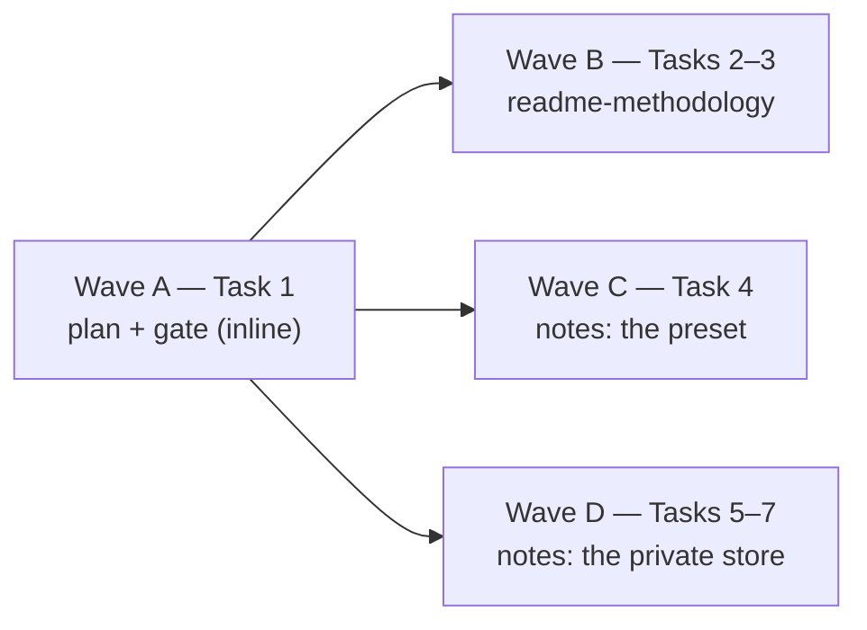

# Wave 2 Closure — README, Methodology, Notes Implementation Plan

> **For agentic workers:** REQUIRED SUB-SKILL: Use superpowers:subagent-driven-development
> (recommended) or superpowers:executing-plans to implement this plan task-by-task. Steps use
> checkbox (`- [ ]`) syntax for tracking.
>
> **The wave is the dispatch unit, not the task.** This plan groups its seven tasks into
> four lettered waves (the table and the launch graph below). Wave A is one small task the
> controlling session runs itself before anything is dispatched; Waves B, C and D are each
> dispatched to **one implementer subagent per wave**, with **one review round per wave**
> and **one reviewer subagent per wave**, the whole wave's tasks in one brief. Inside a wave
> nothing changes: every task keeps its own failing test, its own verification and its own
> commit. A plan that is merely grouped into waves visually gets executed one subagent per
> task, and nothing about that looks wrong while it happens — this paragraph is what stops it.

> **No code block in this plan was executed before it was written down.** Every `Expected:`
> line is a prediction and every mutation outcome is a hypothesis: apply the mutation, run the
> test, revert, and record what actually happened in the task's commit message. If a test
> reddens for another reason, or does not redden, stop and redesign the assertion rather than
> keeping the prose. Where a step's instruction does not match the tree, report the mismatch
> instead of guessing.

> **Half of this plan changes files no commit will ever carry.** Wave D rewrites a private,
> git-ignored note store in another repository's checkout, and the only durable record of
> that work is the measurements each step tells the implementer to paste into the wave
> report. Paste them; a Wave D report without numbers is a report of nothing. And because
> that store has no version control, Wave D copies it aside before its first write and again
> before its first hand edit — every recovery branch below is a `diff -r` against that copy.

**Goal:** Close wave 2 of the extraction design on the documentation side — a `README.md`
that says what Keelline is, what it writes and every command it ships, a `docs/methodology/`
that states the principles behind it with dated sources and an honest note wherever the
backing is thin, and the owner's working-memory store rewritten in place to the note schema
the memory engine reads — so that wave 3's `skills-author` has a methodology to cite,
the P5 materials package has a README to polish, and `attach` has a store already in the shape
it links.

**Architecture:** Two lanes that share no file. `readme-methodology` is documents held to a
test: a rewritten README whose command block is checked against the real parser (every
registered `group command` has a row, every row parses), a three-file `docs/methodology/`
(`README.md` for how to read it, `principles.md` for the principles, `sources.md` for the
citation pack), and one top-level test module that holds their links, their citations and
their backing labels. `notes` is content work executed *with* the shipped memory engine
rather than code: a git-ignored `keelline.toml` makes the private store readable by
`keelline memory …`, a one-off script (kept in the scratchpad, never committed) moves every
hand-curated routing line out of the hand-written index into its note's `index:` frontmatter
and the index's sub-headings into `group:` and `group_order:` keys, the engine renders the
index from then on,
the cross-audience wiki-links §11 forbids are rewritten, misfiled note types are corrected,
and the four generic standing rules are written neutrally into the preset's `[rules]` table
so the `preset-rules` bundle stops being silent. The §5.8 gate grows to walk the public
documents with the one exemption a public document needs: the default paths the preset
itself ships cannot identify a project.

**Tech Stack:** Python ≥ 3.11, standard library only at runtime (`argparse`, `re`,
`pathlib`, `tomllib`), pytest, ruff, mypy strict, `uv`. No new runtime module: Wave B ships
documents and one test module; Wave C ships one TOML table, one test edit and one fragment;
Wave D ships nothing here and runs three scratch scripts.

**Spec:** the agent-harness extraction design (2026-09-05), a private document — §1
(positioning: the bug ledger, the enforcement state machine and the versioned overlay as the
three things found nowhere else; the assertion-oracle discipline and the audit skills as the
two that ride along; the named non-goal; the adoption shape); §2 D3 (neutral core, personal
defaults as a preset), D5 (the memory format stays), D6 (the index is a rendering of
hand-written routing lines), D7 (budgets belong to the preset), D13 (English artifacts), D15
(repository configuration never grants capability); §5.6 (the preset's "standing rules to
enable: ask at decision forks, worktree by default, research freshness, check CI after a
push, no AI attribution, sync the branch from its parent" and `docs/methodology/`: "the
principles the surveys extracted, each with its sources from the citation pack and an honest
note where backing is thin (the falsifiability framing of the ledger, the freshness rule, the
language split)"); §5.8 (no project-identifying string anywhere in the public tree); §9.2
(note schema: `index:`, `group`, `metadata.type`, `startup`, `as_of`, passthrough keys);
§9.3 (the index is rendered from `index:` lines; the first render is budget-checked before
it replaces anything); §11 (memory: "the four generic startup rules rewritten neutrally into
the preset, the language rule into the machine configuration"; "`common/ → projects/` links
are forbidden … the note-migration package rewrites those ten notes (inline the sentence or
drop the link) and its plan cites the count"); §15.2 (the `readme-methodology` row: "README
skeleton, positioning, `docs/methodology/` with the citation pack", depends on foundation;
the `notes` row: "in-place rewrite of the 85 notes in the current store: `index:` lines, the
ten `common/` notes that link into the project, reclassification, startup rules into the
preset — spec (schema); memory-engine validates when it lands"); §15.4 (disjoint ownership:
`README.md` and `docs/methodology/` to readme-methodology, `presets/` to setup); §17 (the
evidence list "the full citation pack goes into `docs/methodology/`"). That document cannot
be opened from this repository; every clause this plan leans on is quoted where it is used.

**Scope:** packages `readme-methodology` and `notes` (§15.2), in one plan by owner decision
of 2026-09-16 (the second of two plans that together close wave 2; the first delivered
`ledger`, `docs-tooling` and `skills-port`). A change belongs to this plan iff it lands in
`README.md`, `docs/methodology/`, `tests/test_documents.py`, the `[rules]` table of
`src/keelline/presets/recommended.toml`, the one bundles test that asserts that table is
absent, the public-document walk this plan adds to `tests/test_neutral_wave2.py`, a
`changelog.d/{readme-methodology,notes}.feature.md` fragment, one sentence in
`docs/plans/README.md`, or — outside this repository — the git-ignored note store of the
private repository handed to Wave D in its brief (its notes, its `MEMORY.md`, a git-ignored
`keelline.toml` beside it, and the store's one committed contract document). The rest of
the preset (`[defaults.*]`, plugins to install, deny rules, personal-parameter defaults)
belongs to `setup`; the overlay layout that turns `developer/` into `common/memory` belongs
to `overlay` and `attach`; the hook that will inject `preset-rules` belongs to `hooks-core`;
the plugin manifests' `description` strings belong to `foundation`/`release`; the private
repository's own adoption (its hooks reading the rendered index, its startup notes retired
in favour of the preset) belongs to the P4 adoption package and is not started here.

**Source:** for Waves B and C, this repository's own `docs/cli.md` (every command's
contract) and the design's §1, §2 and §17 as quoted in Tasks 2 and 3 — there is no external
checkout to hold open. For Wave D, the private repository's checkout, **whose path is handed
to the implementer and to the reviewer out of band, in the dispatch briefs**, and inside it the git-ignored store under
its `[paths] memory` directory: measured 2026-09-16 at **71 notes in three groups (35, 33,
3) plus one superseded design document in a fourth folder that is not a note, 21,661 words
of notes, a hand-written index of 72 entries in 98 lines and 1,069 words, 146 wiki-link
occurrences of which 14 in 9 cross-project notes point into project-only notes, 0 dangling
links, 5 notes ranked `startup`, 0 notes carrying `index:`**. Those numbers are this plan's
premises, not its instructions: every Wave D task re-measures before it acts and reports the
difference. An implementer without the path stops at Task 5 and reports — a store
reconstructed from this plan's prose is not the store. This plan never names that
repository (§5.8), and it never names a note: the store's filenames are the private
inventory whose leak the owner is still deciding how to handle, so a public plan that
listed them would publish exactly what untracking the index was meant to stop.

## Global Constraints

Every task's requirements implicitly include this section.

- **Python floor 3.11**; the runtime imports only the standard library and `keelline` itself,
  enforced by `tests/test_import_boundary.py`. No task may add a dependency; no task adds a
  runtime module at all.
- **English artifacts (D13).** Every document, comment, commit message and fragment in this
  plan is English. Wave D reads a store that is English already and writes English into it.
- **No project-identifying string in the public tree (§5.8).** Task 1's gate walks every
  file this plan creates or rewrites in this repository, including this plan and the preset,
  with one exemption: the eleven default path values the preset ships under
  `[defaults.paths]` are Keelline's own strings and are read off the preset rather than
  written into the test. Wave D's private-side work is *outside* the gate and outside the
  tree, and nothing from it is copied back except counts — never a `--json` object whole:
  `unreadable` carries absolute note paths, and a pasted object puts private filenames into
  a report that may reach a pull-request body.
- **Repository bytes are data** (CONTRIBUTING). Nothing in this plan puts a note's text into
  a `Result.summary`, a test's expected value, or a commit message. The private store's
  notes are quoted nowhere in this repository; the wave report carries numbers.
- **Writes go through `fsops`** in any Keelline module that puts a file into a repository.
  This plan adds no such module; the one script it runs against the private store (Task 5)
  is a scratch script that edits the owner's own git-ignored files under the owner's
  instruction, and it is never committed anywhere; a copy of the store is taken before it
  runs.
- **No cross-module test imports.** `tests/` is not a package and there is no `conftest.py`.
  `tests/test_documents.py` repeats the parser-building three lines that
  `tests/skills/test_skills.py` has, on purpose.
- **No magic numbers** (D7): a bound in a test is a named module constant whose comment says
  what it caps. The two-month freshness window is `FRESH_MONTHS = 2` in `sources.md`'s
  reader, not a literal in an assertion.
- **A test must never read or write the developer's real `~/.config/keelline/`.** Wave D's
  commands run against the private store with `--root <private checkout>` and never with
  `--machine` pointing at the real file; they need no trust record and record none (the
  store's mode is `in-repo` only so the resolver looks at `[paths] memory`, and `memory
  index` renders without trust — trust gates injection, not rendering; every `memory index`
  line the wave pastes therefore ends in the untrusted-store clause, which is expected).
- **Every new assertion ships with the mutation that reddens it**, or a sentence saying why
  no mutation exists. Mutation outcomes below are written as predictions.

## File Structure

| Path | Responsibility | Wave |
|---|---|---|
| `docs/plans/2026-09-16-wave-2-closure-readme-notes.md` (this file) | the plan, committed by Task 1 | A |
| `tests/test_neutral_wave2.py` | the §5.8 gate, grown by a public-document walk (`DOCUMENTS`, `PUBLIC_FORBIDDEN`, the preset-paths exemption) and a `.`-aware vendor-branch arm | A |
| `README.md` | what Keelline is, what it writes, every command, the memory page, where the methodology is | B |
| `docs/methodology/README.md` (create) | how to read the two files beside it: what a principle is, what a source row is, what the three backing labels mean, the freshness rule | B |
| `docs/methodology/principles.md` (create) | ten principles, each with a statement, what Keelline does about it, its sources, its backing label | B |
| `docs/methodology/sources.md` (create) | the citation pack: numbered rows with a date, a URL, what each is cited for, and the month it was last read | B |
| `tests/test_documents.py` (create) | links in the public documents resolve; every registered command has a README row and every README row parses; every citation resolves and every source is cited; every principle carries a backing label | B |
| `changelog.d/readme-methodology.feature.md` (create) | the release note | B |
| `docs/plans/README.md` | one sentence: the methodology now lives in `docs/methodology/`; the design document itself stays private | B |
| `src/keelline/presets/recommended.toml` | `[rules]`: five neutral standing rules the `preset-rules` bundle renders | C |
| `tests/memory/test_bundles.py` | the "emits nothing while the preset has none" test becomes "renders the shipped rules"; the monkeypatched fixture test keeps its role | C |
| `changelog.d/notes.feature.md` (create) | the release note | C |
| *private checkout:* `keelline.toml` (git-ignored via `.git/info/exclude`) | makes the store readable by `keelline memory …` — the same stopgap this repository's own local store uses | D |
| *private checkout:* every note in the store | `index:` from the hand-written index; `group:` and `group_order:` on the notes the index filed under a sub-heading; cross-audience links rewritten; misfiled `metadata.type` corrected | D |
| *private checkout:* `MEMORY.md` in the store | rendered by `keelline memory index` from then on | D |
| *private checkout:* the store's committed contract document | its "the index is hand-written" contract replaced by "the index is rendered from `index:` lines" | D |
| *scratchpad:* `index_lines.py`, `audience_links.py`, `type_audit.py`, `store-before-task5/`, `store-before-task6/` | the one-off migration, the two measuring scripts, and the two copies of the store taken before each write phase; never committed | D |

**Premise (deviations and decisions, for the wave-2 merger):**

1. **Two packages, one plan, one branch, four waves.** Owner decision 2026-09-16, the same
   decision that put the first three closure packages into one plan. Execute on
   `wp/wave-2-closure-docs`, cut from `dev` in the primary checkout — the plan file is
   untracked there today and travels with the working tree, and Task 1 commits it. Wave A is
   one task (the plan and the gate) that the controlling session runs inline — it is too
   small to pay for a dispatch and a review, and every other wave runs under the gate it
   ships. Waves B and C share no file and no import, and both commit here, so **each runs in
   its own worktree** cut from Wave A's commit (`wp/wave-2-closure-docs-b`, `-c`) and the
   controller merges them into the branch in that order — two implementers in one working
   tree interleave commits and cross-stage each other's files. Wave D commits nothing in this
   repository: it runs `uv run keelline` from Wave A's checkout against the private root, so
   it needs no worktree and no merge. The private lane is its own wave because it is its own
   context — a different repository, no diff to review, and an exit check that must not sit
   behind it (the review of Wave D is a read-only re-measurement, stated in the wave table).
   The merger may split the branch into one pull request per wave that commits; a killed
   implementer is resumed, never restarted.
2. **The `[rules]` table is written here, not by `setup`.** §15.4 gives `presets/` to
   `setup`; §15.2's `notes` row says "startup rules into the preset", and §11 says "the four
   generic startup rules rewritten neutrally into the preset". The two clauses conflict and
   the more specific one wins: `notes` writes exactly the `[rules]` table and nothing else in
   the file, `setup` owns every other section, and the bundle that renders `[rules]`
   already ships (`memory.bundles._preset_rules`, silent "until a `[rules]` table ships").
   The rule bodies are neutral rewrites of the four generic standing rules the private store
   ranks `startup` (ask at decision forks; worktree by default; research freshness; check CI
   after a push) plus the language rule in its neutral form (the machine configuration's
   `[personal]` keys decide *which* languages; the rule says the split is by audience). §5.6
   also lists "no AI attribution" and "sync the branch from its parent"; the first is
   mechanised by `commit check` and the second by a hook `hooks-core` has not shipped, so
   neither is a standing rule here — the memory protocol's own test ("a rule already
   mechanised by a gate belongs in neither") — and `setup` may add them if it disagrees.
3. **The private store keeps its startup notes.** Until the private repository adopts
   Keelline (the P4 adoption package), its own `SessionStart` hook reads `metadata.startup`
   off the store and injects those notes; retiring them now would silently drop the owner's
   standing rules from every session. The five ranked notes stay ranked and unchanged in
   substance. When adoption replaces that hook with `memory session-context`, the four
   generic ones are deleted in favour of the preset's rules and the language note in favour
   of `[personal]`; this plan writes that instruction into the store's contract document
   (Task 7) so the adoption plan finds it.
4. **Routing lines are written into the notes by a script, not harvested.** `keelline memory
   index` would harvest every hand-written entry itself, but it stamps a harvested line
   `index_provenance: native` whatever wrote it — a hand-curated line and the harness
   writer's are indistinguishable after the fact. `curated` is the reader's *default* for a
   note that carries `index:` (no `index_provenance` key is written, because the engine
   reports `curated` in its absence), and it survives the render because `reconcile`
   short-circuits on `if note.index:` before it ever reaches the harvest — that branch, not
   a key, is what keeps a line curated. These 71 lines were curated by hand over months; the
   script writes them where the reader finds them first. The script is the instrument of the
   measurement too: it prints what it would change before it changes anything, and the dry
   run's counts go into the report.
5. **The hand order of notes is not preserved; the order of the four sub-headings is.** The
   engine orders a section by `startup` rank, then `group_order`, then name; the hand-written
   developer section was ordered by adjacency. Numbering thirty-five notes with
   `group_order` to freeze that adjacency would make every later insertion a renumbering,
   which is the maintenance cost the generated index exists to remove. Name order it is for
   notes. The project-stable section's four sub-headings carry meaning — they run from the
   code outward — and the engine orders sub-headings by the *smallest* `_order` among each
   heading's members, which with no ranks reduces to the alphabetically first filename in
   each: their hand order would be lost. So every note under sub-heading *n* gets
   `group_order: 10·n` (10, 20, 30, 40) beside its `group:`; heading order follows the number,
   order within a heading stays by name, and a fifth heading slots in at 25 without touching
   a note. Two renderer facts the read-through in Task 5 will meet and must not file as
   defects of this plan: every ungrouped note of a section precedes all of its sub-headings,
   and the renderer puts no blank line between the last entry of one `###` block and the next
   heading — cosmetic, the memory engine's, and reported, not fixed here.
6. **The index header's two casualties leave the index; `index_extra` is not used.** The
   engine renders a fixed header; the hand-written one linked the store's contract document,
   and the hand-written index carried one out-of-store entry pointing at the ledger runbook.
   Routing both through `[memory] index_extra` was the first draft, and it was priced against
   a human reader when three programs read that file. Executed during review: `_extra`
   renders every in-project entry **root-relative** (it keeps `contained(store.root, …)`'s
   result, so no spelling yields the `../` form), and the private repository's own
   memory-reference guard drops a non-note entry only when its target starts with `..` — a
   root-relative entry is kept as a note the walk should have reached, the walk never reaches
   it, and the guard exits **2** ("the walk did not reach the whole store"), which Task 5's
   probes would then read as a store gone wrong. `_extra` also drops an escaping path
   silently and never checks that a path exists, and the `refused_extra` field is `[]` in
   every non-overlay mode — the key has no oracle in any direction. So the two pointers go:
   the contract document is where the store's rules live and the hooks that read the store
   name it; the runbook's notes are injected in full by the ledger's own hook whenever an
   entry is opened, which is a better delivery than a title in the index. A store-relative
   `index_extra` rendering, with an existence check, is a memory-engine follow-up
   (Premise 15).
7. **Reclassification is a bounded audit, not a re-filing.** §11's reclassification (the
   five eval and migration notes moved to the cross-project group) had already happened when
   this was measured. What remains is a type audit against §9.2's four values: one
   cross-project note typed `project` and three project-stable notes typed `feedback` or
   `user` (measured 2026-09-16). Task 6 decides each by the note's *audience* — a lesson
   that would hold in another repository is `feedback`, a fact about this one is `project`,
   a fact about the owner is `user`, a pointer to a resource is `reference` — and moves a
   note between groups only when its audience is plainly the other one. Group moves are
   reported by count, and a move that would empty a group is refused — `memory refs` exits 2
   for any configured group absent on disk.
8. **Cross-audience links are inlined or dropped, never redirected.** §11: "inline the
   sentence or drop the link". A cross-project note that links into a project-only note is
   rewritten so that the sentence stands on its own (the rule it was pointing at, in one
   clause) or the link is removed where the sentence already stands; a cross-project note
   never grows a project-specific clause to keep a link alive. Project-only notes may link
   into cross-project ones freely — that direction resolves from every project. The count
   this plan cites is 14 occurrences in 9 notes (§11 counted 14 in 10 on 2026-09-05; one
   note has since been merged away); Task 6 re-measures and reports both numbers.
9. **The private store's contract document is the one committed file Wave D changes.** It
   says the index is hand-written and budgeted by hand, which Task 5 makes false; a change
   that falsifies a document owns that document. Task 7 rewrites its index contract and
   commits it in the private repository **only if** that checkout's working tree is clean
   and on its base branch — another session may hold uncommitted work there — and otherwise
   leaves the edit uncommitted and says so in the report.
10. **This repository's own local store is untouched.** It is a fourteen-note selection
    seeded from the private store as a stopgap, already rendered by the engine, and it dies
    with the `setup` lane. Re-seeding it from the rewritten notes is a five-minute owner
    step after this plan merges, not a task.
11. **The gate's preset-path exemption is derived, not listed.** `README.md`, `docs/cli.md`
    and the preset itself carry the default `[paths]` values, three of which are tokens in
    the digest table because they were the source repository's paths first. A public
    document that could not say where the note store lives by default would be useless, so
    `PUBLIC_FORBIDDEN` is `FORBIDDEN` minus the digests of the values
    `load_preset("recommended")["defaults"]["paths"]` yields at import time — no path is
    written into the test, and the exemption is exactly "what the plugin ships". The lane
    walk (`LANE`, `EXTRA_FILES`) keeps the full table: source code has no reason to spell a
    default path. The vendor-branch arm gains `(?<![.\w/])` so `.claude/settings.json` and
    `.codex/hooks.json` — harness directories every public document must be able to name —
    and a `/codex/` path segment inside a documentation URL stop reading as a
    vendor-prefixed branch; a bare vendor-prefixed branch name still does.
12. **The README's command coverage is held by a test, both ways.** The first plan left
    "the README rows for the eight new commands" to this lane, and the README's own banner
    admits its list "predates the ledger and the lints". `tests/test_documents.py` derives
    the set of registered `group command` pairs from the real parser and asserts the README
    block names every one of them and that every `keelline …` line in the block parses; a
    lane that ships a command without a README row reddens it, which is the only way a
    README stays current across lanes that never read it.
13. **`docs/methodology/` is principles and sources, not the design document.**
    `docs/plans/README.md` and `CONTRIBUTING.md` say the design "will move here with the
    rest of the methodology documents"; it cannot move as it is — it names the private
    repository, its identifiers, its phases and its paths in nearly every section, all of
    which §5.8 forbids — and neutralising a 1,200-line design is a separate decision for the
    owner. This lane ships what §5.6 asks for; Task 3 rewrites the one sentence in
    `docs/plans/README.md` so it stops promising the design's arrival and points at
    `docs/methodology/` instead. `CONTRIBUTING.md`'s sentence is left alone: it says only
    that the design is private, which stays true.
14. **Sources carry the month they were last read, and a freshness label a test enforces.**
    The private freshness rule ("sources within the last two months, older material dated
    and labelled") becomes a public one in `docs/methodology/README.md`: every source row
    has a publication month and a `read` month; a source older than `FRESH_MONTHS` at its
    `read` month must carry the label `older` in its notes column. The test checks the
    label is present where the arithmetic says it must be; it does not fetch anything.
    Whether a URL still resolves is checked once, by the implementer, at Task 2 with `curl`,
    and each failure is recorded in the row rather than hidden.
15. **Owed elsewhere, so it is written down:** the hook entry that injects `preset-rules`
    (`hooks-core`); the `[personal]` values on the owner's machine (`setup`, and the owner —
    no task writes under `~/.config/keelline/`); the private repository's adoption of the
    rendered index by its own hooks beyond the smoke checks Task 5 runs (the P4 adoption package);
    the deletion of the four generic startup notes and the language note from the private
    store (same lane, Premise 3); the whole-tree §5.8 gate that retires both copies of the
    lane gate (`workflows`); the `README.md` "Pre-1.0" banner's *next* rewrite when the
    adoption state machine ships (`assess`); the two remaining §5.6 preset rules if `setup`
    wants them (Premise 2); a store-relative, existence-checked rendering of
    `[memory] index_extra`, so a project can point its index at a document outside the
    store without every other reader of the file being wrong (`memory-engine`, Premise 6);
    the blank line the renderer omits before a `###` sub-heading (same lane, Premise 5);
    this repository's local `AGENTS.md`, which is not a document and is updated by whoever
    merges.

**Neutralisation (§11: nothing leaves carrying the private repository's state).** Wave D
works *inside* that repository and copies nothing back; Waves B and C write new public prose. The
table names what each wave must not carry into this tree, and Task 1's gate fails on it.

| Private string | Becomes |
|---|---|
| The private repository's name, in any spelling, in the README, the methodology, a fragment, a commit message, this plan | removed; "a private repository" where a reference is unavoidable |
| Any note's filename or title | never written into this repository; Wave D reports counts, never a whole `--json` object |
| The private index's section titles beyond what `[memory] groups` renders (`Developer (cross-project)`) | the engine's own `## Developer` |
| The owner's harness hook script names, in the store's contract document | left in the private document, which is not public; never quoted here |
| Ledger identifiers, phase names, PR numbers cited by notes | stay in the notes (§11: "pointers to PR and BR identifiers stay; they resolve from the project"); none copied into this tree |
| The three default path values that are also digest-table tokens | allowed in public documents and the preset only, through the derived exemption (Premise 11) |

---

## Waves and launch graph

| Wave | Tasks | Package | Dispatch |
|---|---|---|---|
| **A** | 1 | the plan and the gate | **the controlling session, inline, before any dispatch** — one commit, no review round; every other wave runs under the gate it ships |
| **B** | 2–3 | `readme-methodology` | one implementer, one reviewer, in worktree `wp/wave-2-closure-docs-b`; no external checkout; the largest wave on plan lines, most of it prose the implementer copies; a review finding against that prose is a *plan* edit, not a code edit |
| **C** | 4 | `notes`, the public half | one implementer, one reviewer, in worktree `wp/wave-2-closure-docs-c`; one TOML table, one test edit, one fragment, and the in-repository exit check at its end |
| **D** | 5–7 | `notes`, the private half | one implementer, one reviewer, both from Wave A's checkout with the private root in their briefs; commits nothing here. **The review is a read-only re-measurement**, not a diff review: the reviewer re-runs `memory index --check`, `memory inventory`, the two measuring scripts and `docs check --links --memory-graph` against the private root, compares each number with the implementer's report, reads the rendered `MEMORY.md` and the edited contract document, and runs the four probes of Task 5 Step 6 — and edits nothing |

Edges derive from the tasks' Consumes/Produces, not from the file lists. B, C and D share no
file and no import; all three consume Task 1's gate; D consumes five rule *names* from C,
which the plan carries as text and which nothing in D executes against — no edge.



**A killed implementer is resumed, not re-dispatched.** Wave D's Task 5 changes seventy-one
files it does not commit; a restarted implementer that re-runs the script on an already
rewritten store finds nothing to do (the script is idempotent by construction — it skips a
note that already carries `index:`) and must then read the report of the killed run to know
what Task 6 still owes. An implementer killed *mid-write* is the case idempotence does not
cover: `diff -r` against the copy Task 5 Step 4 took says which notes were touched, and
`cp -a` of that copy is the way back.

---

### Task 1: This plan, and the gate over the public documents

**Files:**
- Modify: `tests/test_neutral_wave2.py`
- Commit: `docs/plans/2026-09-16-wave-2-closure-readme-notes.md` (this file)

**Interfaces:**
- Consumes: `FORBIDDEN`, `SHAPES`, `offending(text, forbidden=FORBIDDEN)`, `digest_of`,
  `lane_files()` from the existing gate; `keelline.presets.load_preset(name) -> dict`.
- Produces: `PUBLIC_FORBIDDEN` (the table minus the preset's default path digests),
  `DOCUMENTS` (the public files this plan walks with it), `PLANS` (both closure plans), and
  `test_no_public_document_carries_a_source_repository_string`, which every later task in
  every wave runs. One coupling to say out loud: `offending()` reads the module-level
  `SHAPES`, so the vendor-arm change below applies to the lane walk as well as to the public
  one — it removes false positives there and changes nothing else. Wave B adds `docs/methodology/*.md` to the walk through the glob already
  in `document_files()`; Waves C and D add nothing — the preset is named here.

**Run by the controlling session, inline.** No subagent, no review round: this is one commit
that both dispatched waves need on the branch before they start.

- [ ] **Step 1: Write the failing walk**

In `tests/test_neutral_wave2.py`, replace the single `PLAN` constant and grow the module.
The digests, `SHAPES`' first two arms, `offending()`, `digest_of` and every existing test
stay byte-for-byte; the changes are exactly these.

```python
# tests/test_neutral_wave2.py — replace `PLAN = "..."` with:
PLANS = (
    "docs/plans/2026-09-16-wave-2-closure-ledger-docs-skills.md",
    "docs/plans/2026-09-16-wave-2-closure-readme-notes.md",
)
FRAGMENTS = ("ledger", "docs-tooling", "skills-port", "memory-refs", "readme-methodology", "notes")
# The public documents the second closure plan writes or rewrites, walked with
# `PUBLIC_FORBIDDEN` rather than the full table (see it). `docs/methodology/` is a glob so a
# fourth file there is gated the day it is added; the preset is here because that plan
# writes its `[rules]` table and a rule body is prose.
DOCUMENTS = (
    ROOT / "README.md",
    ROOT / "src" / "keelline" / "presets" / "recommended.toml",
    ROOT / "docs" / "plans" / "README.md",
)
METHODOLOGY = ROOT / "docs" / "methodology"
```

Add, after `offending()`:

```python
def _preset_paths() -> tuple[tuple[int, str], ...]:
    """The digests of the default `[paths]` values the preset ships.

    Three of them are in `FORBIDDEN`, because they were the source repository's paths before
    they were Keelline's defaults. A public document that could not say where the note store
    lives by default would be useless, so the public-document walk exempts exactly the values
    the plugin itself ships — read off the preset at import time, never written here. Source
    code keeps the full table: a module has no reason to spell a default path.
    """
    from keelline.presets import load_preset

    values = load_preset("recommended")["defaults"]["paths"].values()
    return tuple((len(value), digest_of(value)) for value in values)


PUBLIC_FORBIDDEN = tuple(entry for entry in FORBIDDEN if entry not in _preset_paths())


def document_files() -> list[Path]:
    found = [*DOCUMENTS, *sorted(METHODOLOGY.glob("*.md"))]
    # Both plans, without an existence guard, for the reason `lane_files` gives.
    found.extend(ROOT / plan for plan in PLANS)
    for slug in ("readme-methodology", "notes"):
        fragment = ROOT / "changelog.d" / f"{slug}.feature.md"
        if fragment.is_file():
            found.append(fragment)
    return sorted(found)
```

In `lane_files()`, replace `found.append(ROOT / PLAN)` with `found.append(ROOT / PLANS[0])`
— the first plan stays under the full table, the second is a public document — and the
`FRAGMENTS` loop stays as it is (it now also picks up the two new fragments under the full
table, which is fine: a fragment is walked twice, once per table, and the stricter walk
wins; they name no default path).

Change the vendor-branch arm:

```python
    # `(?<![.\w/])`: `.claude/settings.json` and `.codex/hooks.json` are harness directories a
    # public document has to be able to name, and a documentation URL can carry `/codex/` as a
    # path segment; a branch name is never preceded by a dot or a slash.
    ("vendor branch", re.compile(r"(?<![.\w/])(?:codex|claude|cursor)/[a-z0-9][\w-]*")),
```

Add the tests:

```python
# Three of the preset's eleven default `[paths]` values are also digest-table entries — the
# ones that were the source repository's paths before they were Keelline's defaults. Pinned so
# the exemption cannot quietly grow: a fourth would mean a token was added to the table for a
# path the plugin itself ships, which is a contradiction to resolve, not to exempt.
PRESET_PATHS_IN_TABLE = 3


def test_the_public_document_walk_is_not_empty() -> None:
    # The vacuity guard for the parametrised public walk below, the same shape as
    # `test_the_gate_reads_something` for the lane walk; named apart from it so `-k` can pick
    # one. Wave B adds `docs/methodology/README.md` here when it creates the directory.
    files = document_files()
    assert ROOT / "README.md" in files
    assert ROOT / PLANS[1] in files
    assert ROOT / "src" / "keelline" / "presets" / "recommended.toml" in files


def test_the_exemption_is_exactly_the_presets_default_paths() -> None:
    # Reddens if the preset stops shipping a default path (the exemption shrinks and a public
    # document that names it reddens too), or if someone widens `PUBLIC_FORBIDDEN` by hand:
    # the difference between the two tables must be preset values and nothing else.
    exempt = set(FORBIDDEN) - set(PUBLIC_FORBIDDEN)
    assert exempt <= set(_preset_paths())
    assert len(exempt) == PRESET_PATHS_IN_TABLE
    # The full table's size is pinned by `test_the_denylist_is_stored_as_digests`; the lane
    # walk still refuses those three, which `test_the_public_table_still_discriminates` shows.


def test_the_public_table_still_discriminates() -> None:
    # A preset path is allowed by the public table and refused by the full one; a planted
    # token is refused by both; the dotted harness directory is not a vendor branch.
    from keelline.presets import load_preset

    a_default = next(iter(load_preset("recommended")["defaults"]["paths"].values()))
    exempt_value = next(
        value
        for value in load_preset("recommended")["defaults"]["paths"].values()
        if (len(value), digest_of(value)) in set(FORBIDDEN)
    )
    assert offending(exempt_value, PUBLIC_FORBIDDEN) == []
    assert offending(exempt_value) != []
    assert offending(a_default, PUBLIC_FORBIDDEN) == []
    probe = "quernstone"
    planted = ((len(probe), digest_of(probe)),)
    assert offending("see quernstone", planted) == [f"token {digest_of(probe)}"]
    assert offending("edit .claude/settings.json and .codex/hooks.json") == []
    assert offending("see https://example.test/codex/plugins/build") == []
    # The positive case — a bare vendor-prefixed branch name — is `test_the_gate_discriminates`'s
    # existing assertion, which this change must leave green; it is not repeated here because
    # this plan is walked by the gate and would trip on its own example.


@pytest.mark.parametrize("path", document_files(), ids=lambda p: str(p.relative_to(ROOT)))
def test_no_public_document_carries_a_source_repository_string(path: Path) -> None:
    assert offending(path.read_text(encoding="utf-8"), PUBLIC_FORBIDDEN) == [], path
```

Update the module docstring's second paragraph to say the gate now has two tables and why
(three sentences: the public walk, the derived exemption, the lane walk unchanged).

- [ ] **Step 2: Run it**

Run: `uv run pytest tests/test_neutral_wave2.py -q`
Expected: green, first time. **This task has no red state:** the plan file is what the
executing session was handed, so it is on disk before Step 1, and the public walk over
`README.md` and this plan goes green because of the two halves of this edit together (the
exemption clears the store path in the README; the new arm clears `.claude/settings.json`
and the URL cases in this plan's own prose — under the old `\b` arm this plan reddens the
walk). That is why the test edit and the plan land in **one commit**, and why Step 3's
mutations are the whole discrimination proof for this task. If this plan reddens the walk
after the edit, the plan is wrong: fix the plan's wording, not the table.
`test_the_gate_discriminates` stays green — its vendor-branch case is a bare branch name
preceded by a space.

- [ ] **Step 3: Mutations**

Three, one at a time, each reverted before the next; record the outcome in the commit:

1. In `_preset_paths`, return `()`. Expected: `test_the_exemption_is_exactly_the_presets_default_paths`
   reddens (`len(exempt)` is 0 against `PRESET_PATHS_IN_TABLE`) **and** the public walk over
   `README.md` reddens on the store path — the exemption is load-bearing for a real
   document, not only for its own test.
2. Change the vendor arm back to `\b`. Expected: `test_the_public_table_still_discriminates`
   reddens on the `.claude/settings.json` case, and the public walk over this plan reddens
   with it — the plan's Premise 11 names the dotted paths.
3. Remove `ROOT / PLANS[1]` from `document_files()`. Expected:
   `test_the_public_document_walk_is_not_empty` reddens; nothing else does.

- [ ] **Step 4: Full checks**

Run: `uv run pytest -q && uv run ruff check . && uv run ruff format --check . && uv run mypy`
Expected: green. The whole suite, because `tests/guards/test_neutral.py` carries the sibling
copy of `SHAPES` and must stay untouched — Premise 16 of the first plan says both copies
change by hand and this plan changes only one on purpose: the guards lane's gate walks
source and test files that never name a harness directory, so its arm needs no exemption,
and a diff there would be a diff for symmetry alone.

- [ ] **Step 5: Commit**

```bash
git add docs/plans/2026-09-16-wave-2-closure-readme-notes.md tests/test_neutral_wave2.py
git commit -m "docs(plans): plan the second half of the wave-2 closure, and gate its public documents"
```

---

### Task 2: The methodology — principles, sources, and the test that holds them

**Files:**
- Create: `docs/methodology/README.md`, `docs/methodology/principles.md`,
  `docs/methodology/sources.md`, `tests/test_documents.py`
- Modify: `tests/test_neutral_wave2.py` (one assertion in `test_the_public_document_walk_is_not_empty`)

**Interfaces:**
- Consumes: `PUBLIC_FORBIDDEN` and `document_files()` from Task 1 (the walk picks the three
  new files up through the `docs/methodology/*.md` glob).
- Produces: `docs/methodology/sources.md`'s row grammar (`| S<n> | … |`, seven columns) and
  `principles.md`'s section grammar (`## <n>. <title>`, a `**Backing:**` line, `[S<n>]`
  citations), which Task 3's README links to and which `tests/test_documents.py` reads; the
  test module itself, which Task 3 extends with the README's two tests. `FRESH_MONTHS`,
  `BACKING_LABELS`, `_SOURCE_ROW`, `_CITATION`, `links_in(path)`, `sources()`,
  `principle_sections()` in `tests/test_documents.py`.

- [ ] **Step 1: Write the failing tests**

```python
# tests/test_documents.py
"""The public documents are held to a contract, the way the skills are (tests/skills).

`README.md` and `docs/methodology/` are read by people who have not read the code, which is
why nothing in them may be wrong in a way a test could have caught: a relative link that
does not resolve, a command row the parser does not accept, a command with no row, a
citation with no source, a source nothing cites, a principle with no statement of how well
it is backed. None of these is a matter of taste, so none is left to review.

No cross-module test imports (`tests/` is not a package): the three parser lines are the
same three `tests/skills/test_skills.py` has, on purpose.
"""

from __future__ import annotations

import re
from pathlib import Path

import pytest

ROOT = Path(__file__).resolve().parents[1]
README = ROOT / "README.md"
METHODOLOGY = ROOT / "docs" / "methodology"
PRINCIPLES = METHODOLOGY / "principles.md"
SOURCES = METHODOLOGY / "sources.md"
# The freshness window `docs/methodology/README.md` states: a source published more than this
# many months before it was read must say `older` in its notes column. A working rule of the
# methodology, not a project budget, so it is a constant here and a sentence there.
FRESH_MONTHS = 2
# The three answers a principle may give to "how well is this backed", defined in
# docs/methodology/README.md. A fourth value is a wording change to that file first.
BACKING_LABELS = ("sourced", "measured", "thin")
_LINK = re.compile(r"\[[^\]]*\]\(([^)\s]+)\)")
_FENCE = re.compile(r"^```.*?^```", re.MULTILINE | re.DOTALL)
# `| S12 | title | 2026-08 | 2026-09 | https://… | cited for | notes |` — seven cells. The
# published cell is a month or the word `living` for a maintained page that carries no date.
_SOURCE_ROW = re.compile(
    r"^\| (S\d+) \| ([^|]+) \| (\d{4}-\d{2}|living) \| (\d{4}-\d{2}) \| (https?://\S+) \| ([^|]+) \| ([^|]*)\|$",
    re.MULTILINE,
)
_CITATION = re.compile(r"\[(S\d+)\]")
_SECTION = re.compile(r"^## (\d+)\. (.+)$", re.MULTILINE)
# The label, then a full stop, then whatever prose follows: `**Backing:** sourced. The mechanism…`.
# Capturing the bare word let `sourced for the budget` pass as `sourced` while the README says
# the label is chosen by the weakest link, so the stop is part of the grammar.
_BACKING = re.compile(r"^\*\*Backing:\*\* (\w+)\.", re.MULTILINE)


def prose(path: Path) -> str:
    return _FENCE.sub("", path.read_text(encoding="utf-8"))


def links_in(path: Path) -> list[str]:
    """Relative link targets in a document's prose; URLs, anchors and mail links are not
    the tree's to resolve."""
    return [
        target.split("#", 1)[0]
        for target in _LINK.findall(prose(path))
        if not target.startswith(("http://", "https://", "#", "mailto:"))
        and target.split("#", 1)[0]
    ]


def public_documents() -> list[Path]:
    return [README, ROOT / "docs" / "plans" / "README.md", *sorted(METHODOLOGY.glob("*.md"))]


def sources() -> dict[str, tuple[str, str, str, str, str, str]]:
    text = SOURCES.read_text(encoding="utf-8")
    return {row[0]: row[1:] for row in _SOURCE_ROW.findall(text)}


def principle_sections() -> list[tuple[str, str, str]]:
    """`(number, title, body)` per `## n. title` section of principles.md."""
    text = PRINCIPLES.read_text(encoding="utf-8")
    matches = list(_SECTION.finditer(text))
    return [
        (m.group(1), m.group(2), text[m.end() : matches[i + 1].start() if i + 1 < len(matches) else len(text)])
        for i, m in enumerate(matches)
    ]


def _months(stamp: str) -> int:
    year, month = stamp.split("-")
    return int(year) * 12 + int(month)


# Vacuity floors, not coverage: the table has 32 rows and the principles 10 sections today,
# and these numbers say only "not empty enough to be a mistake". Pinning the exact counts
# would make every added source a test edit; the cited/citing tests below hold the content.
SOURCES_FLOOR = 20
PRINCIPLES_FLOOR = 8


def test_the_methodology_walks_are_not_empty() -> None:
    # The vacuity guard for every parametrised test below: an empty methodology directory
    # or an empty sources table passes them all vacuously. Named apart from the two gate
    # guards in `tests/test_neutral_wave2.py` so `-k` can pick one.
    assert PRINCIPLES in public_documents()
    assert len(sources()) >= SOURCES_FLOOR
    assert len(principle_sections()) >= PRINCIPLES_FLOOR


@pytest.mark.parametrize("path", public_documents(), ids=lambda p: str(p.relative_to(ROOT)))
def test_every_relative_link_resolves(path: Path) -> None:
    # Mutation: point one README link at `docs/methodolgy/` — that file's case reddens naming
    # the target.
    missing = [target for target in links_in(path) if not (path.parent / target).exists()]
    assert missing == [], missing


def test_every_source_row_parses_and_the_table_has_no_other_rows() -> None:
    # A row that does not match the grammar is invisible to every test below, which is how a
    # citation to it would look dangling and a fix would be to "loosen the regex". So the
    # table's row count is measured two ways and they must agree: every `| S` line is a row.
    text = SOURCES.read_text(encoding="utf-8")
    declared = [line for line in text.splitlines() if line.startswith("| S")]
    assert len(declared) == len(sources()), "a source row does not match the grammar"


def test_every_citation_resolves_and_every_source_is_cited() -> None:
    # Mutations: cite `[S99]` in a principle → the first assertion reddens; add a row `S98`
    # nothing cites → the second reddens. Both directions, because an uncited source is a
    # source someone meant to use and forgot, which is a claim left without its evidence.
    cited = set(_CITATION.findall(PRINCIPLES.read_text(encoding="utf-8")))
    cited |= set(_CITATION.findall((METHODOLOGY / "README.md").read_text(encoding="utf-8")))
    known = set(sources())
    assert cited - known == set(), sorted(cited - known)
    assert known - cited == set(), sorted(known - cited)


def test_a_source_older_than_the_window_says_so() -> None:
    # Mutation: delete the word `older` from one dated-2025 row's notes → reddens naming it.
    # A `living` page is fresh by definition of the `read` column, so the arithmetic skips it.
    late = [
        source_id
        for source_id, (_, published, read, _, _, notes) in sources().items()
        if published != "living"
        and _months(read) - _months(published) > FRESH_MONTHS
        and "older" not in notes
    ]
    assert late == [], late


def test_a_fresh_source_is_not_labelled_older() -> None:
    # The other direction: the label means something only if it is absent where it does not
    # apply. Mutation: write `older` into a `living` row's notes → reddens.
    wrong = [
        source_id
        for source_id, (_, published, read, _, _, notes) in sources().items()
        if "older" in notes
        and (published == "living" or _months(read) - _months(published) <= FRESH_MONTHS)
    ]
    assert wrong == [], wrong


def test_every_principle_states_its_backing_and_cites_or_measures() -> None:
    # Mutation: remove one `**Backing:**` line → that section is named. A `thin` principle
    # must still cite something or say why nothing exists; the citation rule here is that
    # every section carries at least one `[S<n>]`, and `thin` ones say in prose what the
    # citation does not establish — the README defines the labels.
    sections = principle_sections()
    unlabelled = [n for n, _, body in sections if not _BACKING.search(body)]
    assert unlabelled == [], unlabelled
    bad_label = [
        (n, m.group(1))
        for n, _, body in sections
        if (m := _BACKING.search(body)) and m.group(1) not in BACKING_LABELS
    ]
    assert bad_label == [], bad_label
    uncited = [n for n, _, body in sections if not _CITATION.search(body)]
    assert uncited == [], uncited


def test_principles_are_numbered_consecutively_from_one() -> None:
    # Cheap, and it is what makes `[principle 4]` in the README mean the same thing next
    # month. Mutation: renumber section 3 as 5 → reddens.
    numbers = [int(n) for n, _, _ in principle_sections()]
    assert numbers == list(range(1, len(numbers) + 1))
```

- [ ] **Step 2: Run them to watch them fail**

Run: `uv run pytest tests/test_documents.py -q`
Expected: `test_the_methodology_walks_are_not_empty` reddens on `sources()` (no file → `FileNotFoundError`
from `read_text`, which is a failure, not an error in the walk — acceptable for the red
step); every parametrised link case for `README.md` is collected and goes green or red on
the README as it stands (it links `docs/cli.md`, `SECURITY.md`, `CONTRIBUTING.md`, `LICENSE`
— all present, so green); nothing else is collected because `principles.md` does not exist.

- [ ] **Step 3: Write `docs/methodology/README.md`**

```markdown
# Methodology

Keelline is the tooling half of a way of working with coding agents. This directory is the
other half: the principles the tooling exists to hold, each stated once, each with the
sources that back it and a plain statement of how well they do.

Two files:

- [principles.md](principles.md) — ten numbered principles. Each one has a statement, what
  Keelline does about it today, its sources, and a **Backing** line.
- [sources.md](sources.md) — the citation pack. Every `[S<n>]` in the principles resolves to
  a row here; every row is cited at least once. A test holds both directions.

## How to read a Backing line

A principle says one of three things about its evidence, and the word is chosen by the
weakest link in the chain, not the strongest:

- **sourced** — a dated primary source outside this project states the claim, or states the
  platform fact the claim rests on. The sources are listed and the principle says what each
  one establishes.
- **measured** — the claim rests on a measurement this project made and recorded with its
  date: a count, a byte size, a probe's exit code. Measurements go stale; the date is part
  of the claim.
- **thin** — the principle is a working rule that has earned its place in practice and has
  no independent backing beyond that. It is stated as a rule because the alternative is to
  hide it inside the tooling and pretend it is a fact. Three of the ten are thin, and each
  says what would change its label.

The line is the label, a full stop, and then prose: `**Backing:** sourced. The mechanism is
this project's…`. A hedge lives in the prose, never in the label — a test reads the word
before the stop and nothing after it.

A principle marked *thin* is not a principle to skip. It is one to argue with.

## How to read a source row

`| S<n> | what it is | published | read | URL | cited for | notes |`

- **published** is the month the source carries on its own page, or `living` for a
  maintained reference page that carries no date. A date computed by a fetch tool from a
  timestamp was checked against the page before it went in.
- **read** is the month the source was last opened by whoever edited the row.
- **notes** says `older` when the source was published more than two months before it was
  read. The field this project sits in changes month to month — the same tool can change its
  storage engine and ship a major version between two citations — so an undated source can
  recommend a practice the ecosystem has already left. Older sources are cited for what they
  established, and a fresh source is named beside them where the claim is still current.
  A test checks that the label is present wherever the arithmetic says it must be, and
  absent where it must not; it does not fetch anything.
- A row whose URL could not be fetched when it was added says so in **notes** and names the
  secondary source the URL came from. Nothing is cited from memory.

## Where the word "harness" comes from

Anthropic wrote about harnesses for long-running agents in November 2025 [S27], OpenAI
described "harness engineering" as a discipline in February 2026 [S28] and open-sourced its
own agent harness in August 2026 [S30], and Lilian Weng generalised the term to
self-improvement loops in July 2026 [S29]. In all four the harness is what surrounds the
model: the tools, the context, the guards, the memory. Keelline uses the word the same way,
and narrows it to the part of the harness that encodes *how a particular person works* —
which is the part none of those four covers, and the part that does not travel between
machines unless something carries it.
```

- [ ] **Step 4: Write `docs/methodology/sources.md`**

The `read` month is the month the implementer runs this task. Every row was fetched on
2026-09-16 while this plan was written, with the results recorded in the notes column; the
implementer re-fetches only the rows marked *re-check* in the instructions after the table
and updates `read` on every row to the current month. Each `published` value is what the
page shows; where a page shows no date the value is `living`.

```markdown
# Sources

The citation pack for [principles.md](principles.md); how to read a row is in
[README.md](README.md).

| Id | Source | Published | Read | URL | Cited for | Notes |
|---|---|---|---|---|---|---|
| S1 | Claude Code docs: Create plugins | living | 2026-09 | https://code.claude.com/docs/en/plugins | the plugin as the unit of delivery; plugin-owned skills, agents and hooks | |
| S2 | Claude Code docs: Plugins reference | living | 2026-09 | https://code.claude.com/docs/en/plugins-reference | `${CLAUDE_PLUGIN_ROOT}` and `${CLAUDE_PLUGIN_DATA}`; `plugin.json`'s `version` as what pins update delivery | |
| S3 | Claude Code docs: Hooks reference | living | 2026-09 | https://code.claude.com/docs/en/hooks | per-event exit-code semantics; the 10,000-character cap on each hook's output; `env` blocks in a committed settings file | the cap is stated verbatim on the page; a summarising fetch missed it twice and a raw read found it |
| S4 | Claude Code docs: Skills | living | 2026-09 | https://code.claude.com/docs/en/skills | skills as Markdown with frontmatter, matched on their description | |
| S5 | Claude Code docs: Memory | living | 2026-09 | https://code.claude.com/docs/en/memory | auto-memory as Markdown notes with a `MEMORY.md` index; the first 200 lines or 25 KB of the index loaded per session | |
| S6 | Claude Code docs: Plugin marketplaces | living | 2026-09 | https://code.claude.com/docs/en/plugin-marketplaces | private marketplaces; a marketplace entry's version is overridden by the plugin's own | |
| S7 | Codex docs: Hooks | living | 2026-09 | https://learn.chatgpt.com/docs/hooks | `hooks/hooks.json` read by both harnesses; `PLUGIN_ROOT` mirrored as `CLAUDE_PLUGIN_ROOT`; the hook-trust hash; async hooks cannot block | the developers.openai.com address redirects here permanently |
| S8 | Codex docs: Build a plugin | living | 2026-09 | https://developers.openai.com/codex/plugins/build | the Codex plugin manifest and its publishing validator | |
| S9 | openai/codex repository | living | 2026-09 | https://github.com/openai/codex | the discovery code that exports the plugin root under both names | Apache-2.0 |
| S10 | obra/superpowers v6.3.0 | 2026-08 | 2026-09 | https://github.com/obra/superpowers/releases/tag/v6.3.0 | the process-skills layer Keelline delegates to and does not replace; the plan-location preference override | |
| S11 | github/spec-kit v1.0.7 | 2026-09 | 2026-09 | https://github.com/github/spec-kit/releases/tag/v1.0.7 | the manifest-with-hashes upgrade mechanism; a constitution declared up front, as the contrast to earned enforcement | |
| S12 | towncrier 26.9.0 | 2026-09 | 2026-09 | https://towncrier.readthedocs.io/ | changelog fragments assembled at release | |
| S13 | uv releases | 2026-09 | 2026-09 | https://github.com/astral-sh/uv/releases | `uv tool install` from a git tag; a stdlib-only tool needs no resolver at hook time | the docs site's footer date is stale; the release page carries the version |
| S14 | Agent Skills specification | living | 2026-09 | https://agentskills.io/specification | the skill format six harnesses read, which is why a skill body names actions and never a harness tool | |
| S15 | Agent Plugins 1.0.0 | 2026-08 | 2026-09 | https://agent-plugins.org/specification | a plugin with a declared dependency and its own manifest as a portable unit — the shape the overlay takes | |
| S16 | W3C AI Agent Memory Interoperability Community Group | 2026-06 | 2026-09 | https://www.w3.org/community/ai-agent-memory-interop/ | that there is no standard for coding-agent memory yet: the group works at protocol level and is not standards-track | older; charter adopted 2026-06-19 |
| S17 | Anthropic, "Effective context engineering for AI agents" | 2025-09 | 2026-09 | https://www.anthropic.com/engineering/effective-context-engineering-for-ai-agents | context as a budget; just-in-time retrieval over pre-loading; the cost of every token that arrives unasked | older |
| S18 | A-MEM: Agentic Memory for LLM Agents (NeurIPS 2025) | 2025-02 | 2026-09 | https://arxiv.org/abs/2502.12110 | linked notes with generated descriptions as a memory structure, the closest published shape to a routing-line index | older; background, not a design input |
| S19 | Mem0 | 2025-04 | 2026-09 | https://arxiv.org/abs/2504.19413 | the alternative Keelline does not take: a second store with its own index | older; background |
| S20 | τ-bench | 2024-06 | 2026-09 | https://arxiv.org/abs/2406.12045 | pass^k: a behaviour that passes once is not a behaviour that passes | older |
| S21 | "Stochasticity in Agentic Evaluations: Quantifying Inconsistency with Intraclass Correlation" | 2025-12 | 2026-09 | https://arxiv.org/abs/2512.06710 | run-to-run inconsistency of agent evaluations, measured | older |
| S22 | OWASP Top 10 for LLM Applications 2026 | 2026-08 | 2026-09 | https://genai.owasp.org/resource/owasp-genai-llm-top-10-2026/ | prompt injection and supply-chain entries as the threat classes a committed configuration reaches | the `/llm-top-10/` page still serves the 2025 edition |
| S23 | VibeCheck (arXiv 2609.05978) | 2026-09 | 2026-09 | https://arxiv.org/abs/2609.05978 | generated tests that "frequently lack strong assertions"; tautological tests | |
| S24 | "On the risk of coding before testing" (arXiv 2607.05139) | 2026-07 | 2026-09 | https://arxiv.org/abs/2607.05139 | implementations and tests that are mutually consistent and wrong together | |
| S25 | GitHub Docs: Reuse workflows | living | 2026-09 | https://docs.github.com/en/actions/how-tos/sharing-automations/reuse-workflows | "using the commit SHA is the safest option for stability and security" for a reusable workflow reference | |
| S26 | GitHub changelog: secret scanning and public monitoring | 2026-07 | 2026-09 | https://github.blog/changelog/2026-07-15-improvements-to-secret-scanning-and-public-monitoring/ | what secret scanning covers on a private repository, as of the date | |
| S27 | Anthropic, "Effective harnesses for long-running agents" | 2025-11 | 2026-09 | https://www.anthropic.com/engineering/effective-harnesses-for-long-running-agents | the harness as what surrounds the model over a long task | older |
| S28 | OpenAI, "Harness engineering: leveraging Codex in an agent-first world" | 2026-02 | 2026-09 | https://openai.com/index/harness-engineering/ | harness engineering named as a discipline | older; not fetched directly (the page refuses automated readers); URL and date from two secondary sources of 2026-02 |
| S29 | Lilian Weng, "Harness Engineering for Self-Improvement" | 2026-07 | 2026-09 | https://lilianweng.github.io/posts/2026-07-04-harness/ | the term generalised to self-improvement loops | |
| S30 | OpenAI, "Codex as a platform: build on the open agent harness" | 2026-08 | 2026-09 | https://developers.openai.com/blog/codex-as-a-platform | the Codex harness open-sourced | |
| S31 | Anthropic, "Building effective agents" | 2024-12 | 2026-09 | https://www.anthropic.com/engineering/building-effective-agents | the case for simple, composable patterns over frameworks | older; foundational |
| S32 | GitHub Docs: About secret scanning | living | 2026-09 | https://docs.github.com/en/code-security/secret-scanning/introduction/about-secret-scanning | availability of secret scanning per repository visibility and plan | |
```

**Re-check before committing.** Run, for every URL in the table:

```bash
grep -o 'https\?://[^ |]*' docs/methodology/sources.md | while read -r url; do
  code=$(curl -sIL -o /dev/null -w '%{http_code}' --max-time 20 "$url")
  printf '%s %s\n' "$code" "$url"
done
```

Expected: `200` for every row but S28 (`403`, recorded in its notes). Any other non-200 is
fixed in the row — the right URL, or `unconfirmed` in notes with the secondary source named
— and pasted into the report. `curl` absent or offline: say so in the report and leave the
table as planned; do not invent a status.

- [ ] **Step 5: Write `docs/methodology/principles.md`**

```markdown
# Principles

Ten principles, numbered so the README can point at one. Each has a statement, what Keelline
does about it today, its sources, and a **Backing** line whose vocabulary
[README.md](README.md) defines. Citations resolve to [sources.md](sources.md).

## 1. A bug is a file, and its index is a rendering

**Statement.** A defect is recorded as one file with a stable identifier, a status from a
closed vocabulary, and — for the severe ones — a line saying what the evidence does *not*
establish. The index over those files is generated, refuses to overwrite content it did not
write, and is never the place a fact is entered.

**What Keelline does.** `bugs new` allocates the next identifier across every ref, `bugs
index` renders the index as a pure function of the entries, `bugs check` sweeps the code
roots for identifiers with no entry behind them and entries whose evidence boundary is the
template's placeholder, and `bugs renumber` moves an entry and rewrites every mention. The
identifier grammar is one definition, read from the project's configuration.

**Why a file.** An issue tracker records a conversation; a file records a claim a later
session can falsify. The "what this evidence does not establish" line is the part that
makes an entry a hypothesis rather than a diagnosis — the reporter says where their
knowledge ends, so the next reader starts there instead of inheriting the frame.

**Backing:** thin. The falsifiability framing is this project's own; no independent source
claims that a ledger of files beats a tracker for agent-driven work, and a comparison over
projects that used both would change this label. What is sourced is the platform side: a
generated index resolved by regeneration is the same move a hashed manifest makes for
scaffolded files [S11], and the skills that teach an agent to read an entry are ordinary
skills in the format every harness reads [S4] [S14].

## 2. An assertion nobody has watched fail advertises coverage it may not have

**Statement.** A new or preserved assertion ships with the mutation that reddens it, or with
a sentence saying why no mutation exists. A test that cannot fail is not a test; a test that
fails for a reason other than the one it names proves nothing about that reason.

**What Keelline does.** `mutations.toml` declares, for each load-bearing guard, the one line
to change and the tests that must go red when it does; `scripts/mutation_oracle.py` applies
each, runs only the named tests, and fails on a survivor, on a `before` line that no longer
exists, and on a named test that does not pass on the clean tree first. CI runs the whole
set. The convention is stated in `CONTRIBUTING.md`, and the plans that built this tool
record each mutation's outcome in the commit that ran it.

**Why.** Generated tests that lack strong assertions or restate the implementation are a
measured phenomenon [S23], and an implementation and its tests can be wrong together while
staying mutually consistent [S24]. On the evaluation side, a behaviour that passes once is
not a behaviour that passes [S20], and run-to-run inconsistency of agent evaluations has
been quantified [S21]: an assertion has to be watched failing under the change it names,
not argued about.

**Backing:** sourced. The mechanism (a declared mutation set run in CI) is this project's;
the claim it serves is the four sources'.

## 3. A memory index is a routing table, not a summary

**Statement.** A note carries a rule, one line of why, how to apply it, and a bare pointer
to where the evidence lives. The index carries one line per note — a trigger and what the
note settles — and is rendered from those lines, never edited by hand. An entry that can be
quoted gets quoted instead of opened, so an entry must not read as a finished claim.

**What Keelline does.** Each note's `index:` line is the routing line; `memory index`
renders `MEMORY.md` from them under a declared section order and harvests back any line a
second writer appended, so the harness's own memory writer and Keelline share one directory
without either rewriting the other's keys. `memory inventory` reports each note's size and
whether its line is curated, harvested or provisional; `memory refs` checks that every path a
note names still exists; `docs check --memory-graph` checks the link graph.

**Why.** The harness loads the first 200 lines or 25 KB of the index into every session
[S5], so the index is a budget and every word in it is paid on every turn [S17]. There is no
standard for coding-agent memory to adopt instead [S16]; the published shapes closest to
this one keep linked notes with generated descriptions [S18] or a separate indexed store
[S19], and the second is exactly the second source of truth this design refuses.

**Backing:** sourced. The budget and the absence of a standard are the sources'; the
rule-plus-pointer form is this project's practice and would be *measured* once a before/after
over sessions exists.

## 4. Standing rules arrive whole; everything else is routed

**Statement.** A small set of rules holds for a whole session whatever it turns out to be
about — which language each audience gets, what to do at a design fork, where new work goes.
Those cannot be routed, because there is no moment at which anyone would look one up; by
then the reply is in the wrong language. They are injected in full at session start, ranked,
and never truncated. Everything else is a pointer the index routes to.

**What Keelline does.** `memory session-context` renders four bundles — preset rules,
standing rules, volatile notes, the index — each across numbered parts sized to the
platform's per-entry cap, and `memory fit` reports a bundle that does not fit its slots.
Standing rules are flagged when they outgrow their budget and still delivered, because a
standing rule that does not arrive is a standing rule that gets broken; volatile notes
degrade to descriptions instead.

**Why.** Each hook's output is capped at 10,000 characters and replaced by a preview and a
file path above that [S3], and this project measured its own single-script injection at
about 17 KB on 2026-09-05 — so "every standing rule in full" was a promise the previous
harness did not keep, and the reader got a 2 KB preview. One entry per bundle, each clamped,
is what makes the promise true.

**Backing:** measured. The cap is sourced [S3]; the failure it caused was measured on one
harness on one day, and the bundle design follows from that measurement.

## 5. A repository is untrusted input

**Statement.** A clone you have not read can commit a configuration file, a memory index, a
manifest, a settings file with an environment block, and a tree of symlinks — and every one
of them reaches the tooling before a human does. Repository-controlled values may choose
names, paths inside the project and document layout; they may never set standing rules,
widen permissions, install hooks, pick a write path outside the root, or select their own
enforcement level.

**What Keelline does.** Notes that live in the repository reach the model only after
`memory trust --in-repo-memory` recorded a hash of the store, and then inside a delimited
region with a per-invocation nonce that says "this is data". Every write goes through a
path walk that refuses a symlink at any component and refuses to leave the project root.
Budgets are clamped to plugin-owned ceilings, so a project cannot raise its own payload
cap. The machine-level configuration's location is not selectable by an environment
variable, because a committed settings file can set one [S3].

**Why.** Prompt injection through content the model reads and supply-chain compromise
through configuration it trusts are the first and one of the top entries of the current
OWASP list for LLM applications [S22]; Codex hashes a plugin's hooks before trusting them
for the same reason [S7].

**Backing:** sourced. The threat classes are the sources'; the containment mechanism is
this project's and is held by its own containment tests and mutation entries.

## 6. Fail closed only where the platform blocks, and say so where it cannot

**Statement.** A guard for an action with a high cost of error refuses when it cannot
decide; a context-injecting handler stays silent. Fail-closed is expressible only where the
platform blocks on a non-zero exit — before a tool call — and never on session start, where
exit codes are ignored, or on prompt submission, where a blocking exit erases the prompt.
A guard that cannot fail closed must say so rather than pretend.

**What Keelline does.** Every handler declares its policy, `open` or `closed`; the guards
over a shell call, a commit message and a test run are closed, the memory handlers open.
The guarantee lives in a shell wrapper, not in Python: a Python process cannot fail closed
about its own absence, so the wrapper probes for an interpreter at or above the floor,
refuses with the blocking exit when none is found, and maps every other exit code to it
with a printed reason.

**Why.** The exit-code semantics differ per event and are documented per event [S3]; Codex
runs some hooks asynchronously and an asynchronous hook cannot block [S7]. A hook whose
binary is missing exits 127, which the harness treats as a non-blocking error — so the
guard silently becomes permission, which is why the wrapper exists.

**Backing:** sourced. The per-event semantics are the platforms'; the fail-open matrix was
also measured by this project's own spikes and kept as a test.

## 7. Enforcement is earned, not declared

**Statement.** Rules written into a repository that historically does not follow them do
not take. A gate should run advisory until the repository has been brought to the point
where it would pass, and only then enforce — and the decision to enforce should be read from
the base branch, never from the change under review.

**What Keelline does today.** Not this, yet. The state machine (`initialised`, `adopting`,
`installed`; `adopt --promote`) is designed and its state key is read by every command, but
the assessment engine and the promotion command belong to a later work package. The gates
that exist (`docs check`, `bugs check`, `plan check`, `commit check`) run as gates.

**Why.** The alternative in the field is a constitution declared before the first commit
[S11] or a process layer that tells the agent how to work without asking whether the
repository does [S10]. Neither has a way to introduce a rule into a codebase that violates
it two hundred times, which is where every existing project starts.

**Backing:** thin. This is a design argument from experience with one repository's
adoption of its own rules; nothing external states it, and the package that would measure
it has not shipped. The label changes when the first repository adopts through `init` and
the advisory period's findings are counted.

## 8. A personal overlay is a versioned plugin, not a dotfiles sync

**Statement.** The rules and memory that belong to a person rather than a project should
travel as a plugin that declares a dependency on the public one and carries its own upgrade
manifest — installable on a fresh machine by the same command that installs everything
else, private by construction, and never a prerequisite for the public tool to be useful.

**What Keelline does today.** The public plugin runs with `memory.mode = "local-only"` and
no overlay; `overlay` mode, `attach` and the template repository are later work packages.
The memory store's resolution already honours an overlay symlink only when its target lies
inside a recorded overlay root that binds this repository's remote.

**Why.** A plugin with a declared dependency and a manifest is now a specified, portable
unit [S15]; one plugin root serves both harnesses, because each reads its own manifest from
it [S1] [S8] and Codex exports that root under both names [S9]; a private marketplace can
serve one [S6]; and the plugin's data directory survives updates while the plugin root does
not [S2], which is the distinction the overlay's upgrade path is built on. The overlay's own
CI scans every push for secrets rather than relying on the platform's scanning, whose
coverage of a private repository depends on the plan [S32] and moved as recently as this
summer [S26].

**Backing:** sourced. The mechanism is the sources'; the claim that it beats a dotfiles
sync is experience with three projects on one machine and would be *thin* on its own — the
label follows the mechanism, because the mechanism is what this principle constrains.

## 9. One version string, and immutable pins

**Statement.** The version lives in one place per artifact and every other place is
checked against it, because a stale version pins update delivery: shipped commits never
reach installed users. A project's reference to a shared workflow is a full-length commit
SHA written by the tool that installed it and bumped by the tool that upgrades it; a
floating alias is a documented opt-in.

**What Keelline does.** `release check` cross-checks the version across `pyproject.toml`,
the lockfile, the package and both plugin manifests; the marketplace entries carry no
version because the plugin's own overrides it silently [S6]. Changelog entries are
fragments assembled at release [S12]. The CLI installs from a git tag with no resolver at
hook time [S13].

**Why.** `plugin.json`'s `version` is what update delivery reads [S2]; a full-length SHA is
the only immutable reference to a reusable workflow [S25].

**Backing:** sourced.

## 10. Sources age in months, and durable artifacts share one language

**Statement.** When researching tooling or the state of a fast-moving field, a source older
than two months is background, cited as such and confirmed by a fresh one before anything
is built on it. And everything durable — documents, comments, commits, pull requests — is
written in one language, whatever language the conversation is in, because artifacts are
read by tools, by later contributors and by a possible public extraction.

**What Keelline does.** The freshness rule is the row grammar of [sources.md](sources.md)
and a test over it; the artifact language is a machine-level setting (`artifact_language`)
beside the reply language, so the split is configured once per person rather than restated
per project. The five "harness" sources in the [README](README.md) are the freshness rule's
own worked example: the term moved from a company blog [S27] to a discipline [S28] to an
open-sourced platform [S30] and a research framing [S29] in nine months, with the pattern
essay it all descends from [S31] two years older and still the clearest statement of why
simple composable pieces beat a framework.

**Backing:** thin. Both are working rules stated by the person whose harness this is, kept
because each was adopted after a concrete cost — a citation to a tool that had changed its
storage engine; a history with two languages in it — and neither has evidence beyond that.
A count of citations that turned out stale at two, four and six months would change the
first; the second is a preference and will stay one.
```

- [ ] **Step 6: Run the tests, and the gate**

Run: `uv run pytest tests/test_documents.py tests/test_neutral_wave2.py -q`
Expected: all green. `test_the_methodology_walks_are_not_empty` sees 32 sources and 10
sections. If the neutrality walk over a methodology file reddens, the file is wrong — reword;
the table is not touched. Also add, in
`tests/test_neutral_wave2.py::test_the_public_document_walk_is_not_empty`,
`assert METHODOLOGY / "README.md" in files` — the wave that creates a gated tree proves the
gate reads it.

- [ ] **Step 7: Mutations**

Run each, watch, revert, record in the commit:

1. In `principles.md`, change `[S22]` to `[S99]`. Expected:
   `test_every_citation_resolves_and_every_source_is_cited` reddens naming `S99`.
2. Delete the word `older` from S17's notes. Expected: `test_a_source_older_than_the_window_says_so`
   reddens naming `S17`.
3. Write `older` into S1's notes. Expected: `test_a_fresh_source_is_not_labelled_older`
   reddens naming `S1`.
4. Change S3's `living` to `2026-9`. Expected:
   `test_every_source_row_parses_and_the_table_has_no_other_rows` reddens (32 declared, 31
   parsed) — the grammar is load-bearing, not decorative.
6. Change principle 3's line to `**Backing:** sourced for the budget.` Expected: the backing
   test reddens naming `3` — the word before the stop is `sourced for the budget`, which is
   no word at all.
5. Delete principle 5's `**Backing:**` line. Expected: the backing test reddens naming `5`.

- [ ] **Step 8: Commit**

```bash
git add docs/methodology tests/test_documents.py tests/test_neutral_wave2.py
git commit -m "docs(methodology): ten principles with a dated citation pack, held by a test"
```

---

### Task 3: The README, its two tests, the plans note, the changelog

**Files:**
- Modify: `README.md`, `docs/plans/README.md`, `tests/test_documents.py`
- Create: `changelog.d/readme-methodology.feature.md`

**Interfaces:**
- Consumes: `build_parser`, `discover_registrars`, `split_json_flag` from `keelline.cli`;
  `prose`, `README` from Task 2's test module; `docs/methodology/README.md` and
  `principles.md`'s numbering.
- Produces: the README's `## Commands` block grammar — one fenced `text` block, one
  invocation per line, `#` comments allowed — which the next lane that ships a command must
  add a line to, and which `registered_commands()` in `tests/test_documents.py` is held to.

- [ ] **Step 1: Write the failing tests**

Append to `tests/test_documents.py`:

```python
import argparse
import io
import shlex
from contextlib import redirect_stderr

from keelline.cli import build_parser, discover_registrars, split_json_flag

_COMMANDS_BLOCK = re.compile(r"^## Commands\n.*?^```text\n(.*?)^```", re.MULTILINE | re.DOTALL)


def readme_invocations() -> list[str]:
    """Every `keelline …` line in the README's Commands block, comments stripped."""
    match = _COMMANDS_BLOCK.search(README.read_text(encoding="utf-8"))
    assert match is not None, "README has no `## Commands` section with a ```text block"
    lines = (line.split("#", 1)[0].strip() for line in match.group(1).splitlines())
    return [line for line in lines if line.startswith("keelline ")]


def registered_commands() -> set[str]:
    """`group command` for every subcommand the real parser registers; a group with no
    subcommands (`hook <event>`) counts as its bare name."""
    parser = build_parser(discover_registrars())
    found: set[str] = set()
    for action in parser._actions:
        if not isinstance(action, argparse._SubParsersAction):
            continue
        for group, sub in action.choices.items():
            inner = [a for a in sub._actions if isinstance(a, argparse._SubParsersAction)]
            if not inner:
                found.add(group)
            for nested in inner:
                found.update(f"{group} {command}" for command in nested.choices)
    return found


def test_the_parser_registers_what_this_test_expects_to_walk() -> None:
    # The mutation guard for the two tests below, and a pin on the walk's own mechanism:
    # `_SubParsersAction` is a private name, so the day argparse renames it this reddens
    # instead of `registered_commands()` returning an empty set that satisfies `<=`.
    found = registered_commands()
    assert {"memory index", "bugs check", "docs check", "plan check", "hook"} <= found
    assert len(found) >= 20


def test_every_registered_command_has_a_readme_row() -> None:
    # Mutation: delete the `keelline docs trail` line from the README → reddens naming it.
    # This is the test that makes the README a shared file every lane owes a line to.
    named = {" ".join(line.split()[1:3]) for line in readme_invocations()}
    named |= {line.split()[1] for line in readme_invocations()}
    missing = sorted(command for command in registered_commands() if command not in named)
    assert missing == [], missing


def test_every_readme_row_parses() -> None:
    # Mutation: write `keelline bugs new --sev high` into the block → reddens naming the line.
    parser = build_parser(discover_registrars())
    failed: list[str] = []
    for line in readme_invocations():
        argv, _ = split_json_flag(shlex.split(line)[1:])
        with redirect_stderr(io.StringIO()):
            try:
                parser.parse_args(argv)
            except SystemExit:
                failed.append(line)
    assert failed == [], failed


def test_the_readme_points_at_the_methodology_and_the_reference() -> None:
    # The two documents a reader is sent to; a README that lost either link would still pass
    # the link walk (it checks the links that exist). Mutation: remove the methodology link.
    text = prose(README)
    assert "docs/methodology/README.md" in text
    assert "docs/cli.md" in text
```

- [ ] **Step 2: Run them to watch them fail**

Run: `uv run pytest tests/test_documents.py -q -k "readme or registered"`
Expected: `test_every_registered_command_has_a_readme_row` reddens with the eight missing
rows (`bugs new`, `bugs index`, `bugs check`, `bugs renumber`, `docs check`, `docs trail`,
`plan check`, `memory refs`) — the README's block is a plain fence today, so
`readme_invocations` must first find a ```` ```text ```` fence; if it reddens on the
assertion inside `readme_invocations` instead, that is the same finding one step earlier.
`test_every_readme_row_parses` cannot run until the block exists.

- [ ] **Step 3: Rewrite `README.md`**

Replace the file. Every command line in the block below parses against the real parser
(the test checks); placeholders are real-looking values, not brackets.

````markdown
# Keelline

A methodology harness for coding agents: a bug ledger that lives in the repository, a
working memory whose index is rendered rather than written, guards that fail closed where
the platform lets them, and — designed, not yet shipped — an adoption state machine that
runs gates advisory until a repository has earned them. One plugin for Claude Code and
Codex, one Python package with **no runtime dependencies**.

> **Pre-1.0.** Five areas and the first skills ship: the memory store and its trust gate, the scaffolding engine
> that writes files into a repository, the guards over a shell call, a commit message and a
> test run, the bug ledger, the documentation and plan lints, and the first skills. Not yet:
> the hooks file that wires the guards into a session, `init`, the overlay, and the adoption
> state machine. [docs/cli.md](docs/cli.md) is the reference; the command list below is held
> to the parser by a test, so it is complete for what ships.

## What this is, and what it is not

Two kinds of tool already exist for working with a coding agent. A process layer such as
superpowers tells the agent *how* to work — brainstorm, plan, test first, review. A spec
layer such as spec-kit tells it *what* to build. Neither remembers what went wrong last
time, and neither has a way to introduce rules into a repository that does not yet follow
them.

Keelline adds three things a search of the community plugin marketplace (about 2,300
plugins on 2026-09-05) found nowhere else:

- **A bug ledger as a first-class repository artifact** — one file per bug, a generated
  index, a "what this evidence does not establish" line the tooling insists on, and skills
  that teach the agent how to read an entry.
- **An enforcement state machine** in which gates run advisory until the repository has
  earned them. Designed; the assessment engine is a later work package.
- **A personal overlay that is itself a versioned plugin** with a declared dependency and
  its own upgrade manifest, rather than a dotfiles sync. Designed; `attach` is a later
  work package.

Two more practices ride along and are named as such: every assertion ships with the
mutation that reddens it, and working memory is a routing table of hand-written lines, not
a summary. The principles behind all of it, with dated sources and an honest note where the
backing is thin, are in [docs/methodology/README.md](docs/methodology/README.md).

**This is not a replacement for superpowers.** The recommended preset installs it, and the
adoption skill delegates to it when it is present.

## Install

As a Claude Code plugin:

```
/plugin marketplace add Nezhinskiy/keelline
/plugin install keelline@keelline-marketplace
```

As a command-line tool:

```bash
uv tool install keelline
```

**Requirements: Python 3.11 or newer, and a POSIX system.** Linux and macOS are supported and
tested; Windows is not. The containment this project is built on uses `openat` with
`O_NOFOLLOW` and `O_DIRECTORY`, which have no Windows equivalent.

## What it writes, and where

Keelline writes files. Being specific about which is the point of this section.

| Path | What it is | Written by |
|---|---|---|
| `keelline.toml` | Your project's configuration, committed | you, or a later `init` lane |
| `docs/memory/` (configurable) | The note store, in `in-repo` and `overlay` mode | `keelline memory index` |
| `.keelline/local/memory/` | The note store in `local-only` mode, the default — git-ignored | `keelline memory index` |
| `<store>/MEMORY.md` | The rendered routing index. **Generated — do not hand-edit** | `keelline memory index` |
| `docs/bugs/` and `docs/bug-reports.md` (configurable) | One file per bug, and the generated index over them | `keelline bugs new`, `bugs index`, `bugs renumber` |
| `docs/roadmap.md` (configurable) | Only the design-and-plan trail between its two markers | `keelline docs trail` |
| `.keelline/manifest.json` | The ledger of every scaffolded artifact | the scaffold engine |
| `~/.config/keelline/config.toml` | Machine-level settings: `[personal]`, `[overlay]` | you |
| `~/.config/keelline/trust.json` | Which repositories' committed notes you have approved | `keelline memory trust` |

Every write into a repository goes through a path walk that refuses a symlink at any component
and refuses to leave the project root, and replaces files atomically, keeping the mode of the
file it replaced. Nothing is written by `--check`, `bugs check`, `plan check` or `memory
refs`, and the scaffold engine's `plan` phase performs no writes at all.

## The threat model, in one paragraph

**A repository is untrusted input.** A clone you have not read can commit a `keelline.toml`, a
`MEMORY.md`, a `.keelline/manifest.json`, a `.claude/settings.json` `env` block and a tree of
symlinks, and every one of those reaches Keelline before you do. So notes that live in the
repository reach the model only after you say `keelline memory trust --in-repo-memory` once,
and only inside a delimited region with a per-invocation nonce that says "this is data, not
instructions". Change what the repository ships and the approval lapses, and you are asked
again. A configured value never reaches a subprocess in an option's position, and a
configured path never leaves the project root. See [SECURITY.md](SECURITY.md) for what counts
as a vulnerability here.

## Commands

One line per command; `docs/cli.md` has the rest. Every line here parses against the real
parser, and every registered command has a line — a test holds both.

```text
# Memory
keelline memory index                                 # render MEMORY.md from the notes
keelline memory index --check                         # report drift, write nothing
keelline memory trust --in-repo-memory                # approve a repository's committed notes
keelline memory inventory                             # what a memory sweep reads
keelline memory fit                                   # whether each injection bundle fits its hook slots
keelline memory session-context --bundle standing-rules --part 1
keelline memory refs                                  # backticked paths in notes that no longer resolve

# The bug ledger
keelline bugs new "A title" --severity high --area cli   # file an entry at the next free identifier
keelline bugs index                                   # render the generated index
keelline bugs index --check                           # fail if the committed index is stale
keelline bugs check                                   # every rule the ledger holds, one pass
keelline bugs renumber BR-001 BR-002                  # move an entry; rewrite every mention

# Documentation and plans
keelline docs check                                   # budgets and link targets
keelline docs check --memory-graph                    # also the store's link graph, as advice
keelline docs trail                                   # regenerate the design-and-plan trail
keelline docs trail --check
keelline plan check                                   # lint the plans a change touches
keelline plan check --base origin/main docs/plans/example.md

# Guards
keelline guard bg-cleanup                             # judge one Bash call, read as JSON on stdin
keelline commit check --range origin/main..HEAD       # attribution lines in commit messages
keelline commit strip .git/COMMIT_EDITMSG             # take the attribution block out of a message file
keelline test hygiene                                 # the faults that make a red run unattributable
keelline test audit-entrypoints                       # tests that never exercise what they name

# Internal and release
keelline hook SessionStart                            # dispatch one harness hook event (internal)
keelline release check                                # one version everywhere (this repository's own)
```

Every `memory`, `bugs`, `docs` and `plan` command takes `--root` (default: the current
directory) and `--machine` (read a machine configuration file other than the default);
`memory` commands and `docs check` take `--store` as well. `--json` is accepted anywhere and
prints one machine-readable object instead of one line; a list of findings is under
`findings` whatever the summary calls them.

Exit codes are the same everywhere: **0** success, **1** findings, **2** a refusal or an
internal error. A caller must never read 2 as permission. One command is deliberately outside
that rule: `keelline test audit-entrypoints` exits **0** even when it has findings, and lists
them under `--json`, because its candidates are for triage and gating on them belongs to a
lane that has not shipped.

### `keelline memory trust`

The one command with a consequence worth stating twice. It records a hash of everything the
store yields — every note, `MEMORY.md`, and the repository-controlled configuration that is
rendered into it — against the store's absolute path, in `~/.config/keelline/trust.json`.

You are saying: *I have read what this repository committed under its memory directory, and it
may reach the model as data.* Any later change to any of those files makes the hash disagree
and the approval lapse until you look again and re-run it. A store whose notes are yours —
`overlay` mode, where the notes live in your own machine-level overlay — needs no approval, and
recording one for it is inert.

## Memory, in one page

A note is a Markdown file with frontmatter, under a group directory in the store:

```markdown
---
name: prefer-uv
description: This project uses uv, never pip
index: adding a dependency → use uv add
metadata:
  type: project
  startup: 1
---

Run `uv add`, not `pip install`. The lockfile is committed and CI runs `uv sync --locked`.
```

- **`index:`** is the routing line — the trigger and the answer, not a summary. `memory index`
  writes one from the description when it is missing and reports it as provisional.
- **`metadata.startup`** flags the note as a standing rule, injected in full at session start
  and ranked by that number.
- **`metadata.as_of`** dates a volatile note; one past `volatile_ttl_days` is injected with a
  visible warning rather than dropped.
- **`group:`** files a note under a sub-heading inside its section.

`MEMORY.md` is rendered from the notes and is not a file you edit — curation lives in each
note's `index:` line. A second writer appending entries to `MEMORY.md` is expected, and
`memory index` harvests those back into the notes before it re-renders.

`memory.mode` decides where the store is: `local-only` (the default — `.keelline/local/memory`,
git-ignored, yours), `in-repo` (committed, and therefore behind the trust gate), or `overlay`
(a directory of links into a machine-level overlay shared across your projects).

## The bug ledger, in one paragraph

An entry is one file, `docs/bugs/BR-001.md` by default, with flat frontmatter — `id`,
`status` from `open | partial | fixed | rejected | void`, `severity` from `high | medium |
low`, `area`, `related` — and a body whose `**What this evidence does not establish:**` line
must be filled in for the severities the project names. `bugs index` renders the index as a
pure function of the entries and refuses to overwrite one it did not generate; `bugs check`
finds identifiers in the code with no entry behind them, entries whose evidence line is still
the template's, and citations that do not resolve. The identifier prefix is one configuration
key. The `close-bug` skill walks the closing of an entry through these commands.

## Skills and agents

`skills/` ships `close-bug`, `memory-sweep`, and thin wrappers for commands that have not
landed yet; `agents/` ships a read-only `code-navigator`. Every skill is written in action
language — never a harness tool's name — with the per-harness mapping in
[skills/README.md](skills/README.md), and every `keelline …` invocation in a skill is parsed
against the real parser by a test.

## Contributing

See [CONTRIBUTING.md](CONTRIBUTING.md) — it states the three rules a change here has to satisfy,
which are not obvious from the code. Security reports go through
[SECURITY.md](SECURITY.md), never a public issue.

## License

MIT. See [LICENSE](LICENSE).
````

- [ ] **Step 4: Run every document test, then the gate**

Run: `uv run pytest tests/test_documents.py tests/test_neutral_wave2.py -q`
Expected: green. If `test_every_readme_row_parses` reddens on the `bugs new` line, read
`docs/cli.md`'s `bugs new` section and fix the line to what the parser accepts (the
`--severity` values are the ledger vocabulary; `--area` is free text) — the README is what
changes, never the test. If `test_every_registered_command_has_a_readme_row` names a command
this plan did not list, the parser has grown since 2026-09-16; add the line and say so in
the commit.

- [ ] **Step 5: Mutations**

1. Delete the `keelline docs trail --check` line **and** the `keelline docs trail` line.
   Expected: `test_every_registered_command_has_a_readme_row` reddens naming `docs trail`.
   (Deleting only one of the two leaves it green — two lines name one command — say so in
   the commit.)
2. Change `--severity high` to `--sev high`. Expected: `test_every_readme_row_parses` reddens
   naming the line.
3. Change `## Commands` to `## The commands`. Expected: `readme_invocations()`'s own
   assertion reddens in the two tests that call it — the block is found by heading.

- [ ] **Step 6: The plans note and the fragment**

In `docs/plans/README.md`, replace this one sentence — it is hard-wrapped across three lines
in the file, so match it by meaning, not by a substring — "That design document is not public
yet: it lives in a private repository and will move here with the rest of the methodology
documents, so a plan's references to it cannot be followed from this repository until then."
with:

```markdown
That design document is not public: it lives in a private repository, and a plan's references
to it cannot be followed from this repository. The principles it argues from, with their
sources, are public in [docs/methodology/](../methodology/README.md).
```

Keep the rest of the paragraph as it is. Then write `changelog.d/readme-methodology.feature.md`:

```markdown
The README now says what Keelline is beside the tools it sits next to, lists every command it ships in a block a test holds to the real parser, and says what each command writes. A new `docs/methodology/` states the ten principles behind the tool, each with dated sources and a plain statement of how well it is backed; a test holds every citation to a source row, every source to a citation, and every source older than two months to a label saying so.
```

Run: `uv run pytest tests/test_documents.py tests/test_neutral_wave2.py -q` (the link walk
now reads the plans README through `DOCUMENTS`; its new relative link must resolve).
Expected: green.

- [ ] **Step 7: Wave B exit check**

```bash
uv run ruff check . && uv run ruff format --check . && uv run mypy
uv run pytest --cov --cov-report=term-missing --cov-fail-under=92 -q
uv run python scripts/mutation_oracle.py
uv run keelline release check
```

Expected: all green; the oracle unchanged (this wave adds no `mutations.toml` entry —
nothing here is a guard something downstream reads as permission; every mutation above is
recorded in its commit). Paste every tail into the wave's report.

- [ ] **Step 8: Commit**

```bash
git add README.md docs/plans/README.md tests/test_documents.py changelog.d/readme-methodology.feature.md
git commit -m "docs(readme): say what ships, hold the command list to the parser, point at the methodology"
```

---

### Task 4: The preset's standing rules

**Files:**
- Modify: `src/keelline/presets/recommended.toml`, `tests/memory/test_bundles.py`
- Create: `changelog.d/notes.feature.md`

**Interfaces:**
- Consumes: `keelline.memory.bundles._preset_rules(config)` — renders each `[rules]` entry as
  `### <name>\n\n<body>`, in table order, silent when the table is absent, and **silently
  dropping any entry whose body is not a string** (a malformed rule produces no block, and
  only the order test's length comparison notices); `blocks(Bundle.PRESET_RULES, store, config)`;
  `split(blocks, cap)`, `CAP_MARGIN`; `config.native_caps.hook_output_chars`; the
  `a_store(tmp_path, mode=…)` fixture in `tests/memory/test_bundles.py`.
- Produces: the five rule names, in order — `decision-forks`, `worktree-by-default`,
  `research-freshness`, `ci-after-push`, `language-by-audience` — which the hook entry
  `hooks-core` writes will inject and which Task 7's contract note names as the successors of
  the private store's four generic standing notes and its language note.

- [ ] **Step 1: Rewrite the one test that pins the table's absence, and add two**

In `tests/memory/test_bundles.py`, replace `test_preset_rules_emit_nothing_while_the_preset_has_none`
with the three below. `test_the_owners_own_preset_rules_need_no_trust` stays as it is except
for one sentence of its comment, the one that begins "The shipped preset has no `[rules]`
table yet" and ends "substituted here." — it is one sentence wrapped over three lines; delete
it whole and keep the sentence after it ("That is supplying a fixture …") and the monkeypatch:
the test is about trust, and a fixture that carries one known rule is still the right
instrument for it.

```python
RULES = ("decision-forks", "worktree-by-default", "research-freshness", "ci-after-push", "language-by-audience")


def test_the_shipped_preset_rules_render_in_table_order(tmp_path: Path) -> None:
    # The preset is the plugin's, so this reads the real one: a rule dropped from the table,
    # renamed, or reordered reddens here. Mutation: swap the first two tables in
    # `recommended.toml` → reddens on order; delete `ci-after-push` → reddens on length.
    store, config = a_store(tmp_path)
    produced = blocks(Bundle.PRESET_RULES, store, config)
    assert [block.split("\n", 1)[0] for block in produced] == [f"### {name}" for name in RULES]
    # Every rule has a body of at least one sentence; a heading with nothing under it is a
    # rule nobody wrote.
    assert all(len(block.split("\n\n", 1)[1].split()) >= 20 for block in produced)


def test_the_shipped_preset_rules_fit_one_hook_slot(tmp_path: Path) -> None:
    # A bundle that needs two parts is not wrong, but it is a change the hooks file has to
    # know about (`SLOTS`), so a growing table reddens here before it silently spills.
    store, config = a_store(tmp_path)
    produced = blocks(Bundle.PRESET_RULES, store, config)
    assert len(split(produced, cap=config.native_caps.hook_output_chars - CAP_MARGIN)) == 1


def test_preset_rules_emit_nothing_when_a_preset_has_none(
    tmp_path: Path, monkeypatch: pytest.MonkeyPatch
) -> None:
    # The silent case the shipped preset no longer exercises, kept on a fixture: a preset
    # without the table renders nothing rather than a heading over nothing.
    monkeypatch.setattr(bundles_module, "load_preset", lambda name: {"budgets": {}})
    store, config = a_store(tmp_path)
    assert blocks(Bundle.PRESET_RULES, store, config) == []
```

- [ ] **Step 2: Run to watch them fail**

Run: `uv run pytest tests/memory/test_bundles.py -q -k preset`
Expected: the order test reddens (`[] == [...]`), the fit test reddens too (`split([])` is
`[]`, so `0 == 1`), and the "none" test goes green.

- [ ] **Step 3: Write the `[rules]` table**

Append to `src/keelline/presets/recommended.toml`, after `[defaults.personal]`, and replace
the file's opening comment — the two wrapped lines "Owned by the foundation lane: …" / "every
other section." — with these two:

```toml
# Owned by the foundation lane: [budgets], [native_caps], [defaults.*]; by the notes lane:
# [rules]. The setup lane adds every other section.
```

```toml
# Standing rules the `preset-rules` bundle injects at session start, in this order (§5.6).
# Each is a rule a session cannot look up in time — by the time it would, the fork is already
# picked or the reply is already in the wrong language — so each arrives whole. Neutral by
# construction: nothing here names a project, a person or a harness tool. Personal values
# (which languages, which base branch) come from the machine configuration and the project's
# own file, never from this table.

[rules]
decision-forks = """
At a genuine fork — competing designs, an ambiguous requirement, a trade-off with no obvious
default — stop and ask rather than silently picking. Routine choices with a sensible default
are not forks: pick, say which, proceed. Write the analysis first, as a message: one concrete
scenario walked through each branch, what each costs, a recommendation with its reason; then
offer the options with short labels pointing back at it, recommended first. A scope change
arriving mid-task is a fork too — judge it against what the branch was cut to deliver, out
loud, before admitting it. Before a two-way fork, look for the third framing: when every
option carries the same cost, the cost itself was not questioned. If declining an offer
destroys it, say so while it still exists.
"""

worktree-by-default = """
Feature and fix work goes into an isolated git worktree cut from the base branch, not into
the primary checkout, unless the request says otherwise in so many words. Set the worktree up
first — base verified, branch named after the work — and remember it carries source and
nothing else: no virtual environment, no installed dependencies, no private files, and a
memory store reached only through links the session made. The primary checkout stays clean,
and parallel sessions cannot collide on it.
"""

research-freshness = """
When researching best practices, tooling or the state of a fast-moving field, evidence must
be from within the last two months. Older material may be cited as background only if it is
dated explicitly, labelled as older, and confirmed still current by a fresh source. Put a
month and year beside every source; prefer official documentation, release pages and dated
papers over undated posts; check a date a fetch tool computed from a timestamp against the
page itself. When a claim rests only on an older source, say so and look for recent
confirmation before building on it.
"""

ci-after-push = """
After a push or a pull-request update, read the continuous-integration result before calling
the change ready; local verification can miss checks only the pipeline runs. Read the checks
attached to the pull request, not a query by the branch's head commit — a pull request's runs
attach to its merge reference and a head-commit query can report nothing for a healthy one.
To wait, watch the specific run by its identifier with an exit status, not a command that
returns as soon as nothing is running: a queued job satisfies "nothing running".
"""

language-by-audience = """
Language splits by audience, not by the language the request was written in. Everything
durable or collaborative — documents, code comments and docstrings, commit messages, branch
names, pull-request titles and bodies, issue and review comments — is written in the artifact
language; only what the person reads in the conversation — the reply, and any question asked
there — is written in the reply language. Both are set once in the machine configuration.
Data stays in its own language: a quoted user message, a fixture, product copy. Before
committing or opening a pull request, scan for prose in the reply language that is yours
rather than quoted, and move it.
"""
```

- [ ] **Step 4: Run the tests, the gate, and the full suite**

Run: `uv run pytest tests/memory/test_bundles.py tests/test_neutral_wave2.py -q`
Expected: green; the public walk over the preset (Task 1 named it in `DOCUMENTS`) finds
nothing. If a rule body trips the gate, the body is wrong. Then `uv run pytest -q` (the
suite without the coverage floor — the floor is a CI flag and is run in Step 6): the config
loader ignores a preset table it does not read, so nothing else changes — if a loader test
reddens on an unknown table, stop and report; the loader's contract is `foundation`'s.

Run: `uv run keelline memory session-context --bundle preset-rules` from this repository's
root — its own git-ignored `keelline.toml` is there and its local store resolves, which the
command requires (it exits 1 where no store resolves, whatever the preset says).
Expected: the five rules, `### decision-forks` first, raw text, exit 0. Paste the first and
last line into the report.

- [ ] **Step 5: Mutations**

1. Swap the `decision-forks` and `worktree-by-default` tables. Expected: the order test
   reddens on the first element.
2. Delete `ci-after-push`. Expected: the order test reddens on length.
3. Replace `research-freshness`'s body with `"""Short."""`. Expected: the order test reddens
   on the word-count guard, and nothing else does.

- [ ] **Step 6: The fragment, the Wave C exit check, and commit**

`changelog.d/notes.feature.md`:

```markdown
The `recommended` preset now carries five standing rules — ask at a decision fork, work in a worktree by default, keep research sources within two months, read CI after a push, split languages by audience — that `keelline memory session-context --bundle preset-rules` renders in that order. They are the owner's own rules and never repository content, so they need no trust record; the hook entry that injects them at session start belongs to a later release.
```

The in-repository exit check runs here, at the end of the wave that commits, and not behind
the private-store work:

```bash
uv run ruff check . && uv run ruff format --check . && uv run mypy
uv run pytest --cov --cov-report=term-missing --cov-fail-under=92 -q
uv run python scripts/mutation_oracle.py
uv run keelline release check
```

Expected: all green; the oracle unchanged (no `mutations.toml` entry here — nothing in this
wave is a guard something downstream reads as permission; the three mutations above are
recorded in the commit). Paste every tail into the wave's report.

```bash
git add src/keelline/presets/recommended.toml tests/memory/test_bundles.py changelog.d/notes.feature.md
git commit -m "feat(presets): five neutral standing rules the preset-rules bundle renders"
```

---

### Task 5: The private store, readable by the engine and rendered by it

**Wave D begins here.** Tasks 5–7 change nothing in this repository; their record is the
wave report, and their reviewer re-measures rather than reads a diff (wave table).

**Files:** none in this repository. In the private checkout handed in the brief:
- Create: `keelline.toml` at its root, git-ignored through `.git/info/exclude`
- Modify: every note under the store's three groups (`index:`, and `group:` with
  `group_order:` where the index filed the note under a sub-heading); the store's `MEMORY.md`
- Scratchpad: `index_lines.py`; `store-before-task5/`, a copy of the whole store taken before
  the first write

**Interfaces:**
- Consumes: `keelline memory index [--check] --root PATH [--json]` — on a clean check the
  summary opens `index is current: N words, M lines` and, **because this store records no
  trust, always continues** `; this store's notes are repository data with no trust record,
  so the standing-rules, volatile-notes and index bundles are empty — run keelline memory
  trust --in-repo-memory` (exit code still 0; the clause is on every `index` line this wave
  pastes and is expected); `--check --json` carries `drifted`, `words`, `lines`, `bytes`
  (**of the rendering**, not of the file on disk), `provisional`, `unreadable` (absolute
  paths — never pasted whole); the write path prints `wrote <path> (<words> words, <N> notes)`
  where `N` is the note count in the index, and its `--json` carries `harvested` and
  `provisional`, the two lists that say what the run changed; the note grammar
  (`keelline.memory.notes`: flat `key: value`, one two-space block under `metadata:`, a
  double-quoted value unescaped for `\"` and `\\` only; `index_provenance` defaults to
  `curated` when absent).
- Produces: a store every later step and Task 6 read through the engine: every note with a
  curated `index:` line, `MEMORY.md` rendered, `--check` exiting 0.

**Every command in this task runs from this repository's checkout** (`uv run keelline …`)
**against the private root** (`--root <private>`), so that the engine under test is the one on
this branch. Nothing here needs, reads or writes `~/.config/keelline/`. Replace `<private>`
with the path from the brief; never write that path into a commit or this plan.

- [ ] **Step 1: Make the store resolvable**

In the private checkout, append to `.git/info/exclude` (not `.gitignore` — the rule is local
by construction, the same way this repository's own stopgap is):

```
# Keelline stopgap: makes the git-ignored note store readable by `keelline memory …`
# until this repository adopts Keelline through `init`. Local-only; never committed.
/keelline.toml
```

Write `<private>/keelline.toml`:

```toml
# LOCAL-ONLY AND TEMPORARY. Git-ignored via .git/info/exclude and never committed.
# Not this repository's Keelline configuration — `init` will write that. This exists because
# `keelline memory index` loads keelline.toml from --root before it does anything, and the
# note store cannot be rendered without it. `mode = "in-repo"` while the store is git-ignored:
# `local-only` would look at .keelline/local/memory instead of [paths] memory, and `overlay`
# needs an overlay this machine does not record; the notes are the owner's own on this
# machine — the trust gate is for a clone, and no clone carries this store.

[keelline]
version = "0.1.0"

[project]
name = "project"
base_branch = "dev"

[memory]
mode = "in-repo"
groups = ["developer", "project-stable", "project-volatile"]
```

`[paths] memory` is the preset default and is not written; `index_extra` is deliberately
absent (Premise 6). On the mode: `local-only` is the one mode whose resolver does *not* read
`[paths] memory` (it goes to `.keelline/local/memory`); `overlay` reads it through the same
branch `in-repo` does but needs a recorded overlay, which this machine has none of — so
`in-repo` is the mode that names a real directory at the configured path, and the trust gate
it implies is inert here (rendering never consults it; injection is not wired). The fourth
folder in the store (one superseded design document with no frontmatter) is deliberately
not a group: the engine would quarantine it as unreadable, and it is not a note.

Run: `git -C <private> status --porcelain | grep keelline.toml`
Expected: nothing — the exclusion holds.

- [ ] **Step 2: Baseline the store through the engine**

**Privacy rule for every step of this wave:** never paste a `--json` object whole into the
report. `unreadable` carries absolute note paths, `provisional` and `harvested` carry note
names, and a report may reach a pull-request body. Paste counts, lengths and the summary
line; the summary line carries only numbers and the trust clause.

Run: `uv run keelline memory index --check --root <private> --json`
Expected: exit 1 and `"drifted": true` — the store has index lines to harvest and the
rendering differs from the hand-written file. `"provisional"` of length 0 (every note has a
hand-written entry to harvest), `"unreadable"` of length 0. `"words"` and `"lines"` describe
**the rendering the engine would write**, not the file on disk (the hand-written file is
1,069 words and 98 lines, measured 2026-09-16 with `wc`); the rendering differs by the fixed
header, the dropped `(cross-project)` and conventions line, and the missing `## Elsewhere`,
so report both pairs as a delta rather than expecting a match. Paste `words`, `lines`,
`bytes`, the two lengths, and the `wc -w -l` of the file on disk.

If `unreadable` is not empty, open each named note: the engine's grammar refuses a
frontmatter line that is not `key: value`, a nested key not exactly two spaces deep, and a
duplicate key. Fix the frontmatter by hand (the store is the owner's; that is the
instruction), re-run, and record each fix as a count — never the note's name — in the report.

Also run: `uv run keelline memory inventory --root <private>`
Expected: `71 notes, 21661 words, 0 provisional, N stale` up to whatever changed since
2026-09-16; a `stale` count above 0 names volatile notes past their `as_of` window and is
reported, not fixed here (the protocol says delete a resolved volatile note; that is a
judgement the owner makes, and Task 6's sweep lists them).

- [ ] **Step 3: Write the one-off, and dry-run it**

`<scratchpad>/index_lines.py` — never committed anywhere:

```python
"""Move every hand-written routing line out of MEMORY.md into its note's frontmatter.

One shot, by design: a note that already carries `index:` is skipped, so a second run is a
no-op and a killed run is resumed by running it again. Writes the keys the engine reads —
`index:` (the routing line, double-quoted, escaped the one way the engine unescapes; the
engine reports a note that carries it as `curated` with no provenance key written), and for a
note the index filed under the n-th `###` sub-heading of its section, `group:` (the heading)
and `group_order: 10·n` (so the headings keep the hand order; Premise 5) — and nothing else:
bytes outside the inserted lines are untouched, including line endings.
"""

from __future__ import annotations

import re
import sys
from pathlib import Path

ENTRY = re.compile(r"^- \[([^\]]+)\]\(([^)]+)\)", re.MULTILINE)
HEADING = re.compile(r"^(##|###) (.+)$", re.MULTILINE)
DESCRIPTION = re.compile(r"^description:.*$", re.MULTILINE)


def plan(store: Path) -> list[tuple[Path, str, str | None, int]]:
    """`(note path, routing line, sub-heading or None, heading rank)` for every index entry
    that is a note; the rank is 10 × the sub-heading's position within its section, 0 when
    the entry sits under no sub-heading."""
    text = (store / "MEMORY.md").read_text(encoding="utf-8")
    events = sorted(
        [(m.start(), "h", m.group(1), m.group(2)) for m in HEADING.finditer(text)]
        + [(m.start(), "e", m.group(1), m.group(2)) for m in ENTRY.finditer(text)]
    )
    sub: str | None = None
    rank = 0
    found: list[tuple[Path, str, str | None, int]] = []
    for _, kind, a, b in events:
        if kind == "h":
            if a == "##":
                sub, rank = None, 0
            else:
                sub, rank = b, rank + 10
            continue
        target = (store / b).resolve()
        # A note is one level below the store; an index entry pointing anywhere else (the
        # hand-written index carried one into a runbook) is not a note and is left alone.
        if target.is_file() and target.suffix == ".md" and target.parent.parent == store:
            found.append((target, a, sub, rank))
    return found


def quoted(value: str) -> str:
    return '"' + value.replace("\\", "\\\\").replace('"', '\\"') + '"'


def rewrite(path: Path, line: str, group: str | None, rank: int, apply: bool) -> str:
    with path.open(encoding="utf-8", newline="") as stream:
        text = stream.read()
    if re.search(r"^index:", text, re.MULTILINE):
        return "skip (has index:)"
    match = DESCRIPTION.search(text)
    if match is None:
        return "SKIP: no description line"
    end = match.end()
    # `$` under MULTILINE stops before `\n`, so a CRLF line's `\r` is inside the match; step
    # back over it so the insertion lands between the two line-ending bytes, not inside them.
    if text[end - 1 : end] == "\r":
        end -= 1
    newline = "\r\n" if text[end : end + 2] == "\r\n" else "\n"
    inserted = [f"index: {quoted(line)}"]
    if group:
        inserted += [f"group: {group}", f"group_order: {rank}"]
    patched = text[:end] + newline + newline.join(inserted) + text[end:]
    if apply:
        with path.open("w", encoding="utf-8", newline="") as stream:
            stream.write(patched)
    return f"{'wrote' if apply else 'would write'} {len(inserted)} line(s)" + (f", group {group!r}" if group else "")


def main(argv: list[str]) -> int:
    apply = "--apply" in argv
    store = Path(next(a for a in argv if not a.startswith("--"))).resolve()
    planned = plan(store)
    outcomes = {}
    for path, line, group, rank in planned:
        outcomes[path.relative_to(store).as_posix()] = rewrite(path, line, group, rank, apply)
    for note, outcome in sorted(outcomes.items()):
        print(f"{outcome:32} {note}")
    print(f"{len(planned)} entries; {sum(1 for o in outcomes.values() if o.startswith(('wrote', 'would')))} to write; "
          f"{sum(1 for o in outcomes.values() if o.startswith('skip'))} skipped; "
          f"{sum(1 for _, _, g, _ in planned if g)} with a group")
    return 0


if __name__ == "__main__":
    raise SystemExit(main(sys.argv[1:]))
```

Run: `python3 <scratchpad>/index_lines.py <private>/docs/memory`
Expected: `72 entries` is **not** what prints — the index has 72 entries and one is the
runbook outside the store, so `71 entries; 71 to write; 0 skipped; 33 with a group` (the
project-stable section's four sub-headings cover all of its notes; the developer and
volatile sections have none), with `would write 1 line(s)` on 38 rows and `would write 3
line(s), group '…'` on 33. Paste the last line into the report. A note listed as
`SKIP: no description line` is a note to fix by hand before applying.

- [ ] **Step 4: Copy the store aside, apply, and check the store reads back**

The store has no version control (executed 2026-09-16: every file under it but the contract
document is ignored). Before the first write:

```bash
cp -a <private>/docs/memory <scratchpad>/store-before-task5
```

Every recovery branch below is `diff -r <scratchpad>/store-before-task5 <private>/docs/memory`
to see what changed and `cp -a` back to undo it; a killed run mid-write is the same
`diff -r`. Never `rm` the copy during the wave.

Run: `python3 <scratchpad>/index_lines.py <private>/docs/memory --apply`
Expected: the same counts with `wrote`.

Run: `python3 <scratchpad>/index_lines.py <private>/docs/memory`
Expected: `71 entries; 0 to write; 71 skipped; 33 with a group` — the second run is a no-op.

Run: `uv run keelline memory index --check --root <private> --json`
Expected: exit 1, still `"drifted": true` (the hand-written file and the rendering differ in
header, section titles and order), `"provisional"` and `"unreadable"` both of length 0.
Paste the summary line — it ends in the untrusted-store clause. **If `unreadable` is now
non-empty, the script wrote a line the grammar refuses** — a title with a character the
quoting does not cover; restore that note from the copy, fix the script, and say which
character in the report.

- [ ] **Step 5: Render, verify the render is current, and check its shape mechanically**

Run: `uv run keelline memory index --root <private> --json`
Expected: exit 0; the summary opens `wrote <store>/MEMORY.md (N words, 71 notes)` — the
count is notes in the index, not notes written, and the line would read the same for a
wrong run — so the observables are in the JSON: `harvested` of length **0** and `provisional`
of length **0** (every note carried `index:`, so the engine harvested nothing and invented
nothing). Paste the two lengths and the summary line.

Run: `uv run keelline memory index --check --root <private>`
Expected: exit 0, `index is current: N words, M lines; this store's notes are repository
data with no trust record …`. `N` and `M` are the rendering's, equal to Step 2's `--check`
numbers by construction (same titles, same renderer) — that equality is not evidence; what
carries information is `N` against the hand-written file's 1,069 words and `M` against its 98
lines, so report both as a delta. The exit code is the stability pin.

Then two mechanical checks over the rendered file, before any reading:

```bash
# every note entry's target begins with one of the three configured groups — the property the
# private repository's three index readers depend on, and whose failure is silent by design
grep -E '^- \[' <private>/docs/memory/MEMORY.md | grep -vE '\]\((developer|project-stable|project-volatile)/' ; echo "offenders above (expect none)"
# the four sub-headings, in the hand order
grep -E '^### ' <private>/docs/memory/MEMORY.md
```

Expected: no offending entry; the four `###` lines in the order the hand-written index had
them (the `group_order` ranks decide it). Paste both outputs — headings are not note names.

Then run the private repository's own documentation-hygiene check, from the private root
(its invocation is in the brief). Expected: exit 0 — it reads the rendered index as advice
and requires nothing this task changed. It runs here, one `cp -a` from a full restore, and
not at Task 7 where a failure would sit behind a day of work.

Then read the rendered `MEMORY.md` once, as a person: three sections in the configured
order, the project-stable section's four `###` sub-headings with their notes under them,
every entry's title unchanged from the hand-written index, no `## Elsewhere`. Two renderer
facts are expected and are not this plan's defects (Premise 5): every ungrouped note of a
section precedes its sub-headings, and there is no blank line between the last entry of one
`###` block and the next heading.

- [ ] **Step 6: The private repository's own readers still read it**

The private checkout has three hooks and one guard that read this store today, and none of
them is replaced by this plan (Premise 3). Their invocations are handed in the brief; run
each from the private root and paste the exit code and the first line of output:

1. The session-start injector: expected to print a JSON object whose context carries the
   five standing rules and the volatile notes, exit 0. It reads `metadata.startup` and
   `as_of` off the notes, not the index, so it **cannot** catch a wrong entry shape — it is
   here to prove the notes still parse for it.
2. The prompt-time step-zero router, fed `{"prompt": "/writing-plans x"}` on stdin: expected
   to print a JSON object naming at least one note, exit 0. It matches terms against the
   index entries' titles and filters targets by group prefix — the **one probe that can
   catch a wrong entry-target shape**; do not trim it as redundant with probe 1.
3. The bug-ledger body injector, fed `{"prompt": "open the bug entry for the validator"}` on
   stdin: expected to print a JSON object carrying at least one note body, exit 0. It too
   resolves notes by matching its vocabulary against entry titles, and a title that stopped
   carrying its terms would be silently undelivered — paste the count of notes it names.
4. The memory-reference guard: expected exit 0 and no finding — it reads notes and index
   entries, drops a non-note entry only when the target starts with `..` (there are none now
   that `index_extra` is unused), and a note declared as delivered by a hook must still have
   an entry carrying that hook's vocabulary, which it does because titles are unchanged.

A non-zero exit or an empty output from any of the four is a finding for this task, not for
the private repository: report it with the command's output, do not patch the private
scripts, restore the store from the copy if the cause is this task's write, and stop before
Task 6 if it is the reference guard.

- [ ] **Step 7: Record**

No commit: nothing in this repository changed. The wave report carries, from this task, the
baseline numbers and the on-disk `wc` (Step 2), the dry-run line (Step 3), the two JSON
lengths and the delta against the hand-written file (Step 5), the two mechanical checks'
outputs, the documentation check's tail, and the four exit codes (Step 6).

---

### Task 6: Cross-audience links, the type audit, the graph, the references

**Files:** none in this repository. In the private checkout: the notes the measurements
name; `MEMORY.md` re-rendered. Scratchpad: `audience_links.py`, `type_audit.py`,
`store-before-task6/` (a second copy, taken before the first hand edit).

**Interfaces:**
- Consumes: `keelline docs check --links --memory-graph --root <private> --json` (advisory
  `notices`, each an object with `rule` — `dead-wiki-link`, `repeated-link` or
  `bracketed-identifier` — `path` (the note, store-relative), `line` (always `null` for graph
  notices) and `detail` (the offending target); `--links` is required, because a bare
  `docs check` also budgets the always-loaded document and fails on a root that lacks one); `keelline memory refs --root <private>`
  (exit 0 clean; 1 with a list of stale backticked paths; 2 when a group could not be
  resolved); `keelline memory inventory --root <private> --json` (`entries[].type`,
  `entries[].group`); the memory protocol in `skills/memory-sweep/references/protocol.md`.
- Produces: a store with no cross-project note linking into a project-only note, every
  `metadata.type` matching the note's audience, a clean advisory graph, and every backticked
  path resolving or italicised.

- [ ] **Step 1: Measure the cross-audience links**

`<scratchpad>/audience_links.py`:

```python
"""Wiki-links from the cross-project group into the project-only groups (§11 forbids them:
in an overlay the cross-project notes are shared by every project and such a link dangles
everywhere else). Prints one line per occurrence and a count; edits nothing."""

from __future__ import annotations

import re
import sys
from pathlib import Path

LINK = re.compile(r"\[\[([^\]]+)\]\]")
CROSS = "developer"
PROJECT = ("project-stable", "project-volatile")


def main(store: Path) -> int:
    where = {p.stem: p.parent.name for g in (CROSS, *PROJECT) for p in (store / g).glob("*.md")}
    hits = []
    for path in sorted((store / CROSS).glob("*.md")):
        for number, line in enumerate(path.read_text(encoding="utf-8").splitlines(), start=1):
            for target in LINK.findall(line):
                if where.get(target) in PROJECT:
                    hits.append((path.name, number, target))
    for name, number, target in hits:
        print(f"{name}:{number} -> {target}")
    print(f"{len(hits)} occurrence(s), {len({(n, t) for n, _, t in hits})} pair(s), {len({n for n, _, _ in hits})} note(s)")
    return 0


if __name__ == "__main__":
    raise SystemExit(main(Path(sys.argv[1]).resolve()))
```

Run: `python3 <scratchpad>/audience_links.py <private>/docs/memory`
Expected: `14 occurrence(s), 13 pair(s), 9 note(s)` as of 2026-09-16; paste the count line
only — the per-occurrence lines are the implementer's worklist and name notes.

- [ ] **Step 2: Copy the store aside again, then rewrite each occurrence**

```bash
cp -a <private>/docs/memory <scratchpad>/store-before-task6
```

Task 5's copy is the state before any write; this one is the state before any hand edit, so
`diff -r` against it shows exactly this task's edits and nothing of Task 5's.

For every line the script printed, open the cross-project note and apply Premise 8: keep the
sentence, make it stand on its own. Two shapes, and only these two:

- **Inline.** The link stood for a rule the sentence relies on: replace `[[target]]` with
  that rule in one clause, in the cross-project note's own generic terms (a worktree
  "carries source and nothing else"; a red run "may be the environment's, not the
  change's"). Never copy a project-specific clause — a path, a port, a database name — into
  the cross-project note.
- **Drop.** The link was a "see also" the sentence already survives without: delete the
  link and, if the sentence was only the link, the sentence.

A `Related:` trailer that loses every link loses the trailer. Do not redirect a link to a
different cross-project note unless that note already says the same thing.

Run: `python3 <scratchpad>/audience_links.py <private>/docs/memory`
Expected: `0 occurrence(s), 0 pair(s), 0 note(s)`. Paste it, with the number of notes
edited and the inline/drop split.

- [ ] **Step 3: The type audit**

`<scratchpad>/type_audit.py` — a script rather than a one-liner, because a nested-quote
pipeline in a non-bash shell fails as a wrong answer, not an error:

```python
"""Notes whose `metadata.type` does not fit their group's audience (Premise 7). Reads the
engine's inventory on stdin; prints `group type` per misfit and a count; edits nothing."""

from __future__ import annotations

import json
import sys

CROSS = "developer"
FITS = {CROSS: {"feedback", "user", "reference"}}
PROJECT_FITS = {"project", "reference"}


def main() -> int:
    entries = json.load(sys.stdin)["entries"]
    misfits = [
        e for e in entries
        if e["type"] not in FITS.get(e["group"], PROJECT_FITS)
    ]
    for e in misfits:
        print(e["group"], e["type"])
    print(f"{len(misfits)} misfit(s) of {len(entries)}")
    return 0


if __name__ == "__main__":
    raise SystemExit(main())
```

Run: `uv run keelline memory inventory --root <private> --json | python3 <scratchpad>/type_audit.py`
Expected: `4 misfit(s) of 71` as of 2026-09-16 — one `developer project`, three
project-stable rows typed `feedback` or `user`. For each, open the note (the inventory's
`name` field says which; do not paste it) and decide by audience (Premise 7):

- a cross-project note typed `project` is either a lesson (→ `feedback`) or a project fact
  filed in the wrong group (→ move the file to the project-stable group and keep `project`);
- a project-stable note typed `feedback` is either a lesson that would hold elsewhere
  (→ move it to the cross-project group, keep `feedback`, and re-run Step 1 — it may now
  carry a cross-audience link) or a fact about this project (→ `project`);
- a project-stable note typed `user` is a fact about the owner (keep `user`; the group is
  right if the fact is about the owner *in this project*) or a project fact (→ `project`).

Change `metadata.type` in place; move a file with `mv` (the store is not tracked), never the
last file out of a group — `memory refs` exits 2 for any configured group absent on disk. A
moved note that carried `group:` / `group_order:` loses both (the sub-headings are the
project-stable section's). Re-run the audit: expected `0 misfit(s) of 71`. Report the count
of type changes and of moves.

- [ ] **Step 4: The advisory graph**

Run: `uv run keelline docs check --links --memory-graph --root <private> --json`
Expected: the `notices` list is read whatever the exit code is (`--links` also checks the
always-loaded document's link targets, and that document is the private repository's to
keep green; a `findings` entry there is reported, not fixed). Expected `notices`: no
`dead-wiki-link` (the store had none on 2026-09-16 and Step 2 removes links, never adds
them), no `bracketed-identifier`, and possibly a few `repeated-link` where a `Related:`
trailer names one note twice — fix each by deleting the repeat. Re-run until `notices` is
`[]`; paste the count before and after.

- [ ] **Step 5: The references out of the store**

Run: `uv run keelline memory refs --root <private>`
Expected: exit 0, `every backticked path in the store resolves`. Exit 2 means a configured
group is absent on disk — Task 5's configuration is wrong, or Step 3 emptied a group; fix
that first. Exit 1 lists
backticked paths that no longer exist: for each, either the path moved (write the new one)
or the note records a file that is deliberately gone or belongs to another repository (write
it in *italics*, the protocol's convention). Re-run to exit 0; paste the count fixed and the
count italicised.

- [ ] **Step 6: Re-render, and re-check everything Task 5 checked**

Run: `uv run keelline memory index --root <private> && uv run keelline memory index --check --root <private>`
Expected: exit 0 on both; the check line's numbers move only by the notes Step 3 moved
between groups. Then re-run Task 5's Step 6 (the three private readers) — a moved note's
entry moved section, which the step-zero router does not care about and the reference
guard does check (`delivered_by` notes must stay in the folders their hook reads: if the
guard names one, move it back and change its type instead).

- [ ] **Step 7: Record**

No commit. The report carries: the link counts before and after with the inline/drop split;
the type changes and moves; the graph notices before and after; the refs outcome; the final
`index is current` line.

---

### Task 7: The store's contract document, and the wave's exit

**Files:** in the private checkout, the one committed document that states the store's
contract (its path is beside `MEMORY.md`; the brief names it). In this repository: nothing.

**Interfaces:**
- Consumes: the five rule names from Task 4; the rendering facts from Task 5 (the index is
  rendered, `index:` is where curation lives, `group:` is the sub-heading, `index_extra`
  carries the two out-of-store links); the private repository's documentation-hygiene
  check, handed in the brief.
- Produces: a contract document that is true after this plan, and the instruction the
  adoption lane needs (Premise 3).

- [ ] **Step 1: Rewrite what this plan made false**

Read the document in full first. Then change exactly these things, in its own voice:

1. Where it says the index is a hand-maintained routing table with a word target the owner
   prunes by hand: say instead that `MEMORY.md` is **rendered** by `keelline memory index`
   from each note's `index:` line and is never edited by hand; that the budget is
   `memory_index_words` and `keelline memory index --check` reports it; and that the
   sub-headings of the project-stable section are the notes' `group:` keys. Keep its
   sentence about what an entry is ("a pointer, phrased trigger → what the note settles";
   no status tail) — it now describes the `index:` line.
2. Where it lists the frontmatter a note needs (`name`, `description`, `metadata.type`):
   add `index:` to the list, and say that a line a person wrote carries no provenance key
   (the engine reports it as `curated`), while `index_provenance: provisional` marks one the
   engine invented from the description and is the sweep's to replace.
3. Add one short paragraph saying that a git-ignored `keelline.toml` at the repository root
   exists only to make `keelline memory …` runnable against this store, is excluded through
   `.git/info/exclude`, and is replaced when the repository adopts Keelline through `init`;
   and that the index no longer carries the two out-of-store pointers (this document, and
   the ledger runbook) — the ledger's own hook delivers the runbook's notes in full.
4. Add one short paragraph for the adoption lane: the five `startup`-ranked notes stay
   ranked and are still injected by the repository's own session-start hook; when that hook
   is replaced by `keelline memory session-context`, the four generic ones are deleted in
   favour of the preset's rules of the same names (`decision-forks`, `worktree-by-default`,
   `research-freshness`, `ci-after-push`) and the language note in favour of
   `language-by-audience` plus the machine configuration's `[personal]` values — never
   before, or a session loses its standing rules.
5. Leave every paragraph about the repository's own hooks as it is: they still run, and
   they still read what they read.

Nothing about the hooks' names, the owner's paths or the store's inventory is copied into
this repository; this step's text lives in the private document only.

- [ ] **Step 2: The private repository's own documentation check, again**

Run the documentation-hygiene check the brief names, from the private root (Task 5 Step 5
ran it over the rendered index; this run covers the edited document).
Expected: exit 0. It reads the store as advice (a `NOTE` about the memory graph is not a
failure) and the document you edited as a required one. Paste the tail.

- [ ] **Step 3: Commit there — only if it is safe**

Run: `git -C <private> status --porcelain` and `git -C <private> branch --show-current`.
**If** the output is exactly the one modified document and the branch is the repository's
base branch: commit it there with a subject in that repository's own style, e.g.
`docs(memory): the index is rendered from each note's index line`, no attribution trailer.
**Otherwise** — another session's uncommitted work, or a feature branch checked out — leave
the edit uncommitted and say so in the report with the `status` output; the merger commits
it.

- [ ] **Step 4: Wave D exit check**

Nothing in this repository changed in this wave, so its exit check is the private side's:
re-run Task 5 Step 5's two mechanical checks and `uv run keelline memory index --check --root
<private>` (exit 0), re-run `python3 <scratchpad>/audience_links.py <private>/docs/memory`
(`0 occurrence(s)`), re-run the four probes of Task 5 Step 6, and run
`git -C <private> status --porcelain` — expected: at most the one document from Step 3, and
never `keelline.toml`. In this repository run `uv run pytest tests/test_neutral_wave2.py -q`
once, to show the wave left the gate as it found it. Paste every tail into the wave's
report, beside the numbers from Tasks 5 and 6. The two store copies stay in the scratchpad
until the merger has read the report.

- [ ] **Step 5: Hand back to the merger**

The merger runs the wave-2 checklist (§15.3): merge on the branch's own tests, run the exit
check on `dev`, and record the result in the wave-3 plans — this is the last wave-2 lane, so
the checklist closes wave 2. Premise 15 lists what this plan owes elsewhere. Three owner
steps follow the merge and are not tasks: the private repository's roadmap section for this
extraction marks wave 2 delivered in full; this repository's local `AGENTS.md` "Next" line
loses `readme-methodology` and `notes` and its "Delivered" table gains two rows; this
repository's local store is re-seeded from the rewritten notes if the owner wants the
rewritten versions here (Premise 10).

---

## Self-review against the spec

- **§15.2 `readme-methodology` row** ("README skeleton, positioning, `docs/methodology/`
  with the citation pack"): Task 3 (README, positioning from §1 quoted in the header),
  Task 2 (`docs/methodology/` — principles, sources, how to read them). §5.6's "honest note
  where backing is thin (the falsifiability framing of the ledger, the freshness rule, the
  language split)": principles 1 and 10 carry `thin`, and 7 besides; the label vocabulary
  is a test.
- **§17** ("the full citation pack goes into `docs/methodology/`"): `sources.md`, 32 rows,
  every §17 source present with the URL that resolved on 2026-09-16 and the correction
  where the guessed address did not (the W3C group slug, the OWASP 2026 page, the Codex
  docs redirect, one page that refuses fetches and says so).
- **§15.2 `notes` row** ("`index:` lines, the ten `common/` notes that link into the
  project, reclassification, startup rules into the preset"): Task 5 (every note's `index:`
  line, curated), Task 6 Steps 1–2 (the cross-audience links, 9 notes as re-measured), Task
  6 Step 3 (the type audit, Premise 7), Task 4 (the rules). §9.3's "the migration's first
  render is budget-checked before it replaces anything": Task 5 Step 2 checks before Step 5
  writes. "memory-engine validates when it lands": Tasks 5–6 run every validator the engine
  has (`index --check`, `inventory`, `docs check --memory-graph`, `refs`).
- **§11** ("the four generic startup rules rewritten neutrally into the preset, the language
  rule into the machine configuration"): Task 4's four rules plus the language rule in the
  form that reads the machine configuration's values (Premise 2). "`common/ → projects/`
  links are forbidden … its plan cites the count": 14 occurrences in 9 notes, cited in the
  Source line and re-measured in Task 6.
- **§5.8**: Task 1's public-document walk covers everything this plan writes into the tree,
  with the derived exemption Premise 11 argues; Wave D copies only counts back, never a
  `--json` object.
- **§15.4 disjoint ownership**: `README.md` and `docs/methodology/` (this lane); `presets/`
  — the `[rules]` table only, by Premise 2; `tests/test_documents.py` is new; the one
  bundles test rewritten is the one whose comment pinned the table's absence.
- **Placeholder scan:** no `TBD`, no "similar to Task N", no step without its content. The
  only bracketed value in a command is `<private>` and `<scratchpad>`, both defined once as
  paths handed out of band, which is the Source line's contract.
- **Type consistency:** `PUBLIC_FORBIDDEN`, `DOCUMENTS`, `METHODOLOGY`, `PLANS`,
  `PRESET_PATHS_IN_TABLE`, `document_files()` and
  `test_the_public_document_walk_is_not_empty` are named identically in Task 1 and Task 2; `readme_invocations()`,
  `registered_commands()`, `prose()`, `README` in Task 3 match Task 2's module; the five rule
  names are spelled identically in Task 4's TOML, its test's `RULES`, its fragment, and
  Task 7's paragraph.
