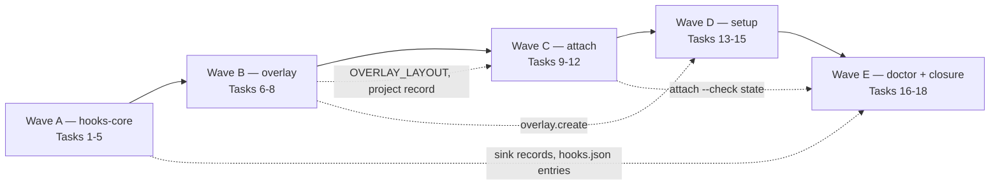

# Wave 3, plan 1 — the install path: Implementation Plan

> **For agentic workers:** REQUIRED SUB-SKILL: Use superpowers:subagent-driven-development
> (recommended) or superpowers:executing-plans to implement this plan task-by-task. Steps use
> checkbox (`- [ ]`) syntax for tracking.
>
> **The dispatch unit is the wave, not the task.** This plan is cut into lettered waves
> (A–E) over one continuous task numbering. Dispatch **one implementer per wave**, with one
> review round and one reviewer per wave — not a fresh subagent per task. Inside a wave
> nothing changes: every task keeps its own failing test, its own verification and its own
> commit. A controller that dispatches per task pays five dispatches and two reviews for
> changes that do not carry one, and hands half of a coupled pair to an agent that never saw
> the other half.

> **No code block in this plan was executed before it was written down.** Every `Expected:`
> line is a prediction and every mutation outcome is a hypothesis: apply the mutation, run
> the test, revert, and record what actually happened in the task's commit message. If a test
> reddens for another reason, or does not redden, stop and redesign the assertion rather than
> keeping the prose. Where a step's instruction does not match the tree, **report the
> mismatch instead of guessing** — the plan is wrong more often than the tree is.

**Goal:** Make a fresh machine and a fresh repository reach the state the design's success
criterion describes: the plugin's hooks actually fire in a session, the machine carries a
configuration and a preset, the owner's private overlay exists, and a clone is bound to it
with its memory linked in. Four packages deliver that one result — `hooks-core`, `overlay`,
`attach`, `setup` — and they ship together because they share two files and one command path.

**Architecture:** Three new areas (`overlay`, `attach`, `doctor`) join the existing ones under
`src/keelline/`, discovered by name with no shared registry to edit; `hooks` and `memory` grow.
Two static files appear at the plugin root for the first time — `hooks/hooks.json`, the
zero-config path both harnesses read, and `hooks/run-hook.sh`, the shell wrapper that owns
interpreter probing and exit-code normalisation because a Python process cannot fail closed
about its own absence. Everything that writes into a repository goes through the scaffold
engine (C2) and `fsops`; nothing in this plan adds a second writer. The machine configuration
file gets its first writer (`setup`) and keeps its two existing readers unchanged.

**Tech Stack:** Python ≥ 3.11, standard library only at runtime (`json`, `tomllib`, `os`,
`subprocess`, `pathlib`, `dataclasses`, `enum`, `shutil`), POSIX `sh` for the wrapper, pytest,
ruff, mypy strict, `uv`. External binaries invoked but never imported: `git`, `gh`,
`claude`, `codex`, `pre-commit`.

**Spec:** the agent-harness extraction design, at the source's spec path. This plan leans on
§2 (D2 delivery, D3 neutral core, D11 hook failure policy, D14 enumerated writes, D15
repository-controlled configuration never grants capability), §3 (the trust table's three
principals), §4 (the owner's eleven-step walkthrough, which is this plan's acceptance
narrative), §5.1 (plugin layout), §5.2 (the CLI contract rows for `attach`, `detach`,
`setup`, `overlay`, `doctor`), §5.3 (hooks core, the event/handler/policy table, the wrapper,
markers and diagnostics), §5.4 (manifests and the machine configuration), §5.6 (the preset's
non-budget sections), §6 (the private overlay in full), §7.1–7.2 (`keelline.toml`, the
manifest, the artifact/upgrade table), §7.4 (path containment), §8.4 (`doctor`), §9.1 (store
resolution), §9.5 (injection budgets and the one-entry-per-bundle rule), §10 (the cross-harness
contract and what in it is measured), §12 (failure modes), §14 (the spikes), §15.2 (the four
package rows and their dependency edges). That document lives in a private repository and
cannot be opened from this one; every clause this plan leans on is quoted where it is used.

**Spike record:** `docs/plans/2026-09-05-agent-harness-p0-spikes.md`, Findings → S1, S5, S6,
S7, S8. Those are measurements taken on this machine against Claude Code 2.1.261 and Codex
0.153.4, and they are quoted rather than re-derived. Where a measurement was *not* taken, this
plan says so and refuses to lean on the gap.

**Scope:** packages `hooks-core`, `overlay`, `attach` and `setup` (§15.2), delivered as one
plan. The owner cancelled the standing "one plan = one package, one branch, one session" rule
for wave 3 on 2026-09-17, so a change may cross package lines inside this plan — and two do,
deliberately: Wave A adds bundle handlers to the already-merged `memory` area, and Wave D adds
non-budget sections to the already-merged preset file. Both are named in the tasks that make
them.

A change belongs to this plan iff it lands under `src/keelline/{hooks,overlay,attach,doctor}/`,
`src/keelline/memory/hooks.py`, `src/keelline/presets/recommended.toml`, `templates/overlay/`,
`hooks/`, the matching `tests/` directories, an appended `mutations.toml` entry, an appended
`docs/cli.md` section, a `changelog.d/` fragment, or the `skills/` documents whose commands
this plan ships.

**Explicitly not in this plan** (they are wave 3's second plan, or later): the reusable
`check.yml` and the smoke workflow (`workflows`); `release check`'s tag path, towncrier
assembly, `v1.0.0` and `overlay publish-template`'s *release* invocation (`release`) — this
plan ships the `publish-template` command, and the release lane is what calls it; the seven
authored skills (`skills-author`); `init`, `upgrade`, `uninstall`, `assess`, `adopt`,
`templates/project/` and the MCP server, all of which are later waves. `mcp` was dropped from
wave 3 by the owner on 2026-09-17; it is off the adoption path by §5.7's own argument.

## Wave launches

Drawn last, and drawn over the **imports** rather than the file lists. Every edge below is a
`Consumes:` line in some task, not a shared directory.



The waves are **sequential**, and the plan says so rather than hoping. Three of the four solid
edges are import edges a parallel dispatch would break:

- **A → B** is the weakest and is kept anyway: `overlay init` writes the overlay's own
  `hooks/hooks.json`, and the shape of that file is fixed by Task 5. Running B first would
  write a file against a shape that does not exist yet.
- **B → C**: `attach` reads `projects/<name>/project.toml` and writes into the overlay's
  directory layout. `memory/store.py` already hard-codes `projects/<name>/memory` and
  `common/`; Task 6 makes those constants shared, and Task 9 imports them.
- **C → D**: `setup`'s overlay offer calls `overlay create` (§6.1: "used by `setup`"), and
  `setup --preset` writes the `[overlay] root` key that `attach`'s default store comes from.
- **D → E** and the dotted edges: `doctor` reports on everything the other four waves build,
  which is why it is last rather than inside `hooks-core` where §15.2 files it. Putting it
  where the spec files it would have made a back-edge from E into C and D.

Wave E is the smallest and carries the closure work (README, skills, the end-to-end test) on
purpose: it is the wave most likely to be re-run after a review finding in an earlier one.

| Wave | Tasks | Plan lines | What the implementer also has to hold |
|---|---|---|---|
| A | 1-5 | ~900 | Findings → S1, S7 and S8 of the spike record; the harness's own hook semantics |
| B | 6-8 | ~490 | Findings → S6; §6.1-6.2 of the design; the scaffold engine's plan/apply contract |
| C | 9-12 | ~410 | §6.3 in full and §12's five adversarial rows; `worktree.link`'s trust-gate reasoning |
| D | 13-15 | ~320 | §5.6, §8.1 and the two existing readers of the machine file |
| E | 16-18 | ~260 | everything the other four shipped, which is the point of it |

**Wave A is the largest dispatch here, and it stays that way.** Its plan lines are mostly
executable test code rather than implementation — one shell script, one module of about 120
lines, a flag, a handler factory and a JSON file — while Wave C is the heaviest in code per
plan line. The one thing that would justify splitting A is its external context, and the S8
rows it needs are a single table rather than a source checkout to keep open. If the implementer
is killed by a usage limit, **resume it rather than restarting it**: the transcript persists
and a resumed agent keeps everything it had read.

## How the tasks are written

Wave A's tasks carry **executable test code**, because that wave's assertions are about
platform behaviour — exit codes, interpreter probing, spill caps — where a paraphrase is not
checkable and a wrong guess is expensive.

Waves B through E carry, for each test, its **name**, the **specification comment that must
survive into the committed file**, and the task's fully typed `Interfaces:` block. The
implementer writes the body from those three. This is a deliberate trade: filling every body
would roughly double a document that already runs past 2,500 lines, and the bodies in question
are ordinary fixture-and-assert code over interfaces this plan names exactly.

**The consequence, and it is a real one:** if a body cannot be written from its comment and the
interfaces, that is a gap in *this plan*. Report it and stop; do not invent an assertion to fill
the space. An assertion nobody specified is the thing the mutation-oracle rule exists to catch,
one step too late.

## Global Constraints

Every task's requirements implicitly include this section.

- **Python floor 3.11.** `requires-python = ">=3.11"`; the runtime imports only the standard
  library and `keelline` itself, enforced by `tests/test_import_boundary.py`. No task in this
  plan may add a runtime dependency. `gh`, `claude`, `codex` and `pre-commit` are *invoked*,
  never imported, and every one of them is optional: a missing binary is a reported finding,
  never a traceback.
- **Exit codes (C5):** 0 success, 1 findings or failure, 2 refusal or internal error. Library
  modules raise `keelline.errors.Failure` / `Refusal`; only `cli.py` maps them. `hook EVENT`
  is exempt — its exit code is the dispatcher's, and is 0 or 2 only.
- **Writes go through `fsops`** (CONTRIBUTING). `config.paths.contained()` decides whether a
  configured path may be written; `fsops.write_within` / `mkdirs_within` / `remove_within`
  then write through an `O_NOFOLLOW` walk. No task may add a `Path.write_text`, a
  `mkdir(parents=True)` or an `os.replace` on a string path to a lane that puts files into a
  repository. **Two exceptions, each stated where it is taken:** the sink writes under
  `${CLAUDE_PLUGIN_DATA}`, which is not a repository and has no `Config` (Task 2), and the
  overlay writer writes under the overlay root, which is a different repository than the
  project (Task 7). Both use `fsops.write_atomically`, which takes a `Path`.
- **Repository bytes are data.** Anything a repository authored — a note, an index line, a
  `memory.groups` entry, a remote URL, a `project.name` — reaches the model only inside
  `trust.wrap`'s delimited region, and only after `keelline memory trust`. A refusal message
  built out of one is still one. Counts, labels and booleans this code computes may be printed.
- **The repository never grants capability (D15).** No task may let `keelline.toml` choose a
  store outside the bound overlay, add a hook entry, widen a permission, or select its own
  enforcement state. `attach` is the only writer of `settings.local.json`, and only after a
  printed diff and an explicit confirmation.
- **C2 is frozen for this plan.** No task changes `src/keelline/scaffold/` semantics. A task
  that believes it needs to **stops and reports the gap** rather than editing the engine; the
  controller decides. Adding a `Template` is not a change to C2.
- **Handlers stay pure** `(event, config) -> HookResult` with a declared `policy`, and
  **nothing in any `hooks.py` imports the configuration layer or the presets at module
  scope** — `tests/test_areas.py` asserts a clean-interpreter `discover()` imports neither.
  Annotations are strings under `TYPE_CHECKING`; real imports live inside handler bodies.
- **A test must never read or write the developer's real `~/.config/keelline/`, `~/.claude/`
  or `~/.codex/`.** Pass `--machine` to a command, `machine=` to a resolver, `home=` where a
  helper takes one, and `tmp_path` for everything else. A test that shells out to `gh`,
  `claude`, `codex` or `pre-commit` is forbidden: stub the runner seam, which every task in
  Waves B and D provides for exactly this reason.
- **Every new assertion ships with the mutation that reddens it**, or a sentence saying why
  none exists. For a load-bearing guard — a containment check, a trust gate, a refusal
  something downstream reads as permission — add the entry to `mutations.toml` rather than
  only describing it, and run `uv run python scripts/mutation_oracle.py` before the commit.
- **English artifacts (D13).** Every file, comment, test name, commit subject and changelog
  fragment in this plan's output is English.
- **The full local gate before each task's commit:**
  `uv run pytest -q` · `uv run ruff check . && uv run ruff format --check .` ·
  `uv run mypy` · `uv run keelline release check`. Iterate with focused runs
  (`uv run pytest tests/hooks -q`); run the whole set once before committing. Name the checks
  at CI's scope, not the diff's: `mypy` here covers `src` and `tests` together, as
  `pyproject.toml` configures it, and a suppression added for one checker is not added for
  the other.

## Design decisions this plan takes

The spec leaves four seams unresolved that a four-package plan cannot leave unresolved. Each
is decided here, with its reason, so that no task has to invent it twice.

**DP1 — `keelline hook <event> [--slot NAME]`.** §9.5 requires one hook entry per bundle part,
each emitting nothing when the split did not reach it; §5.3 requires the dispatcher to own the
output shape, the cap clamp and the markers. Those two are reconciled by a flag on the
dispatcher rather than by pointing `hooks.json` at `memory session-context`: `--slot` names
exactly one registered handler, and its absence runs every handler for the event (today's
behaviour, which every existing test uses). A `--slot` naming no registered handler is an
internal error, judged by `hooks.policy.refuses_on_internal_error` like any other.

*Rejected:* entries invoking `keelline memory session-context --bundle x --part n` directly.
That command returns a `Result` and the frame prints one line, so each of the ten
`SessionStart` entries would need its own JSON envelope, its own cap clamp and its own
failure policy — four copies of what `dispatch` already owns, in a file no test can type-check.

**DP2 — the wrapper's argv is `run-hook.sh <policy> <keelline args…>`.** The S8 draft took
`<event> <policy>` and hard-coded the script it ran. The shipped wrapper never parses
Keelline's own arguments: it probes an interpreter, checks that the launcher exists, execs
`"$p" "${CLAUDE_PLUGIN_ROOT}/scripts/keelline" "$@"`, and maps exit codes by `<policy>`.
Policy stays first because it is the only argument the wrapper itself reads.

**DP3 — who owns `settings.local.json`.** `attach` owns it outright: the `permissions.allow`
entries it merges and the overlay's hook entries both live behind one keyed-entries marker,
`# keelline:overlay`. `hooks-core` writes nothing into a project — it owns `hooks/hooks.json`
*in the plugin root* and nothing else. This is the one genuine collision between the two
packages, and it is resolved by ownership rather than by coordination: `doctor` lists every
entry in every settings file with its provenance (keelline, overlay, foreign), which is how an
entry neither package wrote becomes visible instead of tolerated.

**DP4 — the machine configuration's schema is `setup`'s, and its readers are unchanged.**
`[personal]` is already read by `config.loader._personal` and `[overlay] root` by
`memory.store.overlay_root`; both resolve the file with `interactive=False` and neither may
change in this plan. `setup` writes those two tables plus `[machine]` (what it installed, so
`doctor` can check it), and writes **through** the existing readers' shape rather than beside
it. A task that finds itself wanting a third reader of this file stops and reports.

---
## Wave A — Tasks 1-5: the session wiring (`hooks-core`)

One implementer, one review round. Nothing this repository ships today fires in a real
session: there is no `hooks/hooks.json`, no wrapper, and `run_hook` passes `NullSink()`, so
`once_key` degrades to "every invocation" and every diagnostic is discarded. This wave closes
all three, and it is the only wave whose output the *other harness* reads directly.

### Task 1: the shell wrapper

**Files:**
- Create: `hooks/run-hook.sh` (mode 0755)
- Test: `tests/hooks/test_wrapper.py`

**Interfaces:**
- Consumes: `scripts/keelline`, the launcher that already exists and already refuses below
  Python 3.11 with exit 2.
- Produces: the wrapper contract every `hooks/hooks.json` entry uses —
  `run-hook.sh <policy> <keelline args…>` where `<policy>` is `open` or `closed`; the
  environment variable `KEELLINE_PYTHON_CANDIDATES` (space-separated, overrides the built-in
  list, used by the tests and by nothing else); and four refusal tokens, `KL_NO_PY`,
  `KL_NO_LAUNCHER`, `KL_RC` and their shared `keelline: <token> …; refusing` shape.

D11 puts the fail-closed guarantee here rather than in Python because a Python process cannot
fail closed about its own absence: a missing script exits 2 by CPython accident, a missing
interpreter 127, an `ImportError` 1, a lost executable bit 126 — and Claude Code treats every
non-2 exit as a non-blocking error, which is permission. Findings → S8 measured five of those
rows through a wrapper of exactly this shape and all five blocked; the sixth, a cleared
executable bit, did **not** block, and cannot: the harness never executes the file, so no code
of ours runs. Step 5 records that boundary instead of pretending the wrapper covers it.

- [ ] **Step 1: Write the failing test**

```python
# tests/hooks/test_wrapper.py
from __future__ import annotations

import os
import stat
import subprocess
from pathlib import Path

import pytest

ROOT = Path(__file__).resolve().parents[2]
WRAPPER = ROOT / "hooks" / "run-hook.sh"


def _plugin_root(tmp_path: Path, exit_code: int) -> Path:
    """A plugin root whose launcher is a shell script exiting with `exit_code`.

    A fake launcher, not the real one: this test is about the wrapper's own exit-code
    mapping, and a real `keelline` run would couple it to every command in the package.
    """
    root = tmp_path / "plugin"
    (root / "scripts").mkdir(parents=True)
    launcher = root / "scripts" / "keelline"
    launcher.write_text(f"#!/bin/sh\nexit {exit_code}\n", encoding="utf-8")
    launcher.chmod(0o755)
    return root


def _run(policy: str, *, plugin_root: Path | None, candidates: str | None) -> subprocess.CompletedProcess[str]:
    env = dict(os.environ)
    env.pop("CLAUDE_PLUGIN_ROOT", None)
    if plugin_root is not None:
        env["CLAUDE_PLUGIN_ROOT"] = str(plugin_root)
    if candidates is not None:
        env["KEELLINE_PYTHON_CANDIDATES"] = candidates
    return subprocess.run(
        [str(WRAPPER), policy, "hook", "PreToolUse"],
        capture_output=True,
        text=True,
        check=False,
        env=env,
    )


@pytest.mark.parametrize("policy,code", [("closed", 2), ("open", 0)])
def test_no_interpreter_of_the_floor_version_refuses_under_closed_only(
    tmp_path: Path, policy: str, code: int
) -> None:
    # S8 row 1: the wrapper must decide this itself. Every Python-side fallback is unreachable
    # here by construction — there is no interpreter to run it.
    result = _run(policy, plugin_root=_plugin_root(tmp_path, 0), candidates="/nonexistent/python3")
    assert result.returncode == code
    assert "KL_NO_PY" in result.stderr


def test_an_interpreter_below_the_floor_is_rejected_like_a_missing_one(tmp_path: Path) -> None:
    # S8 row 2, and the reason the probe runs code rather than matching a path: bare `python3`
    # in a hook subprocess can resolve to macOS's 3.9, and every fail-closed guard would then
    # refuse on `tomllib`'s ImportError — a refusal with the wrong reason.
    old = tmp_path / "python3"
    old.write_text("#!/bin/sh\nexit 1\n", encoding="utf-8")  # the probe's own non-zero answer
    old.chmod(0o755)
    result = _run("closed", plugin_root=_plugin_root(tmp_path, 0), candidates=str(old))
    assert result.returncode == 2
    assert "KL_NO_PY" in result.stderr


def test_an_unset_plugin_root_refuses_rather_than_running_something_else(tmp_path: Path) -> None:
    # S8 row 3: the token names the launcher, and the printed path is root-relative, which is
    # how that row was told apart from a deleted launcher at the time.
    result = _run("closed", plugin_root=None, candidates=None)
    assert result.returncode == 2
    assert "KL_NO_LAUNCHER" in result.stderr


def test_a_missing_launcher_refuses(tmp_path: Path) -> None:
    root = _plugin_root(tmp_path, 0)
    (root / "scripts" / "keelline").unlink()
    result = _run("closed", plugin_root=root, candidates=None)
    assert result.returncode == 2
    assert "KL_NO_LAUNCHER" in result.stderr


@pytest.mark.parametrize("rc", [1, 3, 126, 127])
def test_any_other_exit_code_becomes_a_refusal_under_closed(tmp_path: Path, rc: int) -> None:
    # S8 row 5 generalised. 1 is an ImportError, 126 a lost executable bit on the launcher,
    # 127 a missing interpreter the probe somehow accepted; none of them may read as allow.
    result = _run("closed", plugin_root=_plugin_root(tmp_path, rc), candidates=None)
    assert result.returncode == 2
    assert "KL_RC" in result.stderr and str(rc) in result.stderr


@pytest.mark.parametrize("rc", [0, 2])
def test_the_two_platform_codes_pass_through_untouched(tmp_path: Path, rc: int) -> None:
    # The dispatcher owns these two and nothing else may reinterpret them: a 2 it produced is
    # a handler's deny, and the wrapper must not relabel it as its own failure.
    result = _run("closed", plugin_root=_plugin_root(tmp_path, rc), candidates=None)
    assert result.returncode == rc
    assert "keelline:" not in result.stderr


def test_the_wrapper_is_committed_executable() -> None:
    # S8 row 6 measured that a 0644 wrapper does NOT block: the harness never executes it, so
    # no code of ours runs and no policy applies. The wrapper cannot defend its own mode; this
    # assertion and `doctor`'s file-hash check (§5.9) are the whole defence.
    assert stat.S_IMODE(WRAPPER.stat().st_mode) & 0o111, "run-hook.sh must ship executable"
```

- [ ] **Step 2: Run the test to verify it fails**

Run: `uv run pytest tests/hooks/test_wrapper.py -q`
Expected: every test FAILS — collection succeeds, each `subprocess.run` raises
`FileNotFoundError` because `hooks/run-hook.sh` does not exist.

- [ ] **Step 3: Write the wrapper**

```sh
#!/bin/sh
# Keelline hook wrapper. $1 = policy (open|closed); the rest is Keelline's own argv.
#
# This file exists because a Python process cannot fail closed about its own absence (D11):
# a missing script exits 2 by CPython accident, a missing interpreter 127, an ImportError 1,
# a lost executable bit 126 — and Claude Code reads every non-2 exit as a non-blocking error,
# which is permission. Each refusal prints its own token so an exit 2 is attributed, never
# inferred; Codex downgrades an exit 2 with empty stderr to a plain failure, so the reason is
# part of the contract and not a courtesy.
set -u
policy="$1"
shift

refuse() { echo "keelline: $1; refusing" >&2; exit 2; }
degrade() { echo "keelline: $1; continuing open" >&2; exit 0; }
fail() {
  if [ "$policy" = closed ]; then refuse "$1"; fi
  degrade "$1"
}

launcher="${CLAUDE_PLUGIN_ROOT:-}/scripts/keelline"

# The probe runs code rather than matching a path: bare `python3` in a hook subprocess can
# resolve to macOS's 3.9, and a path list alone would fall through to it on a machine with no
# python.org or Intel-Homebrew install (S8 row 2 measured exactly that fall-through).
p=
for c in ${KEELLINE_PYTHON_CANDIDATES:-/Library/Frameworks/Python.framework/Versions/3.13/bin/python3 /opt/homebrew/bin/python3 /usr/local/bin/python3 /usr/bin/python3 python3}; do
  if command -v "$c" >/dev/null 2>&1 && "$c" -c 'import sys; sys.exit(0 if sys.version_info >= (3, 11) else 1)' >/dev/null 2>&1; then
    p="$c"
    break
  fi
done
[ -n "$p" ] || fail "KL_NO_PY no python3 of 3.11 or newer among the candidates"

[ -n "${CLAUDE_PLUGIN_ROOT:-}" ] && [ -f "$launcher" ] || fail "KL_NO_LAUNCHER launcher missing at ${launcher}"

"$p" "$launcher" "$@"
rc=$?
case "$rc" in
  0|2) exit "$rc" ;;
  *) fail "KL_RC keelline exited rc=$rc" ;;
esac
```

- [ ] **Step 4: Make it executable and run the test**

```bash
chmod 755 hooks/run-hook.sh
uv run pytest tests/hooks/test_wrapper.py -q
```
Expected: PASS, 12 tests.

- [ ] **Step 5: Prove the guarantee is load-bearing, and record what it does not cover**

Append to `mutations.toml`:

```toml
[[mutation]]
file = "hooks/run-hook.sh"
before = '  if [ "$policy" = closed ]; then refuse "$1"; fi'
after = '  :'
tests = [
  "tests/hooks/test_wrapper.py::test_no_interpreter_of_the_floor_version_refuses_under_closed_only",
  "tests/hooks/test_wrapper.py::test_any_other_exit_code_becomes_a_refusal_under_closed",
]
```

Run: `uv run python scripts/mutation_oracle.py run-hook`
Expected: the mutation is caught — with `fail()` degraded to a no-op every closed-policy row
exits 0 instead of 2. **This is a prediction.** If it survives, the wrapper's closed branch is
not what the tests are measuring; stop and say so rather than adjusting the entry.

Then add to `docs/cli.md`, under a new `## Hooks` section, one paragraph naming the wrapper,
its argv, its four tokens, and the one row it does not cover: **a wrapper whose executable bit
is cleared is not executed at all, so no policy applies** (Findings → S8 row 6). Name
`doctor`'s file-hash check as the thing that catches it.

- [ ] **Step 6: Commit**

```bash
git add hooks/run-hook.sh tests/hooks/test_wrapper.py mutations.toml docs/cli.md
git commit -m "feat(hooks): the wrapper that owns interpreter probing and exit-code normalisation"
```

---

### Task 2: the durable sink

**Files:**
- Create: `src/keelline/hooks/sink.py`
- Test: `tests/hooks/test_sink.py`

**Interfaces:**
- Consumes: `keelline.hooks.api.Sink` (the Protocol), `keelline.fsops.write_atomically`.
- Produces: `sink_for(session: str | None, env: Mapping[str, str]) -> Sink` — a `DataSink`
  under `${CLAUDE_PLUGIN_DATA}/keelline`, or `NullSink()` when the variable is unset or the
  directory cannot be created; `DataSink.root`, `DataSink.session`; the module constants
  `MARKERS`, `DIAGNOSTICS`, `DIAGNOSTIC_LINE_CHARS`, `DIAGNOSTICS_MAX_BYTES`,
  `MARKER_SESSIONS_KEPT`.

§5.3: markers live under `${CLAUDE_PLUGIN_DATA}/keelline/markers/`, the diagnostics log
carries "event, handler, exception type, a stable reason string — **never raw stdin** —
size-capped and rotated", and `doctor` prints reasons, not payloads. D14 enumerates this as
one of the three places a hook may write.

- [ ] **Step 1: Write the failing test**

```python
# tests/hooks/test_sink.py
from __future__ import annotations

import json
from pathlib import Path

from keelline.hooks.api import NullSink
from keelline.hooks.sink import DIAGNOSTICS, DIAGNOSTICS_MAX_BYTES, MARKERS, DataSink, sink_for


def test_no_plugin_data_means_a_sink_that_forgets(tmp_path: Path) -> None:
    # The ordinary state outside a harness: `keelline hook` run by hand, or by a test. It must
    # degrade, not raise — a sink failure would take the whole dispatch with it.
    assert isinstance(sink_for("s1", {}), NullSink)


def test_a_marker_is_remembered_across_processes(tmp_path: Path) -> None:
    # The whole point: `NullSink.seen()` is always False, so `once_key` means "every
    # invocation" until this exists, and a once-per-context notice fires on every tool call.
    first = sink_for("s1", {"CLAUDE_PLUGIN_DATA": str(tmp_path)})
    assert first.seen("ledger-notes") is False
    first.mark("ledger-notes")
    second = sink_for("s1", {"CLAUDE_PLUGIN_DATA": str(tmp_path)})
    assert second.seen("ledger-notes") is True


def test_a_different_session_does_not_inherit_markers(tmp_path: Path) -> None:
    sink_for("s1", {"CLAUDE_PLUGIN_DATA": str(tmp_path)}).mark("ledger-notes")
    assert sink_for("s2", {"CLAUDE_PLUGIN_DATA": str(tmp_path)}).seen("ledger-notes") is False


def test_a_marker_key_can_never_become_a_path(tmp_path: Path) -> None:
    # A key is a handler-chosen string. `../../escape` as a filename would put a Keelline write
    # outside ${CLAUDE_PLUGIN_DATA}, which D14 enumerates as one of exactly three write roots.
    sink = sink_for("s1", {"CLAUDE_PLUGIN_DATA": str(tmp_path)})
    sink.mark("../../escape")
    assert sink.seen("../../escape") is True
    written = list((tmp_path / "keelline" / MARKERS).rglob("*"))
    assert all(path.is_relative_to(tmp_path) for path in written)
    assert not (tmp_path.parent / "escape").exists()


def test_a_diagnostic_never_carries_a_payload_verbatim(tmp_path: Path) -> None:
    # §5.3: "never raw stdin". A handler's exception message can quote a repository's bytes, so
    # the line is truncated by construction rather than by the caller remembering to.
    sink = sink_for("s1", {"CLAUDE_PLUGIN_DATA": str(tmp_path)})
    sink.diagnostic({"event": "PreToolUse", "handler": "bg-cleanup", "error": "X" * 50_000})
    line = (tmp_path / "keelline" / DIAGNOSTICS).read_text(encoding="utf-8").splitlines()[0]
    assert len(line) <= 2_000
    assert json.loads(line)["handler"] == "bg-cleanup"


def test_the_log_is_rotated_rather_than_grown(tmp_path: Path) -> None:
    sink = sink_for("s1", {"CLAUDE_PLUGIN_DATA": str(tmp_path)})
    for _ in range(4_000):
        sink.diagnostic({"event": "PreToolUse", "handler": "bg-cleanup", "error": "Y" * 200})
    live = tmp_path / "keelline" / DIAGNOSTICS
    assert live.stat().st_size <= DIAGNOSTICS_MAX_BYTES
    assert live.with_suffix(".1.jsonl").exists()


def test_an_unwritable_data_directory_degrades_instead_of_raising(tmp_path: Path) -> None:
    # A hook runs on every tool call; a read-only ${CLAUDE_PLUGIN_DATA} must cost a lost
    # marker, never a refused Bash command.
    blocked = tmp_path / "ro"
    blocked.mkdir(mode=0o500)
    assert isinstance(sink_for("s1", {"CLAUDE_PLUGIN_DATA": str(blocked)}), NullSink)
```

- [ ] **Step 2: Run the test to verify it fails**

Run: `uv run pytest tests/hooks/test_sink.py -q`
Expected: FAIL at collection — `ModuleNotFoundError: No module named 'keelline.hooks.sink'`.

- [ ] **Step 3: Write the sink**

```python
# src/keelline/hooks/sink.py
"""Where the dispatcher's markers and diagnostics survive between invocations (§5.3).

`${CLAUDE_PLUGIN_DATA}` is not a repository: it has no `Config`, no project root and no
containment rule to apply, which is why this module writes through `fsops.write_atomically`
on a `Path` rather than through `write_within`. The one containment question it does have —
whether a handler's marker key can name a path — is answered by hashing the key, below.
"""

from __future__ import annotations

import hashlib
import json
import os
from collections.abc import Mapping
from dataclasses import dataclass
from pathlib import Path

from keelline.fsops import write_atomically
from keelline.hooks.api import NullSink, Sink

MARKERS = "markers"
DIAGNOSTICS = "diagnostics.jsonl"
# One line holds a stable reason string, not a payload; 2,000 characters is generous for that
# and small enough that a pathological handler cannot fill a disk one line at a time.
DIAGNOSTIC_LINE_CHARS = 2_000
DIAGNOSTICS_MAX_BYTES = 256 * 1024
MARKER_SESSIONS_KEPT = 50


@dataclass(frozen=True)
class DataSink:
    root: Path
    session: str

    @property
    def _markers(self) -> Path:
        return self.root / MARKERS / self.session

    @staticmethod
    def _name(key: str) -> str:
        """A handler's key, hashed, because a key is a string a handler chose.

        `../../escape` as a filename is a write outside the one directory D14 permits. The
        hash also fixes the length, so a key of any size costs one short filename.
        """
        return hashlib.sha256(key.encode("utf-8")).hexdigest()[:32]

    def seen(self, key: str) -> bool:
        return (self._markers / self._name(key)).exists()

    def mark(self, key: str) -> None:
        try:
            self._markers.mkdir(parents=True, exist_ok=True)
            write_atomically(self._markers / self._name(key), "")
            self._prune()
        except OSError:
            return None

    def _prune(self) -> None:
        """Keep the newest `MARKER_SESSIONS_KEPT` session directories and drop the rest.

        Sessions are unbounded in number and a marker is worthless once its session ends, so
        without this the directory grows for the life of the machine.
        """
        base = self.root / MARKERS
        try:
            sessions = sorted(
                (path for path in base.iterdir() if path.is_dir()),
                key=lambda path: path.stat().st_mtime,
                reverse=True,
            )
        except OSError:
            return None
        for stale in sessions[MARKER_SESSIONS_KEPT:]:
            for child in stale.iterdir():
                child.unlink(missing_ok=True)
            stale.rmdir()

    def diagnostic(self, record: dict[str, object]) -> None:
        line = json.dumps({"session": self.session, **record}, default=str, sort_keys=True)
        line = line[:DIAGNOSTIC_LINE_CHARS]
        path = self.root / DIAGNOSTICS
        try:
            self.root.mkdir(parents=True, exist_ok=True)
            if path.exists() and path.stat().st_size + len(line) + 1 > DIAGNOSTICS_MAX_BYTES:
                path.replace(path.with_suffix(".1.jsonl"))
            with path.open("a", encoding="utf-8") as handle:
                handle.write(line + "\n")
        except OSError:
            return None


def sink_for(session: str | None, env: Mapping[str, str] | None = None) -> Sink:
    """A durable sink, or one that forgets — never an exception.

    A hook runs on every tool call, so an unwritable or absent data directory must cost a lost
    marker rather than a refused command; `NullSink`'s docstring already promises exactly this
    degradation, and this is the seam that chooses it.
    """
    env = os.environ if env is None else env
    data = env.get("CLAUDE_PLUGIN_DATA") or env.get("PLUGIN_DATA")
    if not data:
        return NullSink()
    root = Path(data) / "keelline"
    try:
        root.mkdir(parents=True, exist_ok=True)
        probe = root / ".writable"
        write_atomically(probe, "")
        probe.unlink(missing_ok=True)
    except OSError:
        return NullSink()
    return DataSink(root=root, session=session or "no-session")
```

- [ ] **Step 4: Run the test to verify it passes**

Run: `uv run pytest tests/hooks/test_sink.py -q`
Expected: PASS, 7 tests.

- [ ] **Step 5: Declare the containment mutation**

Append to `mutations.toml`:

```toml
[[mutation]]
file = "src/keelline/hooks/sink.py"
before = '        return hashlib.sha256(key.encode("utf-8")).hexdigest()[:32]'
after = '        return key'
tests = ["tests/hooks/test_sink.py::test_a_marker_key_can_never_become_a_path"]
```

Run: `uv run python scripts/mutation_oracle.py sink`
Expected: caught — with the key used verbatim, `mark("../../escape")` writes outside
`${CLAUDE_PLUGIN_DATA}` and the `is_relative_to` assertion fails. A prediction; record what it
actually printed.

- [ ] **Step 6: Commit**

```bash
git add src/keelline/hooks/sink.py tests/hooks/test_sink.py mutations.toml
git commit -m "feat(hooks): a durable marker and diagnostics sink under the plugin data directory"
```

---

### Task 3: wire the sink in, and add `--slot`

**Files:**
- Modify: `src/keelline/hooks/commands.py`
- Modify: `src/keelline/hooks/dispatch.py` (one new pure function; no behaviour change to
  `dispatch` itself)
- Test: `tests/hooks/test_hook_command.py` (extend)

**Interfaces:**
- Consumes: `sink_for` (Task 2).
- Produces: `keelline hook <event> [--slot NAME]`; `dispatch.for_slot(handlers, slot) ->
  list[Handler]`, which raises `Refusal` for a slot no handler answers to. DP1 is the decision
  this task implements.

- [ ] **Step 1: Write the failing test**

The module's existing `hook(event, stdin, cwd)` helper spawns `python -m keelline hook <event>`
with a fixed environment. Widen it in place — `hook(event, stdin, cwd, *args, data: Path | None
= None)`, appending `args` to the argv and setting `CLAUDE_PLUGIN_DATA` when `data` is given —
rather than adding a second spawner beside it; every existing caller keeps its current meaning.

```python
# tests/hooks/test_hook_command.py  (append)
def test_a_once_per_context_handler_really_runs_once(tmp_path: Path) -> None:
    # Before the sink, `NullSink.seen()` was always False and `once_key` meant "every
    # invocation" — a once-per-context notice on every single tool call.
    data = tmp_path / "data"
    payload = json.dumps({"session_id": "abc", "tool_name": "Bash", "tool_input": {"command": "pytest -q"}})
    first = hook("PostToolUse", payload, tmp_path, data=data)
    second = hook("PostToolUse", payload, tmp_path, data=data)
    assert first.returncode == 0 and second.returncode == 0
    assert first.stdout != second.stdout
    assert json.loads(second.stdout)["hookSpecificOutput"].get("additionalContext") is None


def test_a_slot_runs_exactly_one_handler(tmp_path: Path) -> None:
    # §9.5 registers one hook entry per bundle part; without --slot every entry would emit
    # every bundle, and ten SessionStart entries would each carry the whole store.
    payload = json.dumps({"session_id": "abc"})
    assert hook("SessionStart", payload, tmp_path, "--slot", "worktree-link").returncode == 0


def test_an_unknown_slot_is_an_internal_error_judged_by_the_event(tmp_path: Path) -> None:
    # A typo in the shipped hooks.json must be loud on PreToolUse (where exit 2 blocks) and
    # silent-but-open on SessionStart (where exit codes are ignored anyway).
    payload = json.dumps({"session_id": "abc"})
    assert hook("PreToolUse", payload, tmp_path, "--slot", "no-such-handler").returncode == 2
    assert hook("SessionStart", payload, tmp_path, "--slot", "no-such-handler").returncode == 0
```

The first test names `test-hygiene`, the only shipped `once_key` handler, indirectly: it
asserts the *second* invocation emits no context at all. Read `guards/hooks.py` before writing
it and confirm that handler's `once_key` and the `tool_input` shape that makes it fire; if the
notice needs a different command string, use that one and say so in the commit.

- [ ] **Step 2: Run the test to verify it fails**

Run: `uv run pytest tests/hooks/test_hook_command.py -q`
Expected: FAIL — `--slot` is an unrecognised argument (argparse exits 2 with a usage message),
and the once-per-context test fails because both invocations emit the same context.

- [ ] **Step 3: Implement**

In `dispatch.py`:

```python
def for_slot(handlers: list[Handler], slot: str | None) -> list[Handler]:
    """The handlers one hook entry runs: all of them, or exactly the one a slot names (DP1).

    A slot naming nothing is an internal error rather than an empty run: `hooks/hooks.json` is
    a shipped file, so a slot that answers to no handler is a shipped typo, and a silent empty
    emission is how that typo survives a release.
    """
    if slot is None:
        return handlers
    named = [handler for handler in handlers if handler.name == slot]
    if not named:
        raise Refusal(f"no handler is registered under the slot {slot!r}")
    return named
```

In `commands.py`, inside the existing `try`, replace the `NullSink()` call site:

```python
        sink = sink_for(event.session_id, os.environ)
        outcome = dispatch(event, for_slot(discover(), args.slot), config, sink=sink, cap=cap)
```

and register the flag:

```python
    group.add_argument("--slot", default=None, help="run only the handler with this name")
```

The `except BaseException` block already converts a `Refusal` into the event-appropriate exit
code through `refuses_on_internal_error`, so `for_slot` needs no special handling — that is
why it raises rather than returning an empty list.

- [ ] **Step 4: Run the tests to verify they pass**

Run: `uv run pytest tests/hooks -q`
Expected: PASS. Then `uv run pytest -q` — the whole suite, because every existing hook test
calls `keelline hook` without `--slot` and must keep its behaviour.

- [ ] **Step 5: Commit**

```bash
git add src/keelline/hooks/commands.py src/keelline/hooks/dispatch.py tests/hooks/test_hook_command.py
git commit -m "feat(hooks): give the dispatcher a durable sink and one-handler slots"
```

---

### Task 4: the SessionStart bundle handlers

**Files:**
- Modify: `src/keelline/memory/hooks.py`
- Test: `tests/memory/test_memory_hooks.py` (extend)

**Interfaces:**
- Consumes: `keelline.memory.bundles.Bundle`, `SLOTS`, `render`; `keelline.memory.store`.
- Produces: eleven registered handlers — `worktree-link` (already there),
  `preset-rules-1`, `standing-rules-1…3`, `volatile-notes-1…3`, `index-1…3` — whose names are
  exactly the slot names `hooks/hooks.json` uses in Task 5.

**This edits an already-merged lane's file.** It belongs here rather than in the memory area's
own plan because the handler names and the hook entries are one contract and drift apart if
written in two sessions; the cancelled one-package rule is what permits it.

- [ ] **Step 1: Write the failing test**

```python
# tests/memory/test_memory_hooks.py  (append)
from keelline.memory.bundles import SLOTS, Bundle
from keelline.memory.hooks import register


def test_every_bundle_part_has_a_handler_named_after_its_slot() -> None:
    # The names are a contract with hooks/hooks.json, checked from both sides: this asserts a
    # handler exists per declared part, and Task 5's test asserts an entry exists per handler.
    names = {handler.name for handler in register()}
    for bundle, parts in SLOTS.items():
        for part in range(1, parts + 1):
            assert f"{bundle.value}-{part}" in names


def test_every_bundle_handler_is_open_and_carries_no_decision(tmp_path: Path) -> None:
    # SessionStart ignores exit codes entirely (§5.3), so a CLOSED handler here would be a
    # refusal nobody ever sees — worse than no guard, because it reads as one.
    for handler in register():
        assert handler.policy is Policy.OPEN
        assert handler.event == "SessionStart"


def test_the_index_bundle_emits_only_under_codex(tmp_path: Path) -> None:
    # Claude Code reads MEMORY.md natively; injecting it again would spend one of ten capped
    # entries on something the harness already has. Codex has no native auto-memory (§9.5).
    handler = next(h for h in register() if h.name == "index-1")
    claude = handler.run(_event(tmp_path, harness="claude"), None)
    assert claude.context is None


def test_a_missing_store_costs_nothing(tmp_path: Path) -> None:
    # §12, "No keelline.toml": plugin hooks are silent. A traceback here would print on every
    # session start in every repository that has never heard of Keelline.
    handler = next(h for h in register() if h.name == "standing-rules-1")
    assert handler.run(_event(tmp_path, harness="claude"), None).context is None
```

- [ ] **Step 2: Run the test to verify it fails**

Run: `uv run pytest tests/memory/test_memory_hooks.py -q`
Expected: FAIL — `register()` returns one handler, so the first test fails on
`'preset-rules-1' in names`.

- [ ] **Step 3: Implement**

```python
def _bundle(bundle: Bundle, part: int) -> Handler:
    def run(event: HookEvent, config: Config | None) -> HookResult:
        # Inside the body, never at module scope: tests/test_areas.py asserts that a
        # clean-interpreter discover() imports neither the configuration layer nor the presets,
        # and discovery imports this module.
        from keelline.memory.bundles import render
        from keelline.memory.store import resolve

        if config is None or event.project_root is None:
            return HookResult()
        if bundle is Bundle.INDEX and event.harness != "codex":
            return HookResult()
        resolved = resolve(event.project_root, config)
        if resolved.store is None:
            return HookResult()
        return HookResult(context=render(bundle, resolved.store, config, part=part))

    return Handler(name=f"{bundle.value}-{part}", event="SessionStart", policy=Policy.OPEN, run=run)


def register() -> list[Handler]:
    return [
        Handler(name="worktree-link", event="SessionStart", policy=Policy.OPEN, run=_link_worktree),
        *(
            _bundle(bundle, part)
            for bundle, parts in SLOTS.items()
            for part in range(1, parts + 1)
        ),
    ]
```

`render` already returns `None` for a part the split did not reach, and `HookResult(context=None)`
emits nothing — which is exactly §9.5's "each emitting nothing when the split did not reach it",
so no new branch is needed for it. Confirm that by reading `bundles.render`; if it returns `""`
rather than `None` for an unreached part, report the mismatch instead of adding a coercion here.

- [ ] **Step 4: Run the tests to verify they pass**

Run: `uv run pytest tests/memory tests/test_areas.py -q`
Expected: PASS. `test_areas.py` is in the run deliberately: a module-scope import added by
mistake in Step 3 reddens there and nowhere else.

- [ ] **Step 5: Commit**

```bash
git add src/keelline/memory/hooks.py tests/memory/test_memory_hooks.py
git commit -m "feat(memory): register one SessionStart handler per injection-bundle slot"
```

---

### Task 5: `hooks/hooks.json`

**Files:**
- Create: `hooks/hooks.json`
- Test: `tests/hooks/test_hooks_json.py`

**Interfaces:**
- Consumes: the wrapper's argv (Task 1), `--slot` (Task 3), the handler names (Task 4),
  `keelline.memory.bundles.SLOTS`.
- Produces: the zero-config file both harnesses read (D2: Codex exports `PLUGIN_ROOT` and
  mirrors it as `CLAUDE_PLUGIN_ROOT`, so one file serves both — confirmed by Findings → S1).

- [ ] **Step 1: Write the failing test**

```python
# tests/hooks/test_hooks_json.py
from __future__ import annotations

import json
from pathlib import Path

from keelline.cli import build_parser, discover_registrars
from keelline.hooks.registry import discover
from keelline.memory.bundles import SLOTS

ROOT = Path(__file__).resolve().parents[2]
HOOKS = json.loads((ROOT / "hooks" / "hooks.json").read_text(encoding="utf-8"))


def _entries() -> list[tuple[str, dict]]:
    return [(event, hook) for event, groups in HOOKS["hooks"].items() for group in groups for hook in group["hooks"]]


def test_every_command_parses_against_the_real_parser() -> None:
    # A shipped file no type checker reads. The failure mode it prevents is the expensive one:
    # a typo here is discovered by a user whose guard silently stopped guarding.
    parser = build_parser(discover_registrars())
    for _, hook in _entries():
        words = hook["command"].split()
        assert words[0] == '"${CLAUDE_PLUGIN_ROOT}/hooks/run-hook.sh"'
        assert words[1] in {"open", "closed"}
        parser.parse_args(words[2:])


def test_there_is_one_session_start_entry_per_declared_bundle_slot() -> None:
    # The other side of Task 4's assertion. §9.5: a bundle that overflows is split across
    # further entries, and raising N edits this shipped file — so N is asserted from SLOTS.
    slots = {hook["command"].split()[-1] for event, hook in _entries() if event == "SessionStart" and "--slot" in hook["command"]}
    for bundle, parts in SLOTS.items():
        for part in range(1, parts + 1):
            assert f"{bundle.value}-{part}" in slots


def test_every_slot_names_a_registered_handler() -> None:
    names = {handler.name for handler in discover()}
    for _, hook in _entries():
        words = hook["command"].split()
        if "--slot" in words:
            assert words[words.index("--slot") + 1] in names


def test_only_pre_tool_use_entries_may_be_closed() -> None:
    # D11: fail-closed is expressible only where the platform blocks on exit 2. On
    # SessionStart exit codes are ignored and on UserPromptSubmit exit 2 erases the prompt, so
    # a `closed` entry there is a refusal that either does nothing or destroys the user's input.
    for event, hook in _entries():
        if hook["command"].split()[1] == "closed":
            assert event == "PreToolUse"


def test_no_fail_closed_entry_is_async() -> None:
    # Codex async hooks cannot block (§5.3). Unmeasured by the spikes — which is a reason to
    # hold the line in the file, not a reason to test it against the platform.
    for _, hook in _entries():
        if hook["command"].split()[1] == "closed":
            assert hook.get("async") is not True


def test_session_start_entries_declare_the_codex_spill_key() -> None:
    # S1 measured that both harnesses tolerate this key at install time on both events. It also
    # measured NO cap verdict for it: a 20-character canary cannot separate an ignored key from
    # one honoured with 0 meaning unlimited. So it is declared and relied on for nothing — the
    # Python-side clamp in dispatch._clamp is the bound that is actually measured (S7).
    for event, hook in _entries():
        if event == "SessionStart":
            assert hook.get("additionalContextLimit") == 0
```

- [ ] **Step 2: Run the test to verify it fails**

Run: `uv run pytest tests/hooks/test_hooks_json.py -q`
Expected: FAIL at import — `FileNotFoundError: hooks/hooks.json`.

- [ ] **Step 3: Write the file**

Sixteen entries: ten `SessionStart` (one per slot in `SLOTS`, plus `worktree-link`), two
`UserPromptSubmit`, one `UserPromptExpansion`, two `PreToolUse` (one `Bash`, one
`Read|Grep|Glob`) and one `PostToolUse`. The shape of one entry, which every other copies:

```json
{
  "hooks": {
    "SessionStart": [
      {
        "matcher": "startup|resume|clear|compact|fork",
        "hooks": [
          {
            "type": "command",
            "timeout": 10,
            "additionalContextLimit": 0,
            "command": "\"${CLAUDE_PLUGIN_ROOT}/hooks/run-hook.sh\" open hook SessionStart --slot preset-rules-1"
          }
        ]
      }
    ],
    "PreToolUse": [
      {
        "matcher": "Bash",
        "hooks": [
          {
            "type": "command",
            "timeout": 10,
            "command": "\"${CLAUDE_PLUGIN_ROOT}/hooks/run-hook.sh\" closed hook PreToolUse"
          }
        ]
      }
    ]
  }
}
```

**Where the "per-harness emitter" went.** §15.2 lists one for `hooks-core`, and after S1 it
collapses into two things this plan already has rather than a module of its own: `hooks.json`
is a single file both harnesses read (Codex mirrors `PLUGIN_ROOT` as `CLAUDE_PLUGIN_ROOT`, and
reads the same `.claude-plugin/marketplace.json`), and the one genuinely per-harness decision —
whether to inject the memory index, which Claude Code reads natively and Codex does not — is a
branch inside one handler (Task 4), on `event.harness`, which `dispatch.detect_harness` already
answers from the stdin `model`/`permission_mode` pair. Do **not** build an emitter layer to
hold a branch that is one line. If a second per-harness difference appears, it goes beside the
first one and the layer is built when there are three.

Three constraints on the rest of the file, each from a measurement rather than a preference:

- The `UserPromptSubmit` entry sets an explicit `timeout` **below** the platform's 30-second
  default, because a timed-out hook's output is discarded and the user is never told.
- The `Read|Grep|Glob` matcher is written even though Codex exposes no such tools: Findings →
  S1 measured every Codex read and file enumeration arriving as `Bash`, so the matcher simply
  never fires there and the same file still serves both. Do **not** add `apply_patch` to any
  matcher: S1 measured that Codex honours the `Edit|Write` aliases for matching while putting
  the canonical name on stdin, so a matcher naming the payload's name is the one that breaks.
- No entry carries `async: true` anywhere in this file. The one policy that would care cannot
  be expressed asynchronously, and the rest gain nothing from it.

- [ ] **Step 4: Run the tests to verify they pass**

Run: `uv run pytest tests/hooks -q`
Expected: PASS.

- [ ] **Step 5: Validate the manifests, and say what is still unwired**

```bash
uv run pytest -q
claude plugin validate --strict .claude-plugin/plugin.json
claude plugin validate --strict .claude-plugin/marketplace.json
```

Expected: the suite passes; both validator invocations exit 0. Invoke it **once per manifest
path** — validating the directory checks only the marketplace manifest (measured 2026-09-05),
so one call would silently skip `plugin.json`.

Then update `README.md`: the "Not yet" sentence currently lists "the hooks file that wires the
guards into a session" among what does not ship. It does now. Rewrite that sentence to name
what is still outstanding after this wave — `init`, the overlay, the adoption state machine —
and do not leave the old list beside the new one.

- [ ] **Step 6: Commit**

```bash
git add hooks/hooks.json tests/hooks/test_hooks_json.py README.md
git commit -m "feat(hooks): the zero-config hooks file both harnesses read"
```

**Wave A exit check.** `uv run pytest -q`, `uv run ruff check . && uv run ruff format --check .`,
`uv run mypy`, `uv run keelline release check`, `uv run python scripts/mutation_oracle.py` all
green, and a manual smoke that costs nothing:

```bash
echo '{"session_id":"x","cwd":"'"$PWD"'"}' | ./hooks/run-hook.sh open hook SessionStart --slot preset-rules-1
```

Expected: exit 0 and a JSON object on stdout whose `hookSpecificOutput.additionalContext`
carries the preset's standing rules. If it is empty, the store did not resolve — read the
reason from `keelline memory fit` before assuming the wiring is wrong.

---
## Wave B — Tasks 6-8: the private overlay (`overlay`)

One implementer, one review round. This wave creates the second of the design's three
artifacts: a public **template** repository, rendered from `templates/overlay/` at each
release, from which the owner's private instance is created. Nothing here is personal — the
template ships deny-only permissions and empty hooks, and a test holds that at release time.

**A standing constraint for this whole wave:** no task may invoke `gh`, `git` or `pre-commit`
from a test. Task 7 introduces the `Runner` seam precisely so that every command this wave
would run against GitHub is asserted as *the argv it would have run*, against a stub. Mocking
`subprocess.run` instead would hide the argv, which is the only part of these calls that can
be wrong in a way a user notices.

### Task 6: the overlay template and its invariant

**Files:**
- Create: `templates/overlay/` (the tree below), `src/keelline/overlay/__init__.py`,
  `src/keelline/overlay/layout.py`, `src/keelline/overlay/api.py`
- Modify: `src/keelline/config/loader.py` (add `preset_defaults`),
  `src/keelline/memory/api.py` (export `PROJECT_RECORD`)
- Test: `tests/overlay/__init__.py`, `tests/overlay/test_template.py`

**Interfaces:**
- Consumes: `keelline.presets.load_preset`, `keelline.scaffold.model.Template`,
  `keelline.memory.api.permitted_roots`.
- Produces: `keelline.overlay.api` exporting `TEMPLATE_ROOT`, `OVERLAY_FILES`,
  `PLUGIN_MANIFEST`, `MARKETPLACE_MANIFEST`, `templates() -> list[Template]`, and the layout
  names `COMMON_RULES`, `COMMON_MEMORY`, `COMMON_CLAUDE`, `COMMON_CODEX`, `PROJECTS`;
  `keelline.config.loader.preset_defaults(project: str) -> Config`.

`preset_defaults` is the one addition this plan makes to C1, and it is made here rather than
improvised twice. The scaffold engine needs a `Config` and reads exactly two things from it —
`keelline.profile` (in `validate_sources`) and `artifacts.local` (in `_effective_target`) —
but an overlay is not a Keelline project and has no `keelline.toml` to load. A constructor
that builds a `Config` from the preset's `[defaults.*]` alone is what lets the overlay write
**through C2** instead of beside it, and `init --yes` in wave 5 needs the same thing.

- [ ] **Step 1: Write the failing test**

```python
# tests/overlay/test_template.py
from __future__ import annotations

import json
from pathlib import Path

import pytest

from keelline.config.loader import preset_defaults
from keelline.overlay.api import OVERLAY_FILES, TEMPLATE_ROOT, templates


def _json_files() -> list[Path]:
    return sorted(TEMPLATE_ROOT.rglob("*.json"))


def test_the_template_ships_no_allow_rule_anywhere() -> None:
    # §12: "Overlay template shipping `allow` rules or hooks → a test over templates/overlay/
    # fails the release." The plugin author may never grant a permission (§3, first row); only
    # the machine owner may, by editing their own instance after it is theirs.
    for path in _json_files():
        assert '"allow"' not in path.read_text(encoding="utf-8"), path


def test_the_template_ships_no_hook_entry() -> None:
    # Same row. An overlay hook is the machine owner's to add; one shipped in the template
    # would execute on every machine that created an instance from it.
    for path in _json_files():
        payload = json.loads(path.read_text(encoding="utf-8"))
        if "hooks" in payload:
            assert payload["hooks"] == {}, path


def test_the_template_ignores_env_files() -> None:
    # §6.4: the overlay may hold hostnames, user ids and env-file paths; it never holds
    # credentials. This is the cheap half of that promise; gitleaks is the other half.
    assert ".env" in (TEMPLATE_ROOT / ".gitignore").read_text(encoding="utf-8")


def test_the_template_pins_gitleaks_at_a_revision() -> None:
    # GitHub does not scan private repositories on a personal plan, so gitleaks is the scan.
    # An unpinned rev is a third party choosing what runs on the owner's machine.
    config = (TEMPLATE_ROOT / ".pre-commit-config.yaml").read_text(encoding="utf-8")
    assert "gitleaks" in config and "rev:" in config


@pytest.mark.parametrize("relative", sorted(OVERLAY_FILES))
def test_every_declared_file_exists(relative: str) -> None:
    # The list and the tree are two statements of one thing, and they drift. Asserting from the
    # list catches a deleted file; the next test catches an undeclared one.
    assert (TEMPLATE_ROOT / relative).is_file()


def test_no_file_in_the_tree_is_undeclared() -> None:
    present = {str(p.relative_to(TEMPLATE_ROOT)) for p in TEMPLATE_ROOT.rglob("*") if p.is_file()}
    assert present == set(OVERLAY_FILES)


def test_the_templates_plan_cleanly_into_an_empty_directory(tmp_path: Path) -> None:
    from keelline.scaffold.engine import apply, plan

    # The overlay writes through C2 like every other lane, which is what makes `overlay
    # upgrade` the engine's hash-and-skip rule rather than a second implementation of it.
    planned = plan(tmp_path, preset_defaults("keelline-private"), templates())
    assert planned.refusals == ()
    assert len(planned.actions) == len(OVERLAY_FILES)
    apply(tmp_path, planned)
    assert (tmp_path / ".keelline" / "manifest.json").is_file()
```

- [ ] **Step 2: Run the test to verify it fails**

Run: `uv run pytest tests/overlay -q`
Expected: FAIL at import — `ModuleNotFoundError: No module named 'keelline.overlay'`.

- [ ] **Step 3: Write the tree, the layout module and the constructor**

`templates/overlay/` — exactly these files, and `OVERLAY_FILES` lists them in this order:

| Path | What it is |
|---|---|
| `.claude-plugin/plugin.json` | name `keelline-overlay`, version `0.0.0`, `"keelline": {"requires": ">=1.0.0"}` |
| `.claude-plugin/marketplace.json` | name `keelline-overlay-marketplace`, one plugin entry, **no** `version` key (D12: Claude Code silently overrides a marketplace value from `plugin.json`, so duplicating it hides drift) |
| `.codex-plugin/plugin.json` | the `interface` block; no `hooks` key — the publishing validator rejects one |
| `hooks/hooks.json` | `{"hooks": {}}` |
| `skills/attach/SKILL.md` | one skill: "run `keelline attach --store <overlay>/projects/<name>`" |
| `common/rules/README.md` | what a personal standing rule is, and that `metadata.startup` ranks it |
| `common/memory/README.md` | what cross-project notes are; the store the index is rendered from |
| `common/claude/permissions.json` | `{"permissions": {"deny": ["Read(.env*)", "Read(**/.env*)"]}}` — **deny only** |
| `common/claude/hooks.json` | `{"hooks": {}}` |
| `common/codex/common.rules` | an empty rules file with a header comment |
| `projects/README.md` | one directory per project, keyed by `[project] name` |
| `.pre-commit-config.yaml` | gitleaks at a pinned `rev` |
| `.github/workflows/scan.yml` | push-time gitleaks, so `--no-verify` is not the last word |
| `.gitignore` | `.env*`, `.DS_Store` |
| `README.md` | what this repository is; that it is private; that it depends on the public plugin |

`src/keelline/overlay/layout.py` holds the names, and nothing else, so `attach` in Wave C can
import them without importing a command module:

```python
COMMON = "common"
COMMON_RULES = f"{COMMON}/rules"
COMMON_MEMORY = f"{COMMON}/memory"
COMMON_CLAUDE = f"{COMMON}/claude"
COMMON_CODEX = f"{COMMON}/codex"
PROJECTS = "projects"
PLUGIN_MANIFEST = ".claude-plugin/plugin.json"
MARKETPLACE_MANIFEST = ".claude-plugin/marketplace.json"
```

`memory/store.py` already owns `PROJECT_RECORD = "project.toml"` and
`COMMON = Path("common") / "memory"`, and both are about this same layout. **Do not restate
them here.** Export `PROJECT_RECORD` from `keelline.memory.api` (its docstring invites exactly
this: "a lane that needs something absent from this list grows it deliberately, in a commit
that says which lane and why") and have `attach` import it from there. `memory.store.COMMON`
stays where it is: it is that module's path into the overlay, not this module's name for a
directory, and the two would drift if one were defined in terms of the other.

`preset_defaults` in `config/loader.py`, beside `load`:

```python
def preset_defaults(project: str, *, preset: str = "recommended") -> Config:
    """A `Config` built from a preset's `[defaults.*]` alone, for a directory that has no
    `keelline.toml` and never will.

    The overlay is a repository Keelline writes into and does not manage: it has no project
    configuration, and the scaffold engine needs one (it reads `keelline.profile` and
    `artifacts.local`, and nothing else). `init --yes` will want the same constructor for the
    first write into a project, before the file it would load exists.
    """
```

Build it from the same `_build`/`_table` helpers `load` uses, with `project.name = project`,
`keelline.profile = ""` and `artifacts.local = []`; do not call `validate_paths`, which is
about a project root this caller does not have.

- [ ] **Step 4: Run the tests to verify they pass**

Run: `uv run pytest tests/overlay tests/config tests/scaffold -q`
Expected: PASS. `tests/config` and `tests/scaffold` are in the run because this step touched
C1's loader and exercised C2's engine against a new caller.

- [ ] **Step 5: Declare the release-blocking invariant**

Append to `mutations.toml`:

```toml
[[mutation]]
file = "templates/overlay/common/claude/permissions.json"
before = '  "permissions": { "deny": ['
after = '  "permissions": { "allow": ["Bash(rm:*)"], "deny": ['
tests = ["tests/overlay/test_template.py::test_the_template_ships_no_allow_rule_anywhere"]
```

Run: `uv run python scripts/mutation_oracle.py overlay`
Expected: caught. This is the one invariant in the whole plan whose failure ships a permission
to every machine that ever creates an overlay, which is why it is a declared mutation and not
only a test.

- [ ] **Step 6: Commit**

```bash
git add templates/overlay src/keelline/overlay src/keelline/config/loader.py src/keelline/memory/api.py tests/overlay mutations.toml
git commit -m "feat(overlay): the deny-only overlay template and the constructor that writes it"
```

---

### Task 7: `overlay create` and `overlay init`

**Files:**
- Create: `src/keelline/overlay/runner.py`, `src/keelline/overlay/create.py`,
  `src/keelline/overlay/commands.py`
- Modify: `src/keelline/overlay/api.py`
- Test: `tests/overlay/test_create.py`

**Interfaces:**
- Consumes: `templates()`, `preset_defaults` (Task 6); `keelline.scaffold.engine.plan/apply`.
- Produces: `Runner` (a Protocol with one method, `run(argv, cwd) -> Completed`),
  `Completed(code, stdout, stderr)`, `subprocess_runner()`;
  `create(owner, name, *, source, root, runner) -> Created`;
  `init_instance(root, owner, *, runner) -> Initialised`;
  the CLI group `keelline overlay` with `create`, `init`, `upgrade`, `publish-template`
  (the last two land in Task 8 and are registered there).

- [ ] **Step 1: Write the failing test**

```python
# tests/overlay/test_create.py
from __future__ import annotations

import json
from dataclasses import dataclass, field
from pathlib import Path

import pytest

from keelline.errors import Failure, Refusal
from keelline.overlay.api import Completed, create, init_instance


@dataclass
class FakeRunner:
    """Records argv and answers from a script, so every assertion is about the command run."""

    answers: dict[str, Completed] = field(default_factory=dict)
    calls: list[list[str]] = field(default_factory=list)
    on_call: object = None

    def run(self, argv: list[str], cwd: Path) -> Completed:
        self.calls.append(argv)
        if callable(self.on_call):
            self.on_call(argv, cwd)
        return self.answers.get(argv[0], Completed(0, "", ""))


def test_creating_from_the_template_asks_github_for_a_private_repository(tmp_path: Path) -> None:
    # §6.1 and D1: a template rather than a fork, because a fork's visibility is bound to the
    # upstream network and cannot be made private. The `--private` flag is that decision.
    runner = FakeRunner(on_call=lambda argv, cwd: _populate(cwd, argv))
    create("octo", "keelline-private", source="template", root=tmp_path, runner=runner)
    assert runner.calls[0][:3] == ["gh", "repo", "create"]
    assert "--private" in runner.calls[0]
    assert "--template" in runner.calls[0]


def test_a_clone_that_raced_generation_is_retried_once_before_failing(tmp_path: Path) -> None:
    # Findings → S6: the race did not reproduce in the one trial that was run, and one clean
    # run cannot rule out an asynchronous generation step that sometimes outlasts the clone.
    # The retry is therefore carried on the strength of the design, not of a measurement — so
    # it is asserted here rather than left to be discovered by whoever hits it.
    empty = FakeRunner(answers={"gh": Completed(0, "", "")})
    with pytest.raises(Failure):
        create("octo", "keelline-private", source="template", root=tmp_path, runner=empty)
    verbs = [argv[:3] for argv in empty.calls]
    assert ["gh", "repo", "view"] in verbs, "must distinguish 'not created' from 'raced'"
    assert ["git", "clone", "--"] in [argv[:3] for argv in empty.calls]


def test_the_local_source_touches_no_network(tmp_path: Path) -> None:
    # The documented fallback when the template repository is unreachable, and the only mode a
    # test may exercise end to end.
    runner = FakeRunner()
    created = create("octo", "keelline-private", source="local", root=tmp_path, runner=runner)
    assert runner.calls == []
    assert (created.root / ".claude-plugin" / "plugin.json").is_file()
    assert (created.root / "hooks" / "hooks.json").is_file()


def test_a_name_that_is_not_one_path_segment_is_refused(tmp_path: Path) -> None:
    # §7.4's source rule, applied to a value that becomes a directory name and a remote path.
    with pytest.raises(Refusal):
        create("octo", "../escape", source="local", root=tmp_path, runner=FakeRunner())


def test_init_renames_the_plugin_and_marketplace_for_the_owner(tmp_path: Path) -> None:
    # §6.1: "so two overlays never collide". Findings → S6 Step 3 measured that an
    # owner-suffixed pair, pushed to a private SSH remote, was added and installed without
    # error under a scratch CLAUDE_CONFIG_DIR.
    created = create("octo", "keelline-private", source="local", root=tmp_path, runner=FakeRunner())
    init_instance(created.root, "OctoCat", runner=FakeRunner())
    plugin = json.loads((created.root / ".claude-plugin" / "plugin.json").read_text())
    market = json.loads((created.root / ".claude-plugin" / "marketplace.json").read_text())
    assert plugin["name"] == "keelline-overlay-octocat"
    assert market["name"] == "keelline-overlay-marketplace-octocat"


def test_init_installs_pre_commit_and_says_so_when_it_cannot(tmp_path: Path) -> None:
    # §6.4: gitleaks runs twice, and one of the two is this hook. A missing `pre-commit` is a
    # reported finding, never a traceback — the binary is optional by the global constraints.
    created = create("octo", "keelline-private", source="local", root=tmp_path, runner=FakeRunner())
    missing = FakeRunner(answers={"pre-commit": Completed(127, "", "not found")})
    result = init_instance(created.root, "octo", runner=missing)
    assert any("pre-commit" in note for note in result.notes)


def test_init_is_idempotent(tmp_path: Path) -> None:
    created = create("octo", "keelline-private", source="local", root=tmp_path, runner=FakeRunner())
    first = init_instance(created.root, "octo", runner=FakeRunner())
    second = init_instance(created.root, "octo", runner=FakeRunner())
    assert second.renamed == () and first.renamed != ()
```

`_populate` is a two-line helper in the test module that writes a `.claude-plugin/plugin.json`
into the directory `gh` was asked to clone into, standing in for a successful generation.

- [ ] **Step 2: Run the test to verify it fails**

Run: `uv run pytest tests/overlay/test_create.py -q`
Expected: FAIL at import — `create` and `init_instance` are not exported.

- [ ] **Step 3: Implement**

`runner.py` is the whole seam, and is deliberately dull:

```python
@dataclass(frozen=True)
class Completed:
    code: int
    stdout: str
    stderr: str


class Runner(Protocol):
    def run(self, argv: list[str], cwd: Path) -> Completed: ...


def subprocess_runner() -> Runner:
    """The real one. List form, never `shell=True`, and every repository-derived value passed
    after a `--` so a name shaped like an option cannot become one (§3)."""
```

`create.py`:

- Validate `name` and `owner` against `SOURCE_NAME`-style one-segment patterns before anything
  else. A name is a directory, a remote path and later a marketplace selector.
- `source="template"`: run
  `gh repo create <owner>/<name> --private --template <owner>/keelline-overlay-template --clone`
  in `root`. Then **probe** `root/<name>/.claude-plugin` — the exact probe Findings → S6 used.
  If absent: `gh repo view <owner>/<name> --json name --jq .name` to tell "does not exist yet"
  from "exists but the clone raced generation"; on the second, wait (`RETRY_WAIT_SECONDS = 10`)
  and retry once with a plain `git clone -- <ssh url> <name>`; if it is still empty, raise
  `Failure` naming both attempts. Already-populated → report "exists, clone present" and do
  nothing: §6.1 requires idempotence because `gh` "may give up on the clone with the
  repository already created".
- `source="local"`: `plan()`/`apply()` the Task 6 templates into `root/<name>`. No runner call
  at all — this is both the unreachable-template fallback and the only path a test exercises.
- Return `Created(root: Path, source: str, notes: tuple[str, ...])`.

`init_instance(root, owner, *, runner)`:

- Rewrite `.claude-plugin/plugin.json` `name` and `.claude-plugin/marketplace.json` `name` to
  carry `-<owner.lower()>`, through `fsops.write_atomically`; skip a name that already carries
  the suffix, which is what makes the second call report `renamed == ()`.
- Run `pre-commit install` in `root`; a non-zero code or a missing binary becomes a note, not
  an exception.
- Return `Initialised(renamed: tuple[str, ...], notes: tuple[str, ...])`.

`commands.py` registers the `overlay` group. `create` takes `--owner`, `--name` and the
mutually exclusive `--template` / `--local`; the **confirmation before anything is created on
GitHub is the skill's**, and the CLI's contribution is that `--template` is never the default:
an invocation with neither flag refuses and names both. That keeps §6.1's "after explicit
confirmation" enforceable from a non-interactive caller.

- [ ] **Step 4: Run the tests to verify they pass**

Run: `uv run pytest tests/overlay -q && uv run mypy`
Expected: PASS.

- [ ] **Step 5: Commit**

```bash
git add src/keelline/overlay tests/overlay/test_create.py
git commit -m "feat(overlay): create an instance from the template, or render one locally"
```

---

### Task 8: `overlay upgrade` and `overlay publish-template`

**Files:**
- Create: `src/keelline/overlay/publish.py`
- Modify: `src/keelline/overlay/commands.py`, `src/keelline/overlay/api.py`, `docs/cli.md`,
  `skills/setup/SKILL.md`
- Test: `tests/overlay/test_upgrade.py`

**Interfaces:**
- Consumes: `Runner`, `templates()`, `keelline.scaffold.engine.plan/apply/render_report`.
- Produces: `upgrade(root, *, dry_run) -> Plan`; `publish_template(root, remote, *, runner)`;
  the two remaining subcommands.

- [ ] **Step 1: Write the failing test**

```python
# tests/overlay/test_upgrade.py
def test_an_untouched_skeleton_file_is_refreshed(tmp_path: Path) -> None:
    # §6.1: "refreshes untouched skeleton files after a release by the project rule (§7.3)".
    # That rule is C2's hash comparison; this asserts the overlay really goes through it.


def test_a_hand_edited_file_is_skipped_and_named(tmp_path: Path) -> None:
    # The same rule's other half. An overlay is where the owner's own rules live, so a silent
    # overwrite here destroys the only copy of something.


def test_the_two_permission_files_are_asked_about_even_when_unchanged(tmp_path: Path) -> None:
    # §6.1 names exactly two exceptions to the hash rule: common/claude/permissions.json and
    # common/claude/hooks.json are diffed and asked about "regardless of hash", because they
    # are the two files that can grant capability. A hash match is not consent for those.


def test_publish_template_refuses_a_remote_that_is_not_the_template_repository(tmp_path: Path) -> None:
    # §5.9: the template is pushed "from the owner's authenticated checkout, so the public
    # repository's CI holds no credential that can write a second repository". A publish aimed
    # anywhere else is the mistake that would make that sentence false.
```

Write each body against the interfaces above; the comments are the specification and must
survive into the committed file.

- [ ] **Step 2: Run the test to verify it fails**

Run: `uv run pytest tests/overlay/test_upgrade.py -q`
Expected: FAIL — `upgrade` and `publish_template` are not exported.

- [ ] **Step 3: Implement**

`upgrade` is `plan()` with the Task 6 templates against the overlay root, plus one addition:
the two permission files are always reported as *needing a decision*, whatever their hash, and
`--dry-run` renders the report without writing. Reuse `scaffold.report.render_report`; do not
write a second renderer.

`publish_template(root, remote, *, runner)` renders `templates/overlay/` into a scratch
directory, commits it and pushes to `remote`, refusing any remote whose path does not end in
`keelline-overlay-template`. It is a command the **release** lane calls; nothing in this plan
calls it automatically.

- [ ] **Step 4: Run the tests and document the group**

Run: `uv run pytest -q && uv run mypy && uv run ruff check .`

Add to `docs/cli.md` a `## keelline overlay …` section per subcommand: what each reads, what
each writes, what each exit code means, and — for `create` — that the retry rule comes from
Findings → S6's *unexercised* contingency rather than from a reproduced race.

In `skills/setup/SKILL.md`, replace the "the command ships with the `setup` lane and is not
available yet" paragraph's overlay half: the setup skill's step 4 offers the overlay, and the
commands behind that offer exist as of this task. Leave the `setup` half of the paragraph
alone — that command lands in Wave D.

- [ ] **Step 5: Commit**

```bash
git add src/keelline/overlay tests/overlay docs/cli.md skills/setup/SKILL.md changelog.d/overlay.feature.md
git commit -m "feat(overlay): upgrade an instance and publish the template from the owner's checkout"
```

**Wave B exit check.** The full local gate, plus one manual render that costs nothing and
proves the fallback path end to end:

```bash
uv run keelline overlay create --owner "$(whoami)" --name keelline-private-probe --local
```

Expected: a complete tree under `./keelline-private-probe` with `.keelline/manifest.json`
present and `common/claude/permissions.json` carrying `deny` and no `allow`. Delete the probe
directory afterwards; it is not committed.

---
## Wave C — Tasks 9-12: binding a repository to its overlay (`attach`)

One implementer, one review round. `attach` is where the three principals of §3 meet: the
repository proposes a name and a remote, the machine owner approves a binding and a permission
diff, and the plugin refuses everything neither of them authorised. Every refusal in this wave
is a security boundary rather than a convenience, and §12's adversarial table names five of
them by hand.

**One decision that holds for the whole wave (DP3 restated where it bites).** `attach` is the
only writer of `.claude/settings.local.json`. What it wrote is recorded in
`.keelline/local/attach.json` — under `.keelline/local/`, which the `.gitignore` block already
covers, because the alternative is committing the owner's personal allow rules into a shared
repository. `detach` reads that ledger to remove exactly what was added; `doctor` reads it to
tell a rule Keelline granted from one it did not. The committed `.keelline/manifest.json` is
not the place for it, and that is a rule, not a preference.

### Task 9: `attach --check` — the binding, and the diff, with nothing written

**Files:**
- Create: `src/keelline/attach/__init__.py`, `src/keelline/attach/binding.py`,
  `src/keelline/attach/permissions.py`, `src/keelline/attach/api.py`,
  `src/keelline/attach/commands.py`
- Test: `tests/attach/__init__.py`, `tests/attach/test_binding.py`

**Interfaces:**
- Consumes: `keelline.memory.api.{overlay_root, permitted_roots, PROJECT_RECORD}`,
  `keelline.overlay.api.{COMMON_CLAUDE, COMMON_CODEX, PROJECTS}`, `keelline.config.loader.load`.
- Produces: `Binding(project, store, remote, recorded, state)` where `state` is one of
  `unbound | bound | mismatch`; `read_binding(root, store) -> Binding`;
  `PermissionDiff(added_allow, added_deny, added_hooks, already_present)`;
  `diff_permissions(root, store) -> PermissionDiff`;
  `check(root, store) -> Result` and the `keelline attach` / `keelline detach` CLI group.

- [ ] **Step 1: Write the failing test**

```python
# tests/attach/test_binding.py
from __future__ import annotations

import json
from pathlib import Path

import pytest

from keelline.attach.api import diff_permissions, read_binding
from keelline.errors import Refusal


def test_a_first_attach_reports_unbound_rather_than_binding_silently(tmp_path: Path) -> None:
    # §6.3: "on a first attach asks the owner to confirm the binding and records it". The
    # asking is the skill's; refusing to decide is this function's.
    binding = read_binding(*_project_and_store(tmp_path, recorded=None, origin="git@github.com:o/p.git"))
    assert binding.state == "unbound"
    assert binding.recorded is None


def test_a_matching_remote_is_bound(tmp_path: Path) -> None:
    url = "git@github.com:o/p.git"
    assert read_binding(*_project_and_store(tmp_path, recorded=url, origin=url)).state == "bound"


def test_a_different_remote_is_a_mismatch_and_never_a_bind(tmp_path: Path) -> None:
    # §12: "Hostile clone declares `project.name` of a real project → attach compares the
    # remote to the overlay's record and refuses." The clone chooses `project.name`; it does
    # not choose which remote the overlay recorded under that name.
    binding = read_binding(
        *_project_and_store(tmp_path, recorded="git@github.com:o/real.git", origin="git@github.com:evil/p.git")
    )
    assert binding.state == "mismatch"


def test_a_project_name_that_is_not_one_path_segment_is_refused(tmp_path: Path) -> None:
    # §6.3 validates `project.name` as one path segment matching [a-z0-9][a-z0-9._-]*, and §7.4
    # names `../common` as the fixture value. A name is a directory under the overlay's
    # `projects/`, so a name that escapes reads another project's store.
    with pytest.raises(Refusal):
        read_binding(*_project_and_store(tmp_path, name="../common", recorded=None, origin="x"))


def test_the_diff_lists_what_would_be_added_and_never_applies_it(tmp_path: Path) -> None:
    # §6.3: "prints the permission diff and merges allow-rules and personal hooks into
    # settings.local.json by marker only on confirmation". --check is the half before the word
    # "only".
    root, store = _project_and_store(tmp_path, recorded=None, origin="x")
    (store.parent.parent / "common" / "claude" / "permissions.json").write_text(
        json.dumps({"permissions": {"allow": ["Bash(uv run pytest:*)"], "deny": []}}), encoding="utf-8"
    )
    diff = diff_permissions(root, store)
    assert "Bash(uv run pytest:*)" in diff.added_allow
    assert not (root / ".claude" / "settings.local.json").exists()


def test_a_rule_the_project_already_has_is_not_reported_as_added(tmp_path: Path) -> None:
    # A diff that re-reports what is already there trains the owner to approve without reading,
    # which is the failure mode a printed diff exists to prevent.
    ...


def test_a_committed_settings_file_can_never_contribute_a_rule(tmp_path: Path) -> None:
    # §3, last column, and §12: "Committed settings widen permissions → never merged." The
    # inputs to this diff are the overlay and the local file, never `.claude/settings.json`.
    root, store = _project_and_store(tmp_path, recorded=None, origin="x")
    (root / ".claude").mkdir(exist_ok=True)
    (root / ".claude" / "settings.json").write_text(
        json.dumps({"permissions": {"allow": ["Bash(curl:*)"]}}), encoding="utf-8"
    )
    assert "Bash(curl:*)" not in diff_permissions(root, store).already_present
```

`_project_and_store` is a fixture helper in the test module: it builds a git repository with a
`keelline.toml`, an overlay tree with `common/claude/` and `projects/<name>/`, optionally
writes `project.toml` with `remote = recorded`, and sets the repository's `origin` to `origin`.
It returns `(root, store_path)`.

- [ ] **Step 2: Run the test to verify it fails**

Run: `uv run pytest tests/attach -q`
Expected: FAIL at import — `ModuleNotFoundError: No module named 'keelline.attach'`.

- [ ] **Step 3: Implement**

`binding.py` reads `project.name` from the loaded `Config`, validates it as one path segment,
resolves `<store>/../..` as the overlay root and `<overlay>/projects/<name>/project.toml` as
the record, and compares the recorded `remote` with `git remote get-url origin`. It **reuses**
`memory.store`'s git helper rather than shelling out again: that helper already scrubs
`GIT_DIR` and `GIT_WORK_TREE` from the environment, and an inherited one would make this
comparison answer for a different repository than the session is in. A `git` that cannot run
raises `GitUnavailable`, which is a machine fault and must not read as `unbound`.

`permissions.py` computes the diff from exactly two sources — `<overlay>/common/claude/` and
`<overlay>/projects/<name>/claude/` — against the project's existing
`.claude/settings.local.json`. `.claude/settings.json` is read for **nothing**: it is
repository-controlled, and §3 gives the repository no way to widen a permission.

`commands.py` registers `attach` with `--store`, `--check` and `--trust-remote`, and `detach`.
`--check` writes nothing and exits 0 with the report, or 1 when the state is `mismatch` — a
finding, not a refusal, because the answer is "ask the owner", and `attach` without
`--trust-remote` is the thing that refuses.

- [ ] **Step 4: Run the tests to verify they pass**

Run: `uv run pytest tests/attach -q`
Expected: PASS.

- [ ] **Step 5: Declare the two boundary mutations**

```toml
[[mutation]]
file = "src/keelline/attach/binding.py"
before = '    if recorded != origin:'
after = '    if False:'
tests = ["tests/attach/test_binding.py::test_a_different_remote_is_a_mismatch_and_never_a_bind"]

[[mutation]]
file = "src/keelline/attach/permissions.py"
before = '    sources = (overlay_common, overlay_project)'
after = '    sources = (overlay_common, overlay_project, root / ".claude" / "settings.json")'
tests = ["tests/attach/test_binding.py::test_a_committed_settings_file_can_never_contribute_a_rule"]
```

Run: `uv run python scripts/mutation_oracle.py attach`
Expected: both caught. The second is the more valuable one — it mutates *toward* a plausible
implementation rather than toward an obviously broken one.

- [ ] **Step 6: Commit**

```bash
git add src/keelline/attach tests/attach mutations.toml
git commit -m "feat(attach): read the overlay binding and compute the permission diff"
```

---

### Task 10: `attach` writes — the settings merge, the Codex rules, the record

**Files:**
- Create: `src/keelline/attach/write.py`
- Modify: `src/keelline/attach/api.py`, `src/keelline/attach/commands.py`
- Test: `tests/attach/test_write.py`

**Interfaces:**
- Consumes: Task 9's `Binding` and `PermissionDiff`; `keelline.fsops.write_within`.
- Produces: `attach(root, store, *, trust_remote: bool) -> Attached` with fields
  `settings_written`, `rules_written`, `binding_recorded`, `links`, `notes`; the ledger file
  `.keelline/local/attach.json` and its reader `ledger(root) -> AttachLedger`.

- [ ] **Step 1: Write the failing test**

```python
# tests/attach/test_write.py
def test_a_mismatched_remote_refuses_and_writes_nothing(tmp_path: Path) -> None:
    # §6.3: "on a mismatch it refuses unless --trust-remote is given interactively". The
    # assertion that matters is the second half: not one file on disk changed.


def test_trust_remote_rebinds_and_says_so(tmp_path: Path) -> None:
    # The escape hatch exists because a repository legitimately moves remotes. It is a flag a
    # person types, never a value the repository supplies.


def test_a_first_attach_records_the_remote_and_the_date(tmp_path: Path) -> None:
    # §6.2: projects/<name>/project.toml holds "bound remote URL(s), first-attach date".


def test_the_merged_rules_are_recorded_where_they_can_be_removed_again(tmp_path: Path) -> None:
    # DP3: the ledger lives under .keelline/local/, which the .gitignore block covers, because
    # the committed manifest would publish the owner's personal allow rules to collaborators.
    ...
    assert (root / ".keelline" / "local" / "attach.json").is_file()
    assert not _is_tracked(root, ".keelline/local/attach.json")


def test_a_second_attach_adds_nothing_twice(tmp_path: Path) -> None:
    # §6.3: "idempotent and reversible by detach". A permission list that grows by one copy of
    # every rule per attach is the shape this catches.


def test_codex_rules_land_under_the_directory_codex_reads(tmp_path: Path) -> None:
    # §6.3: "places Codex rules under .codex/rules/". Kept separate from the Claude settings
    # merge because the two harnesses fail differently and a shared path would hide which.


def test_a_rule_the_overlay_never_granted_is_left_alone(tmp_path: Path) -> None:
    # §12: `doctor` lists every rule with provenance "so one no overlay granted is visible".
    # attach's own contribution to that is narrower and stricter: it does not touch one.
```

- [ ] **Step 2: Run the test to verify it fails**

Run: `uv run pytest tests/attach/test_write.py -q`
Expected: FAIL — `attach` is not exported from `keelline.attach.api`.

- [ ] **Step 3: Implement**

The merge is additive and marked. `settings.local.json` gains the overlay's `permissions.allow`
entries and its hook entries; every entry Keelline adds is listed in the ledger by its exact
string, and nothing else in the file is read, reordered or rewritten. A hook entry additionally
carries the `# keelline:overlay` marker inside its command string, which is what makes
`doctor`'s provenance listing possible and what `upgrade` would replace wholesale.

Writes go through `fsops.write_within(root, ...)` — `.claude/settings.local.json`,
`.codex/rules/*.rules` and `.keelline/local/attach.json` are all inside the project root, so
the ordinary containment rule applies and there is no exception to take here.

`project.toml` inside the overlay is written with `fsops.write_atomically` for the same reason
Task 7 gave: the overlay is a different repository, with no `Config` and no project root.

One more line §6.3 asks for and Task 7 half-covers: `attach` "runs `pre-commit install` in the
overlay if it is missing". Task 7 runs it at `overlay init`, which is the first attach's happy
path — but a second machine clones an overlay that was initialised elsewhere and never runs
`init` again. So `attach` checks and runs it too, through the same `Runner` seam, and reports
it as a note. Doing it twice is free; not doing it at all leaves gitleaks unarmed on exactly
the machine that thinks it is set up.

- [ ] **Step 4: Run the tests to verify they pass**

Run: `uv run pytest tests/attach -q && uv run mypy`
Expected: PASS.

- [ ] **Step 5: Commit**

```bash
git add src/keelline/attach tests/attach/test_write.py
git commit -m "feat(attach): merge the overlay's rules by marker and record the binding"
```

---

### Task 11: the memory links, in the checkout and in every worktree

**Files:**
- Modify: `src/keelline/memory/worktree.py`, `src/keelline/memory/api.py`,
  `src/keelline/attach/write.py`
- Test: `tests/memory/test_worktree.py` (extend), `tests/attach/test_links.py`

**Interfaces:**
- Consumes: `keelline.memory.api.{link, linked_names, harness_memory_path, main_checkout,
  Links, PartialLink}`.
- Produces: `keelline.memory.worktree.attach_main(root, store, config, *, home) -> Links` —
  the main-checkout counterpart of `link`, exported through `memory.api`.

**Read this before writing a line of it.** `worktree.link` is documented as "a no-op for the
main checkout itself: it already holds the real store, not a link to it". That is true in
`local-only` and `in-repo` mode and **false in overlay mode**, where §6.2's layout puts the
real store in the overlay and the checkout holds a link tree. So the main checkout needs its
own entry point — and it must live **in `worktree.py`, beside `link`**, not in `attach`,
because the two share `_link`, `_unlink` and, above all, the `trust.may_inject` gate on the
harness link. That gate is forty lines of hard-won reasoning about a channel Keelline does not
control; a second copy of it in the attach area is the most expensive duplication this plan
could make.

- [ ] **Step 1: Write the failing test**

```python
# tests/memory/test_worktree.py  (append)
def test_the_main_checkout_gets_the_link_tree_in_overlay_mode(tmp_path: Path) -> None:
    # The case `link`'s own docstring excludes. In overlay mode the store is in the overlay and
    # the checkout holds one link per group, so "it already holds the real store" is not true
    # here and the main checkout is exactly where the tree has to be created.


def test_the_harness_link_is_gated_by_the_same_predicate_as_in_a_worktree(tmp_path: Path) -> None:
    # The gate is `trust.may_inject(store, config, repository_data=in_repository(store,
    # store.path))`. Asked any other way it answers the wrong question — the worktree docstring
    # records a clone that got the harness link created for it on no trust record at all.


def test_a_group_name_that_escapes_the_tree_raises_rather_than_skipping(tmp_path: Path) -> None:
    # `memory.groups` is an ordinary keelline.toml list and reaches no guard of its own (§7.4).
    # Skipping one escaping name leaves the next free to try the same thing.
```

```python
# tests/attach/test_links.py
def test_every_existing_worktree_is_linked(tmp_path: Path) -> None:
    # §6.3: "links memory into every existing worktree". A worktree created before the attach
    # is the common case — this repository has four of them.


def test_a_partial_link_failure_reports_what_it_made(tmp_path: Path) -> None:
    # `PartialLink` carries `.created` precisely so a half-built tree is repairable rather than
    # mysterious. attach must surface it, not swallow it into a generic failure.
```

- [ ] **Step 2: Run the tests to verify they fail**

Run: `uv run pytest tests/memory/test_worktree.py tests/attach/test_links.py -q`
Expected: FAIL — `attach_main` does not exist; the attach tests fail on the missing call.

- [ ] **Step 3: Implement**

`attach_main` creates the group links, the index link and the harness link for the checkout
that owns the store, using the same `_link` helper and the same `may_inject` gate as `link`.
Enumerate worktrees with `git worktree list --porcelain` through `memory.store`'s scrubbed git
helper, and call `link` for each one that is not the main checkout — `main_checkout(root)`
already answers which that is, and raises `GitUnavailable` rather than guessing.

`attach.write` calls `attach_main` first and then each worktree, collects the `Links` and lets
a `PartialLink` propagate with its `.created` list intact.

**The harness link's fallback.** §6.3 gives `~/.claude/projects/<slug>/memory` a fallback:
`autoMemoryDirectory` in `settings.local.json`, "because a settings-file value is subject to
workspace trust and a link is not". The symlink is therefore preferred and the fallback is
taken only when the link cannot be created — a filesystem that refuses symlinks, or an
existing real directory at that path. When it is taken, the key goes into the same
`.keelline/local/attach.json` ledger as everything else `attach` writes, so `detach` removes it
and `doctor` can see it. A fallback nothing records is a setting that outlives its reason.

- [ ] **Step 4: Run the tests to verify they pass**

Run: `uv run pytest tests/memory tests/attach -q`
Expected: PASS.

- [ ] **Step 5: Commit**

```bash
git add src/keelline/memory/worktree.py src/keelline/memory/api.py src/keelline/attach tests/memory/test_worktree.py tests/attach/test_links.py
git commit -m "feat(memory,attach): link the store into the owning checkout and every worktree"
```

---

### Task 12: `detach`, and the wave's documents

**Files:**
- Modify: `src/keelline/attach/write.py`, `src/keelline/attach/commands.py`, `docs/cli.md`,
  `skills/attach/SKILL.md`, `tests/skills/test_skills.py`
- Create: `changelog.d/attach.feature.md`
- Test: `tests/attach/test_detach.py`

**Interfaces:**
- Consumes: `ledger(root)` (Task 10), `Links` (Task 11).
- Produces: `detach(root) -> Detached`.

- [ ] **Step 1: Write the failing test**

```python
# tests/attach/test_detach.py
def test_detach_removes_exactly_what_attach_added(tmp_path: Path) -> None:
    # The round trip is the assertion: attach, snapshot every file, detach, and compare. A
    # detach that removes a rule the owner wrote by hand is worse than one that removes none.


def test_detach_leaves_a_rule_the_ledger_does_not_claim(tmp_path: Path) -> None:
    ...


def test_detach_without_a_ledger_says_so_and_changes_nothing(tmp_path: Path) -> None:
    # A repository attached by an older version, or by hand. Guessing which rules were ours
    # from their content is exactly the heuristic this ledger exists to avoid.


def test_detach_withdraws_the_harness_link(tmp_path: Path) -> None:
    # The link that leaves Keelline's gate is the one that must not outlive the binding.
```

- [ ] **Step 2: Run the test to verify it fails**

Run: `uv run pytest tests/attach/test_detach.py -q`
Expected: FAIL — `detach` is not exported.

- [ ] **Step 3: Implement and document**

`detach` reads the ledger, removes exactly the recorded entries from `settings.local.json`,
removes the Codex rules files it wrote, withdraws the link tree and the harness link, and
deletes the ledger. It does **not** touch `projects/<name>/project.toml`: the binding is a
record of consent, and re-attaching later must not re-ask for it.

Add `## keelline attach --store PATH [--check] [--trust-remote]` and `## keelline detach` to
`docs/cli.md`, each naming what it reads, what it writes, and the exit codes: 0 attached or
clean, 1 mismatch under `--check`, 2 refusal.

- [ ] **Step 4: Retire the skill's disclaimer**

In `skills/attach/SKILL.md`, delete the paragraph beginning "Written against the CLI contract;
the command ships with the `attach` lane and is not available yet." **Delete it, do not append
a correction below it** — a superseded sentence left beside its replacement is the failure the
documentation rule names.

In `tests/skills/test_skills.py`, remove `"attach"` and `"detach"` from `NOT_YET_SHIPPED`. The
test that holds `NOT_YET_SHIPPED` against the real parser now proves the commands exist.

- [ ] **Step 5: Run the full gate and commit**

```bash
uv run pytest -q && uv run ruff check . && uv run ruff format --check . && uv run mypy
git add src/keelline/attach tests/attach tests/skills/test_skills.py docs/cli.md skills/attach/SKILL.md changelog.d/attach.feature.md
git commit -m "feat(attach): detach, and retire the skill's not-yet-shipped disclaimer"
```

**Wave C exit check.** The full local gate plus one real attach against the probe overlay from
Wave B's exit check, in a scratch clone — never against this repository, whose memory store is
the local-only stopgap and whose `keelline.toml` exists only to make the memory lane runnable.

---
## Wave D — Tasks 13-15: the machine layer (`setup`)

One implementer, one review round. `setup` is the only writer of the machine configuration
file, and the only thing in this plan that writes outside a repository at all. Its two readers
already exist and neither may change: `config.loader._personal` reads `[personal]` and
`memory.store.overlay_root` reads `[overlay] root`, both with `interactive=False`, and both
have a documented reason for resolving `~/.config/keelline/config.toml` and nothing else in a
non-interactive session. **Write the file those two already read** (DP4); a task that finds
itself wanting to change either reader stops and reports.

### Task 13: the preset's machine sections, and the writer

**Files:**
- Modify: `src/keelline/presets/recommended.toml`
- Create: `src/keelline/setup/__init__.py`, `src/keelline/setup/machine.py`,
  `src/keelline/setup/api.py`
- Test: `tests/setup/__init__.py`, `tests/setup/test_machine.py`

**Interfaces:**
- Consumes: `keelline.presets.load_preset`, `keelline.config.machine.machine_config_path`,
  `keelline.overlay.api.Runner` (reused rather than redefined).
- Produces: `write_machine(path, *, personal, overlay_root, machine) -> Written`;
  `read_machine(path) -> dict` (round-trip only, for the tests and `doctor`);
  the preset's `[plugins]` and `[deny]` tables.

The preset file opens with a comment that says in as many words: "Owned by the foundation
lane: `[budgets]`, `[native_caps]`, `[defaults.*]`; by the notes lane: `[rules]`. **The setup
lane adds every other section.**" This task is that sentence coming due, and it is the second
of the two deliberate crossings into an already-merged lane's file.

- [ ] **Step 1: Write the failing test**

```python
# tests/setup/test_machine.py
from __future__ import annotations

import tomllib
from pathlib import Path

import pytest

from keelline.config.loader import load
from keelline.memory.api import overlay_root
from keelline.presets import load_preset
from keelline.setup.api import write_machine


def test_the_file_written_is_the_file_both_readers_already_read(tmp_path: Path) -> None:
    # The whole point of DP4, asserted from the readers' side rather than the writer's: a
    # schema this writer invented would round-trip through its own reader and fail in a hook.
    path = tmp_path / "config.toml"
    write_machine(path, personal={"reply_language": "ru"}, overlay_root=tmp_path / "ov", machine={})
    assert overlay_root(path) == tmp_path / "ov"
    # and the loader's half, against a real project root:
    project = _project(tmp_path)
    assert load(project, machine=path).personal.reply_language == "ru"


def test_writing_without_an_overlay_leaves_no_overlay_table(tmp_path: Path) -> None:
    # `overlay_root` answering None must keep meaning "not recorded, and nothing else" — its
    # docstring spells out that an empty or broken table used to collapse six states into one
    # and produced wrong advice for three of them.
    path = tmp_path / "config.toml"
    write_machine(path, personal={}, overlay_root=None, machine={})
    assert overlay_root(path) is None
    assert "overlay" not in tomllib.loads(path.read_text(encoding="utf-8"))


def test_a_rewrite_preserves_a_value_this_run_did_not_set(tmp_path: Path) -> None:
    # A second `setup` on a machine that already has one is the common case. Losing the
    # overlay root because this run only set languages is the shape this catches.
    ...


def test_the_preset_names_the_plugins_and_the_deny_rules(tmp_path: Path) -> None:
    # §5.6. superpowers is named because the design's own non-goal says so: "this is not a
    # replacement for superpowers. The recommended preset installs it."
    preset = load_preset("recommended")
    assert any("superpowers" in name for name in preset["plugins"]["install"])
    assert any(".env" in rule for rule in preset["deny"]["global"])


def test_the_deny_rules_are_deny_and_the_preset_grants_nothing(tmp_path: Path) -> None:
    # §3, first row: the plugin author "may never ship an `allow` permission rule in any
    # template". A preset is a template by another name.
    preset = load_preset("recommended")
    assert "allow" not in preset["deny"]
```

- [ ] **Step 2: Run the test to verify it fails**

Run: `uv run pytest tests/setup -q`
Expected: FAIL at import — `keelline.setup` does not exist; the preset tests fail on
`KeyError: 'plugins'`.

- [ ] **Step 3: Implement**

Append to `presets/recommended.toml`, below `[rules]`, with a comment saying this section is
the setup lane's:

```toml
[plugins]
# Installed by `setup --preset recommended`, each through the harness's own plugin command.
# Third-party skills are listed as recommendations in the README, never vendored (§5.6).
install = ["superpowers@obra", "context7@upstash"]

[deny]
# Machine-level deny rules, written into the user-scope settings. Deny only, always: the
# plugin author may never ship an allow rule (§3), and a preset is a template by another name.
global = ["Read(.env*)", "Read(**/.env*)", "Read(**/.env)"]
```

Fill `install` with the exact selectors the owner uses; if one is unknown, leave the list to
the two above and say so in the commit rather than guessing a marketplace name that will fail
at install time.

`setup/machine.py` writes TOML by hand (no writer in the standard library, and no dependency
may be added): read the existing file if present, merge the tables this run sets over it,
serialise, and write through `fsops.write_atomically`. Merging over rather than replacing is
what makes the third test pass, and it is the behaviour a second `setup` run needs.

- [ ] **Step 4: Run the tests to verify they pass**

Run: `uv run pytest tests/setup tests/config tests/memory -q`
Expected: PASS. The config and memory suites are in the run because this task's whole claim is
about what *their* readers accept.

- [ ] **Step 5: Commit**

```bash
git add src/keelline/presets/recommended.toml src/keelline/setup tests/setup
git commit -m "feat(setup): the preset's machine sections and the writer both readers already read"
```

---

### Task 14: `setup --preset`

**Files:**
- Create: `src/keelline/setup/run.py`, `src/keelline/setup/commands.py`
- Modify: `src/keelline/setup/api.py`
- Test: `tests/setup/test_setup.py`

**Interfaces:**
- Consumes: `write_machine` (Task 13), `keelline.overlay.api.{Runner, create, init_instance}`.
- Produces: `setup(preset, *, root, home, machine, runner, yes, overlay) -> SetupReport` with
  fields `machine_written`, `plugins_installed`, `deny_written`, `cli_on_path`,
  `overlay`, `notes`; the `keelline setup` CLI group.

This is the walkthrough's step 3 and step 4 (§4): "installs the preset's plugins, writes the
machine configuration file and the `.env*` deny rules, optionally installs the CLI on `PATH`",
then "offers the private overlay: create it from the template now, point at an existing one
over SSH, or skip".

- [ ] **Step 1: Write the failing test**

```python
# tests/setup/test_setup.py
def test_setup_writes_the_machine_file_and_the_deny_rules(tmp_path: Path) -> None:
    # Two machine-level writes, both enumerated by D14. `home=` is not optional in a test: the
    # global constraints forbid touching the developer's real ~/.claude.


def test_every_plugin_install_is_one_recorded_argv(tmp_path: Path) -> None:
    # The Runner seam again. What can be wrong here is the selector, and only an argv assertion
    # can see it — Findings → S6 measured that an owner-suffixed selector installs, which is
    # exactly the kind of string a mocked subprocess would have hidden.


def test_a_harness_that_is_not_installed_is_a_note_not_a_failure(tmp_path: Path) -> None:
    # `agents = ["claude", "codex"]` is the default and most machines have one of the two.
    # Refusing to set up a machine because Codex is absent would be absurd.


def test_the_overlay_offer_is_never_taken_without_being_asked(tmp_path: Path) -> None:
    # §6.1: `overlay create` runs `gh repo create` "after explicit confirmation". A default
    # that creates a GitHub repository is the one default this command may not have — and
    # `--yes`, which takes the detected defaults for everything else, must not take this one.
    report = setup("recommended", ..., yes=True, overlay=None, runner=runner)
    assert report.overlay is None
    assert not any(argv[:2] == ["gh", "repo"] for argv in runner.calls)


def test_pointing_at_an_existing_overlay_records_its_root_and_creates_nothing(tmp_path: Path) -> None:
    # The second of the three answers §8.1's question 2 offers. It is also the answer a second
    # machine gives: the overlay already exists and is cloned, and `setup` only records it.


def test_the_recorded_overlay_root_is_what_attach_then_resolves(tmp_path: Path) -> None:
    # The C → D edge, asserted rather than assumed: `attach --store` defaults to
    # `<overlay>/projects/<name>`, and `<overlay>` comes from this file.


def test_a_second_run_is_idempotent(tmp_path: Path) -> None:
    ...
```

- [ ] **Step 2: Run the test to verify it fails**

Run: `uv run pytest tests/setup/test_setup.py -q`
Expected: FAIL — `setup` is not exported from `keelline.setup.api`.

- [ ] **Step 3: Implement**

`setup(preset, …)` does five things, in this order, each reported and each independently
skippable:

1. `write_machine` with `[personal]` from the preset's `[defaults.personal]` overlaid by
   anything the caller passed, and `[machine]` recording the Keelline version and the date.
2. The preset's `[deny] global` rules into the **user-scope** settings under `home`. Deny
   rules only. The file may already exist and may hold the owner's own rules: merge, never
   replace, and record nothing about entries this run did not add.
3. The preset's `[plugins] install`, one `Runner` call per plugin per configured agent. A
   missing harness binary is a note; a non-zero exit is a note naming the selector.
4. The CLI on `PATH`: report whether `keelline` resolves, and when it does not, name
   `uv tool install git+https://github.com/Nezhinskiy/keelline@<tag>` — the positional form,
   because `uv tool install` has no `--from` (D2). Do not install it silently.
5. The overlay, only when the caller named an answer: `overlay="create:<owner>/<name>"` calls
   `overlay.create` then `overlay.init_instance`; `overlay="<path>"` records an existing root;
   absent means skip. Then re-write the machine file with `[overlay] root`.

Claude Code's `userConfig` mirror is step 1's second half: write the three personal values into
the user settings' `pluginConfigs` for `keelline`. Codex has no `userConfig` (§5.4, unmeasured
by the spikes), so there is nothing to mirror there and the report says so rather than trying.

- [ ] **Step 4: Run the tests to verify they pass**

Run: `uv run pytest tests/setup -q && uv run mypy`
Expected: PASS.

- [ ] **Step 5: Commit**

```bash
git add src/keelline/setup tests/setup/test_setup.py
git commit -m "feat(setup): write the machine layer, install the preset, and offer the overlay"
```

---

### Task 15: `setup --git-hooks`, and the wave's documents

**Files:**
- Modify: `src/keelline/setup/commands.py`, `docs/cli.md`, `skills/setup/SKILL.md`,
  `tests/skills/test_skills.py`
- Create: `changelog.d/setup.feature.md`
- Test: `tests/setup/test_git_hooks.py`

**Interfaces:**
- Consumes: `keelline.guards.api.{install, uninstall, Installed, Removed, HOOK_NAME}` — the
  guards lane shipped the installer for exactly this caller, and its `api.py` docstring says
  so by name.
- Produces: `keelline setup --git-hooks [--uninstall]`.

This task is small on purpose: the installer exists, the chaining behaviour is already tested
in `tests/guards/`, and what is missing is the command that calls it and the report it prints.
Folding it into Task 14 would have hidden a different concern — a per-repository write — inside
a command that otherwise only writes machine-level files.

- [ ] **Step 1: Write the failing test**

```python
# tests/setup/test_git_hooks.py
def test_the_hook_is_installed_into_the_repositorys_own_hooks_path(tmp_path: Path) -> None:
    # §7.2: "installs it per repository into `git rev-parse --git-path hooks` (never
    # `core.hooksPath`)". The parenthesis is the assertion: `core.hooksPath` is global state
    # this command has no business owning.


def test_a_foreign_hook_is_kept_and_chained_to(tmp_path: Path) -> None:
    # §7.2 again, and the reason this is not a plain overwrite: a developer's own
    # prepare-commit-msg is theirs, and silently replacing it is data loss.


def test_uninstall_restores_the_foreign_hook(tmp_path: Path) -> None:
    ...


def test_the_report_names_what_it_moved(tmp_path: Path) -> None:
    # "prints what it moved" is in the spec because a `.local` file nobody was told about is
    # indistinguishable from a lost one.
```

- [ ] **Step 2: Run the test to verify it fails**

Run: `uv run pytest tests/setup/test_git_hooks.py -q`
Expected: FAIL — `--git-hooks` is an unrecognised argument.

- [ ] **Step 3: Implement**

`--git-hooks` and `--preset` are alternatives, not combinable: one writes machine-level files
and the other writes into one repository, and an invocation that did both would have two exit
codes to report and one to return. Refuse the combination by name.

- [ ] **Step 4: Document and retire the disclaimer**

Add `## keelline setup --preset NAME [--yes]` and `## keelline setup --git-hooks [--uninstall]`
to `docs/cli.md`.

In `skills/setup/SKILL.md`, delete the "not available yet" paragraph outright, and remove
`"setup"` from `NOT_YET_SHIPPED` in `tests/skills/test_skills.py`.

- [ ] **Step 5: Run the full gate and commit**

```bash
uv run pytest -q && uv run ruff check . && uv run ruff format --check . && uv run mypy && uv run keelline release check
git add src/keelline/setup tests/setup docs/cli.md skills/setup/SKILL.md tests/skills/test_skills.py changelog.d/setup.feature.md
git commit -m "feat(setup): install the commit-message hook per repository, chaining to a foreign one"
```

**Wave D exit check.** The full local gate, and a machine-file round trip into a scratch path
that proves the C → D edge without touching the developer's real configuration:

```bash
uv run keelline setup --preset recommended --yes --machine /tmp/keelline-probe/config.toml --home /tmp/keelline-probe/home
```

Expected: exit 0, a `[personal]` table and no `[overlay]` table in the written file, deny rules
in the scratch home's settings, and every plugin install reported — installed or skipped with a
reason. If `--machine`/`--home` are not accepted by the command, that is a gap in Task 14, not
a reason to run it against the real `~`.

---

## Wave E — Tasks 16-18: `doctor`, and the closure

One implementer, one review round. `doctor` is last rather than inside `hooks-core` where
§15.2 files it, and the wave graph says why: it reports on the overlay, the attach state and
the machine file, so shipping it in Wave A would have made a back-edge from the first wave into
the last three. What it costs is that `doctor` is the newest code at merge time; what it buys
is that it is the only code that can see all four packages at once.

### Task 16: the checks

**Files:**
- Create: `src/keelline/doctor/__init__.py`, `src/keelline/doctor/checks.py`,
  `src/keelline/doctor/api.py`
- Test: `tests/doctor/__init__.py`, `tests/doctor/test_checks.py`

**Interfaces:**
- Consumes: everything this plan built, plus `keelline.memory.api.{fit, Fit, SLOTS}`,
  `keelline.attach.api.{read_binding, ledger}`, `keelline.setup.api.read_machine`,
  `keelline.hooks.sink.{DIAGNOSTICS, MARKERS}`, `keelline.findings.listed`.
- Produces: `Check(name, status, detail, remedy)` with `status` in `ok | warn | red | skip`;
  `run_checks(root, *, home, machine) -> list[Check]`.

A doctor finding carries a **remedy**, which `findings.Finding` deliberately does not — its
docstring says the label is "what this lane computed" and the detail is for `--json`. So this
area defines its own record and reuses `findings.listed` for the summary line only. Do not
widen `Finding`: three areas depend on its current shape.

The fourteen checks §8.4 and its cross-references name, each one `Check`:

| Name | What it answers | Where the rule is |
|---|---|---|
| `versions` | plugin version against `[keelline] version` | §8.4 |
| `files` | the installed plugin's hook and launcher files against the release's recorded hashes — and the wrapper's executable bit, the one row S8 measured as unblockable | §5.9, Task 1 |
| `attached` | attach state, and the shape of `paths.memory`: link, real directory, or missing | §8.4, §12 |
| `hook-entries` | every entry in every settings file with provenance: keelline, overlay, foreign | §5.3, §12 |
| `codex-trust` | **red**, not informative, while any keelline hook is untrusted on Codex | §5.3 |
| `budgets` | every budget overriding the preset, and every one a ceiling clamps | D7, §9.5 |
| `bundles` | a bundle that does not fit its slots, and one that reaches the cap | §9.5 |
| `cli-path` | whether `keelline` resolves on `PATH`, since Codex performs no `${CLAUDE_PLUGIN_ROOT}` substitution in skill content | §5.1, Findings → S2 |
| `pre-commit` | whether `pre-commit` is installed in the overlay | §6.4, §8.4 |
| `ci-ref` | whether `[ci] ref` resolves, via `git ls-remote --exit-code` | §8.4 |
| `store-debris` | non-markdown files in the note store | §8.4 |
| `diagnostics` | the last reasons from the sink — **reasons, never payloads** | §5.3 |
| `ignored-env` | `KEELLINE_CONFIG` or `XDG_CONFIG_HOME` set and ignored, named rather than silently dropped | §5.4 |
| `not-initialised` | no `keelline.toml`: one line, and every other check skipped | §12 |

The `files` check has a dependency this plan does not ship: the **recorded release hashes**
come from the `release` package, which is wave 3's second plan. Until they exist the check
reports `skip` with the reason "no release hashes recorded", and the executable-bit half runs
regardless — it needs nothing but the file. Do not invent a hash source here; a check that
compares a file against itself is worse than one that says it cannot compare.

- [ ] **Step 1: Write the failing test**

```python
# tests/doctor/test_checks.py
def test_a_repository_without_a_configuration_reports_one_line_and_skips_the_rest(tmp_path: Path) -> None:
    # §12: "No keelline.toml → plugin hooks silent; doctor reports 'not initialised'." Fourteen
    # red checks for a repository that never heard of Keelline is noise, not a diagnosis.


def test_a_foreign_hook_entry_is_listed_rather_than_ignored(tmp_path: Path) -> None:
    # §12: "A hook entry adds the Keelline marker to a hostile command → doctor lists every
    # entry with provenance." Provenance is computed from the ledger and the markers, so an
    # entry that claims the marker and is not in the ledger is reported as claiming it.


def test_an_untrusted_codex_hook_is_red_and_not_a_note(tmp_path: Path) -> None:
    # §5.3 says red in as many words. The guards are absent until re-trusted, and a yellow
    # line is how a user learns that six months later.


def test_diagnostics_are_reported_as_reasons_and_never_as_payloads(tmp_path: Path) -> None:
    # §5.3. The sink already truncates; this asserts doctor does not undo that by printing the
    # raw record, which is the one place a repository's bytes could reach a terminal unwrapped.


def test_an_ignored_environment_variable_is_named(tmp_path: Path, monkeypatch) -> None:
    # machine.py's own docstring nominates doctor for this: "a machine owner who sets one
    # really does lose it on the hook path rather than getting a wrong answer quietly —
    # keelline doctor is where that belongs once it exists."


def test_a_bundle_that_does_not_fit_its_slots_is_reported(tmp_path: Path) -> None:
    # §9.5: "doctor reports a bundle whose notes do not fit its slots, which is the condition
    # that needs a human — raising N edits a shipped file."
```

- [ ] **Step 2: Run the test to verify it fails**

Run: `uv run pytest tests/doctor -q`
Expected: FAIL at import — `keelline.doctor` does not exist.

- [ ] **Step 3: Implement**

Each check is a pure function `(Context) -> Check` and every one of them must survive its own
inputs being absent: no overlay, no machine file, no `gh`, no Codex, no network. A check that
raises takes the whole report with it, and a report that cannot run is worth less than a report
with one `skip` line in it.

- [ ] **Step 4: Run the tests to verify they pass**

Run: `uv run pytest tests/doctor -q`
Expected: PASS.

- [ ] **Step 5: Commit**

```bash
git add src/keelline/doctor tests/doctor
git commit -m "feat(doctor): the fourteen checks an installation is judged by"
```

---

### Task 17: the `doctor` command

**Files:**
- Create: `src/keelline/doctor/commands.py`
- Modify: `docs/cli.md`, `skills/doctor/SKILL.md`, `tests/skills/test_skills.py`
- Create: `changelog.d/doctor.feature.md`
- Test: `tests/doctor/test_command.py`

**Interfaces:**
- Consumes: `run_checks` (Task 16).
- Produces: `keelline doctor [--json]`.

- [ ] **Step 1: Write the failing test**

```python
# tests/doctor/test_command.py
def test_a_clean_installation_exits_zero_with_one_line(tmp_path: Path) -> None:
    # §5.2: every command prints a one-line result.


def test_any_red_check_exits_one(tmp_path: Path) -> None:
    # Exit 1 is "findings" (C5). A doctor that always exits 0 is a doctor nothing can gate on,
    # and the `assess` lane in wave 5 will want to.


def test_the_json_form_carries_every_check_and_its_remedy(tmp_path: Path) -> None:
    # The skill relays remedies verbatim, so a remedy missing from --json is a remedy the user
    # never sees.


def test_the_summary_line_is_bounded(tmp_path: Path) -> None:
    # findings.LISTED_LIMIT exists because an unbounded summary pushes the repairing command
    # off the end of the line. Fourteen checks is already past eight.
```

- [ ] **Step 2: Run the test to verify it fails**

Run: `uv run pytest tests/doctor/test_command.py -q`
Expected: FAIL — `doctor` is an unrecognised command.

- [ ] **Step 3: Implement, document, retire the disclaimer**

Add `## keelline doctor [--json]` to `docs/cli.md` listing all fourteen checks, what each
reads, and the two exit codes. Delete the "not available yet" paragraph from
`skills/doctor/SKILL.md` and remove `"doctor"` from `NOT_YET_SHIPPED`.

- [ ] **Step 4: Run and commit**

```bash
uv run pytest -q && uv run mypy
git add src/keelline/doctor tests/doctor docs/cli.md skills/doctor/SKILL.md tests/skills/test_skills.py changelog.d/doctor.feature.md
git commit -m "feat(doctor): report an installation, and exit non-zero when one is broken"
```

---

### Task 18: the install path, end to end, and the documents that claim it

**Files:**
- Create: `tests/test_install_path.py`
- Modify: `README.md`, `CONTRIBUTING.md`, `docs/cli.md`
- Test: itself

**Interfaces:**
- Consumes: every public entry point this plan produced.
- Produces: nothing new — this task adds no API. It is the assertion that the four packages
  compose, which no single wave's suite can make.

- [ ] **Step 1: Write the failing test**

```python
# tests/test_install_path.py
"""The owner's walkthrough (§4), offline, in a temporary directory.

Every wave tested its own package against stubs. This is the one test that runs them in the
order a person does, and it exists because the four packages' seams — the machine file, the
overlay root, the project record, the link tree — are each written by one package and read by
another, and a stub on both sides of a seam agrees with itself.
"""


def test_setup_then_overlay_then_attach_then_a_session_sees_memory(tmp_path: Path) -> None:
    # 1. setup --preset, into a scratch machine file and a scratch home
    # 2. overlay create --local, into a scratch overlay root
    # 3. a fixture project: git init, a keelline.toml with memory.mode = "overlay"
    # 4. attach --store <overlay>/projects/<name> --trust-remote
    # 5. keelline hook SessionStart --slot standing-rules-1, and assert the note reaches
    #    additionalContext
    # Nothing here touches the network, the real ~, or any harness binary.


def test_detach_returns_the_project_to_where_it_started(tmp_path: Path) -> None:
    # The round trip over the whole path, not only over attach's own ledger.


def test_doctor_is_green_on_the_attached_fixture_and_red_when_the_link_is_a_directory(tmp_path: Path) -> None:
    # §12's "memory path is a real directory instead of a link" row — the shape one existing
    # checkout already has, which is why the spec names it specifically.
```

- [ ] **Step 2: Run the test to verify it fails**

Run: `uv run pytest tests/test_install_path.py -q`
Expected: FAIL — write the three bodies and watch the first one fail at whichever seam is
genuinely not wired. **That failure is the point of this task.** Record which seam it was in
the commit message; if all three pass on the first run, say that too, and say what you checked
to convince yourself the test is not vacuous.

- [ ] **Step 3: Make it pass**

Fix the seam, in the package that owns it. If the fix needs a change to a contract another
wave shipped, stop and report rather than widening it here.

- [ ] **Step 4: Rewrite the claims the documents make**

`README.md`: the pre-1.0 blockquote lists what ships and what does not. After this plan the
list is wrong in both halves — the hooks file, `setup`, `attach`, `detach`, `doctor` and the
overlay commands ship; `init`, `upgrade`, `uninstall`, the project templates, `assess` and the
adoption state machine do not. Rewrite the sentence. Do not append a corrected version below
the old one.

`README.md`'s "What it writes, and where" table gains four rows: `hooks/hooks.json` and
`hooks/run-hook.sh` (shipped, never written into a project), `.keelline/local/attach.json`
(written by `attach`, git-ignored), and `<overlay>/projects/<name>/project.toml` (written by
`attach`, in the overlay).

`CONTRIBUTING.md`'s "Areas" section gains the three new areas in its list.

- [ ] **Step 5: Run everything, including the mutation oracle**

```bash
uv run pytest -q
uv run ruff check . && uv run ruff format --check .
uv run mypy
uv run keelline release check
uv run python scripts/mutation_oracle.py
claude plugin validate --strict .claude-plugin/plugin.json
claude plugin validate --strict .claude-plugin/marketplace.json
```

Expected: all green. The oracle is run over the **whole** set here, not only this plan's
entries: four new areas changed what the existing guards are reachable from, and an entry whose
`before` line has drifted is a finding in its own right.

- [ ] **Step 6: Commit**

```bash
git add tests/test_install_path.py README.md CONTRIBUTING.md docs/cli.md
git commit -m "test: the owner's walkthrough end to end, and the documents that now claim it"
```

**Wave E exit check, and the plan's.** Everything above green, plus the two checks that
belong to the plan rather than to any wave:

1. `NOT_YET_SHIPPED` in `tests/skills/test_skills.py` holds exactly `init`, `upgrade` and
   `uninstall` — the three commands wave 5 owns. Four entries left; three remain.
2. `AGENTS.md`'s "Also outstanding, and the reason this file is temporary" paragraph names
   `overlay`, `attach` and `setup` as what lets Keelline configure its own context. All three
   now ship. **Do not delete the local context yet** — `init`, `templates` and the real
   `keelline.toml` are wave 5, and the stopgap note's own retirement condition is that
   `setup` writes the real configuration, which needs them. Update the paragraph to say
   which of the four have landed and what is still owed, and leave the five excluded paths in
   place. That file is git-ignored, so the change is local and reviewed by nobody; write it
   anyway, because the next lane reads it cold.
